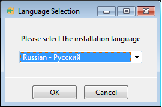

.. container:: flushright

   | Ред База Данных
   | Версия 4.0
   | Руководство администратора

Общие сведения о программе
==========================

Назначение программы
--------------------

СУБД Ред База Данных (далее СУБД или Ред База Данных) используется для
упорядоченного хранения и обработки больших объемов информации. Ред База
Данных представляет собой мощную современную СУБД с открытым кодом. Ядро
Ред Базы Данных построено на основе одной из самых известных и
распространенных в мире СУБД с открытым кодом – Firebird, которая
используется в решениях различного масштаба: от встроенных аппаратных
систем и решений для небольших компаний до IT- систем крупнейших
транснациональных корпораций с размерами баз данных до десятков терабайт
и десятками миллионов транзакций в день.

Функциональное назначение
-------------------------

СУБД Ред База Данных предоставляет пользователям следующие возможности:

-  поддержка всех основных платформ и операционных систем (среди них:
   Windows, семейство Linux, BSD Unix, IBM AIX, HP-UX, Sun Solaris и
   др.);

-  поддержка 32 и 64-битных систем;

-  поддержка многопроцессорных и многоядерных аппаратных платформ;

-  высокое быстродействие;

-  возможность хранения базы данных в одном отдельном файле;

-  возможность аутентификации и авторизации пользователей с
   использованием в качестве источников сведений об учетных записях
   пользователей защищенной БД пользователей или системного каталога;

-  возможность «горячего» резервного копирования БД и инкрементного
   резервного копирования, в т.ч. с применением аппаратных решений для
   резервного копирования;

-  наличие модулей сопряжения практически для всех используемых сред
   разработки, результатов тестов этих модулей и гарантия стабильной
   работы;

-  возможность работы во «встроенном» в ПО (embedded) локальном режиме в
   виде библиотеки DLL без отдельной установки и настройки СУБД Ред База
   Данных, в том числе поддержка встраивания в виртуальную машину Java;

-  обратная совместимость с базами данных от предыдущих версий Firebird;

-  многоверсионная архитектура;

-  модульная архитектура;

-  соответствие большинству требований стандарта ISO/ANSI SQL;

-  низкие требования к аппаратному обеспечению для небольших баз данных;

-  большие возможности по расширению функционала самой СУБД посредством
   модулей;

-  ядро, изначально основанное на многоверсионной архитектуре (MGA);

-  полное соответствие принципам атомарности, непротиворечивости,
   изоляции, долговечности (ACID).

Минимальный состав аппаратных средств
-------------------------------------

Для установки и нормальной работы СУБД Ред База Данных персональный
компьютер должен быть оснащен комплектующими со следующими
характеристиками:

-  Процессор Intel Pentum D и старше, процессор AMD с поддержкой x86_64
   или процессор Intel с поддержкой набора инструкций EM64T для
   архитектуры x86_64.

-  Оперативная память от 2048Mb.

-  Запоминающее устройство объемом не менее 16Гб.

-  Клавиатура 101/102-х клавишная рус/лат.

-  Сетевая карта с поддержкой Ethernet.

Минимальный состав программных средств
--------------------------------------

Для установки и эксплуатации СУБД в ОС семейства Windows не требуется
установки дополнительного программного обеспечения. Для ОС семейства
Linux необходимы библиотеки: glibc 2.4 и старше, libstdc++ от gcc 3.4.3
и старше. Также необходима служба xinetd (eXtended InterNET Daemon) —
служба с открытым исходным кодом, работающая во многих Unix-подобных
системах и управляющая сетевыми соединениями.

Требования к персоналу, среде эксплуатации и внешним мерам безопасности
-----------------------------------------------------------------------

Администратор СУБД должен иметь:

-  базовые навыки администрирования ОС семейства Windows или Linux (в
   зависимости от выбранной архитектуры);

-  навыки настройки программных продуктов и ОС;

-  опыт работы с командной строкой ОС;

-  базовое представление о структуре баз данных и минимальные навыки
   работы по управлению ими;

-  навыки поддержания в работоспособном состоянии технических средств
   ПК.

Безопасная эксплуатация СУБД предполагает, что:

-  должно быть обеспечено отсутствие на компьютере с установленной СУБД
   нештатных программных средств, позволяющих осуществить
   несанкционированную модификацию СУБД и администратор не предпринимает
   попыток модификации СУБД;

-  установка, конфигурация и эксплуатация СУБД осуществляется
   администраторам согласно соответствующей документации;

-  администратором предусмотрены мероприятия, направленные на
   восстановление безопасного состояния СУБД в случае сбоя (отказа);

-  персонал, ответственный за администрирование СУБД, должен пройти
   проверку на благонадежность и компетентность;

-  в своей деятельности администратор должен руководствоваться политикой
   безопасности организации;

-  администраторы являются компетентными, хорошо обученными и
   заслуживающими доверия;

-  имеется в наличии одно или более компетентное лицо, которое
   назначается для управления безопасностью СУБД и информации в нем. Эти
   лица должны иметь личную ответственность за следующие функции:

   -  управление пользователями;

   -  создание и сопровождение ролей;

   -  установление и сопровождение отношений между ролями;

   -  назначение и аннулирование ролей, назначаемых пользователям.

-  доступ к СУБД должен осуществляться только из санкционированных точек
   доступа,размещенных в контролируемой зоне, оборудованной средствами и
   системами физической защиты и охраны (контроля и наблюдения) и
   исключающей возможность бесконтрольного пребывания посторонних лиц;

-  обеспечено взаимодействие СУБД только с доверенными системами ИТ,
   правила безопасности которых скоординированы с правилами безопасности
   СУБД;

-  аутентификация субъектов, осуществляющих попытку доступа к СУБД,
   должна осуществляться с использованием механизмов ОС, под управлением
   которой функционирует СУБД;

-  функционирование СУБД должно осуществляться в среде функционирования
   (ОС), предоставляющей механизм аутентификации, обеспечивающий
   адекватную защиту от прямого или умышленного нарушения безопасности
   нарушителями с высоким потенциалом нападения;

-  все сетевые компоненты (такие, как мосты и маршрутизаторы) передают
   данные правильно, без модификации;

-  загрузка СУБД проходит в доверенной среде, предотвращающей
   несанкционированное прерывание процесса загрузки СУБД и использование
   инструментальных средств, позволяющих осуществить доступ к защищаемым
   ресурсам СУБД в обход механизмов защиты;

-  права пользователей для получения доступа и выполнения обработки
   информации основываются на одной или более ролях, которые им
   назначает администратор. Эти роли точно отражают производственную
   функцию, обязанности, квалификацию и/или компетентность пользователей
   в рамках предприятия.

Миграции с версии 3.0
=====================

Переход с версии 3.0 на 4.0
---------------------------

#. Обновите версию Ред Базы Данных 3.0 до последней.

#. Удостоверьтесь, что в базе данных нет записей, содержащих значение
   ``NULL`` в полях с флагом ``NOT NULL``, с помощью, например,
   следующего скрипта:

   .. container:: mdframed

      execute block returns (table_name varchar(100), field_name
      varchar(100))

      as

      declare variable v smallint;

      begin

      for select rdb$relation_name from rdb$relations r

      where r.rdb$relation_type=0

      into table_name

      do

      for select rf.rdb$field_name from rdb$relation_fields rf

      where rf.rdb$relation_name=:table_name and rf.rdb$null_flag=1

      into field_name

      do begin

      for execute statement select null from rdb$database where exists

      (select null from \|\| table_name \|\| where \|\| field_name \|\|

      is null or \|\| field_name \|\| \|\| = )

      into v do suspend;

      end

      end

#. Сделайте бэкап баз данных на версии 3.0:

   .. container:: mdframed

      gbak -user sysdba -pas masterkey -b {host/path} {host/path}

#. Выполните резервное копирование базы данных безопасности
   (``security3.fdb``) под версией 3.0:

   .. container:: mdframed

      gbak -user sysdba -pas masterkey -b {host/path}security3.fdb
      security3.fbk

#. Выполните резервное копирование базы данных безопасности Java
   (``java-security.fdb``) под версией 3.0:

   .. container:: mdframed

      gbak -user sysdba -pas masterkey -b {host/path}java-security.fdb
      java-security.fbk

#. Обновите Ред Базу Данных до версии 4.0, запустив инсталляцию. Новая
   версия будет установлена по пути прежней с заменой всех файлов,
   кроме:

   -  databases.conf

   -  directories.conf

   -  fbtrace.conf

   -  firebird.conf

   -  plugins.conf

   -  java-security.fdb

   -  security3.fdb

   -  fbjava.yaml

   -  fbtrace_dba.conf

   -  fbtrace_sec.conf

   -  jvm.args

   -  firebird.log (только на Linux)

   После успешной инсталляции эти оригинальные файлы сохраняются с
   суффиксом ``.dist``.

#. Выполните восстановление базы данных из сделанного ранее бэкапа под
   новым сервером.

   .. container:: mdframed

      gbak -c -v <имя backup> <имя базы данных> -user sysdba -password
      masterkey

#. Восстановите резервные копии баз данных безопасности на новой версии
   сервера:

   .. container:: mdframed

      gbak -user sysdba -pas masterkey -c security3.fbk
      {host/path}security4.fdb

      gbak -user sysdba -pas masterkey -c java-security.fbk
      {host/path}java-security.fdb

#. Далее необходимо проициализировать новую БД безопасности для всех
   плагинов аутентификации (какие указаны в ``UserManager``). Для этого
   нужно выполнить создание пользователя ``SYSDBA``, например:

   .. container:: mdframed

      echo "CREATE USER SYSDBA PASSWORD \\"masterkey\" USING PLUGIN
      GostPassword;" \| /opt/RedDatabase/bin/isql -u sysdba security.db

   После чего запустить скрипт ``security_migrate.sql`` из папки
   ``/misc/upgrade/security`` (начиная с версии 4.0.0.2135). Скрипт
   запускается на восстановленной базе пользователей ``security3.fdb``.
   При выполнении скрипта на экран будет выводится процесс миграции.
   После выполнения скрипта в качестве базы данных пользователей можно
   будет использовать ``security4.fdb``.

#. Если в ``firebird.conf`` в параметрах ``AuthClient`` или
   ``AuthServer`` использовался плагин ``Multifactor``, то в новой
   версии его надо заменить на ``GostPassword,Certificate``.

#. Если в ``firebird.conf`` в параметре ``UserManager`` использовался
   плагин ``Multifactor_Manager``, то в новой версии его надо заменить
   на ``GostPassword_Manager``.

#. Перенести параметры конфигурации из файла ``fbjava.yaml`` в
   ``databases.conf``.

#. Если используются UDF - задать параметр конфигурации:

   .. container:: mdframed

      UDFAccess = Restrict UDF

#. Перекомпилируйте все процедуры, триггеры и view (опционально), чтобы
   убедиться в корректности миграции. Это можно сделать с помощью
   IBExpert.

Проблемы совместимости
----------------------

#. *Устаревание UDF функций*

   При восстановлении базы данных с версии 3.0 на версию 4.0 может
   возникнуть ошибка, если в базе данных использовались устаревшие UDF
   функции:

   .. container:: mdframed

      gbak: WARNING:function XXX is not defined

      gbak: WARNING: module name or entrypoint could not be found

   Поддержка внешних UDF функций (реализованных в динамических
   библиотеках и определенных в базе данных с помощью функций оператора
   ``DECLARE FUNCTION``) в версии 4.0 устарели. Теперь по умолчанию для
   параметра ``UdfAccess`` в ``firebird.conf`` задано значение ``NONE``.
   UDF-библиотеки ``ib_udf`` и ``fbudf`` изъяты из дистрибутива.
   Конечно, вы можете реализовать свою собственную динамическую
   библиотеку (или использовать библиотеки из предыдущей версии Ред Базы
   Данных), настроить конфигурацию и работать с устаревшими функциями.
   Но этого делать не рекомендуется — вам лучше переключиться на
   использование функций UDR или PSQL. Чтобы переход стал проще, в
   дистрибутив включен скрипт ``udf_replace.sql``, выполняющий
   соответствующую замену устаревших функций. К этим функциям относятся:

   ==================== =========== =================
   ADDDAY               ADDDAY2     ADDHOUR
   ==================== =========== =================
   ADDMILLISECOND       ADDMINUTE   ADDMONTH
   ADDSECOND            ADDWEEK     ADDYEAR
   DIV                  DNULLIF     DNVL
   DOW                  DPOWER      GETEXACTTIMESTAMP
   GETEXACTTIMESTAMPUTC I64NULLIF   I64NVL
   I64ROUND             I64TRUNCATE INULLIF
   INVL                 ISLEAPYEAR  LTRIM
   ROUND                RTRIM       SDOW
   SNULLIF              SNVL        SRIGHT
   STRING2BLOB          STRLEN      SUBSTR
   SUBSTRLEN            TRUNCATE    UDF_FRAC или FRAC
   ==================== =========== =================

   Просто запустите скрипт:

   .. container:: mdframed

      isql -user sysdba -pas masterkey -i udf_replace.sql <база данных>

   и UDF, распространяемые в ``ib_udf`` и ``fbudf``, будут заменены
   соответствующими новыми функциями.

#. *Изменения в DDL и DML из-за поддержки часовых поясов*

   Поддержка часовых поясов вносит некоторые изменения в DDL и DML,
   которые могут повлиять на совместимость с существующими базами данных
   и приложениями.

   -  Синтаксис для объявления типов данных ``TIMESTAMP`` и ``TIME`` был
      расширен, чтобы включить аргументы, определяющие, должны ли
      столбец, домен, параметр или переменная быть определены с
      установкой часового пояса или без него:

      .. container:: mdframed

         TIME [ {WITHOUT|WITH} TIME ZONE ]

         TIMESTAMP [ {WITHOUT|WITH} TIME ZONE ]

      По умолчанию используется аргумент ``WITHOUT TIME ZONE``.

   -  В версии 4.0 переменные ``CURRENT_TIME`` и ``CURRENT_TIMESTAMP``
      изменены: теперь они возвращают значения типа
      ``TIME WITH TIME ZONE`` и ``TIMESTAMP WITH TIME ZONE`` с часовым
      поясом, установленным часовым поясом сеанса. В предыдущих версиях
      ``CURRENT_TIME`` и ``CURRENT_TIMESTAMP`` возвращали
      соответствующие типы в соответствии с системными часами, то есть
      без какого-либо часового пояса.

      Переменные ``LOCALTIMESTAMP`` и ``LOCALTIME`` теперь заменяют
      прежние функциональные возможности ``CURRENT_TIMESTAMP`` и
      ``CURRENT_TIME`` соответственно.

#. *Сокращенное преобразование неявных литералов даты/времени не
   поддерживается*

   Синтаксис сокращенного преобразования типов, используемый вместе с
   неявными литералами даты/времени, такой как, например:

   .. container:: mdframed

      TIMESTAMP ’NOW’

      DATE ’TODAY’

      DATE ’YESTERDAY’

   мог привести к неожиданным результатам:

   -  в хранимых процедурах и функциях вычисление этих выражений будет
      происходить во время компиляции, а не во время вызова процедуры
      или функции, сохраняя результат в BLR и извлекая это устаревшее
      значение во время выполнения;

   -  в DSQL вычисление этих выражений происходит во время подготовки
      запросов, а не на каждой итерации оператора, как можно было бы
      ожидать при правильном использовании неявных литералов
      даты/времени. Разница во времени между подготовкой и выполнением
      оператора может быть слишком мала, чтобы обнаружить проблему.
      Пользователи могли быть введены в заблуждение, полагая, что
      выражение вычисляется на каждой итерации оператора во время
      выполнения, хотя на самом деле это происходит во время подготовки.

   Если что-то вроде ``TIMESTAMP ’NOW’`` использовалось в SQL запросах в
   коде приложения или в PSQL, возникнет проблема совместимости с Ред
   Базой Данных 4.0. Теперь движок будет выдавать ошибку.

   В тоже время сокращенное преобразование явных литералов, таких как
   ``DATE ’2019.02.20’`` допустимо. Также преобразование
   ``CAST(’NOW’ AS TIMESTAMP)`` продолжает работать как раньше.

#. *Стартовое значение последовательности*

   До версии 4.0 последовательности (``generator/sequence``) создавались
   с текущим значением равным стартовому значению (или 0 по умолчанию).

   Следующим значением последовательности со стартовым значением 0 и
   приращением 1 было 1.

   В версии 4.0 последовательности создаются с текущим значением равным
   стартовому минус инкремент. И начальным значением по умолчанию
   является 1 (а не 0).

   То есть результат оператора ``NEXT VALUES FOR`` для
   последовательности со стартовым значением 100 и приращением 10 будет
   100 (а не 110, как было раньше). Аналогично функция
   ``GEN_ID(SEQ, 1)`` возвратит 91 (а не 101, как было раньше).

.. _sec:install:

Установка, обновление и запуск сервера СУБД Ред База Данных
===========================================================

Поддерживаемые ОС
-----------------

СУБД Ред База Данных может функционировать на следующих ОС:

-  Microsoft Windows (32-bit);

-  Microsoft Windows (x64);

-  Linux x86, Linux x86_64 дистрибутивы, использующие:

   -  glibc 2.4 и старше;

   -  libstdc++ от gcc 3.4.3 и старше;

-  Linux дистрибутивы, поддерживающие Linux Standard Base ISO/IEC 23360,
   начиная с версии 3.0.

Рекомендуемые ОС семейства Linux:

-  Red Hat Enterprise Linux 5.4 и старше;

-  CentOS 6.4 и старше;

-  RED OS 7.1 МУРОМ;

-  GosLinux 6;

-  Альт Линукс;

-  Astra Linux;

-  Mandriva Linux 2010 и старше;

-  SUSE 11 и старше;

-  ROSA 2011 и старше.

Приемка поставленного сервера СУБД Ред База Данных
--------------------------------------------------

Правила приемки описаны в разделе 4 технических условий "Система
управления базами данных «Ред База Данных»" ТУ 502120-001-29926343-2015.

.. _subsec:installwin:

Установка в ОС Windows
----------------------

Скачать дистрибутив Ред Базы Данных можно с официального сайта СУБД —
`reddatabase.ru <http://reddatabase.ru/downloads/>`__. Загрузка доступна
только авторизованному пользователю.

Запустите установку СУБД Ред База Данных с помощью файла
``RedDatabase-OE-4.0.X.X- windows-X.exe``, определив разрядность
используемой операционной системы.

Инсталляция СУБД Ред База Данных осуществляется с помощью стандартного
мастера установки программ. В ходе установки мастер собирает всю
необходимую для установки сервера информацию, производит копирование
файлов и регистрацию программных модулей в реестре Windows.

.. container:: mdframed

   Для установки Ред База Данных 4.0 необходимы права администратора.

Выберите язык установки. Предусмотрена установка на русском и английском
языках.

   Выбор языка

.. container:: center

   .. figure:: _static/imgs/install_win_2.png
      :alt: Лицензионное соглашение

      Лицензионное соглашение

   .. figure:: _static/imgs/install_win_3.png
      :alt: Лицензионное соглашение

      Лицензионное соглашение

Во время инсталляции Вам будет предложено выбрать архитектуру сервера:
Classic, SuperClassic или SuperServer: [arch]

-  **Classic**:

   -  использует отдельный процесс на каждое пользовательское
      соединение;

   -  каждый процесс содержит в себе все что нужно для работы с базой
      данных: область памяти для метаданных, кэш данных для минимизации
      повторных чтений из файла БД; память для сортировок;

   -  если происходит сбой, другие соединения остаются работоспособными

   -  поддержка мультипроцессорности: в многопроцессорных системах ОС
      автоматически распределяет процессы по процессорам/ядрам

-  **Superserver**:

   -  один процесс с общей областью памяти для всех пользовательских
      соединений;

   -  поддержка мультипроцессорности: параллельные запросы пользователей
      выполняются на разных ядрах;

   -  возможный сбой в одном процессе разорвет все подключения;

-  **SuperClassic**:

   -  единый процесс на всех пользователей с общей памятью под
      сортировки;

   -  используется пул потоков ОС для обработки запросов от соединений,
      таким образом каждое соединение работает в отдельном потоке
      управляемом ОС, а неактивные соединения не отъедают ресурсы
      потоков;

   -  каждый поток со своим кэшем данных и областью метаданных;

   -  поддержка мультипроцессорности: потоки ОС легко
      распараллеливаются;

   -  возможный сбой в одном процессе разорвет все подключения.

Каждый из режимов стабилен, и нет причин полностью отдавать предпочтение
какому то одному. Конечно, у вас могут быть свои собственные конкретные
соображения. Если Вы сомневаетесь, просто следуйте за установкой по
умолчанию. Позже вы можете изменить архитектуру через файл конфигурации
``firebird.conf`` (параметр ``ServerMode``), что потребует перезагрузки,
но не переустановки.

Режим сервера может быть настроен для каждой базы данных отдельно.

.. container:: center

   .. figure:: _static/imgs/install_win_4.png
      :alt: Выбор архитектуры сервера

      Выбор архитектуры сервера

   .. figure:: _static/imgs/install_win_5.png
      :alt: Выбор архитектуры сервера

      Выбор архитектуры сервера

Изначально в системе существует только один пользователь – администратор
сервера ``SYSDBA`` (пароль по умолчанию – ``masterkey``). Этот
пользователь обладает полными правами на выполнение всех функций по
управлению работой сервера и работе с базами данных. В процессе
инсталляции Вас попросят изменить пароль данного пользователя в целях
безопасности.

.. container:: center

   .. figure:: _static/imgs/install_win_6.png
      :alt: Завершение установки

      Завершение установки

   .. figure:: _static/imgs/install_win_8.png
      :alt: Завершение установки

      Завершение установки

По окончанию процесса установки будет запущен серверный процесс
``rdbserver``, который будет запускаться автоматически при перезагрузке
сервера. Сервер будет работать как системная служба.

Сервер может работать и в качестве приложения (это менее
предпочтительный вариант). Для запуска используйте следующую команду:

.. container:: mdframed

   rdbserver -a

Исполняемый файл ``rdbserver.exe`` расположен в корневом каталоге
установки Ред Базы Данных.

Остановка выполняется через иконку в системном трэе (*Shutdown*).

На официальном сайте СУБД Ред Базы Данных —
`reddatabase.ru <http://reddatabase.ru/downloads/rdb30/>`__ — можно
загрузить исходные коды сервера. Эти исходные коды можно впоследствии
использовать для ручной сборки и компиляции бинарных файлов сервера с
помощью команды:

.. container:: mdframed

   builds\\win32\\run_all.bat

Для этого необходимо иметь компилятор C++ Visual Studio не ниже 2010-й
версии.

Деинсталляция сервера осуществляется запуском программы
``uninstall.exe``, расположенной в корневой папке установки Ред Базы
Данных. После запуска скрипта пользователь должен подтвердить, что
действительно хочет удалить Ред Базу Данных, после чего будет
произведена деинсталляция сервера.

.. _subsec:installlinux:

Установка в Unix-системах
-------------------------

Установка в графическом режиме
~~~~~~~~~~~~~~~~~~~~~~~~~~~~~~

Файлы Ред База Данных 4.0 поставляются в виде бинарного пакета. При
запуске его из любой графической системы (например, KDE) будет вызван
мастер установки, который произведет сбор всей необходимой информации и
установит СУБД Ред База Данных 4.0 на Ваш компьютер.

Для установки СУБД Ред База Данных необходимо скопировать дистрибутивный
файл ``RedDatabase-4.0.Х.Х-Х-linux-X.bin`` на жесткий диск, а в
операционной системе назначить в правах этого файла разрешение на
исполнение:

.. container:: mdframed

   # chmod +x RedDatabase-4.0.Х.Х-Х-linux-X.bin

После этого запустить установку СУБД Ред База Данных:

.. container:: mdframed

   # ./RedDatabase-4.0.Х.Х-Х-linux-X.bin

.. container:: mdframed

   Для установки сервера Ред База Данных 4.0 необходимы права
   суперпользователя (root).

.. container:: mdframed

   Существуют различные виды пакетов для 32-х и 64-х разрядных
   Unix-систем.

Инсталляция СУБД Ред База Данных осуществляется с помощью стандартного
мастера установки программ. Прежде всего предлагается выбрать язык
установки. Предусмотрена инсталляция на русском и английском языках.

Во время инсталляции Вам будет предложено выбрать архитектуру сервера:
Classic, SuperClassic или SuperServer. Подробнее о каждой архитектуре
было описано `выше <#arch>`__.

.. container:: center

   .. figure:: _static/imgs/install_linux_1.png
      :alt: Выбор архитектуры сервера

      Выбор архитектуры сервера

   .. figure:: _static/imgs/install_linux_2.png
      :alt: Выбор архитектуры сервера

      Выбор архитектуры сервера

Изначально в системе существует только один пользователь – администратор
сервера ``SYSDBA`` (пароль по умолчанию – ``masterkey``). Этот
пользователь обладает полными правами на выполнение всех функций по
управлению работой сервера и работе с базами данных. В процессе
инсталляции Вас попросят изменить пароль данного пользователя в целях
безопасности.

.. container:: center

   .. figure:: _static/imgs/install_linux_3.png
      :alt: Завершение установки

      Завершение установки

   .. figure:: _static/imgs/install_linux_5.png
      :alt: Завершение установки

      Завершение установки

После установки сервер автоматически не запускается. Вам понадобится
сделать это вручную в зависимости от типа системы Linux и вашего
установочного пакета. Управление запуском и остановкой сервера
осуществляет демон инициализации ``systemd`` [stat:startstop]

.. container:: mdframed

   systemctl start firebird

   systemctl stop firebird

или ``init`` скрипт:

.. container:: mdframed

   /etc/init.d/firebird start

   /etc/init.d/firebird stop

Деинсталляция сервера осуществляется запуском программы ``uninstall``,
расположенной в корневой папке установки Ред Базы Данных. После запуска
скрипта пользователь должен подтвердить, что действительно хочет удалить
Ред Базу Данных, после чего будет произведена деинсталляция сервера.

Установка в текстовом режиме
~~~~~~~~~~~~~~~~~~~~~~~~~~~~

Если программа инсталляции запущена в текстовом режиме (с ключом
``--mode text``):

.. container:: mdframed

   # ./RedDatabase-4.0.Х.Х-Х-linux-X.bin --mode text

то она последовательно будет выводить запросы на подтверждение тех или
иных параметров установки, таких как выбор компонентов или пароль
пользователя ``SYSDBA``. В случае, если на тот или иной запрос мастера
установки предусмотрен ответ по умолчанию, то такой вариант обозначен
заглавной буквой, и в этом случае этот вариант можно подтвердить
нажатием клавиши «Ввод», в случае же, если выбор по умолчанию не
предусмотрен, то необходимо обязательно ответить на вопрос «Да» (Y) или
«Нет» (N).

.. figure:: _static/imgs/install_linux_text.png
   :alt: Пример установки Ред База Данных 4.0 в текстовом режиме

   Пример установки Ред База Данных 4.0 в текстовом режиме

Удаление сервера осуществляется, по аналогии с графическим режимом,
запуском программы ``uninstall`` из каталога установки Ред База Данных.

Сборка сервера Ред База Данных 4.0 из исходных файлов
~~~~~~~~~~~~~~~~~~~~~~~~~~~~~~~~~~~~~~~~~~~~~~~~~~~~~

В комплект поставки СУБД Ред База Данных входят исходные файлы сервера.
При сборке сервера вручную можно изменить каталог установки сервера (по
умолчанию ``/opt/RedDatabase``), собрать отладочную («дебаговую») сборку
и т.д. Во время сборки могут возникнуть ошибки, если в системе не
установлены необходимые пакеты или их версии отличаются от требуемых. В
этом случае сервер не будет установлен. Ручная сборка и компиляция
сервера Ред База Данных запускается скриптом ``autogen.sh``. Если
запустить скрипт с параметром ``--help``, то будет выдана справка о
доступных опциях сборки, в частности — архитектура сервера, путь для
установки сервера и т. д.

Для сборки сервера необходимо выполнить следующие шаги:

#. Установить библиотеки ``libtommath`` и ``ICU``;

#. Установить JDK 1.8

#. Установить ``g++, autools, make``

#. Установить переменную среды ``JAVA_HOME`` (прописать путь до файлов
   JDK)

#. Выполнить

   .. container:: mdframed

      ./autogen.sh –enable-java –enable-binreloc

#. Выполнить ``make``

Если устанавливается архитектура Classic, то будет настроен сервис
``xinetd``, управляющий запуском процессов сервера. При установке
архитектур Super и SuperClassic будет запущен демон сервера. Кроме того,
в ходе установки будет создан пользователь с именем ``firebird``.

.. container:: mdframed

   Для работы архитектуры Classic необходимо, чтобы сервис xinetd был
   установлен и запущен.

Обновление сервера
------------------

Обновление сервера между минорными- и патч-версиями Ред Базы Данных
происходит с помощью стандартного мастера установки программ. Перед
установкой новой версии не требуется вручную удалять старую.

Чтобы обновить сервер, просто скачайте нужную версию в зависимости от ОС
и разрядности и запустите установку, как было описано в подразделах
` <#subsec:installwin>`__ и ` <#subsec:installlinux>`__.

.. container:: mdframed

   Перед обновлением убедитесь, что все пользователи отключены от баз
   данных. С помощью команды:

   .. container:: mdframed

      gfix -shut -force <n>

   можно закрыть все подключения и запретить последующие.

В процессе инсталляции (обновления) Вам будет предложено выбрать только
язык установки и принять лицензионное соглашение. Новая версия будет
установлена по пути прежней с заменой всех файлов, кроме:

-  databases.conf

-  directories.conf

-  fbtrace.conf

-  firebird.conf

-  plugins.conf

-  java-security.fdb

-  security4.fdb

-  fbtrace_dba.conf

-  fbtrace_sec.conf

-  jvm.args

-  firebird.log (только на Linux)

После успешной инсталляции эти оригинальные файлы сохраняются с
суффиксом ``.dist``.

.. _sec:startserver:

Запуск и остановка сервера
--------------------------

После окончания процесса установки на Windows сервер Ред Базы Данных
должен быть запущен как сервис. На Linux сервис Вы должны запустить
вручную.

На Linux
~~~~~~~~

Используйте команду ``top`` командной строки для проверки запущенных
процессов в интерактивном режиме. Если сервер Ред База Данных 4.0
запущен, вы должны увидеть процесс с именем ``rdbserver`` и, возможно,
также ``rdbguard`` (процесс Guardian).

На картинке показан вывод ``top``, ограниченный ``grep``, чтобы
отображать только строки, содержащие строку ``rdb``:

.. container:: mdframed

   $ top -b -n1 \| grep rdb

     3835 firebird 20 0 31288  920  516 S 0.0 0.0 0:00.00 rdbguard

     3836 firebird 20 0  127m 2468 1980 S 0.0 0.1 0:00.01 rdbserver

Как альтернатива, вместо команды ``top``, Вы можете использовать
``ps -ax`` или ``ps -aux``, при необходимости перенаправив вывод
``grep``.

Другой способ проверить сервер после установки - запустить клиент
(например, ``isql``) и подключиться к базе данных или создать ее. Эти
операции описаны в Руководстве по SQL.

Если окажется, что среди запущенных процессов не окажется сервиса
``rdbserver``, запустите сервер вручную
(см. `выше <#stat:startstop>`__).

На Windows
~~~~~~~~~~

Откройте *Панель
управления*\ :math:`\rightarrow`\ *Администрирование*\ :math:`\rightarrow`\ *Службы*.

На картинке представлен вид апплета Services (Службы) на Windows 7.
Внешний вид может изменяться в зависимости от версии Windows.

В списке сервисов вы должны найти сервер RedDatabase. Если сервер по
каким то причинам не запущен, вы можете сделать это сейчас, щелкнув
правой кнопкой мыши запись RedDatabaseServerDefaultInstance и нажав
«Запустить».

Состав файлов сервера
=====================

Файлы конфигурации, лог-файлы и базы данных
-------------------------------------------

databases.conf
    

   В этом текстовом файле можно сопоставить конкретный путь к БД и
   псевдоним, чтобы затем в прикладных кодах использовать более короткий
   и удобный псевдоним для обращения к нужной базе данных. Также здесь
   указываются индивидуальные настройки для каждой конкретной базы
   данных.

directories.conf
    

   В данном файле хранятся псевдонимы каталогов и соответствующие им
   реальные пути к ним, где хранятся файлы, заполненные ``BLOB`` –
   данными.

fbtrace.conf
    

   Файл с шаблоном настроек ``fbtrace.conf`` находится в корневом
   каталоге и содержит список отслеживаемых событий и указывает
   размещение логов трассировки для каждого события. Это позволяет
   достаточно гибко настроить параметры аудита различных событий для
   любой базы данных, при этом логирование будет осуществляться в
   отдельные файлы.

fbtrace_dba.conf
    

   Файл конфигурирования для аудита действий пользователя ``SYSDBA``.
   Имеет такую же структуру, что и ``fbtrace.conf``, и на его основе
   создается дополнительная системная сессия аудита.

fbtrace_sec.conf
    

   Файл конфигурирования для аудита событий безопасности. Имеет такую же
   структуру, что и ``fbtrace.conf``, и на его основе создается
   дополнительная системная сессия аудита.

firebird.conf
    

   Файл содержит параметры настройки сервера.

plugins.conf
    

   Файл используется для настройки различных плагинов. Если в файле не
   указана конфигурация для плагина, то для него будут действовать
   настройки по умолчанию.

replication.conf
    

   Используется для настройки системы репликации.

scheduler.conf
    

   Файл с настройками планировщика заданий.

scheduler.fdb
    

   База данных планировщика заданий. В ней хранятся сами задания и
   регистрируемые события, связанные с ними.

security4.fdb
    

   База данных безопасности. В этой базе хранятся параметры
   пользователей системы и политики доступа.

java-security.fdb
    

   База данных безопасности для пользователей Java. Здесь хранятся права
   доступа пользователей, использующим код Java.

jvm.args
    

   Список аргументов для JVM.

firebird.msg
    

   Файл с сообщениями сервера (в основном об ошибках).

firebird.log
    

   Лог-файл сервера.

Инструменты администрирования и сервисы Ред Базы Данных
-------------------------------------------------------

rdblogmgr <.exe>
    

   Утилита настройки журнала репликации. Данная утилита предназначена
   для вывода детализации текущего состояния журнала для заданной базы
   (общее состояние журнала, настройки журнала конфигурации, список
   использованных сегментов). Дополнительно, утилита ``rdblogmgr``
   позволяет выполнить ручное архивирование заданного сегмента журнала
   или всех сегментов, а также принудительно помечает используемый
   сегмент как полный для возможности его архивирования.

rdbrepldiff <.exe>
    

   Утилита сравнения мастер-базы и реплики.

rdbreplmgr <.exe>
    

   Утилита управления асинхронной репликой. Выводит информацию о
   состоянии асинхронной репликации, а также позволяет применять вручную
   журналы к реплике и создавать реплику как копию мастер-базы.

gbak <.exe>
    

   Эта утилита предназначена для резервного копирования и восстановления
   баз данных. Она также обнаруживает разрушения базы данных,
   освобождает дисковое пространство, появившееся в результате удалений,
   разрешает незавершенные транзакции, позволяет разделять базы данных
   на несколько файлов. Она также используется для создания переносимой
   копии с целью восстановления вашей базы данных на другой аппаратной
   платформе.

gfix <.exe>
    

   Это набор общих вспомогательных утилит для изменения свойств баз
   данных, устранения небольших повреждений базы данных, выполнения
   различных задач чистки и т. д. Утилита также предоставляет средство
   администратора для отключения конкретных баз данных до завершения
   работы сервера. Она может быть использована вместе с утилитой
   ``gbak`` для восстановления некоторых типов нарушений в базе данных.

gpre <.exe>
    

   Это препроцессор, который конвертирует исходный код, написанный на
   некоторых языках и содержащий встроенный псевдокод SQL, в корректный
   отформатированный вызов функций Firebird API.

gsec <.exe>
    

   Этот инструмент поддержки списка пользователей и их паролей является
   интерфейсом командной строки для базы данных security4.fdb; он
   управляет записями пользователей на сервере.

gstat <.exe>
    

   Этот инструмент получения статистики собирает и отображает
   статистические сведения по индексам и данным базы данных.

hashgen <.exe>
    

   Используется для проверки целостности компонентов СУБД Ред База
   Данных на внешних накопителях и в оперативной памяти во время
   загрузки и динамически.

instclient.exe
    

   Назначение утилиты ``instclient`` состоит в том, что она:

   -  позволяет установить клиентскую часть Ред Базы Данных одной
      командой;

   -  позволяет установить клиентскую часть как ``fbclient.dll``, либо
      как ``gds32.dll``;

   -  позволяет проверить наличие установленной библиотеки ``fbclient``
      или ``gds32``;

   -  позволяет удалить уже установленный в системе ``fbclient`` или
      ``gds32``.

instreg.exe
    

   Эта утилита прописывает необходимую информацию в реестр Windows,
   указывая стандартное расположение остальных файлов сервера.

instsvc.exe
    

   Утилита записывает, удаляет или меняет информацию о запуске сервера в
   базе сервисов операционной системы Windows.

isql <.exe>
    

   Интерактивный инструмент, который позволяет выполнять запросы к базе
   данных.

mint <.exe>
    

   Утилита осуществляет контроль за целостностью метаданных в БД. Эта
   утилита предназначена для извлечения и хеширования метаданных из баз
   данных, а также для проверки ранее полученного хеша метаданных.

nbackup <.exe>
    

   Утилита позволяет создавать резервные копии и восстанавливать из
   резервных копий также, как ``gbak``, и дополнительно позволяет
   создавать инкрементные копии и восстанавливать из них БД.

rdbguard <.exe>
    

   Исполняемый файл приложения Guardian. Он контролирует состояние
   сервера. Если сервер был остановлен по какой-либо причине, Guardian
   автоматически перезапускает его.

rdbserver <.exe>
    

   Исполняемый файл в случае архитектуры Classic, SuperClassic или
   SuperServer.

rdb_lock_print <.exe>
    

   Эта утилита формирует статистические данные файла блокировок, который
   поддерживается в Ред Базе Данных для управления последовательностью
   изменений базы данных несколькими транзакциями. Она может быть
   полезным инструментом анализа проблем взаимной блокировки.

rdbsvcmgr <.exe>
    

   Утилита предоставляет интерфейс командной строки для Services API,
   обеспечивая доступ к любой службе, которая реализуется в СУБД.

rdbtracemgr <.exe>
    

   Утилита для работы в интерактивном режиме с трассировкой.

Настройка сервера «Ред База Данных»
===================================

Для настройки сервера «Ред База Данных» используется файл
``firebird.conf``. Настройки считываются из файла один раз при старте
сервера, если архитектура Супер или Суперклассик, и при каждом
соединении с базой, если архитектура сервера Классик.

По умолчанию все параметры в файле конфигурации закомментированы. Для
обозначения комментариев используется символ «#». Текст, следующий после
символа «#», до конца строки является комментарием, например:

.. container:: mdframed

   | #комментарий
   | DefaultDbCachePages = 2048 #комментарий

Максимальная длина строки в файле конфигурации сервера равна 80
символов.

Первое слово в строке, начинающейся не с символа комментария, считается
названием параметра. Справа от имени параметра, после символа «=»,
указывается значение параметра.

В файле конфигурации присутствуют параметры трех типов:

-  Целочисленный;

-  Строковый;

-  Логический (булев).

.. container:: mdframed

   Значения параметров, определяющих объем памяти, указываются в байтах.
   В конце таких значений можно ставить сокращения k, m и g,
   соответствующие килобайтам, мегабайтам и гигабайтам.

Некоторые параметры помечены как настраиваемые для конкретных баз данных
(``per-database``) или для подключений (``per-connection``). Настройки
для баз данных задаются в файле ``databases.conf``. Настройки для
соединения - прежде всего клиентский инструмент и выполняется с помощью
параметра ``isc_dpb_config`` в DPB (или, для Services,
``isc_spb_config``). Обратите внимание на то, что настройки для баз
данных могут выполняться при помощи DPB в случае Embedded сервера, при
подключении к базе данных в первый раз.

Существует ряд предопределенных переменных, которые могут быть
использованы в файлах конфигурации, где требуется имя каталога. Полный
их список выглядит следующим образом:

-  ``$(root)`` – корневой каталог

-  ``$(install)`` – директория, куда установлена СУБД. Изначально
   ``$(root)`` и ``$(install)`` одинаковые. ``$(root)`` может быть
   переопределена установкой или изменением переменной окружения
   ``FIREBIRD``, в таком случае эта переменная отлична от
   ``$(install)``.

-  ``$(this)`` – каталог, в котором находится текущий файл конфигурации.

-  ``$(dir_conf)`` – директория, где располагается ``firebird.conf`` и
   ``databases.conf``.

-  ``$(dir_secdb)`` – директория, где располагается база данных
   безопасности по-умолчанию.

-  ``$(dir_plugins)`` – каталог расположения плагинов (``plugins``).

-  ``$(dir_udf)`` – директория, где располагаются функции UDF
   по-умолчанию (``udf``).

-  ``$(dir_sample)`` – каталог с примерами (``examples``).

-  ``$(dir_sampledb)`` – директория, где лежит пример базы данных
   (``examples/empbuild``).

-  ``$(dir_intl)`` – директория, в которой расположены международные
   модули (``intl``).

-  ``$(dir_msg)`` – каталог, где находится файл с сообщениями сервера
   ``firebird.msg``. Обычно он совпадает с ``$(root)``, но может быть
   переопределен переменной окружения ``FIREBIRD_MSG``.

-  ``$(dir_schedulerDb)`` – директория, где находится база данных
   планировщика заданий ``scheduler.fdb``.

Один конфигурационный файл может включать другой с помощью директивы
``include``:

.. container:: mdframed

   include some_file.conf

Относительный путь представляет собой путь по отношению к текущему файлу
конфигурации. Так, в примере выше файл ``/opt/config/master.conf``
ссылается на файл по пути ``/opt/config/some_file.conf``.

.. container:: mdframed

   Директива ``include`` поддерживает групповые символы ``*`` и ``?``.

Общие настройки
---------------

.. container:: tabularx

   | l R **DatabaseAccess** &

Параметр ``DatabaseAccess`` позволяет обеспечить управление
безопасностью при доступе к файлам баз данных. Доступ к базам данных на
сервере может быть полным (``Full``), ограниченным (``Restrict``) или
запрещенным (``None``).

Параметр ``DatabaseAccess`` имеет строковый тип; по умолчанию значение
параметра равно ``Full`` - полный доступ. Для того, чтобы запретить
доступ, следует выставить значение параметра, равное ``None``. Для
ограничения доступа используется значение ``Restrict``. В этом случае
после слова ``Restrict`` указываются директории, в которых могут быть
сохранены файлы баз данных.

При указании каталогов могут быть использованы как абсолютные, так и
относительные пути. Относительные пути берутся от корневого каталога
инсталляции сервера <<Ред База Данных>>. В качестве разделителя
директорий используется символ «;».

.. container:: mdframed

   DatabaseAccess = None

   DatabaseAccess = Restrict C:\\DataBase

   DatabaseAccess = Restrict C:\\DataBase;D:\\Mirror

   DatabaseAccess = Restrict /db;/mnt/mirrordb

   DatabaseAccess = Full

.. container:: mdframed

   Неконтролируемый доступ к базам данных может поставить под угрозу
   безопасность вашей системы. Поэтому настоятельно рекомендуется
   ограничивать директории для размещения баз данных.

.. container:: tabularx

   | l R **RemoteAccess** & Per-database

Параметр предоставляет или отменяет удаленный доступ к базам данных.

.. container:: mdframed

   RemoteAccess = true

По-умолчанию ``RemoteAccess`` включен для всех баз данных, за
исключением базы данных безопасности. Если вы намереваетесь использовать
больше одной специализированной базы данных безопасности, то рекомендуем
отключить удаленный доступ к ним в файле ``databases.conf``.

Для повышенной безопасности следует отключить ``RemoteAccess`` в
``firebird.conf`` и включить его в ``databases.conf`` для некоторых
отдельных баз.

Параметр имеет тип ``Boolean`` и может принимать значения
``true/false, 1/0`` или ``Yes/No``.

.. container:: tabularx

   | l R **ExternalFileAccess** & Per-database

Параметр ``ExternalFileAccess`` позволяет обеспечить управление правами
на создание таблиц во внешних файлах. Разрешение на доступ к внешним
файлам может быть полным (``Full``), ограниченным (``Restrict``) или
запрещенным (``None``).

Параметр ``ExternalFileAccess`` имеет строковый тип; значение по
умолчанию равно «\ ``None``\ » - запрет на создание внешних таблиц. Для
того, чтобы разрешить создание и доступ к внешним файлам, следует
выставить значение параметра равным «\ ``Full``\ ». Для ограничения
доступа используется значение «\ ``Restrict``\ ». В этом случае после
слова ``Restrict`` указываются директории, в которых могут быть
сохранены файлы внешних таблиц. При указании каталогов могут быть
использованы как абсолютные, так и относительные пути. Относительные
пути берутся от корневого каталога Ред Базы Данных. В качестве
разделителя директорий используется символ «;».

.. container:: mdframed

   ExternalFileAccess = None

   ExternalFileAccess = Restrict C:\\DataBase

   ExternalFileAccess = Restrict C:\\DataBase;D:\\Mirror

   ExternalFileAccess = Restrict /db;/mnt/mirrordb

   ExternalFileAccess = Full

.. container:: mdframed

   Неконтролируемая возможность использования внешних таблиц может
   поставить под угрозу безопасность вашей системы. Поэтому настоятельно
   рекомендуется использовать этот параметр для ограничения директорий
   размещения внешних таблиц.

.. container:: tabularx

   | l R **BackupAccess** &

Параметр ``BackupAccess`` задаёт список каталогов, в которых разрешено
создание резервных копий БД. При создании резервных копий первым
проверяется параметр ``BackupAccess``. Если создание копий по указанному
в параметре пути разрешено - создается заданный каталог (при
необходимости - со всеми родительскими).

Параметр ``BackupAccess`` имеет строковый тип. Параметр может принимать
значения: полный (``Full``), ограниченный (``Restrict``) или запрещенный
(``None``). По умолчанию значение параметра равно ``Full`` - полный
доступ. Для того, чтобы запретить доступ, следует выставить значение
параметра, равное ``None``. Для ограничения доступа используется
значение ``Restrict``. В этом случае после слова ``Restrict``
указываются директории, в которых могут быть сохранены файлы резервных
копий БД.

При указании каталогов могут быть использованы как абсолютные, так и
относительные пути. Относительные пути берутся от корневого каталога
инсталляции сервера <<Ред База Данных>>. В качестве разделителя
директорий используется символ «;».

.. container:: mdframed

   BackupAccess = None

   BackupAccess = Restrict C:\\DataBase

   BackupAccess = Restrict C:\\DataBase;D:\\Mirror

   BackupAccess = Restrict /db;/mnt/mirrordb

   BackupAccess = Full

.. container:: tabularx

   | l R **UdfAccess** &

Параметр ``UdfAccess`` предназначен для определения директорий, в
которых могут быть сохранены библиотеки UDF. Разрешение на доступ к
библиотекам внешних функций может быть полным (``Full``), ограниченным
(``Restrict``) или запрещенным (``None``).

Параметр ``UdfAccess`` имеет строковый тип; значение по умолчанию равно
``None`` (в предыдущих версиях значение по умолчанию было
<<``Restrict UDF``>>).

При указании каталогов могут быть использованы как абсолютные, так и
относительные пути. Относительные пути берутся от корневого каталога
инсталляции сервера Ред База Данных. В качестве разделителя директорий
используется символ «;».

.. container:: mdframed

   UdfAccess = Restrict UDF

.. container:: mdframed

   Неконтролируемая возможность использования внешних функций может быть
   использована для того, чтобы поставить под угрозу безопасность как
   баз данных, так и всей системы. Поэтому настоятельно рекомендуется
   использовать данный параметр для ограничения директорий размещения
   ``udf``-библиотек.

.. container:: tabularx

   | l R **TempDirectories** &

С помощью параметра ``TempDirectories`` можно задать каталог, в котором
сервер «Ред База Данных» будет хранить временные данные, допускающие
разбиение на части. Это кэш курсоров, буферов записей, undo-логов, а
также временные BLOB, блоки сортировок, данные мониторинга.

Параметр ``TempDirectories`` имеет строковый тип; значение по умолчанию
равно пустой строке. Если параметр ``TempDirectories`` не активен, то
путь к временному каталогу определяется исходя из значения переменных
окружения ``FIREBIRD_TMP, TEMP, TMP``.

В качестве значения параметра может быть задан путь к одному или
нескольким каталогам. Для папок допускаются как абсолютные, так и
относительные пути. Относительные пути берутся от корневого каталога
инсталляции сервера <<Ред База Данных>>. Если требуется определить
несколько временных каталогов, то в качестве разделителя используется
символ «;».

Если указана одна или несколько директорий, то выгрузка временных данных
при сортировке будет осуществляться в указанные каталоги по очереди
(если в текущей временной директории не осталось места, то временные
файлы будут сохраняться в следующую по списку)

.. container:: mdframed

   TempDirectories = c:\\temp

   TempDirectories = c:\\temp;d:\\temp

.. container:: tabularx

   | l R **TempTableDirectory** &

Параметр ``TempTableDirectory`` задает каталог, в котором сервер «Ред
База Данных» будет хранить данные временных таблиц и блобов. Если
параметр не задан или указанный каталог недоступен, будет использован
каталог из переменных окружения ``FIREBIRD_TMP, TEMP, TMP``.

.. container:: tabularx

   | l R **AuditTraceConfigFiles** &

Параметр ``AuditTraceConfigFile`` в файле конфигурации firebird.conf
задает имя и расположение файла с настройками системного аудита. Этот
параметр имеет строковый тип и по умолчанию указывает на
``fbtrace.conf``. Пустое значение параметра означает, что системный
аудит выключен.

Есть возможностью указания ссылок на другие конфигурационные файлы.
Каждый из них имеет такую же структуру, что и ``fbtrace.conf``, и на их
основе создаются дополнительные системные сессии аудита. Имеются три
таких набора конфигураций для раздельного аудита:

-  Производительности (``fbtrace.conf``)

-  Событий безопасности (``fbtrace_sec.conf``)

-  Действий пользователя ``SYSDBA`` (``fbtrace_dba.conf``)

.. container:: mdframed

   AuditTraceConfigFiles = fbtrace.conf; fbtrace_sec.conf;

.. container:: tabularx

   | l R **MaxUserTraceLogSize** &

Задает максимальный суммарный размер (в мегабайтах) временных файлов,
создаваемых сессией пользовательской трассировки Services API. После
прочтения временного файла приложением он автоматически удаляется.
Параметр имеет целочисленный тип. Единица измерения - мегабайты. По
умолчанию максимальный размер файла вывода ограничен 10 МБ. Если
значения ограничения ``MaxUserTraceLogSize`` достигнуто, то сервер
автоматически приостанавливает сессию слежения.

.. container:: mdframed

   MaxUserTraceLogSize = 10

.. container:: tabularx

   | l R **DefaultDbCachePages** & Per-database

Параметр ``DefaultDbCachePages`` используется для настройки количества
страниц, которые могут быть удержаны кэшем, из расчета на каждую базу
данных. Суперсервер использует единый кэш (2048 страниц) для всех
подключений. Классик создает отдельный кэш (по умолчанию 75 страниц) для
каждого соединения.

При изменении данных параметров следует учитывать особенности
аппаратно-программной платформы, других настроек сервера
(``TempBlockSize``). Также, определение оптимальных для конкретной
задачи настроек хеширования данных сервером «Ред База Данных» может быть
произведено экспериментальным путем.

Параметр имеет целочисленный тип. Единица измерения – страница базы
данных. По умолчанию параметр имеет значение 2048. Максимальное значение
2147483647 страниц. Минимальное значение параметра – 0. Если значение
параметра равно нулю, то сервер не будет выполнять кэширование страниц
данных.

.. container:: mdframed

   DefaultDbCachePages = 2048

.. container:: tabularx

   | l R **DatabaseGrowthIncrement** & Per-database

Параметр позволяет указать объем дискового пространства, которое может
быть выделено под базу данных. Дисковое пространство резервируется в
системе, что позволяет в дальнейшем снизить физическую фрагментацию
файла (-ов) базы данных и дает возможность продолжить работу в условиях
недостатка места на диске. Если режим резервирования включен, то сервер
резервирует 1/16 часть от уже используемого дискового пространства для
одного соединения, но не меньше 128 KB и не больше, чем значение,
заданное параметром ``DatabaseGrowthIncrement`` (по умолчанию 128 MB).

Для отключения резервирования дискового пространства необходимо
выставить значение ``DatabaseGrowthIncrement`` равным 0.

.. container:: mdframed

   DatabaseGrowthIncrement = 134217728

.. container:: mdframed

   Пространство под теневые копии баз данных не резервируется.

.. container:: tabularx

   | l R **FileSystemCacheThreshold** & Per-database

Параметр ``FileSystemCacheThreshold`` устанавливает порог использования
системного кэша сервером «Ред База Данных» для архитектуры Cуперсервер.
Значение параметра ``FileSystemCacheThreshold`` определяет максимально
допустимое количество страниц, которые могут находиться в кэш-памяти
одновременно. Системный кэш будет использоваться до тех пор, пока
количество закэшированных страниц меньше, чем значение параметра
``FileSystemCacheThreshold``.

Параметр имеет целочисленный тип. Единица измерения – страница базы
данных (определяется при создании БД, может иметь размер от 4 до 16 Кб).
По умолчанию параметр имеет значение - 65536 страниц. Максимально
допустимое значение параметра – 2147483647. Минимальное значение
параметра – 0. Если значение параметра ``FileSystemCacheThreshold``
равно 0, то сервер не будет использовать системный кэш.

.. container:: mdframed

   FileSystemCacheThreshold = 65536

.. container:: tabularx

   | l R **FileSystemCacheSize** &

Параметр ``FileSystemCacheSize`` устанавливает максимальный размер
оперативной памяти, используемый системным файловым кешем 64-битными
Windows XP или Windows Server 2003 с Service Pack 1 или выше.

Параметр содержит целое число, представляющее собой количество (в
процентах) оперативной памяти, которое может быть использовано под
файловый кеш. Значение может быть от 10 до 95%. Если задать значение 0,
операционная система сама будет определять размер файлового кеша. Это и
есть значение по умолчанию.

.. container:: mdframed

   FileSystemCacheSize = 0

.. container:: mdframed

   Windows требует обладания привилегией ``SeIncreaseQuotaPrivilege``
   для управления настройками файлового кеша. Эта привилегия доступна по
   умолчанию администраторам и службам, а также выдается учетной записи
   ``firebird`` при установке из дистрибутива Windows Installer.

   Если Ред База Данных запущена как приложение или в режиме
   ``Embedded`` или установлен не из официального дистрибутива, учетная
   запись может не иметь данной привилегии. Процесс не выдаст ошибку при
   запуске, а просто запишет соответствующее сообщение в файл
   ``firebird.log`` и будет работать с настройками операционной системы.

.. container:: tabularx

   | l R **RemoteFileOpenAbility** &

Параметр имеет логический тип. По умолчанию его значение равно 1. В этом
случае сервер «Ред База Данных» может открыть базу данных, только если
она сохранена на физическом диске компьютера, на котором запущен сервер.
Запросы на подключениях с базами данных, сохраненными на сетевых дисках,
переадресовываются на сервер «Ред База Данных», работающий на
компьютере, которому принадлежит диск.

Это ограничение предотвращает возможность того, чтобы две различных
копии сервера открыли одновременно одну и ту же базу данных.
Нескоординированный доступ нескольких копий сервера к одной базе данных
может привести к ее повреждению. Блокировка файла на системном уровне
предотвращает нескоординированный доступ к файлу базы данных. Для
отключения этой опции следует выставить значение параметра
``RemoteFileOpenAbility`` равным 0 (ложь).

.. container:: mdframed

   Этот параметр может вызвать неисправимое повреждение базы данных. Не
   используйте эту опцию, если вы не понимаете рисков потери данных.

.. container:: mdframed

   Сетевая файловая система не обеспечивает надежного способа
   координации доступа к файлам. Если вторая копия сервера соединится с
   базой данных сохраненной на сетевом диске, то это может повредить
   базу данных

.. container:: mdframed

   RemoteFileOpenAbility = 0

.. container:: tabularx

   | l R **TempBlockSize** &

Параметр ``TempBlockSize`` используется для управления пространством
временных каталогов. Временные каталоги используются для выгрузки
результатов обработки больших объемов данных (например, при сортировке
данных). Параметр ``TempBlockSize`` определяет минимальный размер блока,
выделяемого на один запрос с сортировкой.

Параметр имеет целочисленный тип. Единица измерения - байты. По
умолчанию параметр имеет значение 1048576 байт. Максимально допустимое
значение 2147483647 байт. Минимальное значение параметра – 0.

.. container:: mdframed

   TempBlockSize = 1048576

.. container:: tabularx

   | l R **TempCacheLimit** & Per-database

Параметр ``TempCacheLimit`` используется для ограничения объема
оперативной памяти, выделяемой на одно соединение, он определяет
максимальный объем оперативной памяти, выделяемой для одного соединения.

Параметр имеет целочисленный тип. Значение по умолчанию равно 67108864
байт. Максимально допустимое значение (:math:`2^{64} - 1`) байт.
Минимальное значение параметра равно 0.

.. container:: mdframed

   TempCacheLimit = 67108864

.. container:: tabularx

   | l R **MaxIdentifierByteLength** & Per-database

Максимально допустимая длина имени идентификатора в байтах.

Установка этого значения для всех баз данных (включая базу данных
безопасности) может вызвать проблемы.

.. container:: mdframed

   MaxIdentifierByteLength = 252

.. container:: tabularx

   | l R **MaxIdentifierCharLength** & Per-database

Максимально допустимая длина имени идентификатора в символах.

Установка этого значения для всех баз данных (включая базу данных
безопасности) может вызвать проблемы.

.. container:: mdframed

   MaxIdentifierCharLength = 63

.. container:: tabularx

   | l R **AuthServer/AuthClient** & Per-database/Per-connection,
     per-database

Параметр ``AuthServer`` - набор методов аутентификации, разрешенных на
сервере (определяется в файле конфигурации сервера).

Параметр ``AuthClient`` - набор методов аутентификации, поддерживаемых
клиентом (определяется в файле конфигурации на клиенте).

Включенные методы перечислены в виде строковых символов, разделенных
запятыми, точками с запятой или пробелами. Если проверить подлинность с
помощью первого метода не удалось, то сервер переходит к следующему и
т.д. Если ни один метод не подтвердил подлинность, то пользователь
получает сообщение об ошибке.

СУБД Ред База Данных 4.0 поддерживает следующие методы аутентификации:

-  Безопасная парольная аутентификация использующая алгоритм SHA-256
   (``Srp256``). Используется по умолчанию;

-  Безопасная парольная аутентификация использующая алгоритм SHA-1
   (``Srp``);

-  Традиционная (``Legacy_Auth``) аутентификация;

-  Доверительная (``Win_Sspi``) аутентификация для ОС Windows;

-  Метод ``GostPassword`` обеспечивает аутентификацию с использованием
   алгоритмов шифрования из криптографического плагина (Crypto_API);

-  Плагин ``Certificate`` позволяет аутентифицировать пользователей по
   сертификатам X509;

-  Плагин ``VerifyServer`` позволяет клиенту проверить сертификат
   сервера;

-  Доверенная аутентификация через механизм GSSAPI (``Gss``);

-  Доверенная аутентификации для выполнения Execute Statement On
   External без указания логина и пароля (``ExtAuth``).

.. container:: mdframed

   AuthServer = Srp256

   AuthClient = Srp256, Srp, Win_Sspi, Legacy_Auth, Gss, ExtAuth

Если вы хотите использовать плагины аутентификации, которые не
предоставляют ключа шифрования (``Win_Sspi``, ``Legacy_Auth``,
``GostPassword``, ``Gss``), то следует отключить обязательное
(``Required``) шифрование каналов передачи данных (параметр
``WireCrypt``), кроме случаев, когда вы работаете с протоколом XNET.

Чтобы отключить какой-нибудь из методов, раскомментируйте строку и
удалите нежелательный метод из списка.

Оба параметра могут быть использованы в ``databases.conf``.
``AuthClient`` может использоваться как в DPB, так и в SPB для
конкретных настроек соединения.

.. container:: tabularx

   | l R **UserManager** & Per-database

Устанавливает плагин, который будет работать с базой данных
безопасности. Это может быть список с пробелами, запятыми или точками с
запятой в качестве разделителей: используется первый подключаемый модуль
из списка. Всего существует четыре возможных плагина:

-  Srp;

-  Legacy_UserManager;

-  GostPassword_Manager;

-  Ldap.

Для поддержки старой базы данных безопасности и управления
пользователями в ней, следует установить значение параметра
``Legacy_UserManager``.

Для создания многофакторных пользователей и управления ими следует
установить значение параметра ``GostPassword_Manager``.

Для получения списка пользователей каталога ``LDAP`` с помощью
псевдотаблицы ``SEC$USERS`` следует установить значение параметра
``Ldap``.

В SQL операторах управления пользователями можно явно указать какой
плагин будет использоваться.

.. container:: mdframed

   UserManager = Srp

.. container:: mdframed

   Одноименные пользователи, созданные с помощью разных плагинов
   управления пользователями — это разные пользователи.

Параметр ``UserManager`` можно использовать в ``database.conf`` для
переопределения в конкретной базе данных.

.. container:: tabularx

   | l R **DefaultUserManagers** & Per-database

Позволяет указать набор стандартных плагинов.

Если предложение ``USING PLUGIN`` не указано, то при создании
пользователя он сам добавляется во все стандартные плагины (со всеми
указанными атрибутами).

При изменении пароля пользователя он меняется во всех стандартных
плагинах. Если в каком-либо стандартном плагине нет пользователя, то он
добавляется.

Если меняется какой-либо другой атрибут, то он также меняется и в других
стандартных плагинах, но если пользователь отсутствует, то он не
создаётся.

При удалении пользователя он также удалится из всех стандартных
плагинов.

Пример использования:

.. container:: mdframed

   UserManager = Srp Legacy_UserManager GostPassword_Manager

   DefaultUserManagers = Legacy_UserManager GostPassword_Manager

Значение по умолчанию:

.. container:: mdframed

   DefaultUserManagers =

.. container:: mdframed

   Можно использовать только те плагины, которые были указаны в
   параметре UserManager

.. container:: tabularx

   | l R **TrustedUser** &

Логин доверенного пользователя для аутентификации по паролю с именем
другого пользователя. При коннекте кроме имени пользователя
(``isc_dpb_user_name``) можно указать эффективный логин
(``isc_dpb_effective_login``). В ``isql`` для этого добавлен ключ
``-l``. Если задан этот логин, то после успешной аутентификации
проверяется задан ли параметр конфигурации

-  Если не задан - ошибка аутентификации: попытка подмены логина с
   отключенной опцией.

-  Если параметр задан, но пользователь там указан другой - тоже ошибка:
   попытка подмены логина не доверенным пользователем.

-  Если пользователь в конфигурации совпадает с текущим, то есть
   подключается доверенный пользователь, то при подключении к БД его имя
   заменяется на указанный им эффективный логин. Для ядра СУБД это
   подключение будет выглядеть как обычное, информация о подмене логина
   до него не доходит.

Работает для всех плагинов аутентификации.

.. container:: tabularx

   | l R **TracePlugin** &

Задает плагин, используемый функцией трассировки для отправки данных
трассировки в приложение клиента или данных аудита в лог файл.

.. container:: mdframed

   TracePlugin = fbtrace

.. container:: tabularx

   | l R **WireCryptPlugin** & Per-connection

Плагин поточного шифра используется для шифрования и дешифрования
данных, передаваемых по сети.

.. container:: mdframed

   WireCryptPlugin = Arc4

По-умолчанию устанавливается значение параметра ``Arc4``, что означает
использование плагина потокового шифра ``Alleged RC4``.
Сконфигурированный плагин, который требует ключ, сгенерированный
настроенным подключаемым модулем аутентификации, может быть
переопределен в API для конкретного соединения через DPB или SPB.

.. container:: tabularx

   | l R **KeyHolderPlugin** &

Этот параметр представляет собой некоторую форму временного хранилища
для ключей шифрования базы данных.

Реализованного плагина по-умолчанию нет, но образец для Linux под
названием ``libCryptKeyHolder_example.so`` можно найти в папке
``/plugins/``.

.. container:: tabularx

   | l R **CryptoPlugin** &

Параметр ``CryptoPlugin`` определяет имя криптоплагина, который будет
использоваться сервером для общения с Крипто-Про. Параметр имеет
строковый тип. По умолчанию используется криптоплагин ``crypto_api``,
который размещен в каталоге ``plugins``.

.. container:: mdframed

   CryptoPlugin = Crypto_API

.. container:: tabularx

   | l R **LdapPlugin** &

Используется для получения информации об учетной записи с сервера LDAP
вместо базы данных безопасности.

.. container:: tabularx

   | l R **AllowEncryptedSecurityDatabase** & Per-database

Этот параметр позволяет использовать зашифрованную базу данных
безопасности.

Если полагаться на шифрование сетевого канала посредством ключа,
сгенерированного плагином аутентификации (например, SRP), чтобы
передавать ключи шифрования базы данных по этому каналу, то
использование зашифрованных баз данных безопасности является своего рода
порочным кругом. Для того, чтобы отправить ключ шифрования базы данных
по сетевому каналу безопасным путем, канал должен быть уже зашифрован,
но для этого требуется сетевой ключ шифрования от плагина
аутентификации, которому необходимо открыть базу данных безопасности для
проверки хэша, которая, в свою очередь, требует ключа шифрования БД. К
счастью, в большинстве случаев нет необходимости шифровать базу данных
безопасности - она неплохо защищена сама по себе, если вы используете
криптостойкие пароли. Но в некоторых случаях желательно иметь
зашифрованную базу данных безопасности, например, если кто-то хочет
использовать в качестве собственной БД безопасности зашифрованную базу.
В этом случае следует зашифровать ключ, прежде чем передавать его на
сервер с помощью функции обратного вызова. Перед включением этого
параметра убедитесь, что ваши ключи хорошо зашифрованы. Учтите, что при
включении этой опции незашифрованная передача ключа может случиться даже
с незашифрованной БД безопасности.

Эта функция не поддерживается традиционным плагином аутентификации -
если вы заботитесь о безопасности, никогда не используйте традиционную
аутентификацию.

.. container:: mdframed

   AllowEncryptedSecurityDatabase = false

.. container:: tabularx

   | l R **Providers** & Per-database, per-connection

Провайдеры - это практически то, что мы подразумеваем под способами,
используемыми для соединения клиента с сервером, т.е. через интернет; на
том же компьютере через ’localhost’; или через прямое соединение в
локальной сети.

В ``firebird.conf`` доступны по-умолчанию следующие провайдеры:

.. container:: mdframed

   Providers = Remote,Engine13,Loopback

В ``databases.conf`` один или несколько провайдеров могут быть
заблокированы, если вставить и раскомментировать строку из
``firebird.conf`` и удалить нежелательные провайдеры.

Провайдеры, реализованные в Ред Базе Данных 4.0, позволяют поддерживать
удаленные соединения, базы данных с разными ODS, а также замыкание
(chaining) провайдеров. Замыкание - это термин для ситуации, когда
провайдер использует обратный вызов стандартного API при выполнении
операции над базой данных.

Главным элементом архитектуры провайдеров является ``y-valve``. На
начальном этапе вызова ``attach`` или ``create database y-valve``
просматривает список известных провайдеров и вызывает их по одному, пока
один из них не завершит запрошенную операцию успешно. Для соединения,
которое уже установлено, соответствующий провайдер вызывается сразу с
почти нулевыми накладными расходами.

Рассмотрим пример работы ``y-valve``, когда он выбирает подходящего
провайдера при подключении к базе данных. По-умолчанию имеется три
провайдера: ``Remote, Engine13, Loopback``.

Типичная конфигурация клиента работает таким образом: при подключении к
базе данных с именем ``RemoteHost: dbname`` (синтаксис TCP/IP) или
``\\RemoteHost\dbname`` (NetBios), провайдер ``Remote`` обнаруживает
явный синтаксис сетевого протокола и перенаправляет вызов
``RemoteHost``.

Когда ``<имя базы данных>`` не содержит сетевого протокола, а только имя
базы данных, провайдер ``Remote`` отклоняет его, а провайдер
``Engine13`` выходит на первый план и пытается открыть файл с
именованной базой данных. Если это проходит успешно, создается
подключение к базе данных.

Но что происходит, если СУБД возвращает ошибку при попытке подключения к
базе данных?

-  Если файл базы данных, к которому нужно подключиться, не существует,
   то в этом нет интереса.

-  Встроенное соединение может не работать, если пользователь,
   подключившийся к нему, не имеет достаточных прав для открытия файла
   базы данных. Это было бы обычной ситуацией, если бы база данных не
   была создана этим пользователем во встроенном режиме или если ему
   явно не были предоставлены права ОС на встроенный доступ к базам
   данных.

-  После отказа провайдера ``Engine13`` в получении доступа к базе
   данных, пытается подключиться провайдер ``Loopback``. Он не очень
   отличается от ``Remote``, за исключением того, что он пытается
   получить доступ к именованной базе данных ``<dbname>`` на сервере c
   сетевым интерфейсом «внутренней петли» (loopback) в сетевом протоколе
   TCP/IP.

Архитектура провайдеров делает возможным доступ к старым базам данных
при переходе на более высокую версию Ред Базы Данных.

.. container:: tabularx

   | l R **DeadlockTimeout** & Per-database

Значение параметра ``DeadlockTimeout`` определяет, сколько секунд будет
ждать менеджер блокировок после возникновения конфликта до его
разрешения.

Параметр имеет целочисленный тип. Единица измерения - секунды. Значение
по умолчанию равно 10 секунд. Минимально допустимое значение параметра
равно 0. Максимально допустимое значение равно 2147483647.

.. container:: mdframed

   Слишком большое значение параметра может ухудшить производительность
   системы.

.. container:: mdframed

   DeadlockTimeout = 10

.. container:: tabularx

   | l R **StatementTimeout** & Per-database

Это количество секунд, по истечении которых выполнение оператора будет
автоматически прекращено движком. Ноль означает, что время ожидания не
установлено.

.. container:: tabularx

   | l R **ConnectionIdleTimeout** & Per-database

Это количество минут, по истечении которых бездействующее соединение
будет отключено движком. Ноль означает, что время ожидания не
установлено.

.. container:: tabularx

   | l R **MaxUnflushedWrites** & Per-database

Параметр ``MaxUnflushedWrites`` определяет, как часто страницы из кэш
памяти будут выгружаться на жесткий диск (активен только при значении
параметра ``ForcedWrites=Off``).

Значение параметра ``MaxUnflushedWrites`` определяет максимальное
количество не выгруженных на диск страниц, накопившихся в кэш-памяти до
подтверждения транзакции.

Параметр имеет целочисленный тип и измеряется в страницах. Значение по
умолчанию равно 100 страниц. Для не Win32 систем значение по умолчанию
является -1(Отключено). Максимально допустимое значение равно
2147483647.

.. container:: mdframed

   MaxUnflushedWrites = 100

.. container:: mdframed

   Чем больше значение параметра, тем выше вероятность потери данных при
   возникновении аппаратного сбоя в системе.

.. container:: tabularx

   | l R **MaxUnflushedWriteTime** & Per-database

Параметр ``MaxUnflushedWriteTime`` определяет, как часто страницы из кэш
памяти будут выгружаться на жесткий диск (активен только при значении
параметра ``ForcedWrites=Off``).

Значение параметра ``MaxUnflushedWriteTime`` определяет время, по
истечении которого страницы данных, ожидающие подтверждения транзакции в
кэш-памяти, будут выгружены на диск.

Параметр имеет целочисленный тип и измеряется в секундах. Значение по
умолчанию равно 5 секунд. Для не Win32 систем значение по умолчанию
является -1 (Отключено). Максимально допустимое значение равно
2147483647.

.. container:: mdframed

   MaxUnflushedWriteTime = 5

.. container:: mdframed

   Чем больше значение параметра, тем выше вероятность потери данных при
   возникновении аппаратной ошибки в системе.

.. container:: tabularx

   | l R **BugcheckAbort** &

Опция ``BugcheckAbort`` определяет, прерывать ли работу сервера при
возникновении внутренней ошибки (значение 0) или снимать дамп ядра для
последующего анализа (значение 1).

Параметр имеет логический тип. Возможные значения 0 и 1. Значение по
умолчанию равно 1.

.. container:: mdframed

   BugcheckAbort = 0

.. container:: tabularx

   | l R **ClearGTTAtRetaining** & Per-database

Операторы ``COMMIT RETAINING`` и ``ROLLBACK RETAINING`` сохраняют данные
в глобальных временных таблицах объявленных как
``ON COMMIT DELETE ROWS``. В версиях 2.x была ошибка:
``COMMIT RETAINING`` и ``ROLLBACK RETAINING`` делали записи не видимыми
для текущей транзакции. Для возврата поведения 2.x установите параметр
``ClearGTTAtRetaining`` равным 1.

Этот параметр может быть удалён в версии 5.0.

.. container:: tabularx

   | l R **RelaxedAliasChecking** &

Параметр ``RelaxedAliasChecking`` позволяет снять ограничение на
использование псевдонимов имен таблиц в запросах. Использование
псевдонимов имен таблиц позволяет выполнять подобные запросы:

.. container:: mdframed

   SELECT TABLE.X FROM TABLE A

Параметр имеет логический тип. Значение по умолчанию равно 0. Если
значение параметра равно 1, то ограничение на использование псевдонимов
таблиц в запросах снимается.

.. container:: mdframed

   RelaxedAliasChecking = 0

.. container:: tabularx

   | l R **ReadConsistency** &

Параметр обеспечивает согласованность чтения данных для запросов в
режиме ``READ COMMITTED``. При запуске такого запроса для него делается
снимок версий, который будет использоваться запросом для чтения данных.
В этом режиме флаги транзакций ``rec_version / no_rec_version`` не
действуют: любой ``READ COMMITTED`` транзакции по умолчанию назначаются
режимы ``read consistency record version``; значение ``no_rec_version``
молча игнорируется.

.. container:: mdframed

   ReadConsistency = 1

.. container:: tabularx

   | l R **ConnectionTimeout** & Per-connection

С помощью параметра ``ConnectionTimeout`` устанавливается ограничение на
время ожидания соединения. После того как порог, установленный значением
параметра, будет превышен, попытка соединения будет признана неудачной.

Параметр ``ConnectionTimeout`` имеет целочисленный тип и измеряется в
секундах. Значение по умолчанию равно 180 секунд. Минимальное значение
равно 0. Максимально допустимое значение равно 2147483647.

.. container:: mdframed

   ConnectionTimeout = 180

.. container:: tabularx

   | l R **WireCrypt** & Per-connection

Параметр устанавливает, следует ли шифровать сетевое соединение. Он
может принимать три возможных значения: ``Required, Enabled, Disabled``.
По-умолчанию установлено, что шифрование является обязательным
(``Required``) для подключений, поступающих на сервер и включенным
(``Enabled``) для подключений, исходящих с сервера.

.. container:: mdframed

   WireCrypt = Enabled (for client) / Required (for server)

Чтобы получить доступ к серверу с использованием более старой клиентской
библиотеки, параметр ``WireCrypt`` в файле конфигурации сервера должен
быть включен (``Enabled``) или выключен (``Disabled``).

Правила очень просты: если на одной стороне стоит значение
``WireCrypt = Required``, а на другой установлено значение ``Disabled``,
то первая сторона отклоняет соединение и оно не устанавливается. Если на
одной стороне стоит значение ``WireCrypt = Enabled``, то на другой
шифрования может и не быть вовсе.

Отсутствующий подключаемый модуль ``WireCrypt`` или ключ шифрования в
случаях, когда канал должен быть зашифрован, также препятствует
соединению.

Во всех остальных случаях соединение устанавливается без шифрования,
если хотя бы одна сторона имеет ``WireCrypt = Disabled``. В других
случаях устанавливается шифрованное соединение.

.. container:: longtable

   \|>m1.5cm\|m2.2cm\|m5.8cm\|m5.8cm\|

   | 
   | & DISABLED & ENABLED & REQUIRED & DISABLED & ENABLED & REQUIRED
     DISABLED & Шифрование отключено & Шифрование отключено & Ошибка
     соединения ENABLED & Шифрование отключено & Шифрование включено,
     если плагин аутентификации предоставляет ключ шифрования. Иначе
     шифрования нет. & Шифрование включено, если плагин аутентификации
     предоставляет ключ шифрования. Иначе ошибка подключения. REQUIRED &
     Ошибка соединения & Шифрование включено, если плагин аутентификации
     предоставляет ключ шифрования. Иначе ошибка подключения. &
     Шифрование включено, если плагин аутентификации предоставляет ключ
     шифрования. Иначе ошибка подключения.

.. container:: tabularx

   l R **WireCompression** & Per-connection

Параметр включает или отключает сжатие сетевого трафика.

По-умолчанию параметр отключен.

.. container:: mdframed

   WireCompression = false

Параметр настраивается только для клиента - сервер должен следовать
настройкам клиента, если он подключен по правильному протоколу (> = 13)

.. container:: tabularx

   l R **DummyPacketInterval** & Per-connection

Параметр ``DummyPacketInterval`` используется для того, чтобы установить
число секунд ожидания в «тихом» режиме, прежде чем сервер начнет
посылать пустые пакеты для подтверждения соединения.

Параметр имеет целочисленный тип и измеряется в секундах. Значение по
умолчанию равно 0 секунд. Максимально допустимое значение равно
2147483647 секунд.

.. container:: mdframed

   DummyPacketInterval = 0

.. container:: mdframed

   Не используйте данный параметр в windows-системах, если в ней
   запущены TCP/IP клиенты. Это может привести к постоянному увеличению
   объема использования не страничной памяти ядра, что может привести к
   зависанию или аварийному отказу системы.

В Windows это - единственный способ обнаружить и разъединить неактивных
клиентов при использовании NetBEUI, XNET или IPC протоколов.

Сервер «Ред База Данных» использует опцию разъема SO_KEEPALIVE, чтобы
следить за активными подключениями по TCP/IP протоколу. Если вас не
устраивает заданное по умолчанию 2-часовое время ожидания
(``keepalive``), то следует изменить параметры настройки своей
операционной системы соответственно:

В операционных системах семейства Posix отредактируйте файл:

``/proc/sys/net/ipv4/tcp_keepalive_``.

.. container:: tabularx

   l R **DefaultTimeZone** &

Часовой пояс сеанса или клиента.

Если параметр не установлен, то часовой пояс сеанса будет тем же, что
используется операционной системой.

При установке значения на сервере он определяет часовой пояс сеанса по
умолчанию для подключений.

Когда он установлен на клиенте, он определяет часовой пояс по умолчанию,
используемый функциями API на стороне клиента.

.. container:: tabularx

   l R **RemoteServiceName/RemoteServicePort** & Per-connection

Параметры ``RemoteServiceName`` и ``RemoteServicePort`` используются для
установки номера порта или имени сервиса, которые будут использоваться
для клиентских баз данных.

Параметр ``RemoteServiceName`` имеет строковый тип. Значение по
умолчанию равно «\ ``gds_db``\ ».

Параметр ``RemoteServicePort`` имеет целочисленный тип. Значение по
умолчанию равно 3050.

.. container:: mdframed

   RemoteServiceName = gds_db

   RemoteServicePort = 3050

.. container:: mdframed

   Изменять следует только один из этих параметров, не оба сразу. Сервер
   ищет номер порта для клиентских соединений в следующем порядке –
   сначала ``RemoteServiceName`` (соответствующая значению параметра
   запись ищется в файле «\ ``cervices``\ »), затем
   ``RemoteServicePort``.

.. container:: tabularx

   l R **RemoteAuxPort** & Per-connection

Параметр ``RemoteAuxPort`` определяет номер TCP-порта, который будет
использоваться для передачи уведомлений о событиях сервера.

Параметр ``RemoteAuxPort`` имеет целочисленный тип. Значение по
умолчанию равно 0. В этом случае номер порта будет выбираться случайно.

.. container:: mdframed

   RemoteAuxPort = 0

.. container:: mdframed

   Для сервера «Ред База Данных» архитектура Классик номер порта в любом
   случае будет выбираться случайно, независимо от значения параметра
   ``RemoteAuxPort``.

.. container:: tabularx

   l R **TcpRemoteBufferSize** &

Параметр ``TcpRemoteBufferSize`` определяет размер TCP/IP пакета для
обмена сообщениями между сервером и клиентом. Чем больше размер пакета,
тем больше данных будет передаваться за одну передачу.

Параметр имеет целочисленный тип и измеряется в байтах. Значение по
умолчанию равно 8192. Минимально допустимое значение равно 1448.
Максимальное значение равно 32767.

.. container:: mdframed

   TcpRemoteBufferSize = 8192

.. container:: tabularx

   l R **TcpNoNagle** & Per-connection

Параметр ``TcpNoNagle`` используется для настройки пакетов в TCP/IP
сетях. В Linux по умолчанию библиотека сокетов минимизирует количество
физических записей путем буферизации записей перед фактической передачей
данных. Для этого используется встроенный алгоритм, известный как Nagles
Algorithm. Он был разработан, для того, чтобы избежать проблем с
маленькими пакетами в медленных сетях.

Параметр имеет логический тип. По умолчанию значение параметра равно 1
(истина). В этом случае буферизация не используется. На медленных сетях
в Linux это позволяет увеличить скорость передачи.

.. container:: mdframed

   TcpNoNagle = 1

.. container:: tabularx

   l R **TcpLoopbackFastPath** &

Либо включает, либо отключает функцию «TCP Loopback Fast Path»
(``SIO_LOOPBACK_FAST_PATH``).

Относится только к Windows версии 8/2012 или выше.

.. container:: tabularx

   l R **IPv6V6Only** &

Позволяет установить параметр сокета ``IPV6_V6ONLY``. Включение
параметра ограничивает использование сокета исключительно протоколом
IPv6; для IPv4 и IPv6 должны использоваться отдельные сокеты. По
умолчанию установлено значение ``false``.

Примечание: в Windows опция сокета может быть установлена только начиная
с Windows Vista, в старых версиях она всегда включена.

**Сервер**

По-умолчанию, сервер прослушивает пустой IPv6 адрес (::) и принимает все
входящие подключения, будь то IPv4 или IPv6 (``IPv6V6Only = false``).
Если параметр установлен в true, сервер, прослушивая явно или неявно
пустой IPv6 адрес, принимает только IPv6 подключения.

**Клиент**

Адреса IPv6 отображаются как восемь четырёхзначных шестнадцатеричных
чисел (то есть групп по четыре символа), разделённых двоеточием. В
строке подключения необходимо заключать IPv6 адрес в квадратные скобки,
чтобы разрешить неоднозначность с использованием двоеточия в качестве
разделителя между IP адресом хоста и путем к базе данных. К примеру:

.. container:: mdframed

   connect [2014:1234::5]:test;

   connect [2014:1234::5]/3049:/srv/firebird/test.fdb;

.. container:: tabularx

   l R **RemoteBindAddress** &

Параметр ``RemoteBindAddress`` позволяет привязать входящие соединения к
определенному сетевому интерфейсу. При этом все входящие соединения
через другие сетевые интерфейсы будут запрещены.

Параметр имеет строковый тип. По умолчанию его значение равно пустой
строке (разрешены соединения с любого IP адреса).

.. container:: mdframed

   RemoteBindAddress =

.. container:: tabularx

   l R **LockMemSize** & Per-database

Значение параметра ``LockMemSize`` определяет объем памяти, которая
будет выделена менеджеру блокировок. В архитектуре Классик данный
параметр используется для начального распределения, далее таблица
расширяется динамически до предела памяти. В архитектуре Супер значение
параметра определяет начальное распределение и предел выделяемой памяти.

Параметр имеет целочисленный тип. Единица измерения – байты. Значение по
умолчанию равно 1048576 байт. Минимальное значение равно 0.

Максимально допустимое значение равно 2147483647.

.. container:: mdframed

   LockMemSize = 1048576

Размер таблицы блокировок влияет на:

#. Размер кэша страниц базы данных. Страница, помещенная в кэш,
   блокируется, как минимум, один раз, страницы, которые читаются
   несколькими клиентами, могут блокироваться несколько раз (архитектура
   Классик).

#. Число одновременных транзакций. Каждая транзакция имеет блокировку,
   которая ее идентифицирует. Блокировка используется для синхронизации
   транзакций, а также для того, чтобы распознать случаи, когда
   транзакция завершилась без подтверждения или отката.

#. События. Механизм оповещения о событиях основывается на блокировках.
   Число событий и число клиентов, ожидающих эти события, влияют на
   размер таблицы блокировок.

.. container:: tabularx

   l R **LockAcquireSpins** & Per-database

В архитектуре сервера классик только одно клиентское соединение может
обратиться к таблице блокировки в одно и то же время. Доступ к таблице
блокировки управляется с помощью ``mutex(а)``. ``Mutex`` может быть
затребован в условном, либо безусловном режиме. Если ``mutex``
затребован в условном режиме, то ожидание является отказом, и запрос
должен повториться. В безусловном режиме ``mutex`` будет ожидаться до
тех пор, пока не будет получен.

Параметр ``LockAcquireSpins`` имеет целочисленный тип. Его значение
устанавливает количество попыток, которые будут сделаны в условном
режиме. По умолчанию значение параметра равно 0, в этом случае будет
использоваться безусловный режим.

.. container:: mdframed

   Параметр имеет эффект только на SMP (симметричных мультипроцессорных)
   системах.

.. container:: mdframed

   LockAcquireSpins = 0

.. container:: tabularx

   l R **LockHashSlots** & Per-database

Параметр ``LockHashSlots`` используется для настройки числа слотов
хэширования блокировок. Чем больше слотов используется, тем короче
получаются цепочки хэширования, что увеличивает производительность при
повышенной нагрузке.

Параметр имеет целочисленный тип. По умолчанию значение параметра равно
30011. В качестве значения рекомендуется указывать простое число, чтобы
хэш-алгоритм производил хорошее распределение.

.. container:: mdframed

   LockHashSlots = 30011

Увеличение значения данного параметра необходимо только при высокой
загрузке (одновременно с ним следует увеличить и параметр
``LockMemSize`` на тот же процент). Он вычисляется с использованием
утилиты ``Lock Print`` по следующему принципу.

Запускаем утилиту

.. container:: mdframed

   rdb_lock_print -d <database> \| <alias>

В группе заголовка блока (``LOCK_HEADER BLOCK``), которая описывает
основную конфигурацию и состояние таблицы блокировок, смотрим значение
элемента ``Hash lengths`` (длина цепочки хэширования). Этот элемент
сообщает минимальную, среднюю и максимальную длину цепочки слотов. Чем
длиннее будут цепочки, тем медленнее будет работать менеджер блокировок.
Если среднее значение больше 3 или максимальное больше 10, то это
означает, что слотов недостаточно. Поэтому следует увеличить параметр
``LockHashSlots`` в 2-3 раза (при этом взять простое число).

.. container:: mdframed

   Для применения параметра необходимо, чтобы сервер пересоздал таблицу
   блокировок (при этом в системе не должно остаться подключений и
   старой таблицы блокировок).

.. container:: tabularx

   l R **EventMemSize** & Per-database

Значение параметра ``EventMemSize`` определяет объем разделяемой памяти,
которая будет выделена менеджеру событий.

Параметр ``EventMemSize`` имеет целочисленный тип. Единица измерения –
байты. Значение по умолчанию равно 65356. Минимально допустимое значение
равно 0. Максимальное значение равно 2147483647.

.. container:: mdframed

   EventMemSize = 65536

.. container:: tabularx

   l R **SnapshotsMemSize** & Per-database

Кол-во памяти для хранения снапшотов. Оно будет расти автоматически,
если вы не используете экзотическую платформу, которая не является ни
Windows, ни поддерживает системный вызов mmap. Каждый активный shapshot
использует 16 байтов памяти.

.. container:: mdframed

   SnapshotsMemSize = 64K

.. container:: tabularx

   l R **TipCacheBlockSize** & Per-database

Количество выделяемой памяти для кэша каждого блока TIP. Понизьте это
значения, если у вас небольшой TIP и вы хотите сберечь память. Увеличьте
это значение, если вам нужен очень большой кэш и ограничения доступа к
объектам ядра, выделенным для каждого блока (файлы, мьютексы и т. д.).
Каждая кэшированная транзакция использует 8 байтов памяти.

.. container:: mdframed

   TipCacheBlockSize = 4M

Настройки ядра
--------------

.. container:: tabularx

   l R **CpuAffinityMask** &

Параметр ``CpuAffinityMask`` позволяет указать, какие процессоры будут
использоваться сервером (для для ОС Windows).

.. container:: mdframed

   Параметр имеет эффект только в SMP (симметричных мультипроцессорных)
   системах.

Параметр имеет целочисленный тип. Значение параметра соответствует
элементам битового массива, в котором каждый бит представляет
центральный процессор. Таким образом, чтобы использовать только первый
процессор, значение параметра должно быть равно 1. Чтобы использовать и
центральный процессор 1, и центральный процессор 2 - 3. Чтобы
использовать центральный процессор 2, и центральный процессор 3 - 6.
Значение по умолчанию равно 0.

.. container:: mdframed

   CpuAffinityMask = 0

.. container:: tabularx

   l R **GCPolicy** & Per-database

Параметр ``GCPolicy`` используется для управления работой «сборщика
мусора». Параметр имеет строковый тип. Возможные значения параметра:

-  ``background`` - сборщик мусора работает как фоновый, собирая мусор в
   отдельном потоке;

-  ``cooperative`` - сборщик мусора работает в оперативном режиме,
   собирая мусор немедленно при чтении мусорных версий;

-  ``combined`` - сборщик мусора работает в оперативном режиме, но если
   мусор собрать не удается, то о замусоренных страницах сигнализируется
   фоновому сборщику мусора.

По умолчанию в архитектуре Супер сервера «сборщик мусора» работает в
комбинированном режиме. В архитектуре Классик сервера этот параметр
игнорируется, а «сборщик мусора» всегда работает в оперативном режиме.

.. container:: mdframed

   GCPolicy = combined

.. container:: tabularx

   l R **SecurityDatabase** & Per-database

Определяет имя и расположение базы данных безопасности, в которой
хранятся имена пользователей и пароли, используемые сервером для
проверки удаленных подключений.

По-умолчанию в ``firebird.conf``:

.. container:: mdframed

   SecurityDatabase = $(dir_secDb)/security4.fdb

Параметр может быть переопределен для определенной базы данных в файле
``databases.conf``.

Настройки для многопоточной работы
----------------------------------

**MaxParallelWorkers**

Максимальное количество параллельных потоков, которое может создать
ядро. Этот параметр работает только для рестора (не для бэкапа). Для
рестора параллельная обработка реализована только при построении
индексов. По умолчанию ``MaxParallelWorkers = 1``, т.е. параллельное
создание индексов отключено, даже если в ресторе задан ключ ``-PAR``.

Допустимые значения: от 1 до 64. Другие значения будут проигнорированы и
по умолчанию использоваться 1.

.. container:: mdframed

   MaxParallelWorkers = 8

**ParallelWorkers**

Число потоков, используемых рестором по умолчанию, если не задана опция
``-PAR <n>`` в ``gbak``.

Допустимые значения: от 1 до ``MaxParallelWorkers``. Другие значения
будут проигнорированы и по умолчанию использоваться 1.

.. container:: mdframed

   ParallelWorkers = 4

Настройки для Windows-систем
----------------------------

.. container:: tabularx

   l R **GuardianOption** &

Параметр определяет должен ли ``Guardian`` перезапускать сервер после
того, как его работа была завершена неправильно.

Параметр имеет логический тип. Значение по умолчанию равно 1 (истина).
Для того, чтобы отключить ``Guardian`` следует выставить значение
параметра равным 0 (ложь).

.. container:: mdframed

   GuardianOption = 1

.. container:: tabularx

   l R **ProcessPriorityLevel** &

Параметр определяет уровень приоритетов процессов сервера «Ред База
Данных». Параметр имеет целочисленный тип и может принимать значения:

-  0 – нормальный приоритет;

-  положительное значение – повышенный приоритет;

-  отрицательное значение – пониженный приоритет.

.. container:: mdframed

   Все изменения данного параметра должны быть тщательно проверены,
   чтобы гарантировать, что сервер продолжает обрабатывать запросы.

.. container:: mdframed

   ProcessPriorityLevel = 0

.. container:: tabularx

   l R **IpcName** & Per-connection

Параметр ``IpcName`` определяет имя области разделяемой памяти
используемой в качестве транспортного канала в локальном протоколе.
Параметр имеет строковый тип. Значение по умолчанию равно ``FIREBIRD``.

.. container:: mdframed

   Локальный протокол в версиях 2.6, 2.5, 2.1 и 2.0 не совместим с любой
   предыдущей версией Firebird или InterBase.

.. container:: mdframed

   IpcName = FIREBIRD

.. container:: mdframed

   Сервер может регистрировать объекты в пространстве имен ``Global``,
   только если он выполняется под учетной записью с привилегией
   ``SE_CREATE_GLOBAL_NAME``. Это означает, что, если вы работаете под
   ограниченной учетной записью в Vista, XP SP2 или 2000 SP4,
   возможность использования локального протокола для других сеансов
   будет недоступна.

.. container:: tabularx

   l R **RemotePipeName** & Per-connection

Параметр ``RemotePipeName`` определяет название канала (``Pipe``),
используемого как транспортный канал в протоколе NetBEUI. Название
канала в протоколе NetBEUI имеет то же самое значение, что и номер порта
для протокола TCP/IP.

Параметр имеет строковый тип. Значение по умолчанию равно ``interbas`` и
совместимо с InterBase /Firebird 1.

.. container:: mdframed

   RemotePipeName = interbas

Настройки для Unix/Linux систем
-------------------------------

.. container:: tabularx

   l R **Redirection** &

Параметр ``Redirection`` используется для отключения защиты от
переадресации запросов на другие сервера. Возможность переадресации
запросов на другие серверы изначально присутствовала в InterBase. Но она
была исключена корпорацией Borland в InterBase 6.0 после доработки
добавившей SQL-диалекты. Возможность перенаправления запросов была
восстановлена в Firebird 2.0. Но на сегодняшний день использование этой
возможности (прокси сервер) представляет угрозу безопасности. Например,
вы используете защищенный сервер «Ред База Данных», доступ к которому
осуществляется из глобальной сети. В этом случае, если у сервера есть
доступ к локальной сети, то он будет исполнять роль шлюза для входящих
запросов типа:

.. container:: mdframed

   firebird.your.domain.com:internal_server:/private/database.fdb

При этом злоумышленнику достаточно знать имя или IP-адрес хоста вашей
локальной сети, потому что для соединения не требуется знать логин и
пароль на внешнем сервере. Такой шлюз позволяет обойти систему сетевой
защиты, установленную в вашей локальной сети.

Параметр имеет логический тип. Значение по умолчанию равно 0 (ложь). В
этом случае возможность перенаправления запросов отключена. Для
включения этой опции следует значение параметра выставить равным 1
(истина).

.. container:: mdframed

   Redirection = 0

Настройки архитектуры
---------------------

.. container:: tabularx

   l R **ServerMode** &

Определяет архитектуру сервера.

-  **Super:** исключительно один серверный процесс обслуживает все
   подключения, используя потоки для обработки запросов; общий пул для
   всех соединений; общий кеш страниц на уровне базы.

-  **Superclassic:** базы данных открываются одним серверным процессом,
   но доступ не исключительный - embedded процесс может открыть
   одновременно ту же базу; подключения обрабатываются потоками,
   запущенными из общего пула, каждый из которых имеет свой собственный
   страничный кэш базы данных.

-  **Classic:** отдельный процесс на каждое соединение с БД; каждая база
   данных может быть открыта несколькими процессами (включая локальные
   для embedded доступа); отдельный кеш страниц на каждое соединение

.. container:: mdframed

   ServerMode = Super

Настройки пула внешних подключений
----------------------------------

.. container:: tabularx

   l R **ExtConnPoolSize** &

Устанавливает максимальное количество бездействующих соединений в пуле
внешних соединений. Допустимые значения от 0 до 1000. Нулевое значение
обозначает что пул выключен.

.. container:: mdframed

   ExtConnPoolSize = 0

.. container:: tabularx

   l R **ExtConnPoolLifeTime** &

Устанавливает время жизни бездействующих соединений в пуле внешних
соединений. Допустимые значения от 1 секунды до 24 часов (86400 секунд).

.. container:: mdframed

   ExtConnPoolLifeTime = 7200

.. container:: tabularx

   l R **MemoryWipePasses** &

Параметр ``MemoryWipePasses`` используется для настройки необходимости и
метода обезличивания освобождаемой сервером оперативной памяти и
дискового пространства.

.. container:: mdframed

   При необходимости обезличивания памяти требуется указывать полный
   сетевой путь при соединении с БД.

Параметр имеет целочисленный тип. Значение по умолчанию равно 0, это
означает, что обезличивание памяти отключено. Возможные значения:

-  0 — обезличивание не происходит;

-  1 — происходит обнуление памяти;

-  >1 — происходит чередование записи 0xFF и 0x00 в освобождаемую
   память, последний проход при этом в любом случае заполняет блок
   нулями.

.. container:: mdframed

   MemoryWipePasses = 0

.. container:: tabularx

   l R **MaxOpenFileBlobs** &

Параметр ``MaxOpenFileBlobs`` ограничивает число одновременно открытых
файлов BLOB. Когда количество открытых файлов достигнет этого предела,
некоторые из них будут закрыты. Нулевое значение означает, что предела
нет.

.. container:: mdframed

   MaxOpenFileBlobs = 0

Настройки LDAP
--------------

.. container:: tabularx

   l R **LDAPServer** &

Задаёт адрес сервера ``LDAP``, используемый для хранения учётной
информации пользователей. По умолчанию задано пустое значение, т.е.
сервер ``LDAP`` не используется, и учётная информация ищется только в БД
безопасности.

.. container:: mdframed

   LDAPServer = 192.168.1.1

.. container:: tabularx

   l R **LDAPEncryption** &

Тип шифрования, используемый при подключении к серверу ``LDAP``. Может
принимать три значения: ``None, SSL, TLS``.

-  ``None`` – незащищённое подключение к порту 389.

-  ``SSL`` – подключение к ``LDAP`` через ``SSL`` к порту 636.

-  ``TLS`` – подключение с ``TLS``-шифрованием к порту 389.

По умолчанию используется незащищённое подключение.

Сертификат сервера LDAP будет проверяться, если параметр
``VerifyLdapServer`` не отключен.

.. container:: mdframed

   LDAPEncryption = None

.. container:: tabularx

   l R **VerifyLdapServer** &

Включает или отключает проверку сертификата сервера LDAP при включении
``LDAPEncryption``.

.. container:: mdframed

   VerifyLdapServer = 1

.. container:: tabularx

   l R **LDAPUserDN** &

``DN`` пользователя, от имени которого сервер будет подключаться к
``LDAP`` для аутентификации других пользователей. Этот пользователь
должен иметь права на чтение атрибутов ``LDAP``, используемых сервером
«Ред База Данных». Если параметр не задан, сервер будет делать ``bind``
к ``LDAP`` с именем и паролем пользователя, указанным клиентом, чтобы
пройти аутентификацию.

.. container:: mdframed

   LDAPUserDN = uid=rdb,ou=people,dc=example,dc=com

   LDAPUserDN = cn=rdb,cn=users,dc=example,dc=com

.. container:: tabularx

   l R **LDAPPassword** &

Пароль пользователя, определенного в атрибуте ``LDAPUserDN``, от имени
которого сервер будет подключаться к ``LDAP`` для аутентификации других
пользователей.

.. container:: mdframed

   LDAPPassword = 123qwe

.. container:: tabularx

   l R **LDAPUserBase** &

Ветка в ``LDAP``, которая будет использована как стартовая для поиска
пользователей. При аутентификации имена пользователей будут искаться в
этой ветке и рекурсивно во всех ветках, находящихся в ней до первого
совпадения.

.. container:: mdframed

   LDAPUserBase = ou=people,dc=example,dc=com

   LDAPUserBase = cn=users,dc=example,dc=com

.. container:: tabularx

   l R **LDAPUserPrefix** &

Название атрибута, в котором хранится имя пользователя в его ``DN`` в
``LDAP``. В основном используется, когда не задан ``LDAPUserDN``. Если
параметр не задан, клиентская библиотека ``fbclient`` будет шифровать
пароль пользователя и для аутентификации будут использоваться пароли в
атрибутах:
``"rdbLegacyPassword"; "rdbSrpVerifier"; "rdbSrpSalt"; "rdbGostPassword"; "rdbGostPasswordAlgorithm"``.

.. container:: mdframed

   LDAPUserPrefix = uid

   LDAPUserBase = cn

.. container:: tabularx

   l R **LDAPUserFilter** &

Фильтр для поиска учетных записей пользователей. Здесь шаблон ``%u``
будет заменен на имя пользователя, указанное в процессе аутентификации.

.. container:: mdframed

   LDAPUserFilter = &(objectClass=user)(cn=%u)

   LDAPUserFilter = uid=%u

.. container:: tabularx

   l R **LDAPGroupBase** &

Ветка в ``LDAP``, которая будет использована как стартовая для поиска
групп пользователей. Поиск групп будет выполняться рекурсивно. Группы
пользователя будут преобразованы в его роли на сервере.

.. container:: mdframed

   LDAPGroupBase = ou=group,dc=example,dc=com

   LDAPGroupBase = cn=users,dc=example,dc=com

.. container:: tabularx

   l R **LDAPMembershipFilter** &

Фильтр, который будет использован при поиске в ``LDAP`` групп, к которым
принадлежит пользователь.

Существует три основные схемы, используемые в ``LDAP`` для указания
членства в группах. В соответствии с используемой схемой нужно
формировать фильтр. В нём в качестве имени предполагаемого пользователя
указывается шаблон ``%u``, а в качестве ``DN`` пользователя указывается
``%d``. Если указано пустое значение, принадлежность пользователя к
группам не определяется.

.. container:: mdframed

   LDAPMembershipFilter = memberUid=%u

   LDAPMembershipFilter = member=cn=%u,cn=users,dc=example,dc=com

   LDAPMembershipFilter = member=%d

.. container:: tabularx

   l R **LDAPUserCertificate** &

Атрибут ``LDAP``, в котором будет храниться сертификат пользователя.
Если данный параметр задан, то при многофакторном подключении
сертификат, предъявленный пользователем, должен соответствовать его
сертификату в ``LDAP`` (если настроены параметры подключения к
``LDAP``-серверу). Сертификат должен храниться в двоичном формате (DER).

.. container:: mdframed

   LDAPUserCertificate = userCertificate;

.. container:: tabularx

   l R **LDAPPasswordSync** &

Данный параметр задаёт синхронизацию пароля пользователя в БД
безопасности и в ``LDAP``. Здесь перечисляются атрибуты, которые должны
меняться в ``LDAP`` при смене пароля пользователя в БД безопасности.
Допускается указание через «;» следующих атрибутов:

-  ``rdbPassword`` — традиционный пароль пользователя в СУБД «Ред База
   Данных»;

-  ``rdbSecurePassword`` — защищённый пароль пользователя в СУБД «Ред
   База Данных»;

-  ``userPassword`` — пароль пользователя, используемый обычно в
   UNIX-системах;

-  ``sambaLMPassword`` — пароль пользователя, используемый
   SAMBA-протоколом;

-  ``sambaNTPassword`` — пароль пользователя, используемый
   SAMBA-протоколом.

По умолчанию выполняется синхронизация всех паролей.

.. container:: mdframed

   LDAPPasswordSync = rdbPassword;userPassword

.. container:: tabularx

   l R **LDAPReadOnly** &

Заданный параметр может перевести LDAP-сервер в режим только для чтения
(значение 1). Тогда параметр ``LDAPPasswordSync`` будет игнорироваться.
По умолчанию используется значение 0.

.. container:: mdframed

   LDAPReadOnly = 0

Настройки безопасности
----------------------

.. container:: tabularx

   l R **LoginFailureDelay** &

Задаёт время в секундах, на которое задерживается подключение к БД
безопасности. Задержка добавляется, когда количество неудачных попыток
для конкретного пользователя превышает максимальное число неудачных
попыток (на данный момент 4) или когда общее количество неудачных
попыток входа для всех пользователей превышает максимальное число
одновременных сбоев (на данный момент 16). Счетчик неудачных попыток
сбрасывается, если в указанном интервале нет сбоев входа в систему.

.. container:: mdframed

   LoginFailureDelay = 8

.. container:: tabularx

   l R **ProviderName** &

Задаёт имя или идентификатор используемого сервером криптопровайдера.
Должен поддерживаться криптоплагином. Если задаётся именем алгоритма с
национальными (русскими) символами, они должны быть указаны в
URL-encoding. По умолчанию используется провайдер «GOST R 34.10-2001
Signature with Diffie-Hellman Key Exchange».

.. container:: mdframed

   ProviderName = 75

.. container:: tabularx

   l R **HashMethod** &

Задаёт название или идентификатор алгоритма хеширования, используемого
сервером. Должен поддерживаться криптоплагином. Если задаётся именем
алгоритма с национальными (русскими) символами, они должны быть указаны
в URL-encoding. По умолчанию используется алгоритм хеширования, заданный
в ГОСТ Р 34.11-94.

.. container:: mdframed

   HashMethod = 32798

.. container:: tabularx

   l R **SymmetricMethod** &

Задаёт название или идентификатор алгоритма симметричного шифрования,
используемого сервером. Должен поддерживаться криптоплагином. Если
задаётся именем алгоритма с национальными (русскими) символами, они
должны быть указаны в URL-encoding. По умолчанию используется алгоритм
шифрования, заданный в ГОСТ 28147-89.

.. container:: mdframed

   SymmetricMethod = 26142

.. container:: tabularx

   l R **ServerCertificate** &

Задаёт алиас сертификата, которым сервер будет удостоверять свою
подлинность клиенту. Этот сертификат должен быть связан с
соответствующим закрытым ключем. Алиас — это строка, в которой через
запятую перечислены имя владельца сертификата (``SubjectCN``), издатель
сертификата (``IssuerCN``) и серийный номер сертификата в
шестнадцатеричном виде. Сервер будет искать такой сертификат в хранилище
пользователя, от имени которого он запущен и в хранилище компьютера.

.. container:: mdframed

   ServerCertificate = test,Test Center CRYPTO-PRO,143dd54900020002b231

.. container:: tabularx

   l R **ServerPrivatePin** &

В этом параметре задаётся пароль закрытого ключа из ключевого
контейнера, используемого сервером. Если закрытый ключ не защищён
паролем, указывается пустая строка.

.. container:: mdframed

   ServerPrivatePin = mypass

.. container:: tabularx

   l R **TrustedCertificate** &

Указывает алиас доверенного сертификата. Если пользователь предъявляет
сертификат, совпадающий с доверенным, для этого сертификата не
выполняется верификация, а пользователь может указывать своё имя без
пароля. По умолчанию доверенный сертификат не указан.

.. container:: mdframed

   TrustedCertificate = test,Test Center CRYPTO-PRO,143dd54900020002b231

.. container:: tabularx

   l R **CertUsernameDN** &

Задаёт название атрибута в секции ``Subject`` у сертификата, который
содержит имя владельца. По умолчанию используется атрибут ``CN``.

.. container:: mdframed

   CertUsernameDN = CN

.. container:: tabularx

   l R **CertUsernamePattern** &

Здесь указывается регулярное выражение в синтаксисе SQL, которое
используется для извлечения имени пользователя из атрибута владельца в
сертификате. По умолчанию указывается пустая строка, что означает
использование значения атрибута целиком.

.. container:: mdframed

   CertUsernamePattern = [a-zA-Z0-9.]+

.. container:: tabularx

   l R **VerifyCertificateChain** &

Указывается нужно ли выполнять проверку цепочки сертификации
предъявленного пользователем сертификата. Чтобы проверка могла быть
выполнена, сервер должен иметь доступ к центру, выдавшему сертификат
пользователя или доступ к локальному списку отзыва сертификатов. По
умолчанию используется значение 1, т.е. проверка включена.

.. container:: mdframed

   VerifyCertificateChain = 1

.. container:: tabularx

   l R **TraceAuthentication** &

Включает/отключает запись отладочных сообщений о процессе многофакторной
аутентификации в ``firebird.log``.

.. container:: mdframed

   TraceAuthentication = 0

.. container:: tabularx

   l R **HashesFile** &

Для того, чтобы включить контроль целостности файлов сервера, необходимо
указать имя файла с хэш-суммами подконтрольных файлов сервера «Ред База
Данных». Относительный путь берется от корневой директории сервера.

Параметр имеет строковый тип. Значение по умолчанию равно ``hashes``.

.. container:: mdframed

   Алгоритмы хеширования зависят от используемого криптоплагина,
   подробнее см. `п.  <#410>`__\ `8.13 <#410>`__.

.. container:: mdframed

   HashesFile = hashes

.. container:: tabularx

   l R **IntegrityCheckInterval** &

Задает интервал времени регулярной проверки целостности файлов. Нулевое
значение параметра отключает регулярную проверку. Параметр имеет
целочисленный тип и измеряется в секундах. Значение по умолчанию равно
0.

.. container:: mdframed

   Этот параметр не будет работать без параметра, указанного в
   "``HashesFile``".

.. container:: mdframed

   IntegrityCheckInterval = 10

.. container:: tabularx

   l R **IntegrityShutdownAttempts** &

Задает количество попыток прекратить работу СУБД безопасными средствами
в случае несовпадения хешей. Параметр имеет целочисленный тип. Значение
по умолчанию равно 5.

.. container:: mdframed

   Этот параметр не будет работать без параметра, указанного в
   "``IntegrityCheckInterval``".

.. container:: mdframed

   IntegrityShutdownAttempts = 2

.. container:: tabularx

   l R **GssServerKeyfile** &

Устанавливает путь к файлу ключа, которым сервис СУБД аутентифицируется
в Kerberos. По умолчанию путь не задан.

.. container:: mdframed

   KrbServerKeyfile = /etc/krb5.keytab

.. container:: tabularx

   l R **GssServiceName** &

Устанавливает название сервиса СУБД на сервере Kerberos. По умолчанию
установлено следующее значение:

.. container:: mdframed

   GssServiceName = rdb_server

.. container:: tabularx

   l R **GssHostName** &

Устанавливает имя хоста сервера СУБД для аутентификации через GSS. По
умолчанию используется localhost.

.. container:: mdframed

   GssHostName =

.. container:: tabularx

   l R **GSSLibrary** &

Поддерживается также библиотека ``libvas-gssapi.so`` от One Identity
Authentication Services. При её использовании СУБД после аутентификации
определяет группы, назначенные пользователю в домене, и назначает ему
одноимённые роли, существующие в базе данных.

.. container:: mdframed

   GSSLibrary = libgssapi_krb5.so

.. container:: tabularx

   l R **Classpath** &

В этом параметре указываются пути к jar-файлам, хранящим
пользовательские классы с методами, которые будут использоваться в
качестве тела внешних процедур, функций и триггеров или которые
реализуют функции полнотекстового поиска.

.. container:: mdframed

   Classpath = ["/path/to/jars", "myjar"]

Этот параметр можно настроить отдельно для каждой базы данных. Значения
указанные в ``Classpath`` в ``databases.conf`` добавляются к значениям
указанным в ``firebird.conf``. Если список jar для какой-либо базы
данных нужно полностью заменить, то нужно использовать опцию
``OverrideClasspath`` в ``databases.conf``.

Настройка с учетом оборудования и нагрузки на СУБД
--------------------------------------------------

Для увеличения производительности СУБД предлагается выбрать следующие
значение параметров:

``LockHashSlots = 30011``

Большая длина хэш-таблицы блокировок, позволяющая за счет небольшого
увеличения объема памяти под эту таблицу, ускорить работу с ней.

``TempBlockSize = 10485760``

Минимальный размер блока сортировки и шаг его расширения при
необходимости. Позволяет несколько ускорить работу алгоритма сортировки
за счёт выделения памяти бо́льшими блоками.

``TempCacheLimit = 2147483648``

Максимальный размер временного пространства, который может быть
закэширован. При наличии достаточного объема памяти позволяет хранить в
ней (вместо выгрузки на диск) результаты сортировок, выгрузок
``blob``-ов и т.д. Т.к. у каждого процесса сервера собственный кэш,
может потреблять большие объемы памяти на классической архитектуре.

``DeadlockTimeout = 100``

Если известно, что архитектура приложения не допускает дедлоков, можно
увеличить этот параметр чтобы сервер не сканировал таблицу блокировок
каждые 10 секунд при подозрении на потенциальный дедлок. Количество
сканирований и найденных дедлоков отображается в заголовке
``fb_lock_print``. Если первый параметр значительно больше нуля, а
второй - очень близок к нему, значит характер работы прикладной части
предполагает ситуации блокировок, которые дедлоками не являются, но
вынуждают СУБД выполнять их поиск. В этом случае можно увеличить
значение ``DeadlockTimeout`` чтобы сервер не выполнял лишнюю работу.

``DefaultDbCachePages = 200``

Количество страниц, используемых процессом в качестве кэша. Для классика
по умолчанию - 75. Увеличение позволяет до определенной степени
сократить обмен данными с диском. Т.к. у каждого процесса классика будет
собственный кэш, нужно учитывать общее потребление памяти. Значительное
увеличение (>1000) обычно не даёт эффекта.

``LockAcquireSpins = 100``

Позволяет при недоступности мьютекса на таблицу блокировок не усыплять
запрашивающий его процесс (дорогостоящая операция), а проверять этот
мьютекс на доступность указанное количество раз перед усыплением. При
большом количестве процессов с короткими блокировками (OLTP-нагрузка)
позволяет несколько увеличить производительность сервера за счет более
активного использования CPU.

Настройка Linux
---------------

Для увеличения допустимого числа процессов СУБД и доступных им ресурсов:

-  в ``/etc/security/limits.conf`` лимиты ``nproc`` и ``nofile`` для
   пользователя, от имени которого запускается СУБД (firebird),
   устанавливаются в 10000

-  для ``xinetd``-систем в ``/etc/xinetd.d/firebird`` задаются
   параметры:

   .. container:: mdframed

      per_source = UNLIMITED

      instances = UNLIMITED

      cps = 1000 1

При наличии достаточного объема RAM можно смонтировать в память
временный каталог, куда сервер будет выгружать файлы:

-  дописать в ``/etc/fstab`` строку

   .. container:: mdframed

      tmpfs /tmp tmpfs size=32G 0 0

   где 32G - максимальный размер, до которого может расшириться
   временный каталог в памяти;

-  отключить ``Transarent Huge Pages``, например, записав в
   ``/etc/rc.local``:

   .. container:: mdframed

      echo never > /sys/kernel/mm/redhat_transparent_hugepage/enabled

Настройка работы с Java методами
--------------------------------

В «Ред База Данных» реализована возможность создания внешних процедур,
функций и триггеров с использованием языка программирования Java. Они
могут располагаться в jar-файлах. В «Ред База Данных» для работы с этими
файлами используется движок ``FBJAVA``, который позволяет запускать
функции, процедуры и триггеры на платформе Java.

Для их использования необходимо установить JDK не ниже 1.6. А также
настроить параметры взаимодействия сервера «Ред База Данных» с
виртуальной машиной Java с помощью конфигурационного файла
``plugins.conf``, который расположен в корневом каталоге установки
сервера. В нем необходимо раскомментировать секции относящиеся к
``fbjava``, указать путь к ``JAVA_HOME`` и путь до каталога с
jar-файлами (переменная ``JarDirs``):

.. container:: mdframed

   Plugin = JAVA {

   Module = $(dir_plugins)/fbjava

   Config = JAVA_config

   }

   Config = JAVA_config {

   JavaHome = /usr/lib/jvm/java-openjdk

   SecurityDatabase = $(this)/java-security.fdb

   JvmArgsFile = $(this)/jvm.args

   JarDirs = $(this)/jar

   }

Внутренние классы, необходимые для FBJava, находятся в папке ``/jar``
установки сервера.

Классы, содержащие методы, которые будут использоваться в качестве тела
внешних процедур, функций и триггеров, необходимо скопировать в каталог,
указанный в переменной ``JarDirs`` в виде jar-файла.

Классы в файловой системе доступны всем базам данных, обрабатываемыми
процессом RDB. По аналогии с сервером приложений они являются системными
классами.

Более подробно о взаимодействиях с Java методами из базы данных описано
в Руководстве по SQL.

Рекомендации по безопасной настройке СУБД
=========================================

Общие рекомендации
------------------

-  **Проверяйте актуальность версии СУБД**

   Компания "РЕД СОФТ" постоянно работает над улучшением качества своих
   продуктов, поэтому регулярно выпускаются новые сборки, которые
   исправляют имеющиеся ошибки, улучшают прикладной функционал или
   добавляют новые возможности по использованию. Рекомендуемые версии
   официально публикуются на сайте СУБД:
   `reddatabase.ru <https://reddatabase.ru/>`__.

-  **Выбирайте правильную архитектуру СУБД**

   Существует четыре различных взаимозаменяемых архитектуры сервера:

   -  **ClassicServer** — один процесс на одно соединение; поддержка
      многопроцессорных машин. Подходит для мощных систем с несколькими
      ЦПУ и большим количеством ОЗУ. Данная архитектура не вызывает
      отказ в обслуживании всех клиентов при сбое одного серверного
      процесса, и как следствие более надежна.

   -  **SuperServer** — все соединения используют один процесс, меньшие
      требования к памяти при большем быстродействии; для
      многопроцессорных машин (до 3.0 для однопроцессорных). Это
      компактная и высокопроизводительная версия для встраивания в
      распространяемое ПО.

   -  **SuperClassic Server** — один процесс, но свой поток на каждое
      соединение. Комбинация лучшего от SuperServer и Classic. Идеально
      подходит для виртуализации.

   -  **Embedded** (встраиваемая) версия — весь движок содержится в
      одной библиотеке с именем клиентской библиотеки сервера, идеально
      подходит для однопользовательских систем, не требует инсталляции в
      Windows.

   Если вы не знаете какая архитектура подходит именно вам, то
   используйте Super Server. Позднее вы сможете изменить архитектуру
   сервера.

-  **Защитите каталоги**

   Правильно настройте права доступа к каталогам, где размещается сама
   СУБД, базы данных, конфигурационные файлы и журналы аудита.

   Любой, кто имеет доступ к файловой системе на уровне чтения может
   скопировать БД и извлечь все данные из неё. Любой, кто имеет права на
   запись может уничтожить информацию, подменить ее или сделать БД
   нечитаемой. Как правило, только процесс сервера должен иметь доступ к
   файлам и каталогам. Пользователи не должны иметь доступа даже на
   уровне только для чтения. Они будут выполнять запросы к БД через
   сервер, а сервер гарантирует, что пользователи получают только
   разрешенный тип доступа к каким-либо объектам в базе данных.

   Права на каталог с СУБД и конфигурационные файлы настраиваются
   автоматически инсталлятором. Их владельцем становится ``root``. Но
   файлы ``firebird.log, *.fdb, rdb_guard`` доступны для записи
   пользователю ``firebird:firebird``.

   Владельцем каталога с базой данных и с журналами аудита должен быть
   пользователь, от имени которого запускается сервер (в Linux по
   умолчанию это пользователь ``firebird:firebird``, в Windows —
   ``System``). Только владельцу каталога должны быть предоставлены
   права на запись и чтение.

-  **Делайте регулярные копии**

   Резервное копирование необходимо для возможности быстрого и
   недорогого восстановления информации (пользовательских баз данных,
   базы данных безопасности СУБД, конфигурационных файлов настроек СУБД,
   журналов аудита СУБД) в случае утери рабочей копии информации по
   какой-либо причине.

   Периодичность резервного копирования определяется исходя из важности
   хранимых данных. Для информации имеющей особенную ценность
   периодичность должна быть не реже чем 1 раз в сутки.

   Утилита ``Nbackup``, входящая в комплект поставки СУБД, позволяет
   создавать резервные копии, восстанавливать из резервных копий и
   дополнительно позволяет создавать инкрементные копии и
   восстанавливать из них БД. Инкрементная резервная копия содержит
   только изменения со времени создания определенной,ранее созданной
   резервной копии. ``Nbackup`` позволяет блокировать файл базы данных и
   может работать с активной базой данных, не мешая подключенным к ней
   пользователям. Созданная резервная копия базы данных всегда будет
   отображать состояние базы данных на момент начала создания резервной
   копии. Если вы используете инкрементное копирование не забывайте
   периодически делать полные копии БД.

   Типичный порядок создания резервной копии: Блокировать базу данных с
   помощью параметра ``-L (Lock)``:

   .. container:: mdframed

      nbackup [-U <пользователь> -P <пароль>] -L <база_данных>

   Создать резервную копию, сжать файл базы данных, используя любые
   другие программы.

   Простое копирование файла также допустимо.

   Разблокировать базу данных с помощью параметра ``-UN (UNlock)``:

   .. container:: mdframed

      nbackup [-U <пользователь> -P <пароль>] -UN <база_данных>

   Более подробно об использовании утилит резервного копирования можно
   прочитать в
   `главе <#sec:utilities>`__\ `7 <#sec:utilities>`__\ `<<>> <#sec:utilities>`__.

-  **Настройте репликацию**

   Репликация предназначена для обеспечения повышенной
   отказоустойчивости в случае повреждения физической структуры файла
   базы данных, вызванной техническим сбоем оборудования, программным
   сбоем операционной системы или самой СУБД. Репликация — одна из
   техник масштабирования баз данных. Она подразумевает перенос любых
   изменений данных в реальном времени с основного рабочего сервера на
   один или несколько резервных серверов, гарантируя, таким образом, их
   идентичность с точки зрения хранящихся на них данных. В процессе
   подключения к основному серверу проверяется наличие и доступность
   резервных серверов, после чего устанавливается с ними постоянное
   соединение. Любые сетевые проблемы с данным соединением, обнаруженные
   в процессе репликации, считаются сбоем резервного сервера. Настройка
   системы репликации приведена в
   `главе <#sec:replication>`__\ `11 <#sec:replication>`__\ `<<>> <#sec:replication>`__.

-  **Запускайте СУБД от имени несистемного пользователя**

   На Unix-подобных системах, СУБД обычно уже запущена от имени
   пользователя ``firebird`` по умолчанию, а не ``root``. На Windows
   платформах также необходимо запустить сервис СУБД под заданной
   учетной записью (например, ``firebird``). На практике запуск службы
   от имени пользователя ``localsystem`` представляет угрозу
   безопасности, тем более если ваша система подключена к сети Интернет.

-  **Не создавайте пользовательские БД от пользователя sysdba**

   Пользователь ``sysdba`` - это аккаунт с полными правами доступа для
   всех ваших баз данных. Его пароль должен быть известен только
   нескольким доверенным администраторам. Не используйте этого
   супер-пользователя для регулярной работы с БД. Вместо этого, создайте
   учетные записи пользователей и наделите их необходимыми правами.

Рекомендации по настройке СУБД
------------------------------

-  **Смените пароль SYSDBA**

   Если вы еще не сделали этого на этапе установки, смените пароль
   администратора ``sysdba``. Для этого используйте оператор SQL:

   .. container:: mdframed

      ALTER USER SYSDBA PASSWORD <пароль>;

-  **Используйте псевдонимы для БД**

   В конфигурационном файле ``databases.conf`` можно сопоставить
   реальный путь к БД и специальный псевдоним, чтобы затем использовать
   более короткий и удобный псевдоним для обращения к нужной базе
   данных.

   Использование псевдонимов БД позволяет скрывать физическое
   расположение баз данных от конечных пользователей. Например, добавив
   строку в ``databases.conf``:

   .. container:: mdframed

      personal = C:\DB\WORK\personal.fdb

   пользователям для подключения к БД будет достаточно знать псевдоним
   БД - ``personal``.

   Псевдонимы также позволят вам без проблем перемещать базы данных,
   ведь клиенты продолжат использовать свои существующие строки
   подключения.

   Псевдонимы начинают работать немедленно как только были добавлены и
   сохранены - нет необходимости в перезагрузке сервера.

-  **Измените метод аутентификации**

   СУБД Ред База Данных поддерживает следующие режимы аутентификации:

   -  Безопасная парольная аутентификация использующая алгоритм SHA-256
      (``Srp256``) для передачи данных. Используется по умолчанию;

   -  Безопасная парольная аутентификация использующая алгоритм SHA-1
      (``Srp``) для передачи данных;

   -  Традиционная (``Legacy_Auth``) аутентификация, унаследованная от
      предыдущих версий;

   -  Доверительная (``Win_Sspi``) аутентификация для ОС Windows;

   -  Метод ``GostPassword`` обеспечивает аутентификацию с
      использованием алгоритмов шифрования из криптографического плагина
      (Crypto_API);

   -  Плагин ``Certificate`` позволяет аутентифицировать пользователей
      по сертификатам X509;

   -  Плагин ``VerifyServer`` позволяет клиенту проверить сертификат
      сервера;

   -  Доверенная аутентификация через механизм GSSAPI (``Gss``).

   Изменение режима аутентификации производится с помощью параметров
   ``AuthServer, AuthClient`` в файле конфигурации ``firebird.conf``.

-  **Измените стандартный порт подключения**

   Измените имя сервиса (``RemoteServiceName``) или стандартный порт
   подключения (``RemoteServicePort``), которые будут использоваться для
   клиентских баз данных. Изменять следует только один из этих
   параметров, не оба сразу.

   .. container:: mdframed

      RemoteServicePort = 49156

   Эти параметры позволяют усложнить идентификацию злоумышленником
   вашего сервера в локальной сети.

-  **Защитите сервер от атаки перебором паролей**

   Пользователям можно назначить политику, которая будет отвечать за
   максимальное количество неудачных попыток входа, после которых
   учетная запись будет заблокирована.

   .. container:: mdframed

      CREATE POLICY BanPolicy AS MAX_FAILED_COUNT=5;

   При заданной длине и наборе возможных символов труднее всего взломать
   пароли в виде строки случайных символов. Они достаточно долго
   выдерживают атаку полным перебором (из-за высокой энтропии), но их и
   труднее всего запомнить. Создайте политику безопасности, которая не
   позволит пользователям использовать простые пароли.

   -  ``PSWD_NEED_CHAR`` — минимальное количество букв в пароле;

   -  ``PSWD_NEED_DIGIT`` — минимальное количество цифр в пароле;

   -  ``PSWD_NEED_DIFF_CASE`` — требование использования различных
      регистров букв в пароле;

   -  ``PSWD_MIN_LEN`` — минимальная длина пароля;

   -  ``PSWD_VALID_DAYS`` — срок действия пароля;

   -  ``PSWD_UNIQUE_COUNT`` — количество последних не повторяющихся
      паролей;

   .. container:: mdframed

      CREATE POLICY PasswordPolicy AS PSWD_NEED_CHAR=7,
      PSWD_NEED_DIGIT=5, PSWD_MIN_LEN=12, PSWD_NEED_DIFF_CASE=true,
      PSWD_VALID_DAYS=30, PSWD_UNIQUE_COUNT=3;

   Будет создана политика которая, запретит использование паролей длиною
   менее 12 символов, где должно быть не менее 7 букв и 5 цифр. Должны
   использоваться буквы в разном регистре. Срок действия пароля 30 дней.
   3 последних пароля не должны повторяться. Назначьте политику
   пользователю и смените ему пароль. Политика должна примениться.

-  **Контролируйте активность пользователей**

   Также с помощью политик безопасности можно задать количество
   одновременно открытых сессий пользователя (``MAX_SESSIONS``),
   продолжительность простоя пользователя до отключения
   (``MAX_IDLE_TIME``), период времени неиспользования учетных записей
   пользователей (``MAX_UNUSED_DAYS``).

   Для простых учетных записей пользователей вполне достаточно одной
   открытой сессии. Для учетный записи администратора ``sysdba`` это
   значение может быть увеличено до 2.

   Компьютер, оставленный без присмотра пользователем, может быть
   использован злоумышленником. Задайте время бездействия пользователя,
   после которого сессия будет блокирована.

   Администраторы могут владеть неактуальной информацией об используемых
   учетных записях. Полезно блокировать те учетные записи пользователей,
   которые не используются продолжительное время.

   .. container:: mdframed

      CREATE POLICY AccPolicy AS MAX_SESSIONS=1, MAX_IDLE_TIME=600,
      MAX_UNUSED_DAYS=45;

   Будет создана политика которая, установит максимум одну сессию для
   пользователя, с длительностью бездействия в 10 минут, и 45 днями
   неиспользования учетной записью.

-  **Контролируйте целостность ваших файлов**

   Контроль за файлами сервера означает, что для всех критически важных
   файлов сервера (бинарные файлы, файлы конфигурации, база данных
   безопасности ``security4.fdb`` и т. д.) может быть вычислен и
   проверен хеш.

   Для генерации хешей используется утилита ``hashgen``, входящая в
   комплект поставки СУБД. Пример использования утилиты ``hashgen``:

   .. container:: mdframed

      hashgen.exe generate -S 32798 ../security4.fdb > hash.sign

   Этой командой сгенерирована и сохранена в файл ``hash.sign``
   контрольная сумма для БД безопасности ``security4.fdb``.

   Для того, чтобы включить контроль целостности файлов сервера,
   необходимо указать имя файла, содержащего контрольные суммы (хеши)
   защищаемых файлов сервера в конфигурационном файле ``firebird.conf``.
   Имя этого файла задается параметром ``HashesFile``:

   .. container:: mdframed

      HashesFile = hash.sign

   Если задано значение этого параметра, то каждый раз при запуске
   сервера и регулярно в процессе работы СУБД в соответствии со
   значением параметра ``IntegrityCheckInterval`` файла конфигурации
   ``firebird.conf``, происходит проверка целостности файлов сервера.

   .. container:: mdframed

      IntegrityCheckInterval = 10

   Раз в 10 секунд сервер будет проверять БД ``security4.fdb``. Если
   хеши при проверке не совпадут, то СУБД попытается прекратить работу
   безопасными средствами. Количество попыток безопасного прекращения
   работы задается параметром ``IntegrityShutdownAttempts``:

   .. container:: mdframed

      IntegrityShutdownAttempts = 2

-  **Обезличивайте память**

   Параметр ``MemoryWipePasses`` файла конфигурации ``firebird.conf``
   используется для настройки необходимости и метода обезличивания
   освобождаемой сервером оперативной памяти и дискового пространства.
   Значение по умолчанию равно 0, это означает, что обезличивание памяти
   отключено. Возможные значения:

   -  0 — обезличивание не происходит;

   -  1 — происходит обнуление памяти;

   -  >1 — происходит чередование записи ``0xFF`` и ``0x00`` в
      освобождаемую память, последний проход при этом в любом случае
      заполняет блок нулями.

-  **Включите аудит событий**

   Аудит событий реализован на основе утилиты ``FBTrace``. Средства
   аудита позволяют серверу отслеживать и записывать в лог-файлы такие
   события: соединения и отсоединения от БД (создания и удаления БД),
   операции DML и DDL, выполнение хранимых процедур и т.д. Запись в лог
   для каждой конкретной БД начинает вестись с момента ее создания или
   присоединения к ней и до момента отсоединения от нее или ее удаления.
   Регистрируются события, завершившиеся как удачно, так и неудачно (с
   ошибкой).

   Сессию системного аудита запускает сам сервер. Это означает, что нет
   необходимости взаимодействия с пользователем. События, которые будут
   отслеживаться в этой сессии, задаются в конфигурационном файле и
   читаются при старте сессии.

   Файл с шаблоном настроек ``fbtrace.conf`` находится в корневом
   каталоге и содержит список отслеживаемых событий и указывает
   размещение логов трассировки для каждого события. Это позволяет
   достаточно гибко настроить параметры аудита различных событий для
   любой базы данных, при этом логирование будет осуществляться в
   отдельные файлы.

   По умолчанию аудит выключен. Для включения аудита необходимо изменить
   в конфигурационном файле ``fbtrace.conf`` параметр ``enabled``.

-  **Используйте шифрование**

   В СУБД Ред База Данных существует возможность зашифровать данные
   хранимые в базе данных. Не весь файл базы данных шифруется: только
   страницы данных, индексов и blob.

   Для того чтобы сделать шифрование базы данных возможным необходимо
   получить или написать плагин шифрования базы данных. Затем Вы можете
   зашифровать свою базу данных с помощью следующей команды:

   .. container:: mdframed

      ALTER DATABASE ENCRYPT WITH <имя плагина> [KEY <имя ключа
      шифрования>]

   Также в СУБД Ред База Данных есть защита канала передачи данных.
   Параметр ``WireCrypt`` устанавливает, следует ли шифровать сетевое
   соединение. Он может принимать три возможных значения:
   ``Required, Enabled, Disabled``. По-умолчанию установлено, что
   шифрование является обязательным (``Required``) для подключений,
   поступающих на сервер и включенным (``Enabled``) для подключений,
   исходящих с сервера.

-  **Изучите документацию**

   Мы создали подробную документацию
   (https://reddatabase.ru/documentation/). В ней описаны все
   необходимые моменты по правильному использованию СУБД Ред База
   Данных. Прочитайте её, задайте нам вопросы (rdb@red-soft.ru) и
   начните использовать СУБД прямо сейчас.

.. _sec:utilities:

Утилиты командной строки
========================

Утилита ISQL
------------

ISQL - это утилита командной строки для работы с базами данных «Ред Базы
Данных» при помощи языка структурированных запросов (Structured Query
Language — SQL, подробнее о языке SQL см. «Руководство по SQL»). Утилита
может быть использована для создания БД, создания и изменения метаданных
и для выполнения различных запросов к БД. Утилита может работать в двух
режимах: пакетном и интерактивном.

В пакетном режиме утилита получает на вход файл со скриптом SQL, который
содержит одну или несколько команд. По завершении выполнения всех
переданных на вход команд утилита завершает свою работу.

В интерактивном режиме пользователь последовательно вводит команды для
работы с базами данных и тут же получает результат их выполнения. При
этом одна команда может быть разбита на несколько строк. После
завершения обработки каждой команды и вывода всех результатов ее работы
пользователь получает приглашение ввести следующую команду до тех пор,
пока не будет введена команда выхода из интерактивного режима
(``exit``).

Запуск ISQL
~~~~~~~~~~~

Запуск утилиты производится следующим образом:

.. container:: mdframed

   isql [–u <пользователь>] [-p <пароль>] [-r <роль>] [[<спецификация
   сервера>] <БД>]

   <спецификация сервера> ::= host[\port \| service]:

   \| \\\host[@port \| service]\\

   \| <protocol>://[ host[: port \| service]/]

   <protocol> = inet \| inet4 \| inet6 \| wnet \| xnet

Соединение с базой данных
~~~~~~~~~~~~~~~~~~~~~~~~~

После запуска утилиты необходимо либо присоединиться уже к существующей
БД, либо создать новую. Для создания базы используется оператор
``CREATE DATABASE``, для соединения с уже существующей базой данных —
оператор ``CONNECT`` (подробнее см. «Руководство по SQL», глава 2).
Присоединиться к уже существующей БД можно непосредственно при запуске
утилиты, указав имя базы, и, если необходимо, имя пользователя и
пароль [1]_. Необязательный переключатель ``-role`` задаёт имя роли,
права которой будут учитываться при работе с базой данных.

.. container:: mdframed

   isql 127.0.0.1:c:\\temp\\base.fdb –user testuser –password pass -role
   rdb$admin

Символ терминатора
~~~~~~~~~~~~~~~~~~

Символом конца строки (завершения команды) в ISQL по умолчанию является
точка с запятой. Этот символ можно изменить командой:

.. container:: mdframed

   SET TERM <строка>;

где ``<строка>`` может быть как одним символом, так и группой символов.

Транзакции в ISQL
~~~~~~~~~~~~~~~~~

ISQL может использоваться для выполнения операций трех типов:

-  изменение структуры БД (DDL-операции);

-  изменение и выборка данных из БД (DML-операции);

-  просмотр структуры БД (извлечение метаданных).

В каждом из этих случаев, если не задано отдельно оператором
``SET TRANSACTION``, ISQL автоматически запускает транзакцию по
умолчанию.

При выполнении DDL-операции эта транзакция автоматически подтверждается
после ввода каждого оператора DDL, и стартует новая транзакция.
Отключить режим автоматического подтверждения DDL-операций можно
командой ``SET AUTO[DDL] {OFF|ON}``.

При выполнении запроса выборки/изменения данных стартует транзакция с
уровнем изоляции ``SNAPSHOT``. Такая транзакция будет активной до тех
пор, пока не будет вручную подтверждена оператором ``COMMIT`` или
отменена оператором ``ROLLBACK``.

Извлечение метаданных производится с помощью команды ``SHOW``. При этом
ISQL запускает транзакцию с уровнем изоляции ``READ COMMITED``, что дает
возможность видеть все изменения метаданных, подтвержденные другими
пользователями.

Переключатели командной строки
~~~~~~~~~~~~~~~~~~~~~~~~~~~~~~

Переключатели командной строки начинаются в символа <<->>. Достаточно
указать только начальные символы переключателей.

.. container:: longtable

   \|>m5.314cm\|m9.787001cm\|

   **Опция & Описание Опция & Описание -a(ll) & Извлечение всех
   метаданных, включая не-SQL объекты (например внешние функции).
   Используется совместно с командой ``extract`` -b(ail)& Этот
   переключатель указывает утилите поручить ошибку ОС, но только в
   пакетном режиме (``set bail on``). Переключатель возвращает код
   ошибки операционной системе. Он был добавлен для предотвращения
   выполнения скриптов после обнаружения ошибки. -c(ache) <число> &
   Задать число страниц, которые будут кэшироваться при соединении с БД
   -ce(rtificate) <алиас> & Использовать сертификат для проверки
   подлинности пользователя при многофакторной аутентификации -ch(arset)
   <кодировка> & Задать кодировку для текущего соединения
   (``set names``) -d(atabase) <база данных> & Задать имя и путь к БД,
   которое будет записано в выходной поток -e(cho) & Включает или
   подавляет дублирование команд на указанное устройство вывода
   (монитор, в файл, и т. д.) (``set echo on``) -ex(tract) & Извлечь
   метаданные -f(etch_password) & Извлечь пароль из файла -i(nput) <имя
   файла> & Задать файл с SQL-запросами для выполнения (``set input``).
   -l(ogin) & Эффективный логин доверенного пользователя. Для
   аутентификации по паролю с именем другого пользователя. См. параметр
   конфигурации ``TrustedUser``. -m(erge) & Перенаправление ошибок на
   поток стандартного вывода -m2 & Отправлять информацию о статистике и
   планах в выходной файл, который указан в переключателе ``-o(utput)``
   -n(oautocommit) & Отключить автоматическое подтверждение DDL-операций
   (``set autoddl off``) -nod(btriggers) & Не запускать триггеры базы
   данных -now(arnings) & Не показывать предупреждения -o(utput) <имя
   файла> & Задать файл для вывода результата выполнения запросов. Без
   аргументов перенаправляет вывод на стандартное устройство вывода
   (монитор)(``set output``) -pag(elength) <размер> & Размер страницы
   -p(assword) <пароль> & Пароль пользователя -pi(n) <PIN> & Задать PIN
   (пароль), если он необходим для получения закрытого ключа сертификата
   пользователя -q(uiet) & Не показывать сообщение Use CONNECT...
   -r(ole) <роль> & Имя роли -r2 <роль> & Имя роли с учетом регистра
   -s(qldialect) <диалект> & SQL диалект (``set sql dialect``)
   -t(erminator) <строка> & Команда терминатора (``set term``)
   -tr(usted) & Использовать доверительную аутентификацию -u(ser)
   <пользователь> & Имя пользователя -x & Извлечение метаданных -z &
   Показать версии утилиты и сервера**

Общие команды
~~~~~~~~~~~~~

Общие команды isql выполняют множество полезных задач, включая чтение,
запись и выполнение скриптов схемы, а также выполнение команд командной
строки.

.. container:: longtable

   \|>m4.5cm\|m11cm\|

   **Команда & Описание Команда & Описание BLOBDUMP <ID blob> <имя
   файла> & Сохраняет данные ``BLOB`` в указанном файле. ``<ID blob>`` –
   идентификатор, содержащий два шестнадцатеричных числа, разделенных
   двоеточием (:). Первое число является идентификатором таблицы,
   содержащей столбец ``BLOB``. Второе – последовательный номер объекта.
   Для получения этого идентификатора выдайте любой оператор ``SELECT``,
   который выбирает столбец ``BLOB``. Выход покажет шестнадцатеричный
   идентификатор ``BLOB`` выше или на месте столбца ``BLOB`` в
   зависимости от того, установлен ли ``SET [DISPLAY]`` в ``ON`` или
   ``OFF``. BLOBVIEW <ID blob> & Отображает данные ``BLOB`` в текстовом
   редакторе по умолчанию. ``<ID blob>`` – идентификатор, содержащий два
   шестнадцатеричных числа, разделенных двоеточием (:). См. описание
   ``BLOBDUMP`` для определения идентификатора.**

   *Замечание:* ``BLOBVIEW`` может вернуть ошибку "Invalid transaction
   handle" после закрытия редактора. Для исправления ситуации запустите
   транзакцию вручную с помощью команды ``SET TRANSACTION``. EDIT [<имя
   файла>] & Позволяет отредактировать и заново выполнить предыдущую
   команду isql или пакет команд в исходном файле. ``<имя файла>``
   (необязательно) – полностью заданное имя файла для редактирования в
   файловой системе. HELP & Отображает список команд isql с их
   описанием. INput <имя файла> & Читает и выполняет блок команд из
   указанного текстового файла (скрипта SQL). Входные файлы могут
   содержать другие команды ``INPUT``, предоставляя таким образом
   возможность проектирования цепочного или структурированного набора
   скриптов DDL. OUTput [<имя файла>] & Перенаправляет выходные данные в
   файл на диске или на стандартное устройство вывода (монитор). Если
   имя файла не указано, результаты появятся на стандартном выводе, на
   мониторе (т. е. вывод в файл отключен). SET & См. `пункт
   <<>> <#subsubsec:set_isql>`__ SHELL [<команда>] & Предоставляет
   временный доступ к окну командной строки без подтверждения или отката
   любой транзакции. Аргумент ``<команда>`` является необязательным, это
   команда или вызов, допустимый в командной строке, из которой была
   запущена isql. Команда будет выполнена, а управление возвращено isql.
   Если команда не указана, isql открывает интерактивную сессию в
   командной строке, ввод ``EXIТ`` возвращает управление isql. SHOW &
   См. `пункт <<>> <#subsubsec:show_isql>`__ EXIT & Подтверждает текущую
   транзакцию без подсказки, закрывает базу данных и завершает сессию
   isql. QUIT & Отменяет текущую транзакцию и закрывает окно isql.

Команды SHOW
~~~~~~~~~~~~

Команды ``SHOW`` используются для отображения метаданных, включая
таблицы, индексы, процедуры, триггеры и привилегии. Они могут отображать
список имен всех объектов указанного типа или предоставлять детальную
информацию о конкретном объекте, заданном в команде.

.. container:: mdframed

   SHOW <объект> [<имя объекта>|<шаблон имени объекта>]

Задание имени объекта по маске производится с помощью группового символа
«\ ``%``\ », который будет задавать маску имен объектов подобно ``LIKE``
в SQL-запросах, то есть обозначает любое количество любых символов в
именах объектов.

Следующий пример покажет все таблицы, начинающиеся с ``tab``.

.. container:: mdframed

   show tables tab%

.. container:: longtable

   \|>m6.5cm\|m9cm\|

   **Команда & Описание Команда & Описание SHOW ALL & Покажет все
   метаданные. SHOW CHECKs <имя таблицы> & Отображает имена и тексты
   всех определенных пользователем ограничений ``CHECK``, заданных для
   указанной таблицы. SHOW COMMENTs & Отображает все комментарии,
   которые были созданы для разных объектов текущей БД. SHOW {COLLATIONs
   \| COLLATION <имя>}**

   SHOW {COLLATEs \| COLLATE <имя>} & Выводит список всех определенных
   пользователем параметров сортировки текущей БД. SHOW {DOMAINs|DOMAIN
   <имя>} & Отображает определение одного указанного домена ``<имя>``
   или отображает список имен всех доменов, объявленных в базе данных
   (``DOMAINs``) . SHOW {DATABASE|DB} & Отображает информацию о
   подключенной базе данных (имя файла, размер и количество выделенных
   страниц, интервал очистки, номера транзакций, статус Forced Writes,
   ODS, набор символов по умолчанию). SHOW DEPENdencies <имя объекта>

   SHOW DEPENdency <имя объекта> & Отображает все зависимости для
   указанного имени объекта. На выходе – разделенный запятыми список
   других объектов БД, с которыми указанный объект зависим. SHOW
   {EXCEPtions|EXCEPtion <имя>} & Отображает текст одного указанного
   исключения ``<имя>`` или отображает список имен и текстов всех
   исключений, объявленных в базе данных (``EXCEPtions``). SHOW {FILTERs
   \| FILTER <имя>} & Выдает список всех ``BLOB``–фильтров, объявленных
   оператором ``declare filter`` или показывает подробную информацию о
   конкретном фильтре. SHOW SYStem {FUNCtions|FUNCtion <имя>} &
   Отображает объявление указанной UDF функции ``<имя>`` или отображает
   список имен всех UDF функций, объявленных в базе данных
   (``FUNCtions``). SHOW {FUNCtions|FUNCtion <имя>} & Отображает
   объявление указанной хранимой функции ``<имя>`` или отображает список
   имен всех хранимых функций, объявленных в базе данных
   (``FUNCtions``). SHOW SYStem {GENERATORs|GENERATOR <имя>}

   SHOW SYStem {SEQuences|SEQuence <имя>} & Эти две команды идентичны.
   Отображают объявление указанного системного генератора ``<имя>``
   вместе с его текущим значением или отображает список имен всех
   системных генераторов, объявленных в базе данных вместе с их текущими
   значениями (``GENERATORs|SEQuences``). SHOW {GENERATORs|GENERATOR
   <имя>}

   SHOW {SEQuences|SEQuence <имя>} & Эти две команды идентичны.
   Отображают объявление указанного генератора ``<имя>`` вместе с его
   текущим значением или отображает список имен всех несистемных
   генераторов, объявленных в базе данных вместе с их текущими
   значениями (``GENERATORs|SEQuences``). SHOW {GRANTs\|

   GRANT {|<имя роли>}} & Если команда содержит ``GRANTs``, то она
   отображает список всех привилегий в текущей БД. Иначе отображает
   информацию привилегий и ролей по отношению к указанному объекту в
   подключенной базе данных или отображает членство пользователей в
   роли. SHOW {INDexes|INDICES}

   SHOW {INDICES|INDexes} <имя таблицы>

   SHOW INDex <имя индекса> & Первая форма отображает информацию обо
   всех индексах для всех таблиц в подключенной базе данных. Вторая
   форма отображает информацию об индексах для указанной таблицы
   ``<имя таблицы>``. Наконец третья форма отображает информацию об
   указанном индексе. SHOW {MAPPING \| MAPPING <имя>} & Показывает все
   созданные отображения объектов безопасности в подключенной базе
   данных или информацию о конкретном отображении. SHOW {PROCedures \|
   PROCedure <имя>} & Отображает все процедуры в подключенной базе
   данных с их зависимостями или отображает текст указанной процедуры с
   объявлениями и типами (входной/выходной) каждого аргумента. SHOW
   {PACKAGES \| PACKAGE <имя>} & Отображает все пакеты в подключенной
   базе данных с их зависимостями или отображает содержимое указанного
   пакета. SHOW {ROLEs \| ROLE <имя>} & Отображает имена ролей SQL в
   подключенной базе данных или отображает всех пользователь, получивших
   данную роль. SHOW SECCLAsses <имя объекта> & Отображает информацию о
   классах безопасности для данного объекта. SHOW SQL DIALECT &
   Отображает диалекты SQL клиента и подключенной базы данных. SHOW
   SYStem [<имя таблицы>] & Команда без параметров отображает имена
   системных таблиц, функций и сортировок для конкретных наборов данных.
   Для уточнения деталей о конкретной таблице укажите имя таблицы. SHOW
   {TABLEs \| TABLE <имя>} & Отображает список имен всех таблиц в
   алфавитном порядке или показывает подробности указанной таблицы. SHOW
   {TRIGgers \| TRIGger <имя>} & Отображает список имен всех таблиц
   вместе с именами их триггеров в алфавитном порядке или для заданного
   триггера указывает таблицу, к которой он принадлежит, отображает
   параметры заголовка, статус активности и исходный код PSQL тела
   триггера. SHOW USERS & Выводит список пользователей, соединенных с БД
   в настоящее время. SHOW VERsion & Отображает информацию о программной
   версии isql и серверной программы Ред База Данных, а также номер
   структуры на диске (ODS) подключенной базы данных. SHOW {VIEWs \|
   VIEW <имя>} & Отображает все представления или информацию об
   указанном представлении.

Команды SET
~~~~~~~~~~~

Команды ``SET`` позволяют просматривать и изменять некоторые вещи,
связанные со средой ISQL. Отдельные из них доступны в скриптах.

.. container:: longtable

   \|>m5.2cm\|m10.5cm\|

   **Команда & Описание Команда & Описание SET & Выводит на экран
   текущие установленные опции ``SET`` SET AUTO[DDL] [on|off] & Задает,
   будут ли операторы DLL подтверждаться автоматически после их
   выполнения или будут подтверждаться после явного выполнения
   ``COMMIT``. Оператор доступен в скриптах. Без аргументов – просто
   переключает ``AUTODDL`` между включено и выключено. SET BAIL [on|off]
   & Задание данной опции определяет поручить или нет ошибку ОС, но
   только в пакетном режиме. Переключатель возвращает код ошибки
   операционной системе. Команда была добавлена для предотвращения
   выполнения скриптов после обнаружения ошибки. SET BLOB [n|all|off] &
   Задает необходимость отображения подтипа ``ВLOВ`` и отображения
   данных ``BLOB``.**

   ``n`` – отображать ``ВLOВ`` заданного подтипа. Значение по умолчанию
   ``n=1`` (текст). Положительные числа определены в системе;
   отрицательные числа определяются пользователем.

   ``all`` – отображать данные ``ВLOВ`` любого подтипа.

   ``off`` – отключает отображение данных ``ВLOВ``. Вывод показывает
   только идентификатор ``ВLOВ`` (два шестнадцатеричных числа,
   разделенных двоеточием). SET BULK_INSERT <подготовленный insert
   запрос> & Примитивная обработка подготовленных запросов на вставку.
   После ввода этой команды пользователь входит в интерактивный режим
   (``BULK>``), где требуется ввести параметры в виде кортежа
   ``(val1, ..., valN)``. Для выхода из интерактивного режима введите
   пустую строку или любой символ, отличный от ``(`` и ``--`` (можно
   явно выйти, введя слово ``stop``). Кортежи должны располагаться на
   одной строке, за исключением параметров в кавычках. Однако, если
   добавить ``+++`` после запятой, параметры кортежа можно переносить на
   следующую строку. Одиночные комментарии (``--``) можно добавлять
   только между кортежами. Команды ``commit`` или ``commit work``
   вводятся с первого символа строки и располагаются на одной строке.
   Любые символы, идущие за кортежем, кроме ``)`` и ``+++``, будут
   игнорироваться. SET COUNT [on|off] & Включает/выключает отображение
   количества строк, найденных по запросам. SET DECFLOAT ROUND <режим> &
   Изменение режима округления для типа ``DECFLOAT``. Подробнее о типе
   ``DECFLOAT`` см. Руководство по SQL. Поддерживаются следующие режимы
   округления:

   .. container:: tabular

      > l> l > l > l CEILING & HALF_UP & HALF_DOWN & REROUND UP &
      HALF_EVEN & FLOOR & DOWN

   SET DECFLOAT TRAPS TO <trap>[, <trap> ...] & Изменение обработки
   ошибок для типа ``DECFLOAT``. Подробнее о типе ``DECFLOAT`` см.
   Руководство по SQL. Исключения могут генерироваться для следующих
   ситуаций:

   .. container:: tabular

      > l> l > l Division_by_zero & Inexact & Invalid_operation Overflow
      & Underflow &

   SET DECFLOAT BIND <bind-type> & Изменение отображения значений
   ``DECFLOAT`` на другие доступные типы данных. Подробнее о типе
   ``DECFLOAT`` см. Руководство по SQL. Допустимые типы для привязки:

   .. container:: tabular

      > l> l NATIVE & DOUBLE PRECISION CHAR[ACTER] & BIGINT[,<точность>]

   SET ECHO [on|off] & Включает/выключает отображение команд до их
   выполнения. SET EXPLAIN [on|off] & Включает/выключает расширенного
   подробного плана запроса. Этот план выводит более подробную
   информацию о методах доступа используемых оптимизатором, однако его
   нельзя включить в запрос. SET GENERATOR <имя генератора> TO
   <значение> & Устанавливает значение последовательности или генератора
   в заданное значение. SET HEADING [on|off] & Включает/выключает
   отображение заголовков столбцов. SET LIST [on|off] & Задает формат
   отображения результатов запросов ``SELECT``. По умолчанию данные на
   экране выводятся в табличном варианте, где сверху названия столбцов,
   а под ними все строки, удовлетворяющие запросу ``SELECT``. Значение
   ``ON`` позволяет выводить результат в другом виде, где для каждой
   строки (результата запроса) выводится своя отдельная таблица (с
   заголовками столбцов слева). SET LOCAL_TIMEOUT <значение> & Позволяет
   установить тайм-аут выполнения оператора (в миллисекундах) для
   следующего оператора. После выполнения SQL оператора он автоматически
   сбрасывается в ноль. SET NAMES <csname> & Задает набор символов,
   который будет активным в транзакциях базы данных. SET PLAN [on|off] &
   Задает, нужно ли отображать план запроса оптимизатора. SET PLANONLY &
   Задает только подготовку запросов ``SELECT`` и отображение плана без
   выполнения самого запроса. SET [TRUSTED] ROLE & Изменяет текущую
   роль. Позволяет установить контекстной переменной ``CURRENT_ROLE``
   одну из назначенных ролей для пользователя ``CURRENT_USER`` или роль,
   полученную в результате доверительной аутентификации
   (``SET TRUSTED ROLE``). SET {ROWCOUNT|MAXROWS} [<n>] & Указывает
   какое максимальное количество строк будет выводится при выполнении
   оператора ``SELECT``. Значение 0 (стоит по умолчанию) говорит о том,
   что ограничений нет. SET SQLDA_Display [on|off] & Отображает или
   скрывает внутренние подробности об SQL-операторах, которые были
   выполнены isql. SET SQL DIALECT <n> & Устанавливает SQL-диалект в то
   значение, которое было задано для сессии клиента.
   :math:`n\in\{1,2,3\}`. SET STATs [on|off] & Определяет, отображать ли
   статистику выполнения, которая будет следовать за выходными данными
   запроса. SET TIME [on|off] & Задает, отображать ли время в значении
   ``DATE`` (только диалект 1). SET TERM <строка> & Задает символ,
   который будет использоваться в качестве терминатора команды или
   оператора. Он доступен в скриптах. SET TRANSACTION & Запускает на
   выполнение транзакцию с заданными характеристиками. SET
   {WARNINGS|WNG} [on|off] & Задает, выводить ли предупреждающие
   сообщения. SET WIDTH <столбец> [<n>] & Используя команду
   ``set width``, пользователь может регулировать ширину столбца на
   экране. Но только для ``character`` – столбцов. ``<n>`` — количество
   символов.

Утилита GBAK
------------

Наиболее универсальным инструментом, позволяющим осуществить резервное
копирование базы данных на любой платформе, является ``gbak`` – утилита
командной строки, входящая в поставку «Ред База Данных». С помощью
``gbak`` можно обратиться к серверу и произвести считывание данных и
получение на их основе резервной копии, а также восстановить базу данных
из резервной копии.

В ``gbak`` действует принцип «обратной совместимости». Это значит, что
созданные резервные копии в более ранних версиях «Ред База Данных» могут
быть восстановлены в более поздних, но не наоборот.

Для того, чтобы создать резервную копию базы данных, необходимо
выполнить следующую команду:

.. container:: mdframed

   gbak -B[ACKUP_DATABASE] [O(VERWRITE)] [backup опции] [общие опции]
   <база_данных-источник> <файл резервной копии>

Ключ ``-В`` означает, что необходимо выполнить резервное копирование
базы данных, путь к которой указан как ``<база_данных-источник>``, а
результаты резервного копирования сохранить в файл, указанный как
``<файл резервной копии>``. При этом, если путь последнего содержит
несуществующие каталоги, они будут созданы автоматически.

Если ``<файл резервной копии>`` уже существует, то резервное копирование
не будет выполнено. Но если указать опцию ``O(VERWRITE)``, файл бэкапа
будет заменен.

Для восстановления базы из резервной копии действует следующая команда:

.. container:: mdframed

   gbak -C[REATE_DATABASE] [restore опции] [общие опции] <файл резервной
   копии> <база_данных>

Ключ ``-C`` означает, что необходимо восстановить базу данных из
резервной копии, путь к которой указан как ``<файл резервной копии>``, а
результаты восстановления сохранить в файл, указанный как
``<база_данных>``. Недостающие каталоги, если такие имеются, в пути к
файлу ``<базы_данных>`` будут автоматически созданы.

Вместо данной команды можно использовать
``-R[ECREATE_DATABASE] [O[VERWRITE]]`` (восстанавливает БД или
восстанавливает ее поверх старой, если используется параметр
``overwrite``) и ``-REP[LACE_DATABASE]`` (заменяет базу данных из
резервной копии).

Для того, чтобы выполнить любую операцию над базой данных с помощью
``gbak``, необходимо пройти процедуру идентификации и аутентификации —
указать имя и пароль пользователя, который имеет право на запуск сервиса
``gbak`` (подробнее см. `раздел  <#436>`__\ `[436] <#436>`__). Для
указания имени и пароля пользователя используются переключатели
-``user`` и -``pa[ssword]``, соответственно, например:

.. container:: mdframed

   gbak -user testuser -pa pass -role rdb$admin ...

Необязательный переключатель ``-role`` задаёт имя роли, права которой
будут учитываться при выполнении каких-либо действий утилиты. Поэтому
если пользователь не указывает роль, то он получает права только тех
ролей, которые ему назначены с ``DEFAULT``.

Имя пользователя и пароль можно не указывать, если в системе установлены
контекстные переменные ``ISC_USER`` и ``ISC_PASSWORD``. А также если
используется доверительная аутентификация Windows (``Win_Sspi``) или
доверенная через механизм GSSAPI (``gss``), и пользователь системы, от
имени которого запускается утилита ISQL, является членом группы
администраторов.

Набор всех возможных опций, представлен ниже.

.. container:: longtable

   \|>m4cm\|m11.5cm\|

   **Опция & Описание Опция & Описание -co(nvert) & Преобразование
   внешних файлов во внутренние таблицы -e(xpand) & Не производить
   сжатие резервной копии -fa(ctor) & Использовать блокирующий фактор n
   -g(arbage_collect) & Не собирать мусор во время резервного
   копирования -ig(nore) & Игнорировать контрольные суммы -l(imbo) &
   Игнорировать зависшие двухфазные транзакции (limbo) -nod(btriggers) &
   Не запускать триггеры уровня базы данных -nt & Создаёт резервную
   копию в нетранспортабельном формате -ol(d_descriptions) & Производит
   резервное копирование метаданных в формате старого стиля, т.е. в
   режиме совместимости со старыми базами данных -par(allel) <n> &
   Количество параллельных рабочих потоков для бэкапа. Включает
   многопоточное выполнение резервного копирования. -t(ransportable) &
   Создаёт транспортабельную (переносимую) резервную копию - этот
   параметр включен по умолчанию -zip & Сжать файл резервной копии перед
   его шифрованием. После шифрования файл почти не сжимается.**

   Такой сжатый файл может быть распакован только восстановлением
   ``gbak``.

   Ключ ``-ZIP`` не нужен для восстановления, потому что формат
   определяется автоматически.

.. container:: longtable

   \|>m4cm\|m11.5cm\|

   **Опция & Описание Опция & Описание -bu(ffers) & Задать размер кэша
   для БД (количество кэшируемых страниц) -fix_fss_d(ata) <кодировка> &
   Исправить кодировку данных -fix_fss_m(etadata) <кодировка> &
   Исправить кодировку метаданных -i(nactive) & Деактивировать индексы
   во время восстановления -ig & Игнорировать ошибки в BLR процедур,
   функций и триггеров. Если эта опция не указана и в процессе
   восстановления в BLR находится ошибка, восстановление
   останавливается. Если использовать ключ ``-ig`` восстановление будет
   продолжено, но неисправный BLR-код хранимых процедур, функций и
   триггеров будет представлять ``NULL``. В конце лога восстановления
   будет выдано предупреждение:**

   ``gbak: WARNING:Database is not online due to failure to restore one or more objects.``

   .. container:: mdframed

      Если в логе восстановления появилось такое предупреждение
      обязательно перекомпилируйте исходный текст объектов.

   Исходный код для перекомпиляции объектов можно получить с помощью
   следующих запросов:

   .. container:: mdframed

      select RDB$PROCEDURE_SOURCE from RDB$PROCEDURES

      where RDB$PROCEDURE_BLR is NULL;

      select RDB$FUNCTION_SOURCE from RDB$FUNCTIONS

      where RDB$FUNCTION_BLR is NULL;

      select RDB$TRIGGER_SOURCE from RDB$TRIGGERS

      where RDB$TRIGGER_BLR is NULL;

   -k(ill) & Восстановить без создания теневых копий -mo(de) <режим
   доступа> & Режим доступа read_only или read_write -n(o_validity) & Не
   выполнять контроль данных -o(ne_at_a_time) & Подтверждать после
   восстановления каждой таблицы -p(age_size) & Установить размер
   страницы -par(allel) <n> & Количество параллельных рабочих потоков
   для рестора. Включает многопоточное выполнение восстановления БД,
   если ``MaxParallelWorkers > 1`` (см. ``firebird.conf``). Вместо этого
   параметра утилиты можно указать параметр конфигурации
   ``ParallelWorkers``. -use(_all_space) & Не резервировать место под
   версии записей -rdb_map(ping_file) <файл с отображением> & Для
   корректного восстановления БД с версии 2.X, если ее бэкап содержит
   внешние Java функции или процедуры. Необходимость в этой опции
   возникла по причине изменения синтаксиса: в версии 2.X при объявлении
   внешней функции(процедуры) не указывались ее аргументы, в отличии от
   версии 3.0 и выше. Поэтому, если функции(процедуры) имеют аргументы,
   следует создать текстовый файл ``<файл с отображением>``, где первый
   столбец - имя функции(процедуры) в java, а во втором - типы
   аргументов

     ``package.class.Function1 arg1,arg2,arg3``

     ``package.class.Function2 arg1,arg2,arg3``

   В этом случае нужная java функция (процедура) будет подбираться на
   лету просто по имени. -tablespace_map(ping) <файл с отображением> &
   Для корректного восстановления БД, если ее бэкап содержит таблицы или
   индексы, сохраненные в табличных пространствах. Текстовый файл
   ``<файл с отображением>`` должен состоять из строк с двумя
   значениями: первый столбец - имя табличного пространства, второй -
   новое расположение табличного пространства для восстановленной базы
   данных.

     ``tablespace1 d:\db\restore\ts1.dat``

     ``tablespace2 d:\db\restore\ts2.dat``

   В этом случае табличные пространства копируются с новыми путями.

.. container:: longtable

   \|>m4cm\|m11.5cm\|

   **Опция & Описание Опция & Описание -crypt <имя плагина> & Имя
   плагина для шифрования файла резервной копии или восстановленной базы
   данных вместо плагина по умолчанию. Его также можно использовать в
   сочетании с ключом ``-KEYNAME`` для шифрования резервной копии
   незашифрованной базы данных или для шифрования базы данных,
   восстановленной из незашифрованной резервной копии. -fe(tch_password)
   & Получить пароль из файла -keyholder <имя плагина> & Это основной
   ключ, необходимый gbak для доступа к зашифрованной базе данных.
   -keyname <имя ключа> & Явное присвоение имени ключу вместо ключа по
   умолчанию, указанного в исходной базе данных (при резервном
   копировании) или в файле резервной копии (при восстановлении).
   -m(eta_data) & Производит резервное копирование только метаданных
   -pas(sword) & Пароль пользователя, подключающегося к базе данных для
   резервного копирования -ro(le) & Подсоединиться с использованием роли
   -se(rvice) & Создаёт резервную копию на том же компьютере, где
   находится база данных-источник. Для этого вызывается Service Manager
   на компьютере-сервере. -skip_d(ata) <шаблон> & Пропускать данные
   таблиц, имена которых соответствуют указанному здесь регулярному
   выражению в SQL-синтаксисе (см. оператор ``SIMILAR TO``)
   -include(_data) & Включать только данные таблиц, имена которых
   соответствуют указанному здесь регулярному выражению в SQL-синтаксисе
   (см. оператор ``SIMILAR TO``).**

   Связь ключей ``-INCLUDE_DATA`` и ``-SKIP_DATA`` для таблицы:

   .. container:: tabular

      \|c|m2cm\|m2.2cm\|m2.4cm\| & [0cm][0cm]SKIP_DATA & не установлено
      & соответствует таблице & не соответствует таблице не установлено
      & включается & включается & исключается соответствует таблице &
      исключается & исключается & исключается не соответствует таблице &
      включается & включается & исключается

     -st(atistics) TDRW & Вывести статистику в процессе работы (работает
   вместе с ``-v(erbose)``).

   ``T`` — время от начала работы gbak;

   ``D`` — время прошедшее с последнего вывода на экран;

   ``R`` — число страниц прочитанных с последнего вывода на экран;

   ``W`` — число страниц записанных с последнего вывода на экран
   -tru(sted) & Использовать доверительную аутентификацию -user & Имя
   пользователя, который подключается к базе данных для резервного
   копирования -v(erify) & Отчет о каждом выполненом действии -verbi(nt)
   <n> & Подробный вывод лога действии с заданным интервалом времени -y
   <путь к файлу> & Вывод лога в файл -z & Показать версию gbak и версию
   сервера «Ред База Данных»

Примеры шифрования резервной копии
~~~~~~~~~~~~~~~~~~~~~~~~~~~~~~~~~~

**Пример 1.**

Чтобы сделать бэкап зашифрованной базы данных, выполните подобную
команду:

.. container:: mdframed

   gbak -b -keyholder MyKeyHolderPlugin host:dbname backup_file_name

Файл резервной копии будет зашифрован с использованием того же плагина и
ключа шифрования, которые используются для шифрования базы данных. Это
гарантирует, что украсть данные из файла резервной копии будет не легче,
чем из базы данных.

**Пример 2.**

Чтобы восстановить базу данных, которая была ранее зашифрована,
выполните следующую команду:

.. container:: mdframed

   gbak -c -keyholder MyKeyHolderPlugin backup_file_name host:dbname

Восстановленная база данных будет зашифрована с использованием того же
плагина и ключа, что и файл резервной копии. В данном примере это тот же
плагин и ключ, что и в исходной базе данных.

**Пример 3.**

С помощью следующей команды можно:

-  либо восстановить базу данных из файла резервной копии, созданного с
   использованием нестандартных плагинов шифрования Crypt и Keyholder,
   используя тот же Keyname, который использовался для резервного
   копирования;

-  либо восстановить незашифрованную резервную копию как зашифрованную
   базу данных.

.. container:: mdframed

   gbak -c -keyholder MyKeyHolderPlugin -crypt MyDbCryptPlugin -keyname
   SomeKey non_encrypted_backup_file host:dbname

**Пример 4.**

Чтобы сделать зашифрованную резервную копию незашифрованной базы данных,
выполните:

.. container:: mdframed

   gbak -b -keyholder MyKeyHolderPlugin -crypt MyDbCryptPlugin -keyname
   SomeKey host:dbname encrypted_backup_file

.. container:: mdframed

   Попытки создать незашифрованную резервную копию зашифрованной базы
   данных или восстановить зашифрованную резервную копию в
   незашифрованную базу данных потерпят неудачу. Такие операции
   намеренно запрещены.

**Пример 5.**

Чтобы создать сжатую зашифрованную резервную копию, выполните:

.. container:: mdframed

   gbak -b -keyholder MyKeyHolderPlugin -zip host:dbname
   backup_file_name

Файл резервной копии будет сжат до того, как он будет зашифрован с
использованием того же плагина шифрования и того же ключа, который
используется для шифрования базы данных.

Многопоточный бэкап
~~~~~~~~~~~~~~~~~~~

Ред База Данных (начиная с версии 3.0) поддерживает многопоточный
backup. Он показал себя до 5 раз быстрее обычного бэкапа в один поток.
Реальное ускорение зависит от процессора, дисковой подсистемы и
структуры базы данных.

Для включения распараллеливания в ``gbak`` появилась опция ``-par <n>``:

.. container:: mdframed

   gbak –b database backup –par 8 ...

.. container:: mdframed

   Параметры конфигурации ``MaxParallelWorkers`` и ``ParallelWorkers``
   не оказывают влияния на включение или отключение многопоточного
   бэкапа.

При бэкапе создаётся 1 основной поток и ``N-1`` рабочих. Каждый поток
создаёт собственное подключение к БД. Поэтому невозможен параллельный
бекап БД в режиме ``single shutdown``. В случае задания параметра
``-par 2`` или более, возникнет ошибка
``"ERROR: database ... shutdown"``.

Многопоточный рестор
~~~~~~~~~~~~~~~~~~~~

Ред База Данных (начиная с версии 3.0) поддерживает многопоточный
restore. Он показал себя до 2-х раз быстрее обычного рестора в один
поток. Реальное ускорение зависит от процессора, дисковой подсистемы и
структуры базы данных.

Для включения распараллеливания в ``gbak`` появилась опция ``-par <n>``:

.. container:: mdframed

   gbak –c backup database –par 8 ...

а также два параметра конфигурации ``ParallelWorkers`` и
``MaxParallelWorkers``.

Для рестора параллельная обработка реализована только при построении
индексов. При этом внутри ядра создаются ``N`` потоков, где ``N`` - либо
значение, переданное из ``gbak``, либо значение параметра конфига
``ParallelWorkers`` (если при ресторе не задан ключ ``-PAR``). ``N``
должен быть меньше значения параметра конфига ``MaxParallelWorkers``
(максимальное допустимое значение - 64), иначе операция завершится с
ошибкой. По умолчанию ``MaxParallelWorkers = 1``, т.е. параллельное
создание индексов отключено даже если в ресторе задан ключ ``-PAR``.

Параллельные потоки одновременно читают таблицу и сортируют её записи.
Затем один основной поток строит дерево сортировки (B+tree) и создаёт
индекс.

.. container:: mdframed

   Т.к. при параллельном создании индексов рабочие потоки внутри ядра
   создают собственные подключения к базе, она не может быть
   восстановлена в режиме ``single shutdown`` как это было раньше.
   Поэтому при использовании опции ``-par`` при ресторе база создаётся в
   режиме ``multi shutdown``, т.е. в процессе рестора к ней может
   подключиться ``SYSDBA`` или владелец базы и сделать с ней что хочет.

Утилита NBACKUP
---------------

``Nbackup`` позволяет создавать резервные копии и восстанавливать из
резервных копий так же, как ``gbak``, и дополнительно позволяет
создавать инкрементные копии и восстанавливать из них БД. Инкрементная
резервная копия содержит только изменения со времени создания
определенной, ранее созданной резервной копии.

Второе назначение ``Nbackup`` – блокировать файл базы данных. Таким
образом, Вы после этого сможете сами создавать обычные копии или
резервные копии с помощью утилит по Вашему выбору. В этом режиме
``Nbackup`` ничего не резервирует, а лишь создает подходящие условия,
чтобы Вы могли без каких бы то ни было проблем создавать резервные
копии. Также эти условия могут использоваться для восстановления базы
данных из резервной копии.

.. container:: longtable

   \|>m6cm\|m9.5cm\|

   **Опция & Описание Опция & Описание -L(OCK) <база данных> &
   Блокировка базы данных для резервирования. Это означает, что основной
   файл базы данных временно замораживается с возможностью внесения
   изменений. Как и в режиме резервирования, изменения фиксируются во
   временном файле дельты. -UN(LOCK) <база данных> & Разблокировка ранее
   заблокированной базы данных. Сначала определяется наличие любых
   изменений с момента блокирования базы данных и производится
   объединение временного файла дельты и основного файла базы данных.
   После этого база данных переводится в нормальный режим чтения/записи,
   а временный файл удаляется. -F(IXUP) <база данных> & Разблокировка
   базы данных после самостоятельного восстановления из блокированной
   резервной копии. Так как копия блокированной базы данных является так
   же блокированной, поэтому не получится использовать копию как рабочую
   базу данных. Поэтому, если исходная база данных повреждена или
   утеряна, то нужно восстановить/разархивировать/скопировать базу
   данных из копии и разблокировать ее с параметром ``-F`` (но не
   ``-UN``). -B(ACKUP) <уровень><GUID> <база данных> [<резервный файл>]
   & Создание резервной копии всей базы данных или инкрементных
   резервных копий. Вместо уровня инкрементной резервной копии можно
   указать GUID бэкапа из таблицы в ``RDB$BACKUP_HISTORY``. Он
   формируется при каждом бекапе. В этом случае инкрементный бэкап можно
   делать относительно любой копии (а не только относительно предыдущего
   уровня) -R(ESTORE) <база данных> [<резервный файл 0> [<резервный файл
   1>...]] & Восстановление из резервной копии всего файла базы данных
   или из инкрементных резервных копий**

.. container:: longtable

   \|>m4cm\|m11.5cm\|

   **Опция & Описание Опция & Описание -D(IRECT) [ON OFF] &
   Включает/выключает небуферизованный ввод/вывод при чтении БД
   -I(NPLACE) & Восстанавливает инкрементную копию в существующую базу
   данных -S(IZE) & Вывести количество страниц в базе после блокировки
   БД . -DE(COMPRESS) <команда> & Команда для разархивирования бэкапа во
   время восстановления. Символ ``@`` в команде соответствует файлу
   бекапа.**

.. container:: longtable

   \|>m6.5cm\|m9cm\|

   **Опция & Описание Опция & Описание -NOD(BTRIGGERS) & Не запускать
   триггеры базы данных -U(SER) <имя пользователя> & Имя пользователя
   -P(ASSWORD) <пароль пользователя> & Пароль пользователя -RO(LE)
   <роль> & Роль пользователя -FETCH_PASSWORD <файл> & Считывает пароль
   из файла -Z & Выдает версию СУБД**

.. container:: mdframed

   Опция ``-I``\ может повредить базу данных, если она была изменена со
   времени предыдущего восстановления. Кроме того, эта опция после
   восстановления инкрементного бэкапа переводит БД в режим только для
   чтения.

Создание резервной копии всей базы данных
~~~~~~~~~~~~~~~~~~~~~~~~~~~~~~~~~~~~~~~~~

``Nbackup`` может работать с активной базой данных, не мешая
подключенным к ней пользователям. Созданная резервная копия базы данных
всегда будет отображать состояние базы данных на момент начала создания
резервной копии.

Синтаксис ``nbackup`` для создания резервной копии всей базы данных:

.. container:: mdframed

   nbackup [-U <пользователь> -P <пароль> [-RO <роль>]] -B 0
   <база_данных> [<резервный_файл>]

Например:

.. container:: mdframed

   nbackup -user testuser -password pass -role rdb$admin -b 0 base.fdb
   base_10_04_17.nbk

Имя пользователя и пароль можно не указывать, если в системе установлены
контекстные переменные ``ISC_USER`` и ``ISC_PASSWORD``. А также если
используется доверительная аутентификация Windows (``Win_Sspi``) или
доверенная через механизм GSSAPI (``gss``), и пользователь системы, от
имени которого запускается утилита ISQL, является членом группы
администраторов.

Необязательный переключатель ``-role`` задаёт имя роли, права которой
будут учитываться при выполнении каких-либо действий утилиты. Поэтому
если пользователь не указывает роль, то он получает права только тех
ролей, которые ему назначены с ``DEFAULT``. Например, если в команде
выше не указать роль пользователя (предположим роль ``rdb$admin`` не
была назначена ему с ``DEFAULT``), то выдастся сообщение об ошибке:

-ALTER DATABASE failed

-no permission for ALTER access to DATABASE

Уровень резервной копии 0 означает создание резервной копии всей базы
данных. Уровни резервных копий больше 0 используются для создания
инкрементных резервных копий.

Вместо имени файла базы данных можно указать псевдоним (alias, из файла
``databases.conf``).

Вместо имени файла резервной копии можно указать ``stdout``. Это
перенаправит резервную копию в стандартный поток вывода, откуда Вы
сможете перенаправить ее, например, на ленточный накопитель или на вход
утилиты для сжатия получаемой резервной копии.

Восстановление из резервной копии всего файла базы данных
~~~~~~~~~~~~~~~~~~~~~~~~~~~~~~~~~~~~~~~~~~~~~~~~~~~~~~~~~

Резервная копия всей базы данных восстанавливается следующим образом:

.. container:: mdframed

   nbackup [-U <пользователь> -P <пароль> [-RO <роль>]] -R <база_данных>
   [<резервный_файл>]

Например:

.. container:: mdframed

   nbackup -user sysdba -password masterkey -r base.fdb
   base_10_04_17.nbk

Уровень не указывается при восстановлении. Параметр ``-R`` должен быть
указан последним.

.. container:: mdframed

   Если указанная база данных уже существует и нет активных соединений,
   она будет перезаписана без предупреждения! Если есть активные
   соединения, восстановление не состоится, и Вы получите сообщение об
   ошибке.

Создание инкрементных резервных копий
~~~~~~~~~~~~~~~~~~~~~~~~~~~~~~~~~~~~~

Для создания инкрементной резервной копии необходимо указать уровень
резервной копии больше :math:`0`. Инкрементная резервная копия уровня
:math:`N` содержит изменения базы данных с момента создания последней
резервной копии уровня :math:`N-1`.

**Примеры:**

Через день после создания резервной копии всей базы данных (уровня 0)
создается резервная копия уровня 1:

.. container:: mdframed

   nbackup -B 1 base.fdb base_11_04_17.nbk

Эта резервная копия будет содержать только изменения базы данных за
последний день. Если через день вновь создать резервную копию уровня 1:

.. container:: mdframed

   nbackup -B 1 base.fdb base_12_04_17.nbk

Эта копия будет содержать изменения за последние два дня, то есть с
момента создания резервной копии всей базы данных, а не только с момента
создания предыдущей инкрементной копии уровня 1.

Далее, при создании резервной копии уровня 2 (допустим, в тот же день):

.. container:: mdframed

   nbackup -B 2 base.fdb base_12_04_17_2.nbk

Эта резервная копия будет содержать изменения только с момента создания
последней резервной копии уровня 1 (то есть за несколько часов).

.. container:: mdframed

   Создание инкрементных резервных копий для многофайловых баз данных
   еще не поддерживается.

Все примечания, сделанные по поводу создания резервной копии всей базы
данных, применимы и к созданию инкрементных резервных копий.

Восстановление из инкрементных резервных копий
~~~~~~~~~~~~~~~~~~~~~~~~~~~~~~~~~~~~~~~~~~~~~~

При восстановлении базы данных из инкрементных резервных копий
необходимо обеспечить наличие полной цепочки инкрементных резервных
копий, начиная с уровня 0 и до уровня, которым необходимо завершить
восстановление.

Cинтаксис:

.. container:: mdframed

   nbackup [-U <пользователь> -P <пароль> -RO <роль>] -R <база_данных>
   [<резервная_копия0> [<резервная_копия1> [...] ] ]

Таким образом, восстановление для предыдущего примера до уровня 2 будет
выглядеть так:

.. container:: mdframed

   nbackup -R base.fdb base_10_04_17.nbk base_12_04_17.nbk
   base_11_04_17_2.nbk

.. container:: mdframed

   Nbackup считает все аргументы после параметра ``-R`` именами файлов с
   резервными копиями. По этой причине никакие другие параметры (``-U``
   или ``-P``) не могут следовать за списком файлов параметра ``-R``.

.. container:: mdframed

   Не существует формального ограничения на уровень резервной копии,
   однако на практике редко имеет смысл создавать копии уровней больше 3
   или 4.

Блокировка базы данных и самостоятельное резервное копирование
~~~~~~~~~~~~~~~~~~~~~~~~~~~~~~~~~~~~~~~~~~~~~~~~~~~~~~~~~~~~~~

Если Вы предпочитаете использовать какие-то другие утилиты для создания
резервных копий базы данных или просто делать обычную копию базы данных
как резервную, то для этого существует режим блокировки/разблокировки
программы ``nbackup``. <<Блокировка>> в данном случае означает, что
основной файл базы данных временно замораживается, а не невозможность
внесения изменений в базу данных. Как и в режиме резервирования,
изменения фиксируются во временном файле дельты; при разблокировании
файл дельты объединяется с основным файлом базы данных.

Самостоятельное резервное копирование обычно происходит по следующему
сценарию:

#. Блокировка базы данных с помощью параметра -``L(OCK)``:

   .. container:: mdframed

      nbackup [-U <пользователь> -P <пароль> [-RO <роль>]] -L
      <база_данных>

#. Создание резервной копии, сжатие файла базы данных, используя любые
   другие программы или простое копирование файла с базой.

#. Разблокировка базы данных с помощью параметра -``UN(LOCK)``:

   .. container:: mdframed

      nbackup [-U <пользователь> -P <пароль> [-RO <роль>]] -UN
      <база_данных>

Восстановление из резервной копии, сделанной после блокировки
~~~~~~~~~~~~~~~~~~~~~~~~~~~~~~~~~~~~~~~~~~~~~~~~~~~~~~~~~~~~~

Копия блокированной базы данных является так же блокированной, поэтому
Вы не сможете просто использовать копию как рабочую базу данных. В
случае, если Ваша исходная база данных повреждена или утеряна, и нужно
восстановить базу данных из копии, сделанной Вами самостоятельно,
действуйте следующим образом:

#. Разархивируйте/скопируйте/восстановите файл базы данных с помощью
   используемых Вами утилит.

#. Теперь разблокируйте базу данных, но не с параметром ``-UN(LOCK)``, а
   с параметром ``-F(IXUP)``:

   .. container:: mdframed

      nbackup -F <база_данных>

При использовании параметра ``-UN`` сначала определяется наличие любых
изменений с момента блокирования базы данных (после использования
параметра ``-L``) и производится объединение временного файла дельты и
основного файла базы данных. После этого база данных переводится в
нормальный режим чтения/записи, а временный файл удаляется. При
использовании параметра ``-F`` только изменяется в «нормальное» значение
флага состояния самостоятельно восстановленной базы данных.

Утилита GFIX
------------

Эта утилита является одним из основных инструментов администратора БД.
Утилита ``GFIX`` позволяет:

-  Выполнять принудительную чистку (``sweep``) базы данных;

-  Изменять интервал автоматической чистки;

-  Закрывать базу данных для получения монопольного доступа, и затем
   снова открывать ее;

-  Переводить базу в режимы «чтение/запись» или «только чтение»;

-  Переключаться между синхронным и асинхронным вводом (Forced Writes);

-  Изменять диалект БД;

-  Устанавливать размер кэша;

-  Изменять GUID базы данных;

-  Отыскивать повисшие транзакции и отменять или подтверждать их;

-  Активировать или удалять теневые копии;

-  Производить ремонт поврежденных баз данных.

Запуск ``GFIX`` осуществляется следующим образом:

.. container:: mdframed

   gfix [<опции>] <имя базы данных>

Если база данных состоит из нескольких файлов, то при запуске ``gfix``
необходимо указать первичный файл.

Для того, чтобы выполнить любую операцию над базой данных с помощью
``gfix``, необходимо пройти процедуру идентификации и аутентификации —
указать имя и пароль пользователя, который имеет право на запуск сервиса
``gfix`` (подробнее см. `п.  <#436>`__\ `[436] <#436>`__). Для указания
имени и пароля пользователя используются переключатели -``user`` и
-``pa[ssword]``, соответственно, например:

.. container:: mdframed

   gfix -user testuser -pa pass -role rdb$admin [опции] <имя базы
   данных>

Необязательный переключатель ``-role`` задаёт имя роли, права которой
будут учитываться при выполнении каких-либо действий утилиты. Поэтому
если пользователь не указывает роль, то он получает права только тех
ролей, которые ему назначены с ``DEFAULT``.

Имя пользователя и пароль можно не указывать, если в системе установлены
контекстные переменные ``ISC_USER`` и ``ISC_PASSWORD``. А также если
используется доверительная аутентификация Windows (``Win_Sspi``) или
доверенная через механизм GSSAPI (``gss``), и пользователь системы, от
имени которого запускается утилита ISQL, является членом группы
администраторов.

Набор всех возможных опций утилиты ``GFIX``, представлен ниже.

.. container:: longtable

   \|>m5.314cm\|m9.787001cm\|

   **Операция & Описание Операция & Описание -ac(tivate_shadow) <теневая
   копия> & Параметр предназначен для активации теневой копии.
   ``<теневая копия>`` -адрес и имя файла теневой копии (или первого из
   файлов). -at(tach) <n> & Дополнительный параметр к ``-shut``.
   Предназначен для запрета новых соединений с БД. ``<n>`` указывает
   количество секунд, через которое произойдет отключение БД. Отключение
   отменится, если к этому времени еще останутся активные соединения.
   -b(uffers) <n> & Устанавливает новый размер кэша (буфера) БД в
   страницах. ``<n>`` - количество страниц. -co(mmit) {<ID> \| all} &
   Завершает подтверждением зависшую транзакцию с идентификатором
   ``<ID>``, или все зависшие транзакции (``all``) -ca(che) & Параметр
   не используется. -fu(ll) & Используется вместе с ``-v(alidate)`` для
   проверки структур записей и таблиц; освобождает неназначенные
   фрагменты записей. -fo(rce_shutdown) <n> & Дополнительный параметр к
   ``-shut``. Предназначен для принудительного закрытия базы данных.
   ``<n>`` указывает количество секунд, через которое произойдет
   закрытие. Если остались активные пользователи, они отключатся,
   последние результаты их работы будут потеряны. Такое средство нужно
   применять с осторожностью, как последнюю возможность.
   -fe(tch_password) & Извлекает пароль из файла. -g(uid) & Изменяет
   GUID базы данных. GUID генерируется случайно. -h(ousekeeping) <n> &
   Изменяет интервал транзакций для автоматической чистки ``sweep``.
   ``<n>`` устанавливает новый интервал. Если ``n = 0``, автоматическая
   чистка запрещена. -i(gnore) & Игнорировать ошибки контрольных сумм
   при проверке или чистке. -icu & Исправляет базу данных для работы с
   текущей версией ICU. -k(ill_shadow) <база данных> & Удаляет все
   неиспользуемые теневые копии базы данных. -l(ist) & Показывает
   некоторые сведения (в том числе ID) о всех зависших транзакциях.
   -me(nd) & Подготавливает испорченную базу данных для резервного
   копирования. Помечает разрушенные записи как неиспользуемые. -mo(de)
   {read_write \| read_only} & Устанавливает режим записи для базы
   данных - только для чтения или чтение/запись. Этот параметр может
   принимать два значения. -nol(inger) & Закрывает указанную базу
   данных, после того как последнего соединения не стало, независимо от
   установок ``LINGER`` в базе данных. -n(o_update) & Используется
   вместе с ``-v(alidate)`` для проверки разрушенных или неразмещенных
   структур. Если таковые есть, они отобразятся в сообщении, но не будут
   исправлены. -o(nline) {single|multy|normal}& Открывает закрытую после
   ``-shut`` базу данных. Опция ``normal`` позволяет устанавливать
   соединение с БД любым авторизованным пользователям, а не только
   ``SYSDBA`` и владельцем БД. Опция ``multy`` позволяет устанавливать
   соединение с БД только ``SYSDBA`` и владельцем БД. Опция ``single``
   похожа на ``multy``, за тем исключением, что только один из
   пользователей – ``SYSDBA`` или владелец БД – может соединиться.
   -pr(ompt) & Используется вместе с ``-l(ist)``. Выводит подсказки при
   восстановлении транзакций. -pa(ssword) <пароль> & Пароль пользователя
   для работы с ``gfix``. -replica {none|read_only|read_write} & Выбрать
   режим реплики - только для чтения (``read_only``) или для чтения и
   записи (``read_write``). Режим ``none`` отключает репликацию и
   переводит реплику в режим ``read_write``. Как правило, этот режим
   должен использоваться после сбоя в базе данных мастера, когда эта
   реплика переходит в статус мастера. Или если нужно сделать физические
   резервные копии из реплики. -role & Роль пользователя для работы с
   ``gfix``. -r(ollback) {<ID> \| all}& Завершает откатом зависшую
   транзакцию с идентификатором ``<ID>``, или все зависшие транзакции
   (``all``) -sq(l_dialect) <n> & Изменяет диалект базы данных. ``<n>``
   может быть 1 или 3. -sw(eep) & Запускает принудительную чистку БД.
   -sh(utdown) {single|multy|full} & Закрывает базу данных. Используется
   с одним из дополнительных параметров ``-attach, -force`` или
   ``-tran``. Опция ``multy`` позволяет устанавливать соединение с БД
   только ``SYSDBA`` и владельцем БД. Опция ``single`` похожа на
   ``multy``, за тем исключением, что только один из пользователей –
   ``SYSDBA`` или владелец БД – может соединиться. Опция ``full`` не
   позволяет соединиться с БД никому, даже ``SYSDBA`` и владельцу БД.
   -tw(o_phase) {<ID> \| all} & Автоматическое двухфазное восстановление
   limbo транзакции с номером ``<ID>``, или всех транзакций (``all``).
   -tra(nsaction) <n> & Дополнительный параметр к ``-shut``.
   Предназначен для запрета запуска новых транзакций. ``<n>`` указывает
   количество секунд, через которое произойдет отключение БД. Отключение
   отменится, если к этому времени еще останутся активные транзакции.
   -tru(sted) & Используется trusted авторизацию -u(se) {full \|
   reserve} & Включает :math:`100\%` заполнение страниц БД (``full``)
   или :math:`80\%` заполнение по умолчанию (``reserve``).
   :math:`100\%`-е заполнение имеет смысл для баз только для чтения.
   -user & Имя пользователя для работы с ``gfix``. -v(alidate) &
   Определяет и показывает неназначенные страницы БД. То есть,
   созданные, но не назначенные для каких либо структур данных. -w(rite)
   {sync|async} & Переключает режимы синхронной/асинхронной записи
   Forced Writes. -z & Выводит версию Ред Базы Данных и утилиты
   ``gfix``.**

Активация теневой (оперативной) копии
~~~~~~~~~~~~~~~~~~~~~~~~~~~~~~~~~~~~~

Файл теневой копии является дополнительной копией первичного файла(ов)
базы данных. Для любой данной базы данных может существовать несколько
теневых копий, которые могут быть активированы и деактивированы по
умолчанию с помощью утилиты ``gfix``.

Для активации теневой копии используется команда -``ac[tivate]``:

.. container:: mdframed

   gfix -activate <файл теневой копии>

Это делает файл теневой копии новым файлом базы данных, и пользователи
могут продолжать нормальную обработку данных и без потерь.

В случае, если ваш основной файл(ы) базы данных поврежден или
нечитабелен, администратор базы данных может активировать теневой файл.
После активации файл больше не является теневым файлом, и для его замены
необходимо создать новый. Кроме того, теневой файл должен быть
переименован на имя старого файла базы данных, который он заменяет.

.. container:: mdframed

   Следует отметить, что активация теневой копии, в то время как сама
   база данных активна, может привести к повреждению тени. Перед ее
   активацией убедитесь, что файл базы данных действительно недоступен.

.. container:: mdframed

   Администратор базы данных может настроить базу данных для
   автоматического создания нового теневого файла в случае активации
   текущей тени. Это позволяет обеспечить непрерывную поставку теневых
   файлов и предотвращает работу базы данных без нее.

Удаление теневых копий
~~~~~~~~~~~~~~~~~~~~~~

Удаление всех недоступных теневых копий конкретной базы данных
производится командой:

.. container:: mdframed

   gfix -kill <база данных>

В случае, если база данных, работающая с теневыми файлами, теряет тень,
или по какой-либо причине тень становится непригодной, база данных
перестанет принимать новые соединения до тех пор, пока администратор
базы не уничтожит поврежденную тень и, в идеале, создаст новую тень для
замены сломанной.

.. container:: mdframed

   При соединении с локальной базой данных пользователь может не
   обладать правом на запуск сервиса ``gfix``. Однако он сможет
   выполнить ту или иную операцию, только если у него есть
   соответствующие права. Например, для удаления теневой копии
   пользователь должен обладать правом на DDL-операцию ``DROP SHADOW`` —
   подробнее см.
   `п.  <#section_opertiondata>`__\ `[section_opertiondata] <#section_opertiondata>`__.

Установка размера кэша базы данных
~~~~~~~~~~~~~~~~~~~~~~~~~~~~~~~~~~

Кэш (или буфер) базы данных - это оперативная память, выделяемая
сервером для работы с базой данных. Операции в оперативной памяти
происходят гораздо быстрее, чем если данные постоянно считываются с
диска. Размер кэша указывается в страницах БД. Если размер страницы
установлен 8192, то кэш в 5000 страниц займет примерно 40 мегабайт ОЗУ.
Если сразу много пользователей одновременно обращаются к базе данных,
может случиться, что серверу не хватит выделенной оперативной памяти. В
этом случае он начнет работать с диском, что замедлит производительность
БД. Изменить размер кэша для базы данных можно командой:

.. container:: mdframed

   gfix -b[uffers] <кол-во страниц> <база данных>

Это действие применяется только к указанной вами базе данных. На другие
базы данных, работающие на том же сервере, это изменение не повлияет.

Другим способом установить размер кэша по умолчанию для всех вновь
создаваемых БД, является изменение конфигурационного файла
``firebird.conf``, а именно параметра ``DefaultDbCachePages``.

Однако более предпочтительным способом для этих целей является утилита
``gfix``, так как она позволяет установить собственный размер кэша для
каждой базы данных. Если какой-то базой данных пользуются реже, размер
кэша для нее можно оставить по умолчанию, или даже уменьшить.

Управление limbo транзакциями
~~~~~~~~~~~~~~~~~~~~~~~~~~~~~

<<Застрявшей>> (<<зависшей>>) транзакцией (limbo) называют транзакцию,
которая работает одновременно с двумя или более базами данных. При
завершении такой транзакции, Ред База Данных совершает двухфазное
подтверждение Commit, гарантируя, что изменения будут внесены либо во
все БД, либо ни в одну. При этом подтверждения в базах данных будут
даваться по очереди. Если в это время возникнет сбой системы, то может
получиться, что в каких то БД изменения были сделаны, а в каких то нет.
При этом транзакция переходит в неопределенное состояние, когда сервер
не знает, следует ли подтвердить эту транзакцию, или откатить.

``Gfix`` предоставляет несколько команд, позволяющих управлять этими
транзакциями limbo.

Команда ``gfix -l[ist]`` будет отображать сведения о limbo транзакциях.
Если команда не выдала результата, то зависших транзакций нет, и
дальнейшие действия не требуются:

.. container:: mdframed

   gfix -l[ist] <база данных>

Эту команду можно дополнить ключом ``-pr[ompt]``, и тогда вам будет
предложено выполнить ``Commit`` или ``Rollback`` для каждой обнаруженной
транзакции limbo. В этом случае команда будет такой:

.. container:: mdframed

   gfix -l[ist] -pr[ompt] <база данных>

Если обнаружено больше одной транзакции в состоянии ``in-limbo``, то
администратор может подтвердить (или откатить) все limbo транзакции или
какую-то одну, по идентификатору:

.. container:: mdframed

   gfix -commit {all \| <ID>} <база данных>

   gfix -rollback {all \| <ID>} <база данных>

После срабатывания этих команд следует заново запустить команду
``-list``, чтобы убедиться, что limbo транзакций больше не осталось.

``Gfix`` можно использовать для автоматического двухфазного
восстановления limbo транзакции с идентификатором, или всех транзакций:

.. container:: mdframed

   gfix -tw[o_phase] {all \| <ID>} <база данных>

Эти три команды можно также использовать вместе с ключом ``-pr[ompt]``.

.. container:: mdframed

   Так как при запуске ``gfix``\ можно указать только одну пару имя
   пользователя/пароль, то при восстановлении зависших двухфазных
   транзакций, которые работали с базами данных на разных серверах,
   логин и пароль пользователя, выполняющего восстановление, должны
   совпадать на всех серверах.

Установка режима доступа для базы данных
~~~~~~~~~~~~~~~~~~~~~~~~~~~~~~~~~~~~~~~~

База данных может работать в одном из двух режимов доступа: только для
чтения, или для чтения / записи (по умолчанию). Если вам понадобилось
поменять режим, выполните команду:

.. container:: mdframed

   gfix -mo {read_only \| read_write} <база данных>

Например, если вы хотите разместить базу данных на CD диске, у вас не
получится это сделать в режиме <<чтения-записи>>. После того, как база
данных будет заполнена данными, ее следует изменить в режим только для
чтения, а затем использовать на CD диске (или других файловых системах
только для чтения) без проблем.

Чистка базы данных
~~~~~~~~~~~~~~~~~~

Вследствие того, что СУБД «Ред База Данных» имеет версионную
архитектуру, со временем в ней могут накапливаться устаревшие версии
записей, которые не нужны ни одной активной транзакции. В обычных
условиях такие записи успешно удаляются «сборщиком мусора», но при
возникновении ошибок в работе сервера «Ред База Данных» (например, из-за
аппаратного сбоя), в базе данных могут остаться зависшие транзакции или
фрагменты записей, которые не могут быть удалены обычным «сборщиком
мусора». Большое число таких «мусорных» записей может привести к
значительному росту размера БД и падению производительности. Для
удаления таких записей применяется процедура чистки (``sweep``). Чистка
может производится в ручном и автоматическом режиме. В автоматическом
режиме администратор задает интервал чистки — разницу между Oldest
Transaction (или Oldest Interesting Transaction, OIT – находится в любом
состоянии, кроме подтвержденного) и Oldest Snapshot Transaction (OST).
По умолчанию этот интервал равен 20000 транзакций. Изменить этот
параметр для конкретной базы данных можно с помощью опции
-``h[ouskeeping]``:

.. container:: mdframed

   gfix -h[ouskeeping] <интервал> <база данных>

Если интервал равен 0, то в этом случае автоматическая чистка будет
отменена.

Вручную чистку можно произвести с помощью команды ``-sweep``:

.. container:: mdframed

   gfix -sweep [-i[gnore]] <база данных>

Ключ ``-i[gnore]`` заставляет Ред Базу Данных игнорировать ошибки
контрольной суммы на страницах базы данных. Лучше не использовать эту
опцию, однако, если в вашей базе данных возникли некоторые проблемы,
возможно, эта опция станет необходимой.

Закрытие (блокировка) базы данных
~~~~~~~~~~~~~~~~~~~~~~~~~~~~~~~~~

Закрытие базы данных означает, что база данных переводится в особый
режим, в котором к ней запрещены некоторые подключения, в зависимости от
указанного состояния. Полноценная работа с закрытой базой данных
возможна только после обратного ее перевода в открытый режим.

Закрытие базы данных может быть необходимо для получения монопольного
доступа к ней и проведения действий по восстановлению структуры базы
и/или хранящихся в ней данных.

Для закрытия БД используется команда -``sh[ut]``. Совместно с этой
командой указывается режим отключения существующих соединений и время
ожидания (в секундах) до полной блокировки:

.. container:: mdframed

   gfix -sh[ut] {full|single|multi} {-at[tach]|-tr[аn]|-f[orce]}
   <таймаут> <база данных>

Состояние ``full`` означает, что запрещены любые подключения, даже
``SYSDBA`` и владельца базы данных.

Состояние ``multi`` означает, что пользователи ``SYSDBA`` и владелец
базы данных могут неограниченно подключаться к базе данных. Все
остальные соединения запрещены. Это состояние используется по умолчанию
при блокировке базы данных.

Состояние ``single`` означает, что пользователю ``SYSDBA`` или владельцу
базы данных позволено одно подключение к базе данных. Все остальные
соединения запрещены.

Режим ``-at[tach]`` означает, что все новые соединения к базе данных
запрещены. Существующие соединения при этом не разрываются. Число
``<таймаут>`` определяет количество секунд, которое сервер будет ждать
до завершения всех активных соединений к базе данных. Если после этого
не останется ни одного активного соединения, то база данных будет
закрыта. В противном случае, закрытие БД будет отменено.

При указании режима ``-tra[nsaction]`` сервер заблокирует запуск новых
транзакций в закрываемой базе данных. Если по истечении ``<таймаут>``
секунд к базе не останется ни одного активного подключения, то база
данных будет закрыта. В противном случае закрытие БД будет отменено.

В режим ``-fo[rce_shutdown]`` сервер будет ждать завершения всех
активных соединений к базе данных. По истечении времени ``<таймаут>``
база будет закрыта вне зависимости от того, есть ли еще к ней активные
соединения. В этом режиме возможна потеря данных, но он гарантирует, в
отличие от двух предыдущих, что база будет переведена в закрытое
состояние.

Перевести закрытую базу снова в открытое состояние можно только с
помощью команды ``-on[line]``

.. container:: mdframed

   gfix -o[nline] {single|multi|normal} <база данных>

Состояние ``normal`` означает, что к базе данных могут подключаться
любые авторизованные пользователи. Этот режим используется по умолчанию
при включении базы данных.

Использование пространства страниц базы данных
~~~~~~~~~~~~~~~~~~~~~~~~~~~~~~~~~~~~~~~~~~~~~~

.. container:: mdframed

   Изменять режим заполнения страниц с данными можно только, если база
   находится в режиме ``read_write``.

Когда пишется страница базы данных, Ред База Данных резервирует 20%
страницы для будущего использования.

Для использования всего доступного пространства страницы базы данных вы
можете использовать команду ``-use full``. Если впоследствии вы захотите
вернуться к режиму по умолчанию, введите команду ``-use reserve``, чтобы
использовать только 80% каждой страницы.

.. container:: mdframed

   gfix -use {full|reserve} <база данных>

Проверка и исправление баз данных
~~~~~~~~~~~~~~~~~~~~~~~~~~~~~~~~~

При некорректном завершении работы сервера, аппаратном или программном
сбое возможно появление различных ошибок в базе данных. Проверка базы
данных с помощью утилиты ``gfix`` поможет найти такие фрагменты в базе
данных и выбрать способ исправления той или иной ошибки. Проверку базы
данных рекомендуется производить не только после аппаратных или
программных сбоев в работе сервера, но и при возникновении любой ошибки
при работе с базой данных, которая не связана с некорректно построенным
запросом или проблемами с сетью, при ошибках резервного
копирования/восстановления, а также с определенной периодичностью в
профилактических целях.

Перед проверкой (или исправлением — см. далее) базы данных необходимо
получить исключительный доступ к ней, как это описано в
`п.  <#section_block_db>`__\ `[section_block_db] <#section_block_db>`__.

Проверка базы данных выполняется с помощью команды -``v[alidate]``:

.. container:: mdframed

   gfix -v[alidate] <база данных>

По умолчанию при проверке базы данных ``gfix`` освобождает
неиспользуемые страницы в базе данных [2]_, а также обнаруживает
разрушенные структуры данных.

По умолчанию проверка работает на уровне страниц. Для проверки и на
уровне страниц и на уровне записей используйте команду:

.. container:: mdframed

   gfix -v[alidate] -full <база данных>

которая освобождает неиспользуемые фрагменты записей.

Для того, чтобы ``gfix`` производил только проверку базы данных без
освобождения неиспользуемых страниц, необходимо указать опцию
-``n[o_update]``:

.. container:: mdframed

   gfix -v[alidate] -n[o_update] <база данных>

Для того, чтобы ``gfix`` не проверял ошибки контрольных сумм,
используется опция -``i[gnore]``\  [3]_ команды -``v[alidate]``:

.. container:: mdframed

   gfix -v[alidate] -i[gnore] <база данных>

Результаты работы утилиты ``gfix`` сохраняются в лог-файле сервера –
``firebird.log``.

После проверки базы данных, если были найдены ошибки, можно попытаться
исправить базу данных. Для этого существует опция ``-mend``. Однако и
она не в состоянии исправить все ошибки и может привести к потере данных
(поврежденных записей).

.. container:: mdframed

   gfix -mend <база данных>

Лучший способ избежать потери данных - регулярно делать резервное
копирование и проверять копии на возможность восстановления. При попытке
исправить поврежденную базу данных всегда работайте с копией основного
файла, а не с оригиналом. Использование опции ``-mend`` может привести к
<<бесшумному>> удалению данных.

Изменение режима записи на диск
~~~~~~~~~~~~~~~~~~~~~~~~~~~~~~~

Многие ОС применяют кеширование операций ввода-вывода. При этом для
буферизации используется некоторый объем быстрой памяти (который может
быть как частью оперативной памяти сервера, так и специальной памятью,
встроенной в сам диск). Это повышает производительность приложений, их
интенсивность записи, но пользователь не будет уверен, когда его данные
будут занесены на физический диск.

При работе с базой данных крайне желательно, чтобы данные были безопасно
сохранены. В Ред Базе Данных можно указать должны ли данные сразу
записываться на физический диск по ``commit`` или же доверить запись ОС.

.. container:: mdframed

   gfix -write {sync|async} <база данных>

По умолчанию, все БД работают с включенным Forced Writes (``sync``) и
отключать этот режим не рекомендуется. Если все же вы не удовлетворены
производительностью БД, и при этом стопроцентно уверены в своем
серверном оборудовании, можете попробовать отключить Forced Writes.

Активация режима репликации
~~~~~~~~~~~~~~~~~~~~~~~~~~~

Для активации режима репликации для базы данных используется команда:

.. container:: mdframed

   gfix -replica {GUID} <имя базы данных>

Здесь указывается GUID мастер-базы. GUID это уникальный идентификатор
БД, используемый для её опознавания в системе репликации. Узнать его
можно с помощью утилиты ``gstat -h``. Он генерируется при создании базы
(либо при первом коннекте, если еще не задан). Он будет автоматически
пересоздан при восстановлении базы из бэкапа и при выполнении команды
``nbackup -f`` (выход из режима блокировки базы без влития изменений из
дельта-файла). Также его можно сменить с помощью команды ``gfix -g``,
которая должна выполняться в эксклюзивном режиме с правами
администратора. Это может быть полезно при копировании БД средствами
файловой системы.

Удаляется ``GUID`` для слейв-базы в момент отключения режима реплики.

Снятие режима реплики производится с помощью команды:

.. container:: mdframed

   gfix -replica {} <имя базы данных>

Утилита GSTAT
-------------

Утилита ``gstat`` предназначена для получения полной информации о базе
данных. ``Gstat`` даёт информацию о дате создания базы данных, размере
страниц базы данных, количестве теневых копий, таблицах и другую.

Для того, чтобы работать с ``gstat``, необходимо пройти процедуру
идентификации и аутентификации — указать имя и пароль пользователя,
который имеет право на запуск сервиса ``gstat`` (подробнее см.
`п.  <#436>`__\ `[436] <#436>`__). Для указания имени и пароля
пользователя используются переключатели -``user`` и -``password``,
соответственно, например:

.. container:: mdframed

   gstat -u testuser -p pass -role rdb$admin [<опции>] <база данных>

Необязательный переключатель ``-role`` задаёт имя роли, права которой
будут учитываться при выполнении каких-либо действий утилиты. Поэтому
если пользователь не указывает роль, то он получает права только тех
ролей, которые ему назначены с ``DEFAULT``.

Имя пользователя и пароль можно не указывать, если в системе установлены
контекстные переменные ``ISC_USER`` и ``ISC_PASSWORD``. А также, если
используется доверительная аутентификация Windows (``Win_Sspi``) или
доверенная через механизм GSSAPI (``gss``), и пользователь системы, от
имени которого запускается утилита ISQL, является членом группы
администраторов.

Запуск ``GSTAT`` осуществляется одним из следующих способов:

.. container:: mdframed

   gstat [<опции>] <база_данных>

   gstat <база_данных> [<опции>]

.. container:: longtable

   \|>m4cm\|m11cm\|

   **Переключатель & Описание переключателя Переключатель & Описание
   переключателя -a(ll) & Это значение по умолчанию, если вы не
   запросили ``-index, -data`` или ``-all``. Отыскивает и отображает
   статистику по ``-index`` и ``-data``. -d(ata) & Статистика страниц
   данных – информация о таблицах содержащихся в базе данных.
   Пользовательские и системные индексы, системные таблицы не
   анализируются. -e(ncryption) & Анализ шифрования базы данных
   -h(eader) & Статистика заголовочной страницы - это информация о
   глобальных свойствах всей базы данных, хранящаяся на заголовочной
   страницы каждой базы данных. Эта информация также выводится, если
   использовать любой другой переключатель ``gstat``. -i(ndex) &
   Статистика индексов – информация об индексах в базе данных.
   Пользовательские и системные таблицы, системные индексы не
   анализируются. -s(ystem) & Эквивалент переключателям
   ``-a[ll] -s[ystem]``. Это модификатор, который дополняет выводы
   ``-data`` или ``-index`` анализом системных таблиц (индексов).
   -u(sername) & Имя пользователя -p(assword) & Пароль пользователя
   -fetch <имя файла>|stdin|/dev/tty & Файл, из которого будет считан
   пароль пользователя -r(ecord) & Модификатор для переключателей
   ``-data`` и ``system``. Он добавляет записи о средних длинах записей
   и версий для любых таблиц. -t(able) <ТАБЛИЦА> [<ТАБЛИЦА>] ...& Анализ
   таблицы или списка таблиц и любых индексов, принадлежащих указанным
   таблицам. За переключателем ``-table`` следует список имен таблиц,
   которые вы хотите проанализировать. Список должен быть в верхнем
   регистре, и каждая таблица разделяется пробелом. Нет необходимости
   указывать переключатель ``-index``, поскольку будут проанализированы
   любые индексы в указанных таблицах. -role & Имя роли -tr &
   Использовать доверительную аутентификацию -z & Показать версию
   сервера и утилиты**

Статистика заголовочной страницы
~~~~~~~~~~~~~~~~~~~~~~~~~~~~~~~~

Запустив утилиту ``gstat`` с ключом ``-header`` можно получить
статистические данные о нашей базе данных. Часть информации является
статичной, часть – меняется в зависимости от происходящих в базе данных
изменений. Пример информации с заголовочной страницы приводится ниже:

.. container:: mdframed

   Database "d:\RedDataBases\testdb.fdb"

   Database header page information:

   .. container:: tabular

      ll Flags & 0 Generation & 103 System Change Number & 3 Page size &
      8192 Server & RedDatabase ODS version & 12.0 Oldest transaction &
      91 Oldest active & 92 Oldest snapshot & 92 Next transaction & 92
      Sequence number & 0 Next attachment ID & 65 Implementation &
      HW=AMD/Intel/x64 little-endian OS=WindowsCC=MSVC Shadow count & 0
      Page buffers & 0 Next header page & 0 Database dialect & 3
      Creation date & Sep 6, 2017 16:58:58 Attributes & force write

   Variable header data:

   Database backup GUID: {49E55285-939F-4960-94A3-3681659D2341}

   Database GUID: {F87421F8-92F4-49C0-3D8F-3B88FDA010C1}

   \*END\*

``Flags`` – это набор флагов, определяющий важные особенности поведения
базы данных. Флаги устанавливаются только с помощью специальных
инструментов вроде ``gfix``, изменять флаги с помощью других
инструментов опасно - это может привести к порче базы данных. Значения
флагов можно посмотреть в
`таблице  <#table:319>`__\ `[table:319] <#table:319>`__

Надо сказать, что при получении статистики показывается, что значение
параметра ``Flags`` всегда равно нулю, вне зависимости от установленных
флагов.

``Generation`` – это счетчик, который увеличивается на единицу всякий
раз, когда заголовочная страница записывается на диск.

``Page size`` – размер страницы базы данных, исчисляется в байтах. Все
файлы одной базы данных состоят из страниц одинакового размера, который
устанавливается при создании базы данных и при восстановлении базы
данных из резервной копии. Множество важнейших параметров сервера
зависят от размера страницы - например, кеш базы данных. Рекомендуют
создавать базу данных с размером страниц не менее 4096 байт, а лучше
8192 или 16384 байта.

``System Change Number`` – маркер (число от 0 до 3), которым помечаются
страницы базы данных при создании инкрементных копий с помощью утилиты
``nbackup``. ``Nbackup`` выполняет резервное копирование страниц базы
данных, копируя страницы, которые были изменены с момента последней
резервной копии непосредственно предшествующего уровня. Если делается
резервная копия уровня 0, копируются все страницы, а если уровня 1 –
копируются только те страницы, которые были изменены после последнего
уровня 0. Чтобы иметь возможность находить измененные страницы, Ред База
Данных использует маркер, который называется SCN. Это число
увеличивается при каждом изменении состояния резервной копии и не
зависит от уровня резервного копирования.

-  0 – страницы перед резервным копированием;

-  1 – страницы, записанные в дельта-файл во время резервного
   копирования;

-  2 – страницы, записанные во время слияния дельта-файла с основной
   резервной копией;

-  3 – страницы, записанные после окончания первого бэкапа и слияния.

Резервное копирование и восстановление с помощью ``gbak`` не
восстанавливает содержимое таблицы ``RDB$BACKUP_HISTORY`` и сбрасывает
SCN всех страниц обратно на 0. Таким образом, восстановление с помощью
``gbak`` перепишет всю базу данных (и может даже изменить размер
страницы). Это делает предыдущие резервные копии с помощью ``nbackup``
бессмысленными в качестве отправной точки для последующих резервных
копий: нужно начать заново с уровня 0.

``Server`` – чьим сервером была создана база данных: ``RedDatabase`` или
``Firebird``.

``ODS version`` – версия структуры базы данных на диске (On-Disk
Structure). Представляет собой два числа, разделенные точкой.
"Целая" часть - это основная версия ODS, которая зависит от версии
сервера, создавшего данную базу данных. Главная версия определяет
основные возможности работы с базой данных, и ее значение присваивается
при создании (восстановлении) базы данных.

"Дробная" часть (после точки) - это минорная версия ODS, которая может
меняться (точнее, увеличиваться) в течение жизни базы данных в
зависимости от того, под управлением какой версии сервера работают с
этой базой данных.

``Oldest transaction`` – идентификатор старейшей заинтересованной
транзакции в базе данных (``Oldest Interesting Transaction`` или
``OIT``). Первая транзакция с состоянием, отличным от ``commit``. На
практике это:

-  ``Oldest Active Transaction``;

-  номер самой старой транзакции, завершенной "настоящим" ``rollback``
   (выполняется если пользователь в одной транзакции модифицировал более
   100000 записей);

-  транзакция в состоянии ``in-limbo`` (полузавершенная) двухфазного
   ``commit``.

Значение этого параметра часто сравнивается с ``Next transaction``.
Разница этих параметров показывает количество мусора в базе данных и
можно судить о целесообразность выполнения резервного копирования.

``Oldest active`` – старейшая транзакция, которую пользователь
стартовал, и до сих пор не завершил по ``commit`` или ``rollback``
(``Oldest Active Transaction`` или ``OAT``).

``Oldest snapshot`` – номер последней транзакции ``snapshot``, которая
влияет на процесс сборки мусора (``Oldest Snapshot Transaction`` или
``OST``). Дело в том, что только транзакции с уровнем изоляции
``snapshot`` вызывают появление мусорных версий записей в базе данных.
``OST`` – это старейший <<номер snapshot>> для всех активных транзакций.
Транзакция *read-only, read committed* не имеет <<номера snapshot>>.
Транзакция *read-write, read committed* имеет <<номер snapshot>> равный
своему собственному номеру. Для транзакции *snapshot* <<номер snapshot>>
– это номер ``Oldest Active Transaction`` на момент ее старта. Номер
``Oldest Snapshot Transaction`` обновляется, когда стартует новая
транзакция (или выполняется ``commit retaining``) или когда стартует
``sweep``.

``Next transaction`` – это просто номер, который будет присвоен
следующей транзакции при ее старте.

Если вы заметили, что разница между ``OIT`` и ``Next transaction`` все
увеличивается, значит какие-то транзакции не подтверждаются должным
образом и следовательно может накапливаться все большее число мусорных
записей. В конце концов вы увидите, что время запуска базы данных
увеличивается, а производительность падает. В таком случае возможно
следует запустить ``gfix`` для сборки мусора вручную.

``Sequence number`` – порядковый номер файла базы данных. Для базы
данных, состоящей из одного файла, он всегда равен нулю. Второй файл в
базе данных будет иметь номер 1 и т д.

``Next attachment ID`` – номер следующего соединения к этой базе данных.
Каждый раз, когда приложение подключается к базе данных, это число
увеличивается на один. Запуск и завершение работы базы данных также
увеличивает этот номер. Запуск ``gstat`` не изменяет идентификатор.

``Implementation`` – архитектура аппаратуры, на которой была создана
база данных.

``Shadow count`` – число файлов оперативных копий, которые определены
для данной базы данных.

``Page buffers`` – размер кэша базы данныхв страницах. Ноль означает,
что база данных использует значение по умолчанию сервера
(``DefaultDbCachePages`` в ``firebird.conf``).

``Next header page`` – номер следующей заголовочной страницы. Всегда
равен нулю. Собственно говоря, любая страница в базе данных имеет ссылку
на номер следующей страницы такого же типа, но так как заголовочная
страница всегда единственная в каждом файле базы данных, то у нее эта
ссылка обнулена.

``Database dialect`` – диалект SQL базы данных.

``Creation date`` – дата создания базы данных или последнего
восстановления из резервной копии.

``Attributes`` – различные атрибуты базы данных. Очевидно, что значения
этих атрибутов соответствуют флагам, хранящимся в параметре ``Flags``.

``Variable header data`` – переменные данные заголовочной страницы.
Например, интервал очистки (sweep interval), GUID базы даных, GUID
последней резервной копии и другое.

Анализ всей базы данных
~~~~~~~~~~~~~~~~~~~~~~~

Если не заданы никакие опции утилиты ``gstat`` по умолчанию выполняется
анализ всей базы данных. Будет собрана информация о таблицах и индексах,
содержащихся в базе данных. Поскольку вывод, скорее всего, будет очень
большим, рекомендуется передать вывод в файл:

.. container:: mdframed

   gstat d:\RedDataBases\testdb.fdb > d:\RedDataBases\testdb.txt

Статистика страниц данных
~~~~~~~~~~~~~~~~~~~~~~~~~

Следующая команда

.. container:: mdframed

   gstat -data <база данных>

просматривает в базе данных таблицу за таблицей, отображая итоговую
информацию о страницах данных. Для включения в отчет системных таблиц
добавьте переключатель ``-system``.

Вывод о каждой таблице будет примерно следующий:

.. container:: mdframed

   TEST_TABLE (338)

   Primary pointer page: 734, Index root page: 735

   Pointer pages: 7, data page slots: 20448

   Data pages: 20448, average fill: 85%

   Primary pages: 13998, secondary pages: 6450, swept pages: 13998

   Empty pages: 0, full pages: 20446

   Big record pages: 8

   Blobs: 463, total length: 248371310, blob pages: 15410

   Level 0: 463, Level 1: 0, Level 2: 0

   Fill distribution:

   0 - 19% = 0

   20 - 39% = 0

   40 - 59% = 0

   60 - 79% = 0

   80 - 99% = 0

Анализ индексов
~~~~~~~~~~~~~~~

Следующая команда

.. container:: mdframed

   gstat -i[ndex] <база данных>

отыскивает и отображает статистику по индексам в базе данных: средняя
длина ключа (в байтах), общее количество дубликатов и максимальное
количество дубликатов одного ключа и другое. Вы можете добавить
переключатель ``-system``, чтобы включить сведения о системных индексах
в отчет.

К сожалению, не существует способа получить статистику по одному
индексу. Однако вы можете ограничить результат одной таблицей, используя
переключатель ``-t``, за которым следует имя таблицы. Вы можете записать
разделенный пробелам и список имен таблиц для получения результатов
более чем по одной таблице.

Данные индексной страницы отображаются так:

.. container:: mdframed

   TEST_TABLE (128)

   Index IND1 (0)

   Root page: 756595, depth: 4, leaf buckets: 232528, nodes: 50422773

   Average node length: 11.90, total dup: 0, max dup: 0

   Average key length: 8.11, compression ratio: 1.11

   Average prefix length: 3.89, average data length: 5.11

   Clustering factor: 6485823, ratio: 0.13

   Fill distribution:

   0 - 19% = 1

   20 - 39% = 0

   40 - 59% = 0

   60 - 79% = 0

   80 - 99% = 232527

Статистика по размерам и версиям записей
~~~~~~~~~~~~~~~~~~~~~~~~~~~~~~~~~~~~~~~~

Следующая команда:

.. container:: mdframed

   gstat -r[ecord] [-d] <база данных>

отображает статистику по размерам и версиям записей.

Утилита GSEC
------------

``GSEC`` — это утилита для работы с базой данных безопасности
(содержащей информацию о пользователях СУБД). Она позволяет
привилегированному пользователю управлять учетными записями
пользователей для различных баз данных. Используя различные опции, можно
добавлять, изменять или удалять учетные записи пользователей из базы
данных безопасности.

Информация о всех пользователях хранится в обычной базе данных,
называемой базой данных безопасности. По умолчанию база данных
безопасности располагается в директории «Ред Базы Данных» и называется
``security4.fdb`` (см. `Приложение  <#app:7>`__\ `[app:7] <#app:7>`__).

``GSEC`` может быть запущена как в интерактивном, так и в командном
режиме, и может отображать подсказки с перечислением всех опций.

Синтаксис ``GSEC``:

.. container:: mdframed

   gsec [ <опции> ... ] <команда> [ <параметры> ... ]

.. container:: longtable

   \|>m5.1660004cm\|m9.591001cm\|

   **Опция & Описание опции Опция & Описание опции -user <имя
   пользователя> & Имя пользователя -password <пароль> & Пароль
   пользователя -fetch_password <файл> & Файл, из которого будет считан
   пароль пользователя -role <имя роли> & Название роли, чьи права будет
   использовать указанный пользователь -trusted & Использовать
   доверительную аутентификацию**

   -database <БД_безопасности> & Путь к файлу базы данных безопасности
   -z & Отобразить версию ``GSEC`` и сервера «Ред Базы Данных»

.. container:: longtable

   \|>m5.19cm\|m9.567cm\|

   **Команда & Описание команды Команда & Описание команды add <имя> [
   <параметр> ... ] & Добавление нового пользователя delete <имя> &
   Удаление пользователя display & Вывод информации обо всех
   зарегистрированных пользователях display <имя> & Вывод информации о
   конкретном пользователе modify <имя> <параметр> [ <параметр> ... ] &
   Изменение информации о пользователе mapping {set \| drop} & Включает
   или выключает флаг ``AUTO ADMIN MAPPING`` для автоматического
   предоставления роли ``RDB$ADMIN`` администраторам Windows в текущей
   базе данных, если используется доверительная авторизация {? \| help}
   & Отображает все опции и команды ``GSEC`` z & Отобразить версию
   ``GSEC`` и сервера «Ред Базы Данных» quit & Выход из интерактивного
   режима**

.. container:: longtable

   \|>m5.19cm\|m9.542cm\|

   **Параметр & Описание параметра Параметр & Описание параметра -pw
   <пароль> & Пароль пользователя -uid <uid> & Идентификатор
   пользователя -gid <uid> & Идентификатор группы -fname <имя> & Полное
   имя пользователя -mname <отчество> & Отчество -lname <фамилия> &
   Фамилия -admin {yes \| no} & Установка флага, имеет ли пользователь
   роль ``RDB$ADMIN``**

Для того, чтобы выполнить любую операцию с помощью ``gsec``, необходимо
пройти процедуру идентификации и аутентификации — указать имя и пароль
пользователя, который имеет право на запуск сервиса ``gsec`` (подробнее
см. `п.  <#436>`__\ `[436] <#436>`__). Для указания имени и пароля
пользователя используются переключатели -``user`` и -``pa[ssword]``,
соответственно, например:

.. container:: mdframed

   gsec -user testuser -password pass -role rdb$admin <команда>
   [<параметры>...]

Необязательный переключатель ``-role`` задаёт имя роли, права которой
будут учитываться при выполнении каких-либо действий утилиты. Поэтому
если пользователь не указывает роль, то он получает права только тех
ролей, которые ему назначены с ``DEFAULT``. Права на внесение изменений
в базу данных безопасности имеют пользователи с административными
привилегиями. При этом роль ``RDB$ADMIN`` должна быть указана в
переключателе ``-role``. Остальные пользователи имеют права только на
изменение своей учетной записи.

Имя пользователя и пароль можно не указывать, если в системе установлены
контекстные переменные ``ISC_USER`` и ``ISC_PASSWORD``. А также если
используется доверительная аутентификация Windows (``Win_Sspi``) или
доверенная через механизм GSSAPI (``gss``), и пользователь системы, от
имени которого запускается утилита ISQL, является членом группы
администраторов.

Пример запуска утилиты ``GSEC`` в интерактивном режиме:

.. container:: mdframed

   gsec -user sysdba -password masterkey

Пример вывода информации о пользователях:

.. container:: mdframed

   GSEC> display

   user name uid gid full name

   ---------------------------------------------------------

   SYSDBA 0 0 Sql Server Administrator

   TEST_USER 0 0 John Smith

``GSEC`` можно использовать для управления базой данных безопасности на
удаленном сервере. Для этого необходимо указать в командной строке имя:

.. container:: mdframed

   gsec -database 192.168.10.1:C:\\RedDatabase\\security4.fdb -user
   sysdba -password masterkey

Для выхода из интерактивного режима утилиты ``GSEC`` используется
команда ``q[uit]``:

.. container:: mdframed

   GSEC> quit

Утилита rdb_lock_print
----------------------

Утилита ``rdb_lock_print`` является инструментом, формирующим
статистические данные файла блокировок, что помогает при решении сложных
проблем взаимных блокировок.

Исполняемый модуль ``rdb_lock_print`` находится в каталоге ``bin``
установки СУБД «Ред База Данных». Синтаксис вызова утилиты может
выглядеть одним из следующих способов:

.. container:: mdframed

   rdb_lock_print -d <database_name> [<опции>...]

   rdb_lock_print -f <lock_file> [<опции>...]

Где параметр ``<database_name>`` задает имя и путь к БД. Параметр
``lock_file`` задает имя и путь к lock - файлу. Путь к файлу таблицы
блокировок проходит через ``/tmp/firebird`` в ОС Linux и
``C:/ProgramData/firebird`` в ОС Windows.

С помощью утилиты ``rdb_lock_print`` может быть выведена таблица
блокировок в удобном пользователю формате. Отчет вывода разбит на блоки
в следующей последовательности:

#. ``LOCK_HEADER BLOCK``: заголовок блока;

#. ``OWNER BLOCK``: группы владельцев;

#. ``REQUEST BLOCK``: группы запросов. Каждый владелец выводится с его
   запросами;

#. ``LOCK BLOCK``: группы блокировок;

#. ``History``: история событий.

Утилита ``rdb_lock_print`` имеет несколько опций, приведенных в
`таблице  <#table:39>`__\ `[table:39] <#table:39>`__. Если никаких опций
не задано, то выводится заголовок блока ``LOCK_HEADER BLOCK``, в котором
описано основная конфигурация и состояние таблицы блокировок.

Результаты использования утилиты могут оказаться достаточно большими,
поэтому удобнее отчет выводить в файл, указав: ``> <путь к файлу>``.

Блок LOCK_HEADER
~~~~~~~~~~~~~~~~

Первая группа всех отчетов ``rdb_lock_print``. Каждый отчет выводит
только одну группу заголовка. На `рисунке  <#img30>`__\ `1 <#img30>`__
представлено, как может выглядеть блок ``LOCK_HEADER``.

.. figure:: _static/imgs/lockprint_lock_header.png
   :alt: Пример группы заголовка блока
   :name: img30

   Пример группы заголовка блока

Version:

Номер версии менеджера блокировок.

Active owner:

Владелец, который управляет таблицей блокировок в настоящий момент. Если
в таблицу блокировок не пишет ни один процесс, то активным владельцем
будет 0.

Length:

Общий объем памяти, выделенный таблице блокировок (в байтах).

Used:

Наибольшая величина смещения в таблице блокировок, которая используется
в настоящий момент.

Flags:

Определены два битовых флага:

-  ``LHB_shut_manager`` — показывает, что БД остановлена;

-  ``LHB_lock_ordering`` — блокировки назначаются в порядке запросов
   FIFO.

Enqs:

Число запросов, полученных на блокировку (не включает запросы, которые
пришли и ушли).

Converts:

Запросы на повышение уровня блокировки.

Rejects:

Запросы, которые не могут быть удовлетворены.

Вlocks:

Запросы, которые не могут быть удовлетворены немедленно.

Deadlock scans:

Показывает число просмотров менеджером блокировок цепочки блокировок и
владельцев для поиска взаимных блокировок. Менеджер приступает к
просмотру, когда процесс ожидает блокировки в течение ``Scan interval``
секунд.

Deadlocks:

Число найденных взаимных блокировок.

Scan interval:

Время (в секундах), которое ожидает менеджер блокировок до того как
запустить к поиску взаимных блокировок.

Acquires:

Сколько раз владелец запрашивает исключительное управление таблицей
блокировок, чтобы выполнить изменения.

Acquire blocks:

Сколько раз владелец находился в состоянии ожидания при запросе
исключительного управления таблицей блокировок.

Spin count:

Режим ожидания взаимной блокировки, когда повторяется запрос к таблице
блокировок. По умолчанию отключено(равно 0).

Mutex wait:

Процент попыток, которые были заблокированы, когда владелец старался
обратиться к таблице блокировок Сколько раз (в процентах) владелец
находился в состоянии ожидания, когда пытался обратиться к таблице
блокировок.

Hash slots:

Число слотов кэширования блокировок.

Hash lengths:

Длина цепочки кэширования.

Remove node:

Владелец сообщает о намерении удалить узел из таблицы, когда зависает
при запросе к таблице блокировок.

Insert queue:

Владелец сообщает о намерении добавить узел в таблицу, когда зависает
при запросе к таблице блокировок.

Insert prior:

Указывает, где размещается ошибочное добавление узла.

Оwners:

Количество владельцев, соединенных с таблицей блокировок.

Free owners:

Количество блоков владельцев, выделенных владельцам, которые завершили
их соединения, оставив блоки неиспользованными.

Free locks:

Количество групп блокировок, которые были освобождены и не использованы
повторно.

Free requests:

Количество групп запросов, которые были освобождены и не использованы
повторно.

Lock ordering:

Определяет порядок получение запросов на блокировку (в порядке их
поступления). Включено, если флаг ``LHB_lock_ordering`` установлен.

Блок OWNER
~~~~~~~~~~

Идентифицирует конкретного владельца. Владельцы делятся на несколько
типов, которым сопоставляются числа: 1 – процесс, 2 – база данных, 3 –
клиентское соединение, 4 – транзакция, 255 – фиктивный процесс.

Заголовок блока содержит число, которое используется в качестве
идентификатора владельца в таблице блокировок.

   Пример группы владельцев

Owner id:

Идентификатор владельца.

Type:

Тип владельца.

Pending:

Ожидание завершения блокировки, запрошенную владельцем, но не
полученную. Показывает смещение группы запроса блокировки.

Process id:

Идентификатор процесса.

Thread id:

Идентификатор потока.

Flags:

Биты, которые определяют состояние. Процесс в одно и то же время может
находиться более чем в одном состоянии.

Requests:

Запросы на блокировку (обработанные или ожидающие завершения) связанные
с этим процессом.

Forward:

Ссылается на последующий элемент в очереди запросов, принадлежащих этому
процессу. Число задает смещение.

Backward:

Ссылается на предыдущий элемент в очереди запросов, принадлежащих этому
процессу. Число задает смещение.

Blocks:

Временный список блокировок (групп запросов), блокирующих другие запросы
на блокировку, которыми владеет этот процесс.

Блок REQUEST
~~~~~~~~~~~~

Выводит все запросы владельца. На `рисунке  <#img32>`__\ `3 <#img32>`__
показано как выглядит блок ``REQUEST BLOCK``.

.. figure:: _static/imgs/lockprint_request.png
   :alt: Пример блока конкретного запроса
   :name: img32

   Пример блока конкретного запроса

Owner:

Смещение группы владельца в таблице блокировок, выполнившего запрос.

Lock:

Смещение группы блокировки, которая описывает блокируемый ресурс.

State:

Состояние блокировки, которое назначено этому ресурсу.

Mode:

Режим блокировки – состояние, которое было запрошено для блокировки.

Flags:

Флаг запроса содержит биты: 1 – блокирование, 2 – ожидание завершения, 4
– конвертирование, 8 – отмена. Они могут комбинироваться.

AST:

Адрес подпрограммы, которая вызывается, когда кто-либо еще хочет
получить блокировку на ресурс, используемый настоящим запросом.

Argument:

Адрес аргумента, который может понадобиться подпрограмме AST.

Блок LOCK
~~~~~~~~~

Группы блокировок представляют блокируемые ресурсы различных типов,
соответствующих определенным сериям:

.. container:: longtable

   \|>m1.5cm\|>m4cm\|m10cm\|

   **Серия & Символ & Тип ресурса Серия & Символ & Тип ресурса &
   LCK_database & Сама база данных & LCK_relation & Отношение & LCK_bdb
   & Страница базы данных & LCK_tra & Транзакция & LCK_rel_exist &
   Существование отношения & LCK_idx_exist & Существование индекса &
   LCK_attachment & Привязанность & LCK_shadow & Теневая копия &
   LCK_sweep & Чистка & LCK_retaining & Самая молодая транзакция,
   подтвержденная с сохранением контекста & LCK_expression & Механизм
   кэширования выражения индекса & LCK_prc_exist & Существующая
   процедура & LCK_update_shadow & Синхронное изменение теневой копии &
   LCK_backup_alloc & Страница размещения таблицы в резервном файле &
   LCK_backup_database & Защита записи в файл БД & LCK_backup_end &
   Защита согласованного удаления резервного файла & LCK_rel_partners &
   Партнеры отношений & LCK_page_space & Страница пространства ID &
   LCK_dsql_cache & DSQL кэш & LCK_monitor & Сбрасывание данных
   мониторинга & LCK_tt_exist & Наличие TextType & LCK_cancel & Отмена &
   LCK_btr_dont_gc & Предотвращение удаления страницы B-дерева из
   индекса & LCK_shared_counter & Общий счетчик всей БД & LCK_rel_gc &
   Разрешение сборки мусора для отношения**

На `рисунке  <#img33>`__\ `4 <#img33>`__ представлен вывод группы
блокировки ресурса серии 8. Блок ``LOCK_BLOCK`` идентифицирует группу
описания заблокированного ресурса.

   Пример группы блокировок

Series:

Тип ресурса.

Parent:

Родитель для всех блокировок, связанных с конкретным типом ресурса.

State:

Наивысшее текущее состояние блокировки.

Size:

Длина части группы блокировки, содержащей ключ (в байтах).

Length:

Фактическая длина ключа.

Data:

Данные. Являются целым числом.

Key:

Идентификатор заблокированного ресурса.

Hash queue:

Начало и конец очереди хэш для ключей ресурсов.

Requests:

Показывает число запросов на блокировку этого ресурса и указатели вперед
и назад на группы блокировок.

Request:

Список запросов. Показывает идентификатор запрашиваемой группы, процесс,
выполняющий запрос и фактическое состояние блокировки с запрашиваемым (в
круглых скобках).

Flags:

Флаг запроса содержит биты: 1 – блокирование, 2 – ожидание завершения, 4
– конвертирование, 8 – отмена. Они могут комбинироваться.

Блок History
~~~~~~~~~~~~

Менеджер блокировок запоминает действия, которые он выполнял для каждого
владельца. Эти действия можно просмотреть в блоке ``History`` и блоке
``Event log``.

   Пример вывода записей истории

GRANT:

Предоставление блокировки на ресурс.

ENQ:

Помещение в очередь запрос .

DENY:

Отказ в запросе на ресурс.

POST:

Отправка сообщения владельцу по поводу ресурса.

DEQ:

Снятие блокировки владельцем.

SCAN:

Сканирование взаимных блокировок.

WAIT:

Владелец в состоянии ожидания.

CONVERT:

Повышение уровня блокировки.

Администрирование подсистемы безопасности
=========================================

Основные термины и определения
------------------------------

**Сервер баз данных** (далее сервер) — установленная СУБД Ред База
Данных. Для соединения с сервером по сети по умолчанию используется порт
3050 (настраивается через параметр ``RemoteServicePort`` в
конфигурационном файле Ред База Данных).

**Конфигурационный файл сервера** — текстовый файл ``firebird.conf``,
расположенный в корневой директории каталога установки сервера. Файл
содержит параметры настройки сервера.

**База данных безопасности** — база данных, в которой хранится
информация о пользователях, зарегистрированных для конкретного сервера
Ред Базы Данных — ``security4.fdb`` (расположена в корневой директории
каталога установки сервера). Для каждой базы данных база данных
безопасности может переопределена в файле ``databases.conf`` (параметр
``SecurityDatabase``). Любая база данных может быть базой данных
безопасности для самой себя. В этой базе хранятся параметры
пользователей системы и политики доступа
(см. `Приложение  <#app:7>`__\ `[app:7] <#app:7>`__).

**Пользователь** — субъект доступа к базам данных сервера.

**Политика безопасности** — совокупность требований к сложности пароля и
параметрам сессий пользователя. Политики назначаются пользователям для
повышения общей безопасности системы.

**Идентификация** — предъявление пользователем имени (логина) для входа
в систему.

**Аутентификация** — процедура подтверждения пользователем того, что он
тот, чье имя он предъявил в ходе идентификации.

**Фактор аутентификации** — метод аутентификации из любого плагина.

**Криптопровайдер** — внешнее программное обеспечение, осуществляющее
функции хеширования, шифрования, криптографической защиты.

**Криптоплагин** — библиотека, которая обеспечивает взаимодействие между
криптопровайдером и сервером или утилитами сервера. Каждый криптоплагин
предназначен для взаимодействия с определенным криптопровайдером.

**Роль** — совокупность прав для доступа к той или иной базе данных.
Роли могут назначаться пользователям. Каждый пользователь может иметь
произвольное количество ролей в одной или нескольких базах данных.
Каждая роль может быть назначена произвольному количеству пользователей.
Роли хранятся в той базе данных, в которой они были созданы.

**Администратор сервера БД** — пользователь с именем ``SYSDBA``.
Создается при установке сервера. Обладает всеми правами по управлению
работой сервера и полным доступом ко всем базам данных сервера. Пароль
для ``SYSDBA`` по умолчанию – ``masterkey``.

**Системный администратор** — пользователь, которому назначена роль
``RDB$ADMIN``. Предназначен для распределения прав пользователей, а
также для операций обслуживания баз данных (резервное копирование,
восстановление и т.д.).

**Системный каталог** — совокупность системных таблиц, содержащая
информацию обо всех объектах базы данных. Создается при создании БД и
изменяется при изменении метаданных в БД.

Общая модель защиты
-------------------

Модель защиты описывает совокупность объектов защиты, субъектов доступа
к защищаемым объектам и используемые механизмы безопасности,
обеспечивающие выполнение заданных требований к безопасности информации.

Объектами защиты в Ред Базы Данных являются:

-  хранящиеся в Ред Базе Данных пользовательские данные (записи, поля);

-  данные системного каталога (метаданные);

-  операции над данными и метаданными.

Субъектами доступа являются пользователи системы, прошедшие процесс
идентификации и аутентификации, а также запущенные от их имени процедуры
и функции.

Система защиты состоит из следующих подсистем (механизмов безопасности):

-  идентификация и аутентификация;

-  ролевое разграничение доступа;

-  распределение системных привилегий;

-  разграничение доступа к объектам базы данных;

-  аудит событий;

-  шифрование информации;

-  очистка освобождаемых ресурсов;

-  контроль целостности информационных объектов.

Специальные учетные записи
--------------------------

**SYSDBA**

Изначально в системе существует только один пользователь – администратор
сервера ``SYSDBA`` (пароль по умолчанию – ``masterkey``). Этот
пользователь обладает полными правами на выполнение всех функций по
управлению работой сервера и работе с базами данных.

.. container:: mdframed

   Во время установки сервера или сразу после нее рекомендуется как
   можно быстрее сменить пароль по умолчанию пользователя ``SYSDBA``.

**Пользователи POSIX**

В POSIX системах, включая MacOSX, имя пользователя POSIX будет
интерпретировано как имя пользователя Ред Базы Данных Embedded, если имя
пользователя не указано явно.

В POSIX системах, кроме MacOSX, пользователь ``SYSDBA`` не имеет пароля
по умолчанию. Если полная установка установка осуществляется с помощью
стандартных скриптов, то одноразовый пароль будет создан и сохранён в
текстовом файле в том же каталоге что и ``security4.fdb``, обычно это
``/opt/RedDatabase/``. Файл с паролем имеет имя ``SYSDBA.password``.

В POSIX системах пользователь ``root`` может выступать в роли
``SYSDBA``. Ред База Данных Embedded в этом случае будет трактовать имя
пользователя ``root`` как ``SYSDBA``, и он будет иметь доступ ко всем
базам данных сервера.

**Пользователи Windows**

В операционных системах семейства Windows NT вы также можете
пользоваться учётными записями ОС. Для этого необходимо, чтобы в файле
конфигурации ``firebird.conf`` (параметр ``AuthServer``) в списке
плагинов присутствовал провайдер ``Win_Sspi``. Кроме того, этот плагин
должен присутствовать и в списке плагинов клиентской стороны (параметр
``AuthClient``).

Администраторы операционной системы Windows автоматически не получают
права ``SYSDBA`` при подключении к базе данных (если, конечно, разрешена
доверенная авторизация). Имеют ли администраторы автоматические права
``SYSDBA``, зависит от установки значения флага ``AUTO ADMIN MAPPING``.

.. container:: mdframed

   До версии 3.0 при включенной доверительной аутентификации,
   пользователи прошедшие проверку по умолчанию автоматически
   отображались в ``CURRENT_USER``. В версии 3 и выше отображение должно
   быть сделано явно для систем с несколькими базами данных безопасности
   и включенной доверительной аутентификацией.

**Владельцы базы данных**

Владелец базы данных — это либо текущий пользователь (``CURRENT_USER``),
который был в момент создания, либо пользователь который был указан в
параметрах ``USER`` и ``PASSWORD`` в операторе ``CREATE DATABASE``.

Владелец базы данных является администратором в ней и имеет полный
доступ ко всем объектам этой базы данных, даже созданных другими
пользователями.

**Администраторы**

Администратор — это пользователь, которые имеет достаточные права для
чтения и записи, создания, изменения и удаления любого объекта в базе
данных. В таблице показано, как привилегии «Суперпользователя» включены
в различных контекстах безопасности.

.. container:: longtable

   \|m3cm\|m3.3cm\|m9cm\|

   **Пользователь & Роль ``RDB$ADMIN`` & Замечание Пользователь & Роль
   ``RDB$ADMIN`` & Замечание ``SYSDBA`` & Автоматически & Существует
   автоматически на уровне сервера. Имеет полные привилегии ко всем
   объектам во всех базах данных. Может создавать, изменять и удалять
   пользователей. Пользователь ``root`` или суперпользователь в POSIX &
   Автоматически & Также как ``SYSDBA``. Только в Ред базе Данных
   Embedded. Владелец базы данных & Автоматически & Также как
   ``SYSDBA``, но только в этой базе данных. Администраторы Windows &
   Устанавливается в ``CURRENT_ROLE``, если вход успешен & Также как
   ``SYSDBA``, если соблюдены следующие условия:**

    В файле конфигурации ``firebird.conf`` (параметр ``AuthServer``) в
   списке плагинов присутствовал провайдер ``Win_Sspi``. Кроме того,
   этот плагин должен присутствовать и в списке плагинов клиентской
   стороны (параметр ``AuthClient``).

    Во всех базах данных, где требуется полномочия суперпользователя
   должен быть включен ``AUTO ADMIN MAPPING`` или создано отображение
   предопределенной группы ``DOMAIN_ANY_RID_ADMINS`` на роль
   ``RDB$ADMIN``.

    При входе не указана роль. Обычный пользователь & Должна быть
   предварительно выдана и должна быть указана при входе & Также как
   ``SYSDBA``, но только в тех базах данных, где эта роль предоставлена.
   Пользователь POSIX & Должна быть предварительно выдана и должна быть
   указана при входе & Также как ``SYSDBA``, но только в тех базах
   данных, где эта роль предоставлена. Только в Ред базе Данных
   Embedded.

   Пользователь Windows & Должна быть предварительно выдана и должна
   быть указана при входе & Также как ``SYSDBA``, но только в тех базах
   данных, где эта роль предоставлена. Доступно только если в файле
   конфигурации ``firebird.conf`` (параметр ``AuthServer``) в списке
   плагинов присутствовал провайдер ``Win_Sspi``. Кроме того, этот
   плагин должен присутствовать и в списке плагинов клиентской стороны
   (параметр ``AuthClient``).

.. _44:

Идентификация и аутентификация
------------------------------

.. container::
   :name: 44

В СУБД Ред База Данных подсистема идентификации и аутентификации
основана на имени пользователя, его пароле, а также других факторах
аутентификации.

Для того, чтобы пройти процедуру идентификации, пользователь обязан
предъявить свой логин (имя пользователя). Основываясь на этой
информации, сервер в дальнейшем определит, как должна происходить
аутентификация пользователя, и какие права сможет получить пользователь
после прохождения аутентификации.

Под аутентификацией понимается процедура проверки того, что субъект
безопасности именно тот, за кого он себя выдает (тот, чье имя он
предъявил при идентификации). Данная проверка производится с помощью
некой уникальной информации (как правило, пароля или сертификата).

Весь функционал, который относится к аутентификации, реализован в виде
сторонних плагинов: ``Legacy_Auth``, ``Gss``, ``Srp``, ``Win_Sspi``,
``GostPassword``, ``Certificate`` и ``VerifyServer``. Они реализуют
следующие методы аутентификации:

-  Безопасная парольная аутентификация использующая алгоритм SHA-256
   (``Srp256``) для передачи данных. Используется по умолчанию;

-  Безопасная парольная аутентификация использующая алгоритм SHA-1
   (``Srp``) для передачи данных;

-  Традиционная (``Legacy_Auth``) аутентификация, унаследованная от
   предыдущих версий;

-  Доверительная (``Win_Sspi``) аутентификация для ОС Windows;

-  Метод ``GostPassword`` обеспечивает аутентификацию с использованием
   алгоритмов шифрования из криптографического плагина (Crypto_API);

-  Плагин ``Certificate`` позволяет аутентифицировать пользователей по
   сертификатам X509;

-  Плагин ``VerifyServer`` позволяет клиенту проверить сертификат
   сервера;

-  Доверенная аутентификация через механизм GSSAPI (``Gss``);

-  Доверенная аутентификации для выполнения
   ``Execute Statement On External`` без указания пароля (``ExtAuth``).

Плагины аутентификации состоят из трех частей и все три части должны
быть настроены отдельно в ``firebird.conf``:

-  Клиентская часть (параметр ``AuthClient``) – подготавливает данные на
   клиенте для отправки на сервер;

-  Серверная часть (параметр ``AuthServer``) – проверяет пароль на
   правильность;

-  Менеджер пользователей (параметр ``UserManager``) – добавляет,
   изменяет и удаляет пользователей на сервере. Это не требуется, если
   используется какой-либо внешний метод аутентификации, такой как
   доверенная аутентификация Windows.

Параметр ``AuthClient`` настраивается на клиентской машине и содержит
список методов, поддерживаемых клиентом. Параметр ``AuthServer``
настраивается на сервере и содержит список доступных методов
аутентификации, разрешенных сервером. Методы перечисляются в виде
строковых символов (слов), разделенных запятыми, точками с запятой или
пробелами.

Подлинность пользователя проверяется методом, указанным первым в списке.
Если проверить подлинность с помощью него не удалось, то сервер
переходит к следующему и т.д. Если ни один метод не подтвердил
подлинность, то пользователь получает сообщение об ошибке.

СУБД Ред База Данных также обеспечивает возможность аутентификации
пользователя на сервере с использованием протокола LDAP. При
аутентификации из службы каталогов запрашивается дополнительная
информация о пользователе (телефон, адрес, email и т.д.), и на основе
этих данных заполняются контекстные переменные на сервере БД.

Управление пользователями
~~~~~~~~~~~~~~~~~~~~~~~~~

Создать пользователя можно с помощью одного из плагинов управления
пользователями, указанных в параметре ``UserManager`` (файла
конфигурации ``firebird.conf``):
``Srp, GostPassword_Manager, Legacy_UserManager``. По умолчанию
используется тот плагин, который был указан первым в списке.

Информация о пользователях, зарегистрированных для конкретного сервера
Ред Базы Данных, хранится в особой базе данных безопасности —
``security4.fdb``. Для каждой базы данных база данных безопасности может
быть переопределена в файле ``databases.conf`` (параметр
``SecurityDatabase``). Любая база данных может быть базой данных
безопасности для самой себя.

.. container:: mdframed

   Следует учитывать, что одноименные пользователи, созданные с помощью
   разных плагинов управления пользователями — это разные пользователи.

Это связано с тем, что методы парольной аутентификации используют разные
таблицы в базе данных безопасности для хранения данных пользователей.
Поэтому для системы аутентификации пользователь, созданный менеджером
``Legacy_UserManager``, никак не связан с пользователем, созданным
``Srp``. У них разные пароли и другая пользовательская информация. Но с
точки зрения движка эти пользователи одинаковые, так как движок
идентифицирует пользователей по именам.

Можно управлять учётными записями пользователей средствами операторов
SQL. Такая возможность предоставлена следующим пользователям:

-  ``SYSDBA``

-  Любому пользователю, имеющему права на роль ``RDB$ADMIN`` в базе
   данных безопасности и права на ту же роль для базы данных в активном
   подключении (пользователь должен подключаться к базе данных с ролью
   ``RDB$ADMIN``);

-  При включенном флаге ``AUTO ADMIN MAPPING`` в базе данных
   пользователей (``security4.fdb`` или той, что установлена для вашей
   базы данных в файле ``databases.conf``) — любой администратор
   операционной системы Windows (при условии использования сервером
   доверенной авторизации - ``Win_Sspi``) без указания роли. При этом не
   важно, включен или выключен флаг ``AUTO ADMIN MAPPING`` в самой базе
   данных.

Непривилегированные пользователи могут использовать только оператор
``ALTER USER`` для изменения собственной учётной записи.

Для создания новой учетной записи пользователя используется следующий
синтаксис:

.. container:: mdframed

   CREATE USER <логин> PASSWORD <пароль>

   [FIRSTNAME <имя пользователя>]

   [MIDDLENAME <отчество пользователя>]

   [LASTNAME <фамилия пользователя>]

   [ACTIVE \| INACTIVE]

   [USING PLUGIN имя плагина]

   [TAGS (<атрибут> [, <атрибут> ...] )]

   [GRANT ADMIN ROLE]

   <атрибут> ::= <имя атрибута> = строковое значение

Пользователь должен отсутствовать в текущей базе данных безопасности Ред
Базе Данных иначе будет выдано соответствующее сообщение об ошибке.

Имя пользователя может состоять максимум из 63 символов. Начиная с
версии 3.0 имена пользователей подчиняются общему правилу наименования
идентификаторов объектов метаданных. Таким образом, пользователь с
именем ``"Alex"`` и с именем ``"ALEX"`` будут разными пользователями.

Предложение ``PASSWORD`` задаёт пароль пользователя. Максимальная длина
пароля зависит от плагина проверки подлинности (``AuthServer``) и
плагина управления пользователями (``UserManager``). Для плагина SRP
эффективная длина пароля ограничена 20 байтами. Для плагина
``Legacy_UserManager`` максимальная длина пароля равна 8 байт.

Необязательные предложения ``FIRSTNAME, MIDDLENAME`` и ``LASTNAME``
задают дополнительные атрибуты пользователя, такие как имя пользователя,
отчество и фамилия соответственно.

Кроме того можно задать неограниченное количество пользовательских
атрибутов с помощью необязательного предложения ``TAGS``.

Если при создании учётной записи будет указан атрибут ``INACTIVE``, то
пользователь будет создан в "неактивном состоянии", т.е. подключиться с
его учётной записью будет невозможно. При указании атрибута ``ACTIVE``
пользователь будет создан в активном состоянии (по умолчанию).

С опцией ``GRANT ADMIN ROLE`` создаётся новый пользователь с правами
роли ``RDB$ADMIN`` в базе данных пользователей (``security4.fdb``). Это
позволяет ему управлять учётными записями пользователей, но не дает ему
специальных полномочий в обычных базах данных.

Необязательное предложение ``USING PLUGIN`` позволяет явно указывать
какой плагин управления пользователями будет использован. Допустимыми
являются только значения, перечисленные в параметре ``UserManager``.

.. container:: mdframed

   Если предложение ``USING PLUGIN`` не указано, то при добавлении
   пользователя он сам добавляется во все плагины из списка параметра
   ``DefaultUserManagers`` (в том числе его атрибуты).

Для изменения существующей учетной записи пользователя используется
следующий синтаксис:

.. container:: mdframed

   ALTER {USER <логин> \| CURRENT USER}

   {

   [SET]

   [PASSWORD <пароль>]

   [FIRSTNAME <имя пользователя>]

   [MIDDLENAME <отчество пользователя>]

   [LASTNAME <фамилия пользователя>]

   [ACTIVE \| INACTIVE]

   [TAGS (<атрибут>|DROP <имя атрибута> [, <атрибут>|DROP <имя
   атрибута>...] )]

   }

   [USING PLUGIN имя плагина]

   [{GRANT \| REVOKE} ADMIN ROLE];

   <атрибут> ::= <имя атрибута> = строковое значение

В операторе ``ALTER USER`` должно присутствовать хотя бы одно из
необязательных предложений.

Это единственный оператор управления учётными записями, который может
также использоваться непривилегированными пользователями для изменения
их собственных учетных записей, однако это не относится к опциям
``GRANT/REVOKE ADMIN ROLE`` и атрибуту ``ACTIVE/INACTIVE`` для изменения
которых, необходимы административные привилегии.

.. container:: mdframed

   Если предложение ``USING PLUGIN`` не указано, то при изменении
   атрибутов пользователя они сами сменяется у соответствующих
   пользователей в плагинах из списка параметра ``DefaultUserManagers``.

   Если в каком-либо плагине из списка нет пользователя, то он
   добавляется, но только если среди изменяемых атрибутов есть пароль.

Для удаления существующей учетной записи пользователя используется
следующий синтаксис:

.. container:: mdframed

   DROP USER <логин>

   [USING PLUGIN имя плагина];

.. container:: mdframed

   Если предложение ``USING PLUGIN`` не указано, то при удалении
   пользователя он сам удаляется из всех плагинов из списка параметра
   ``DefaultUserManagers``.

Безопасная парольная аутентификация (SRP, SRP256)
~~~~~~~~~~~~~~~~~~~~~~~~~~~~~~~~~~~~~~~~~~~~~~~~~

Ред База Данных 4.0 поддерживает метод аутентификации пользователей,
реализованный в качестве плагина по умолчанию – Secure Remote Password
(SRP) Protocol.

В результате работы данного протокола обе стороны получают длинный
секретный ключ, проверяемый на соответствие между сторонами после
получения. В случаях, когда помимо аутентификации необходимо шифрование
данных, SRP предоставляет более надёжные, чем SSH, и более быстрые, чем
протокол Диффи-Хеллмана, средства для достижения этой цели. Он также не
зависит от третьих лиц, в отличие от Kerberos.

SSH протокол требует предварительного обмена ключами между сервером и
клиентом, когда открытый ключ располагается на сервере. SRP не нуждается
в этом. От клиента требуется только логин и пароль. Все обмены
происходят, когда соединение установлено.

Кроме того, SRP устойчив к атаке посредника (man-in-the-middle).

Для того, чтобы пользователь Ред База Данных смог пройти парольную
аутентификацию, он должен быть предварительно создан с помощью плагина
управления пользователями ``Srp``:

.. container:: mdframed

   CREATE USER test PASSWORD pass

   USING PLUGIN Srp;

Для этого в файле конфигурации ``firebird.conf`` параметр
``UserManager`` должен содержать значение ``Srp`` в списке:

.. container:: mdframed

   UserManager = Srp, Legacy_UserManager

Данные о пользователях, созданных с помощью ``Srp`` плагина, хранятся в
базе данных безопасности (``security4.fdb``) в таблице ``PLG$SRP``
(см. `Приложение  <#app:7>`__\ `[app:7] <#app:7>`__).

Менеджер пользователей ``Srp`` хэширует пароль алгоритмом SHA-1, при
этом эффективная длина пароля ограничена 20 байтами. На длину пароля нет
ограничения в 20 байт и он может быть использован. Хэши различных
паролей, длина которых более 20 байт, тоже различны. Предел
эффективности наступает из-за ограниченной длины хэша в SHA1 равном 20
байт или 160 бит. Рано или поздно найдётся более короткий пароль с тем
же хэшем с помощью атаки Brute Force. Именно поэтому часто говорят, что
эффективная длина пароля для алгоритма SHA1 составляет 20 байт.

Для работы данного метода необходимо, чтобы в файле конфигурации
``firebird.conf`` параметр ``AuthServer`` в списке значений содержал
метод аутентификации ``Srp``. Кроме того, этот метод должен
присутствовать и в списке методов клиентской стороны – в параметре
``AuthClient``.

.. container:: mdframed

   AuthServer = Srp

   AuthClient = Srp

Для аутентификации в режиме ``Srp`` необходимо предъявить имя
пользователя и пароль:

.. container:: mdframed

   isql localhost:d:\test.fdb –user test –password pass

Традиционная (Legacy_Auth) аутентификация
~~~~~~~~~~~~~~~~~~~~~~~~~~~~~~~~~~~~~~~~~

Традиционная аутентификация подразумевает использование пароля в
качестве единственного фактора аутентификации. Пароль может передаваться
серверу в виде хэша или в открытом виде. Шифрование пароля происходит по
алгоритму ``LEGACY``.

Если вы собираетесь использовать данный метод аутентификации, в файле
конфигурации ``firebird.conf`` выставите значения следующих параметров:

.. container:: mdframed

   UserManager = Legacy_UserManager

   WireCrypt = Enabled

   AuthServer = Legacy_Auth, Srp, Win_Sspi

   AuthClient = Legacy_Auth, Srp, Win_Sspi

Плагин, отвечающий за ``Legacy_Auth`` аутентификацию, не предоставляет
ключа шифрования трафика. Поэтому следует отключить обязательное
(``Required``) шифрование сессий через параметр ``WireCrypt`` в
конфигурации сервера, т.е. выставить значение ``Enabled`` или
``Disabled``.

Для аутентификации в традиционном режиме необходимо предъявить имя
пользователя и пароль, например:

.. container:: mdframed

   isql localhost:d:\test.fdb –user testuser –password testpass

В этом методе аутентификации учитывается только первые 8 символов любого
пароля.

Для того, чтобы пользователь Ред База Данных смог пройти традиционную
аутентификацию, он должен быть предварительно создан с помощью плагина
управления пользователями ``Legacy_UserManager``:

.. container:: mdframed

   CREATE USER test PASSWORD test

   USING PLUGIN Legacy_UserManager;

Данные о пользователях, созданных в традиционном режиме, хранятся в базе
данных безопасности (``security4.fdb``) в таблице ``PLG$USERS``
(см. `Приложение  <#app:7>`__\ `[app:7] <#app:7>`__).

Доверительная (Win_Sspi) аутентификация
~~~~~~~~~~~~~~~~~~~~~~~~~~~~~~~~~~~~~~~

В доверительном режиме аутентификации используется система безопасности
операционной системы. В операционных системах семейства Windows NT можно
пользоваться учётными записями ОС. Для этого необходимо, чтобы в файле
конфигурации ``firebird.conf`` параметр ``AuthServer`` в списке значений
содержал метод аутентификации ``Win_Sspi``. Кроме того, этот метод
должен присутствовать и в списке методов клиентской стороны – в
параметре ``AuthClient``. Также для использования доверительной
аутентификации следует отключить обязательное (``Required``) шифрование
соединений (параметр ``WireCrypt``), поскольку плагин, реализующий
``Win_Sspi``, не предоставляет ключ шифрования. Для этого достаточно
выставить значение ``Enabled`` или ``Disabled``.

.. container:: mdframed

   AuthServer = Win_Sspi, Srp

   AuthClient = Win_Sspi, Srp

   WireCrypt = Enabled

До Ред Базы Данных 3.0 при включенной доверительной аутентификации,
пользователи прошедшие проверку по умолчанию автоматически отображались
в ``CURRENT_USER``. В версии 4.0 отображение должно быть сделано явно
для систем с несколькими базами данных безопасности и включенной
доверительной аутентификацией.

Отображение для включения использования доверительной аутентификации
Windows во всех базах данных, которые используют текущую базу данных
безопасности:

.. container:: mdframed

   CREATE GLOBAL MAPPING TRUSTED_AUTH

   USING PLUGIN WIN_SSPI

   FROM ANY USER

   TO USER;

В этом режиме при подключении к серверу Ред База Данных не требуется
предъявлять имя пользователя и пароль. Если пользователь локального
компьютера подключается к серверу, работающему на том же компьютере, то
он получает роль ``PUBLIC``.

При сетевом соединении происходит проверка принадлежности пользователя
домену, в состав которого входит компьютер с работающим сервером БД.
Если пользователь не является доменным, то он не имеет прав на
подключение к серверу.

Для того, чтобы узнать, с каким именем пользователя и паролем вы
подключились в режиме доверительной аутентификации, можно выполнить
следующий запрос:

.. container:: mdframed

   select CURRENT_USER from rdb$database;

   —————————————————————————–

   domain\\administrator

То есть подключился пользователь с именем ``administrator``, который
является членом домена ``domain``.

Чтобы при подключении доверенного пользователя не указывать никакой
дополнительной информации о роли, существует оператор
``SET TRUSTED ROLE``, который включает доступ доверенной роли.

Администраторы операционной системы Windows автоматически не получают
права ``SYSDBA`` при подключении к базе данных. Имеют ли администраторы
автоматические права ``SYSDBA`` зависит от установки значения флага
``AUTO ADMIN MAPPING``. После успешного "auto admin" подключения текущей
ролью будет являться ``RDB$ADMIN``.

Оператор ``ALTER ROLE`` разрешает или запрещает автоматическое
предоставление роли ``RDB$ADMIN`` администраторам Windows в текущей базе
данных, если используется доверительная авторизация. По умолчанию
автоматическое предоставление роли ``RDB$ADMIN`` отключено.

.. container:: mdframed

   ALTER ROLE RDB$ADMIN {SET \| DROP} AUTO ADMIN MAPPING

Оператор ``ALTER ROLE`` является упрощённым видом оператора создания
отображения предопределённой группы ``DOMAIN_ANY_RID_ADMINS`` на роль
``RDB$ADMIN``.

.. container:: mdframed

   CREATE MAPPING WIN_ADMINS

   USING PLUGIN WIN_SSPI

   FROM Predefined_Group

   DOMAIN_ANY_RID_ADMINS

   TO ROLE RDB$ADMIN;

В обычных базах данных статус ``AUTO ADMIN MAPPING`` проверяется только
во время подключения. Если Администратор имеет роль ``RDB$ADMIN``
потому, что произошло автоматическое отображение во время входа, то он
будет удерживать эту роль на протяжении всей сессии, даже если он или
кто-то другой в это же время выключает автоматическое отображение. Точно
также, включение ``AUTO ADMIN MAPPING`` не изменит текущую роль в
``RDB$ADMIN`` для администраторов, которые уже подключились.

.. container:: mdframed

   Рекомендуется явно указывать на то, что ожидается доверительная
   аутентификация, используя для этого ключ –``tr``. Например, если в
   системе установлены соответствующие значения переменных окружения
   ``ISC_USER`` и ``ISC_PASSWORD``, и не будет указан ключ –``tr`` при
   аутентификации, то вместо контекста безопасности пользователя на
   сервер будут переданы имя пользователя и пароль, соответствующие
   переменным окружения, как при традиционной аутентификации, что
   приведет к ошибке, так как на сервере ожидается доверительная
   аутентификация.

При доверительной аутентификации права на доступ и операции над
объектами баз данных могут быть назначены пользователю операционной
системы, как обычному пользователю Ред База Данных.

При доверительной аутентификации возможен следующий вариант соединение с
БД:

.. container:: mdframed

   isql localhost:d:\test.fdb

.. _multi_auth:

GostPassword метод аутентификации
~~~~~~~~~~~~~~~~~~~~~~~~~~~~~~~~~

Метод ``GostPassword`` обеспечивает аутентификацию с использованием
алгоритмов шифрования из криптографического плагина. При аутентификации
все данные пользователя, кроме имени, передаются только в зашифрованном
виде. Для работы данного метода необходимо наличие криптопровайдера и
криптоплагина. В качестве криптопровайдера в настоящее время
используется КриптоПро CSP 4.0 (о его настройках см.
 `Приложение  <#app:3>`__\ `[app:3] <#app:3>`__). Криптоплагин входит в
поставку СУБД и называется ``Crypto_API``.

Для использования этого режима аутентификации следует в файле
конфигурации ``firebird.conf`` добавить в список значений параметра
``AuthServer`` метод аутентификации ``GostPassword``. Кроме того, этот
метод должен присутствовать и в списке методов клиентской стороны – в
параметре ``AuthClient``. Также в конфигурационном файле сервера и
клиента необходимо указать используемый криптоплагин
``CryptoPlugin = Crypto_API`` (по умолчанию).

.. container:: mdframed

   AuthServer = GostPassword, Srp

   AuthClient = GostPassword, Srp

   UserManager = GostPassword_Manager

   WireCrypt = Enabled

   CryptoPlugin = Crypto_API

Следует отключить обязательное (``Required``) шифрование соединений,
поскольку плагин, реализующий ``GostPassword``, не предоставляет ключ
шифрования. Для этого достаточно выставить значение параметра
``WireCrypt`` равным ``Enabled`` или ``Disabled``.

Для того, чтобы пользователь Ред База Данных смог пройти
``GostPassword``-аутентификацию, он должен быть предварительно создан с
помощью плагина управления пользователями ``GostPassword_Manager``:

.. container:: mdframed

   CREATE USER test PASSWORD pass

   USING PLUGIN GostPassword_Manager;

.. container:: mdframed

   Для того, чтобы ``SYSDBA`` мог пройти
   ``GostPassword``-аутентификацию, необходимо создать нового
   пользователя с именем ``SYSDBA``, используя плагин
   ``GostPassword_Manager``.

Данные о пользователях, созданных этим плагином, хранятся в базе данных
безопасности (``security4.fdb``) в таблице ``PLG$MF``
(см. `Приложение  <#app:7>`__\ `[app:7] <#app:7>`__). Там хранится не
только хеш пароля, но и название алгоритма, с помощью которого этот хеш
получен.

Для ``GostPassword``-аутентификации необходимо предъявить имя
пользователя и пароль, например:

.. container:: mdframed

   isql localhost:d:\test.fdb –user test –password pass;

Аутентификация по сертификату (Certificate)
~~~~~~~~~~~~~~~~~~~~~~~~~~~~~~~~~~~~~~~~~~~

Ред База Данных 4.0 поддерживает метод аутентификации по сертификату с
использованием алгоритмов шифрования из криптографического плагина. Для
работы данного метода необходимо наличие криптопровайдера и
криптоплагина. В качестве криптопровайдера в настоящее время
используется КриптоПро CSP 4.0 (о его настройках см.
 `Приложение  <#app:3>`__\ `[app:3] <#app:3>`__). Криптоплагин входит в
поставку СУБД и называется ``Crypto_API``.

Для того, чтобы пользователь Ред База Данных смог пройти аутентификацию
по сертификату, в файле конфигурации ``firebird.conf`` параметр
``AuthServer`` должен содержать значение ``Certificate`` в списке. Кроме
того, этот метод должен присутствовать и в списке методов клиентской
стороны – в параметре ``AuthClient``. Также в конфигурационном файле
сервера и клиента необходимо указать используемый криптоплагин
``CryptoPlugin = Crypto_API`` (по умолчанию).

.. container:: mdframed

   AuthServer = Certificate, Srp

   AuthClient = Certificate, Srp

   WireCrypt = Disabled

   CryptoPlugin = Crypto_API

Следует отключить обязательное (``Required``) шифрование соединений,
поскольку плагин, реализующий ``Certificate``, не предоставляет ключ
шифрования. Для этого достаточно выставить значение параметра
``WireCrypt`` равным ``Enabled`` или ``Disabled``.

Данные о таком пользователе не хранятся в базе данных безопасности
(``security4.fdb``).

При подключении необходимо предъявить алиас сертификата и пароль
закрытого ключа - PIN (если установлен). Контейнер с набором ключей и
сертификат создаются заранее. Например:

.. container:: mdframed

   isql localhost:d:\test.fdb –certificate "TESTUSER,Федеральная служба
   судебных приставов,120025bec5106c2a6b1143bac900000025bec5" -pin
   123456

Алиас сертификата представляет собой строку следующего вида:

.. container:: mdframed

   <алиас сертификата> ::= ``SubjectCN,IssuerCN,SerialNumber``

где ``SubjectCN`` – имя владельца сертификата, ``IssuerCN`` – название
издателя сертификата, ``SerialNumber`` – серийный номер сертификата в
шестнадцатеричном виде.

.. container:: longtable

   \|>p4cm\|>p3cm\|p8.5cm\|

   **Параметр & Возможное значение & Комментарий Параметр & Возможное
   значение & Комментарий AuthServer, AuthClient & Srp, Win_Sspi,
   Legacy_Auth, Gss, GostPassword, Certificate & Параметр ``AuthServer``
   - набор методов аутентификации, разрешенных на сервере.**

   Параметр ``AuthClient`` - набор методов аутентификации,
   поддерживаемых клиентом. CryptoPlugin & Crypto_API & Имя библиотеки
   криптопровайдера (расположена в каталоге ``plugins`` сервера)
   ServerCertificate & <алиас сертификата> & Задаёт алиас сертификата,
   которым сервер будет удостоверять свою подлинность клиенту.
   CertUsernameDN & <атрибут> & Атрибут сертификата, из которого будет
   извлекаться имя его владельца. По умолчанию ``CN``.
   CertUsernamePattern & <регулярное выражение> & Регулярное выражение,
   применяемое к атрибуту сертификата с именем пользователя для
   извлечения самого этого имени. Использует синтаксис SQL, по умолчанию
   не задано. VerifyCertificateChain & 0 1 & Задаёт / отключает проверку
   цепочки сертификации пользовательского сертификата.
   TrustedCertificate & <алиас сертификата> & Задаёт алиас сертификата,
   которому сервер будет доверять. Если пользователь предъявляет этот
   сертификат, он будет аутентифицирован с указанным именем без пароля и
   без проверки его сертификата.

Проверка сертификата сервера (VerifyServer)
~~~~~~~~~~~~~~~~~~~~~~~~~~~~~~~~~~~~~~~~~~~

Ред База Данных 4.0 поддерживает плагин проверки сертификата сервера с
использованием алгоритмов шифрования из криптографического плагина. Для
работы данного плагина необходимо наличие криптопровайдера и
криптоплагина. В качестве криптопровайдера в настоящее время
используется КриптоПро CSP 4.0 (о его настройках см.
 `Приложение  <#app:3>`__\ `[app:3] <#app:3>`__). Криптоплагин входит в
поставку СУБД и называется ``Crypto_API``.

Данный плагин не имеет смысла использовать без политик безопасности
(`п.  <#45>`__\ `8.4.12 <#45>`__), который позволяет не завершать
процесс аутентификации на первом успешном методе, а проверять все методы
аутентификации и только потом принимать решение о том, давать ли доступ
пользователю или нет.

Для того, чтобы пользователь Ред База Данных смог проверить сертификат
сервера, в файле конфигурации ``firebird.conf`` должны быть указаны
параметры ``ServerCertificate`` и ``ServerPrivatePin``, а параметр
``AuthServer`` должен содержать значение ``VerifyServer`` в списке.
Кроме того, этот метод должен присутствовать и в списке методов
клиентской стороны – в параметре ``AuthClient``. Также в
конфигурационном файле сервера и клиента необходимо указать используемый
криптоплагин ``CryptoPlugin = Crypto_API`` (по умолчанию).

.. container:: mdframed

   AuthServer = Srp, VerifyServer, Policy

   AuthClient = Srp, VerifyServer

   WireCrypt = Disabled

   CryptoPlugin = Crypto_API

Следует отключить обязательное (``Required``) шифрование соединений,
поскольку плагин, реализующий ``VerifyServer``, не предоставляет ключ
шифрования. Для этого достаточно выставить значение параметра
``WireCrypt`` равным ``Enabled`` или ``Disabled``.

Данные плагина не хранятся в базе данных безопасности
(``security4.fdb``).

При подключении необходимо указывать параметр для проверки сертификата
сервера. Например:

.. container:: mdframed

   isql localhost:d:\test.fdb –verify

Аутентификация доверенным пользователем
~~~~~~~~~~~~~~~~~~~~~~~~~~~~~~~~~~~~~~~

В ``firebird.conf`` добавлен параметр конфигурации ``TrustedUser`` для
аутентификации по паролю с именем другого пользователя. По умолчанию
пустой.

При соединении с базой данных кроме имени пользователя
(``isc_dpb_user_name``) можно указать эффективный логин
(``isc_dpb_effective_login``). В ``isql`` для этого добавлен ключ
``-l``.

Если задан эффективный логин, то после успешной аутентификации любого
плагина проверяется задан ли параметр ``TrustedUser``:

-  Если не задан - ошибка аутентификации: попытка подмены логина с
   отключенной опцией.

-  Если параметр задан, но логин пользователя не совпадает с доверенным
   - тоже ошибка: попытка подмены логина не доверенным пользователем.

-  Если параметр задан и логин пользователя совпадает с доверенным, то
   при подключении к базе данных его имя заменяется на указанный им
   эффективный логин.

Для ядра СУБД это подключение будет выглядеть как обычное, информация о
подмене логина до него не доходит.

.. container:: mdframed

   Работает для всех плагинов аутентификации.

Доверенная аутентификация через механизм GSSAPI (Gss)
~~~~~~~~~~~~~~~~~~~~~~~~~~~~~~~~~~~~~~~~~~~~~~~~~~~~~

Ред База Данных 4.0 поддерживает Kerberos аутентификацию через GSSAPI
(Generic Security Services Application Programming Interface). GSSAPI –
это абстрактный уровень над Kerberos 5, предназначенный для решения
проблемы несовместимости схожих сервисов безопасности. GSSAPI
обеспечивает автоматическую аутентификацию (single sign-on), для систем,
которые её поддерживают.

Принцип работы:

-  Для аутентификации клиента используется контекст безопасности,
   полученный при входе в систему или из других источников типа kinit.

-  Из контекста безопасности клиент извлекает токен, который
   отправляется на сервер СУБД.

-  Сервер СУБД проверяет токен через GSSAPI (по умолчанию для проверки
   используется механизм Kerberos).

-  Если токен проходит проверку, сервер извлекает из него имя
   пользователя, которое будет использовано для подключения к базе.

К достоинствам данной аутентификации можно отнести преимущества
технологии единого входа (SSO):

-  ввод пользователем своих учётных данных только один раз;

-  отсутствие ввода пароля;

-  безопасность;

-  централизованное хранение учётных данных пользователей.

При работе с Kerberos GSSAPI использует стандартные учётные записи в
формате ``servicename/hostname@realm``.

Имя пользователя при такой аутентификации формируется из имени учетной
записи в базе данных ``KDC``.

.. container:: mdframed

   Такой вид аутентификации работает только при передаче данных через
   сетевой протокол.

.. container:: mdframed

   Если пользователь указал логин, то данный метод аутентификации будет
   проигнорирован сервером.

Для работы данного метода аутентификации необходимо, чтобы в файле
конфигурации ``firebird.conf`` параметр ``AuthServer`` в списке значений
содержал метод аутентификации ``Gss``. Кроме того, этот метод должен
присутствовать и в списке методов клиентской стороны – в параметре
``AuthClient``. Так как плагин, отвечающий за ``GSSAPI`` аутентификацию,
не предоставляет ключа шифрования трафика, следует отключить
обязательное (``Required``) шифрование сессий через параметр
``WireCrypt`` в конфигурации сервера, т.е. выставить значение
``Enabled`` или ``Disabled``.

Если вы собираетесь использовать данный метод аутентификации, в файле
конфигурации ``firebird.conf`` выставите значения следующих параметров:

.. container:: mdframed

   AuthServer = Gss, Srp

   AuthClient = Gss, Srp

   WireCrypt = Disabled

   GssServerKeyfile =

   GssServiceName =

   GssHostName =

   GSSLibrary =

где

-  ``GssServerKeyfile`` — путь до файла, содержащий долговременный ключ
   сервиса, который будет использовать СУБД для аутентификации в
   Kerberos. Этот ключевой файл создаётся в центре распределения ключей
   (KDC), например командой утилитой в Active Directory;

-  ``GssServiceName`` — имя сервиса (по умолчанию «\ ``rdb_server``\ »),
   созданное на сервере Kerberos для аутентификации СУБД;

-  ``GssHostName`` — DNS-адрес сервера СУБД (например
   «\ ``rdb.example.com``\ »);

-  ``GSSLibrary`` — динамическая библиотека GSSAPI
   (``libgssapi_krb5.so``). Поддерживается также библиотека
   ``libvas-gssapi.so`` от One Identity Authentication Services. При её
   использовании СУБД после аутентификации определяет группы,
   назначенные пользователю в домене, и назначает ему одноимённые роли,
   существующие в базе данных.

При доверенной аутентификации возможен следующий вариант соединение с
БД:

.. container:: mdframed

   isql localhost:d:\test.fdb

Доверенная аутентификации для выполнения Execute Statement On External без указания логина и пароля (ExtAuth)
~~~~~~~~~~~~~~~~~~~~~~~~~~~~~~~~~~~~~~~~~~~~~~~~~~~~~~~~~~~~~~~~~~~~~~~~~~~~~~~~~~~~~~~~~~~~~~~~~~~~~~~~~~~~~

Для выполнения оператора ``EXECUTE STATEMENT ON EXTERNAL``, если внешний
источник данных находится на другом сервере, предложения
``AS USER <имя пользователя>`` и ``PASSWORD <пароль>`` являются
обязательными.

.. container:: mdframed

   EXECUTE STATEMENT ’SELECT \* FROM RDB$DATABASE’

   ON EXTERNAL ’server:db1’ AS USER ’MYUSER’ PASSWORD ’mypassword’

Значения имени пользователя и пароля передаются в открытой форме, что
небезопасно. Например, если ESOE (сокр. от
``EXECUTE STATEMENT ON EXTERNAL``) вызывается из кода хранимой
процедуры, подключенные пользователи могут видеть пароль.

Для безопасного подключения в Ред Базе Данных был разработан плагин
аутентификации ``ExtAuth`` специально для ESOE, который устанавливает
доверительную связь между серверами Ред Базы Данных и выполняет
аутентификацию ESOE без логина и пароля:

.. container:: mdframed

   EXECUTE STATEMENT SELECT \* FROM RDB$DATABASE

   ON EXTERNAL server:db1;

Для использования данной возможности следует в файле конфигурации
``firebird.conf`` добавить в список значений параметров ``AuthServer`` и
``AuthClient`` метод аутентификации ``ExtAuth`` на всех серверах,
которые будут "доверять" друг другу.

.. container:: mdframed

   AuthServer = Srp, ExtAuth

   AuthClient = Srp, ExtAuth

Затем необходимо сгенерировать ключевой файл для плагина. Этот ключ
должен быть размещен на всех серверах Ред Базы Данных, которые должны
доверять друг другу.

Чтобы сгенерировать ключевой файл ``ExtAuth.conf``, запустите
исполняемый файл ``extauth_keygen``. Ключевой файл содержит три
параметра:

-  ``Key`` – сам ключ;

-  ``IgnoreLogin`` – игнорировать явное указание логина в операторе ESOE
   (по умолчанию логин не игнорируется). Если значение параметра ``No``
   и указан логин, то плагин ``ExtAuth`` перестает действовать.

-  ``IgnorePassword`` – игнорировать явное указание пароля в операторе
   ESOE (по умолчанию пароль не игнорируется). Если значение параметра
   ``No`` и указан пароль, то плагин ``ExtAuth`` перестает действовать.

   Содержимое файла ``ExtAuth.conf``

Потом скопируйте файл ключа на все доверенные сервера Ред Базы Данных в
папку ``plugins``. Ключ, созданный на Windows, можно использовать в
Linux, и наоборот.

.. container:: mdframed

   Другое имя ключевого файла и его расположение не допускается.

Чтобы использовать плагин аутентификации внутри конкретной базы данных,
необходимо создать отображение между пользователями плагина ``ExtAuth``
и обычными пользователями Ред Базы Данных.

Например, чтобы запустить ESOE от имени пользователя ``MYUSER``:

.. container:: mdframed

   EXECUTE STATEMENT ’SELECT \* FROM RDB$DATABASE’

   ON EXTERNAL ’server:db1’;

нужно сопоставить пользователя ``MYUSER`` с фактическим пользователем в
целевой базе данных ``db1``. Давайте предположим, что есть пользователь
``MYUSER2`` в целевой базе данных, в этом случае нужно создать следующее
отображение в целевой базе данных ``db1``:

.. container:: mdframed

   CREATE MAPPING cluster_auth USING PLUGIN extauth

   FROM USER MYUSER TO user MYUSER2;

Оба пользователя должны существовать.

Можно создать отображение между пользователями для всех баз данных на
сервере.

Аутентификация по протоколу LDAP
~~~~~~~~~~~~~~~~~~~~~~~~~~~~~~~~

Ред База Данных поддерживает возможность аутентификации пользователей
сервера баз данных с использованием службы каталогов через протокол
``LDAP``. Как известно, учётные данные пользователей хранятся в БД
безопасности – ``security4.fdb``. Также существует возможность добавить
дополнительный источник учётной информации – службу каталогов на основе
сервера OpenLDAP и Active Directory. При этом ``LDAP`` используется
именно как дополнение к традиционной схеме безопасности сервера. При
проверке пользовательских учётных данных, если заданы параметры
подключения к ``LDAP``, сервер для всех пользователей, кроме ``SYSDBA``,
сначала пытается проверить наличие учетной записи пользователя в
каталоге ``LDAP`` и если он там не найден, то выполняется также поиск в
БД безопасности ``security4.fdb``. Для ``SYSDBA`` поиск выполняется
сначала в БД безопасности, а потом — в ``LDAP``.

Если пользователь не найден в ``LDAP``-сервере(не задан адрес
``LDAP``-сервера) и проверка в базе данных безопасности прошла
неуспешно, выдается сообщение об ошибке аутентификации.

С точки зрения конечного пользователя всё это работает совершенно
прозрачно и ему не нужно выполнять никаких дополнительных действий.

Параметры конфигурации LDAP
^^^^^^^^^^^^^^^^^^^^^^^^^^^

Для аутентификации по протоколу ``LDAP`` в ``firebird.conf`` должны быть
заданы настройки подключения к серверу каталогов.

.. container:: longtable

   \|>m3.7cm\|>p2.6cm\|p9.2cm\|

   **Параметр & Возможное значение & Комментарий LDAPServer & & Адрес
   сервера ``LDAP`` (IP-адрес или символьное имя) LDAPEncryption &
   None|SSL|TLS & Тип шифрования, используемый при подключении к
   ``LDAP``. Он может принимать три значения:**

   -  ``None`` – шифрование отсутствует, подключение к серверу по порту
      389 (по умолчанию);

   -  ``SSL`` – подключение по протоколу ``LDAPS`` по порту 636;

   -  ``TLS`` – подключение с командой ``START_TLS`` к порту 389.

   Сервер ``LDAP``, к которому выполняется подключение, должен быть
   настроен соответствующим образом.

   Сертификат сервера ``LDAP`` будет проверяться, если параметр
   ``VerifyLdapServer`` не отключен. VerifyLdapServer & true|false &
   Если параметр включен, то при ``SSL/TLS``-соединениях будет
   выполняться проверка сертификата ``LDAP``-сервера со стороны сервера
   Ред База Данных. Если сертификат не проходит проверку, соединение
   разрывается. Верификация сертификата выполняется аналогично проверке
   пользовательского сертификата. Если параметр отключен, проверка
   сертификата ``LDAP``-сервера не выполняется. LDAPUserDN & uid=rdb,
   ou=people, dc=example, dc=com & ``DN`` пользователя, от имени
   которого сервер будет подключаться к ``LDAP`` для аутентификации
   других пользователей. Этот пользователь должен иметь права на чтение
   атрибутов ``LDAP``, используемых сервером Ред База Данных. Если
   параметр не задан, сервер будет делать ``bind`` к ``LDAP`` с именем и
   паролем пользователя, указанным клиентом, чтобы пройти
   аутентификацию. LDAPPassword & & Пароль пользователя, определенного в
   атрибуте ``LDAPUserDN``, от имени которого сервер будет подключаться
   к ``LDAP`` для аутентификации других пользователей. LDAPUserBase &
   ou=people, dc=example, dc=com & Ветка в ``LDAP`` каталоге в виде
   ``DN``, которая будет использована как стартовая для поиска
   пользователей. При аутентификации имена пользователей будут искаться
   в этой ветке и рекурсивно во всех ветках, находящихся в ней до
   первого совпадения. LDAPUserPrefix & uid & Название атрибута, в
   котором хранится имя пользователя в его ``DN`` в ``LDAP``. Для
   OpenLDAP обычно ``uid``, для AD - ``cn``. В основном используется,
   когда не задан ``LDAPUserDN``.

   Если параметр ``LDAPUserPrefix`` не задан, клиентская библиотека
   ``fbclient`` будет шифровать пароль пользователя и для аутентификации
   будут использоваться пароли из атрибутов:
   ``rdbLegacyPassword; rdbSrpVerifier; rdbSrpSalt; rdbGostPassword; rdbGostPasswordAlgorithm``.

   Если параметр ``LDAPUserPrefix`` задан, то пароль не шифруется и
   отправляется на сервер открытым, сервер "биндится" к ``LDAP`` с этим
   именем пользователя и этим паролем. LDAPUserFilter & uid=%u & Фильтр
   для поиска учетных записей пользователей. В значении этого параметра
   используется шаблон ``%u``, который при поиске будет заменен на имя
   пользователя, предъявленное при аутентификации. По умолчанию параметр
   имеет значение ``uid=%u``, что типично для схем каталога на базе
   OpenLDAP. В схеме, поддерживаемой Active Directory, обычно
   используется фильтр ``&(objectClass=user)(cn=%u)``. LDAPGroupBase &
   ou=group, dc=example, dc=com & Ветка в ``LDAP``, которая будет
   использована как стартовая для поиска групп пользователей. Поиск
   групп будет выполняться рекурсивно. Группы пользователя будут
   преобразованы в его роли на сервере. Указывается в виде ``DN``.
   LDAPMembershipFilter & member=%d & Фильтр, который будет использован
   при поиске в ``LDAP`` групп, к которым принадлежит пользователь.

   Существует три основные схемы, используемые в ``LDAP`` для указания
   членства в группах. В соответствии с используемой схемой нужно
   формировать фильтр. В нём в качестве имени предполагаемого
   пользователя указывается шаблон ``%u``, а в качестве ``DN``
   пользователя указывается ``%d``. Если указано пустое значение,
   принадлежность пользователя к группам не определяется.
   LDAPUserCertificate & & Атрибут ``LDAP``, в котором будет храниться
   сертификат пользователя. Если данный параметр задан, то сертификат,
   предъявленный пользователем, должен соответствовать его сертификату в
   ``LDAP`` (если настроены параметры подключения к ``LDAP``-серверу).
   Если этот параметр не задан, сертификат пользователя не будет
   проверяться на соответствие его сертификату из ``LDAP``. Сертификат
   должен храниться в двоичном формате (DER) в атрибуте
   ``«userCertificate»``. LDAPPasswordSync & rdbSrpVerifier;
   userPassword & Данный параметр задаёт синхронизацию пароля
   пользователя в БД безопасности и в ``LDAP``. Здесь перечисляются
   атрибуты, которые должны меняться в ``LDAP`` при смене пароля
   пользователя в БД безопасности. Допускается указание через «;»
   следующих атрибутов:

   -  ``rdbLegacyPassword`` — традиционный пароль пользователя в СУБД
      Ред База Данных;

   -  ``rdbSrpVerifier`` — пароль (верификатор) SRP;

   -  ``rdbGostPassword`` — пароль по ГОСТ;

   -  ``userPassword`` — пароль пользователя, используемый обычно в
      UNIX-системах;

   -  ``sambaLMPassword`` — пароль пользователя, используемый
      SAMBA-протоколом;

   -  ``sambaNTPassword`` — пароль пользователя, используемый
      SAMBA-протоколом.

   По умолчанию выполняется синхронизация всех паролей. LDAPReadOnly &
   0|1 & Заданный параметр может перевести LDAP-сервер в режим только
   для чтения (значение 1). Тогда параметр ``LDAPPasswordSync`` будет
   игнорироваться. По умолчанию используется значение 0.

Процесс аутентификации при передаче пароля в открытом виде
^^^^^^^^^^^^^^^^^^^^^^^^^^^^^^^^^^^^^^^^^^^^^^^^^^^^^^^^^^

Пользователь при подключении к БД передаёт пароль в *открытом виде* в
тэге ``isc_dpb_password``. В файле конфигурации задан параметр
``LDAPServer``.

Cервер для всех пользователей, кроме ``SYSDBA``, сначала пытается
проверить наличие учетной записи пользователя в каталоге ``LDAP``.
Пользователь будет аутентифицироваться в ``LDAP`` по его реальному
логину методом ``bind`` одним из следующих способов:

#. Если задан параметр ``LDAPUserDN``, то сначала сервер подключается к
   ``LDAP`` от этого общего пользователя. Затем он ищет ``DN`` реального
   пользователя и отключается от ``LDAP``. Далее сервер делает ``bind``
   с полным именем (``DN``) и паролем реального пользователя.

   Это позволяет распределять учетные записи пользователей по разным
   веткам ``LDAP``.

#. Если ``LDAPUserDN`` не задан, то сервер сразу делает ``bind`` с
   именем и паролем реального пользователя. При этом ``DN`` пользователя
   формируется как
   ``LDAPUserPrefix + <имя пользователя> + LDAPUserBase``. Т.е. в этом
   случае пользователи должны лежать в одной ветке ``LDAP``, указанной в
   ``LDAPUserBase``.

Если пользователь не найден в ``LDAP``, сервер пытается проверить
пользователя через ``security4.fdb``. Если он там найден, аутентификация
выполняется по считанным из неё данным. Если не найден или найден, но
его пароль не совпадает, то сообщается об ошибке аутентификации.

.. container:: mdframed

   Если в ``firebird.conf`` заданы параметры ``LDAPServer`` и
   ``LDAPUserPrefix``, клиентская библиотека ``fbclient`` шифровать
   пароль не будет.

Для ``SYSDBA`` поиск выполняется сначала в БД безопасности, а потом — в
``LDAP``.

Процесс аутентификации при передаче пароля в зашифрованном виде
^^^^^^^^^^^^^^^^^^^^^^^^^^^^^^^^^^^^^^^^^^^^^^^^^^^^^^^^^^^^^^^

Пользователь при подключении к БД передаёт пароль в *зашифрованном виде*
в тэге ``isc_dpb_password_enc``. В файле конфигурации задан параметр
``LDAPServer``.

Cервер для всех пользователей, кроме ``SYSDBA``, сначала пытается
проверить наличие учетной записи пользователя в каталоге ``LDAP``.
Сначала выполняется подключение к ``LDAP``-серверу от имени общего
пользователя ``LDAPUserDN`` (указывается обязательно). Затем на сервере
происходит поиск нужного пользователя относительно указанной ветви
``LDAPUserBase``. Если пользователь найден, то сверяются хэш его пароля
в ``LDAP`` с хэшем предоставленного им пароля.

Пароль пользователя для ``Legasy/Srp/GostPassword``-аутентификации
хранится в ``LDAP`` в атрибуте
``rdbLegacyPassword/rdbSrpVerifier/rdbGostPassword`` в том же виде, в
котором он сохраняется в ``security4.fdb``.

Если пользователь не найден в ``LDAP``, сервер пытается проверить
пользователя через ``security4.fdb``. Если он там найден, аутентификация
выполняется по считанным из неё данным.

Если пользователь не найден в ``LDAP`` и не найден в ``security4.fdb``,
проверка пароля считается неуспешной.

Процесс аутентификации по сертификату
^^^^^^^^^^^^^^^^^^^^^^^^^^^^^^^^^^^^^

При аутентификации по сертификату сначала проверяется является ли
пользовательский сертификат доверенным. Для этого он сравнивается с
сертификатом, заданным в параметре конфигурации ``TrustedCertificate``.
Если сертификат не доверенный, то он верифицируется и после этого
проверяется, задан ли параметр конфигурации ``LDAPUserCertificate``.
Если он не задан, проверка сертификата считается успешной. Если параметр
задан, то выполняется подключение к ``LDAP``-серверу и скачивание оттуда
сертификата пользователя. Затем полученный сертификат сравнивается с
сертификатом, предоставленным пользователем. Если они одинаковы,
проверка сертификата считается успешной. Если не удалось подключиться к
``LDAP``, получить оттуда сертификат пользователя или сертификаты не
совпадают, проверка сертификата считается неуспешной.

Если проверка сертификата через ``LDAP`` прошла успешно, имя
пользователя, извлечённое из сертификата, может отличаться от имён
пользователей, которые заданы другими факторами аутентификации.

Имя пользователя из сертификата (из секции ``Subject``) извлекается с
помощью двух параметров конфигурации.

-  ``CertUsernameDN`` – содержит ``DN`` атрибута пользователя внутри
   сертификата. По умолчанию используется атрибут ``CN``.

-  ``CertUsernamePattern`` – задаёт регулярное выражение в синтаксисе
   ``SQL``, которое извлекает подстроку из содержимого найденного
   атрибута. По умолчанию используется пустой шаблон, что означает
   использование содержимого атрибута целиком.

Если указанный атрибут не найден в сертификате или результатом
применения к нему регулярного выражения оказалась пустая строка,
возвращается ошибка.

Верификация сертификата пользователя выполняется в два этапа. На первом
этапе проверяется наличие у пользователя доступа к закрытому ключу,
соответствующему предъявленному сертификату. Это выполняется генерацией
сессионного ключа по алгоритму Диффи-Хеллмана, в которой участвуют пары
открытых и закрытых ключей клиента и сервера. На втором этапе
выполняется проверка самого сертификата и его цепочки сертификации.
Верификация может быть отключена параметром конфигурации
``VerifyLdapServer``. Верификация считается неуспешной в следующих
случаях:

-  не удалось построить цепочку сертификации;

-  любой сертификат из цепочки отозван;

-  любой сертификат из цепочки просрочен;

-  любой сертификат из цепочки не прошёл проверку подписи;

-  любой сертификат из цепочки используется не по назначению;

-  цепочка основана на недоверенном корневом центре сертификации;

-  цепочка сертификации содержит цикл;

-  цепочка сертификации построена не полностью;

-  не удалось проверить статус отзыва для любого сертификата из цепочки.

При неудачной верификации пользователю сообщается об ошибке проверки
фактора аутентификации, а в ``firebird.log`` записывается сообщение с
информацией о владельце сертификата и типе произошедшей ошибки.

Информация о пользователях, получаемая из LDAP
^^^^^^^^^^^^^^^^^^^^^^^^^^^^^^^^^^^^^^^^^^^^^^

После аутентификации через ``LDAP`` можно запросить информацию о
пользователе с помощью функций ``LDAP_ATTR``:

.. container:: mdframed

   LDAP_ATTR(<имя атрибута> [, <имя пользователя> ])

Важно учитывать, что получить атрибуты пользователя, указанного в
необязательном аргументе функции ``LDAP_ATTR``, может только ``SYSDBA``,
владелец базы данных, пользователь с ролью ``RDB$ADMIN`` или
пользователь, принадлежащий группе ``LDAP_ADMIN`` каталога ``LDAP``.

Можно узнать где пользователь прошел проверку подлинности: через базу
данных безопасности или в ``LDAP``:

.. container:: mdframed

   select RDB$GET_CONTEXT(’AUTHDATA’, ’AUTH_TYPE’) from rdb$database;

и с помощью какого плагина аутентификации:

.. container:: mdframed

   select RDB$GET_CONTEXT(’AUTHDATA’, ’AUTH_PLUGIN’) from rdb$database;

Также можно узнать ФИО пользователя. При аутентификации через LDAP эта
информация считывается из атрибута пользователя "CN":

.. container:: mdframed

   select RDB$GET_CONTEXT(’AUTHDATA’, ’USER_FIRST_NAME’) from
   rdb$database;

   select RDB$GET_CONTEXT(’AUTHDATA’, ’USER_MIDDLE_NAME’) from
   rdb$database;

   select RDB$GET_CONTEXT(’AUTHDATA’, ’USER_LAST_NAME’) from
   rdb$database;

Если заданы параметры ``LDAPGroupBase`` и ``LDAPMembershipFilter``, то
осуществляется поиск групп, к которым принадлежит пользователь в
``LDAP``. После этого ему назначаются роли, соответствующие найденным
группам пользователя из ``LDAP``. Заполняются переменные ``LDAP_ROLES``
и ``LDAP_ROLES_DN`` – список ролей пользователя и DN ролей пользователя,
полученных из каталога ``LDAP``.

Список всех групп, которым принадлежит пользователь, можно получить с
помощью функции ``LDAP_USER_GROUPS``:

.. container:: mdframed

   LDAP_USER_GROUPS(<имя пользователя> [, <фильтр списка групп> ])

Для получения полного списка групп пользователей каталога ``LDAP`` можно
использовать функцию ``LDAP_GROUPS``:

.. container:: mdframed

   LDAP_GROUPS([ <фильтр списка групп> ])

Получение полного списка групп и списка групп для конкретного
пользователя доступно только для ``SYSDBA``, владелеца базы данных,
пользователю с ролью ``RDB$ADMIN`` или пользователю, принадлежащему
группе ``LDAP_ADMIN`` каталога ``LDAP``.

Результирующие списки групп можно отфильтровать во время запроса с
помощью необязательных аргументов функций ``LDAP_GROUPS`` и
``LDAP_USER_GROUPS``:

.. container:: mdframed

   select LDAP_GROUPS(’objectClass=posixGroup’) from rdb$database;

   select LDAP_USER_GROUPS(’TEST-USER’, ’objectClass=posixGroup’) from
   rdb$database;

Изменение пароля в LDAP
^^^^^^^^^^^^^^^^^^^^^^^

Чтобы сменить или задать пароль пользователя в ``LDAP`` используется
параметр конфигурации ``LDAPPasswordSync``. В нём через «;» указываются
пароли, которые необходимо сменить (по умолчанию – все возможные). При
изменении пароля указанный пользователь сначала ищется в базе данных
безопасности и, если он там найден, его пароль меняется. Затем
пользователь ищется в ``LDAP`` (если задан адрес ``LDAP``-сервера). В
``LDAP`` меняются следующие атрибуты:

-  ``userPassword`` – пароль пользователя в Linux (записывается хэш
   ``SHA1`` в кодировке ``BASE64``).

-  ``sambaLMPassword`` – ``LMHash`` для ``Samba``.

-  ``sambaNTPassword`` – ``MD4`` хэш для ``Samba``.

-  ``rdbLegacyPassword`` – пароль пользователя на сервере БД,
   зашифрованный алгоритмом ``LEGACY``, используемым при традиционной
   аутентификации.

-  ``rdbLegacyHistory`` - история изменения паролей Legacy.

-  ``rdbLegacyPasswordTime`` - время последнего изменения пароля Legacy

-  ``rdbGostPassword`` – пароль по ГОСТ пользователя на сервере БД,
   зашифрованный каким-либо алгоритмом из криптоплагина.

-  ``rdbGostPasswordAlgorithm`` – алгоритм шифрования пароля по ГОСТ на
   сервере БД (в кодировке ``UTF-8``).

-  ``rdbGostHistory`` – история смены ГОСТ паролей.

-  ``rdbGostPasswordTime`` – время последнего изменения пароля ГОСТ.

-  ``rdbSrpVerifier`` - пароль (верификатор) SRP.

-  ``rdbSrpSalt`` - соль SRP.

-  ``rdbSrpHistory`` - история изменения паролей SRP.

-  ``rdbSrpPasswordTime`` - время последнего изменения пароля SRP.

Если сменить какой-либо пароль не получилось, в ``firebird.log``
записывается сообщение об ошибке с указанием имени пользователя,
атрибута и описания ошибки. Два связанных с паролем атрибута тоже не
меняются. Например, пароль не получится сменить, если в схеме ``LDAP``
нет соответствующего ему атрибута. При ошибке смены одного из паролей
выполняется попытка сменить остальные пароли.

Если атрибут, соответствующий паролю, у пользователя не задан, но он
имеется в схеме ``LDAP``, нужный атрибут создаётся.

Если пользователь найден, но хотя бы один из паролей не получилось
задать, пользователю возвращается ошибка
«\ ``error changing ldap password``\ ».

Если пользователь не найден ни в ``security4.fdb``, ни в ``LDAP``,
возвращается ошибка «\ ``record not found for user``\ ».

Схемы LDAP
^^^^^^^^^^

Так как сервер при работе с ``LDAP`` использует ряд атрибутов, не
входящих в стандартные схемы, то для полноценной работы сервера
необходимо добавить к конфигурации ``LDAP`` схему, аналогичную
приведенной в `приложении  <#app:6>`__\ `[app:6] <#app:6>`__.

Чтобы сервер мог использовать эти атрибуты, администратор ``LDAP``
должен назначить пользователю класс ``rdbAuth``. У пользователя, от
имени которого сервер выполняет подключение к ``LDAP (LDAPUserDN)``
должны быть права на чтение всех этих атрибутов и на запись в атрибуты
``rdbLegacyPassword, rdbSrpVerifier, rdbSrpSalt, rdbGostPassword, rdbGostPasswordAlgorithm, rdbLegacyHistory, rdbSrpHistory, rdbGostHistory, rdbLegacyPasswordTime, rdbSrpPasswordTime, rdbGostPasswordTime, rdbActive, rdbPolicy, rdbFailedCount, rdbAccessTime``.
При этом сервер сможет создавать нужные атрибуты запросами к ``LDAP``.

.. _45:

Политики безопасности
~~~~~~~~~~~~~~~~~~~~~

.. container::
   :name: 45

Общие сведения
^^^^^^^^^^^^^^

Политики безопасности (политики учетных записей) позволяют
контролировать следующие параметры безопасности системы:

-  сложность пароля при его задании;

-  количество предыдущих паролей, которые не должен повторять вновь
   заданный;

-  срок действия пароля;

-  количество допустимых неудачных попыток аутентификации;

-  количество одновременно открытых сессий пользователя;

-  продолжительность простоя пользователя до отключения;

-  период времени неиспользования учетных записей пользователей;

-  набор методов аутентификации, которые пользователь должен пройти.

Политики учетных записей создаются и хранятся в базе данных безопасности
(``security4.fdb`` или любой другой заданной) в таблице ``PLG$POLICIES``
(см. `Приложение  <#app:7>`__\ `[app:7] <#app:7>`__) или в LDAP.
Информация о назначенных пользователям политиках хранится в базе данных
безопасности в таблице ``PLG$USER_POLICY``. Для контроля уникальности
паролей хэши старых паролей хранятся в ``PLG$PASSWD_HISTORY``. Дата и
время создания пароля сохраняется в поле ``PLG$PASSWD_TIME`` в таблице
соответствующего метода (``PLG$SRP, PLG$USERS, PLG$MF``).

Для удобного просмотра всех созданных политик существует псевдотаблица
безопасности ``SEC$POLICIES``
(см. `Приложение  <#app:8>`__\ `[app:8] <#app:8>`__), аналогичная
``PLG$POLICIES``.

.. container:: mdframed

   Политики безопасности работают со всеми известными методами
   аутентификации.

Политики реализуется в виде плагина ``Policy``.

.. container:: mdframed

   Для включения политик плагин ``Policy`` должен быть указан в
   ``AuthServer`` последним в списке.

Если он указан, то успешное прохождение аутентификации по любому методу
не завершает процесс аутентификации, а добавляет информацию об успехе в
``AuthBlock``. Затем плагин ``Policy`` проверяет ``AuthBlock`` и решает
дать ли доступ пользователю.

Создание политик безопасности
^^^^^^^^^^^^^^^^^^^^^^^^^^^^^

Для создания, изменения или удаления политики безопасности
администратору необходимо соединиться с какой-либо базой данных.

.. container:: mdframed

   Хотя сами политики хранятся в базе данных безопасности
   ``security4.fdb``, создать их можно, соединившись с любой базой
   данных. Однако пользователь при этом должен иметь права на запись в
   базу данных безопасности.

Для создание политики используется оператор ``CREATE POLICY``. Синтаксис
этого оператора приведен ниже:

.. container:: mdframed

   CREATE POLICY <имя политики> [AS <параметр>=<значение>
   [,<параметр>=<значение>…]]

   <параметр> ::= AUTH_FACTORS

   \| PSWD_NEED_CHAR

   \| PSWD_NEED_DIGIT

   \| PSWD_NEED_DIFF_CASE

   \| PSWD_MIN_LEN

   \| PSWD_VALID_DAYS

   \| PSWD_UNIQUE_COUNT

   \| MAX_FAILED_COUNT

   \| MAX_SESSIONS

   \| MAX_IDLE_TIME

   \| MAX_UNUSED_DAYS

Описание политик приведено в следующей таблице:

.. container:: longtable

   \|>m3.5cm\|>m2cm\|m9cm\|

   **Параметр & Тип & Описание Параметр & Тип & Описание AUTH_FACTORS &
   VARCHAR(64)& Факторы аутентификации (задаются в круглых скобках через
   запятую):**

   -  ``SRP`` – пароль (верификатор) SRP

   -  ``LEGACY`` – пароль Legacy

   -  ``WIN_SSPI``

   -  ``GSS``

   -  ``CERTIFICATE`` – сертификат пользователя

   -  ``VERIFYSERVER`` – проверка сервера

   -  ``GOSTPASSWORD`` – пароль по ГОСТ

   PSWD_NEED_CHAR & INTEGER & Минимальное количество букв в пароле
   PSWD_NEED_DIGIT & INTEGER & Минимальное количество цифр в пароле
   PSWD_NEED_DIFF_CASE &BOOLEAN & Требование использования различных
   регистров букв в пароле PSWD_MIN_LEN &INTEGER & Минимальная длина
   пароля PSWD_VALID_DAYS & INTEGER& Срок действия пароля
   PSWD_UNIQUE_COUNT & INTEGER& Количество последних не повторяющихся
   паролей MAX_FAILED_COUNT & INTEGER& Количество неудачных попыток
   входа MAX_SESSIONS & INTEGER& Максимальное число одновременных
   подключений одного пользователя MAX_IDLE_TIME & INTEGER & Время
   бездействия, в секундах MAX_UNUSED_DAYS & INTEGER & Максимальное
   время неактивности учетных записей пользователя, в днях

Следующий пример демонстрирует создание политики:

.. container:: mdframed

   CREATE POLICY TestPolicy AS

   AUTH_FACTORS = (SRP, LEGACY),

   PSWD_NEED_CHAR = 5,

   PSWD_NEED_DIGIT = 3,

   PSWD_MIN_LEN = 8,

   PSWD_NEED_DIFF_CASE = true,

   PSWD_VALID_DAYS = 15,

   PSWD_UNIQUE_COUNT = 5,

   MAX_FAILED_COUNT = 5,

   MAX_SESSIONS = 10,

   MAX_IDLE_TIME = 1800,

   MAX_UNUSED_DAYS = 45;

Назначение политики пользователям
^^^^^^^^^^^^^^^^^^^^^^^^^^^^^^^^^

Назначение политики пользователю выполняется оператором
``GRANT POLICY``:

.. container:: mdframed

   GRANT POLICY <имя_политики> TO <имя_пользователя>;

Пользователь может иметь только одну политику. По умолчанию при создании
пользователя ему назначается политика ``DEFAULT``. В ней отсутствуют
какие-либо требования к паролям или сессиям пользователей. Чтобы
отменить предыдущую политику и назначить новую, нужно просто еще раз
выполнить оператор ``GRANT POLICY <новая_политика>``. То есть для того,
чтобы отменить требования политики для определенного пользователя, ему
необходимо назначить политику по умолчанию:

.. container:: mdframed

   GRANT POLICY DEFAULT TO <имя_пользователя>

Политики назначаются только пользователям, но не ролям. Назначить
политику несуществующему пользователю нельзя.

После назначения пользователям политик, касающихся требований к паролям,
администратор должен сменить этим пользователям пароли, чтобы они
удовлетворяли требованиям сопоставленных этим пользователям политик
безопасности. При этом ограничение ``PSWD_UNIQUE_COUNT`` действует в
рамках используемого парольного плагина, т.е. если пользователь меняет
``LEGACY``-пароль, и политикой задано ограничение на 3 неповторяющихся
пароля, проверены будут текущий ``LEGACY``-пароль и 2 предыдущих. Пароли
остальных плагинов в проверке не участвуют.

Если при смене пароля пользователь введет пароль, который не
удовлетворяет установленной для пользователя политике безопасности, то
будет выдано сообщение:

An error occurred while attempting to modify the user record.

При неудачной попытке входа у пользователя увеличивается счётчик
неудачных попыток и время доступа к БД устанавливается на текущее + 1
секунда. Когда достигается значение ``MAX_FAILED_COUNT`` при неудачных
попытках соединиться с базой данных, пользователь блокируется. Для его
разблокировки следует подключиться к базе безопасности ``security4.fdb``
и установить значение столбца ``PLG$FAILED_COUNT`` (см. таблицу
``PLG$MF``), выполнив запрос:

.. container:: mdframed

   UPDATE PLG$MF SET PLG$FAILED_COUNT=<значение> WHERE PLG$USER_NAME =
   <имя_польз-я>

При установке значения параметра в :math:`0` пользователь блокироваться
не будет.

Есть и другой способ снятие блокировки пользователя. Сброс количества
неудачных попыток и времени доступа к БД выполняется оператором
``RESET USER``:

.. container:: mdframed

   RESET USER <имя пользователя>;

Выполнить этот оператор может только пользователь, обладающий
административными привилегиями в БД безопасности.

Если пользователь при прохождении аутентификации предъявил все требуемые
политикой безопасности факторы аутентификации, при этом эти факторы
удовлетворяют ограничениям политики для этого пользователя и позволяют
однозначно идентифицировать пользователя, то аутентификация субъекта
доступа считается успешной.

Использование политик позволяет повысить общую безопасность системы, а
именно:

-  запретить пользователям использовать слишком простые пароли;

-  требовать от пользователей регулярной смены паролей;

-  ограничить число неудачных попыток аутентификации, что в совокупности
   с требованиями к сложности и сроку действия паролей исключает подбор
   пароля злоумышленником;

-  ограничить число одновременных подключений для пользователя;

-  автоматически отключать пользователя при длительном бездействии и
   требовать прохождения им повторной аутентификации.

Кроме того, в случае, если пользователь не прошел процедуру
аутентификации, он не получит информации о том, какой именно из
предъявленных им факторов является неправильным.

Работа с политиками безопасности через LDAP
^^^^^^^^^^^^^^^^^^^^^^^^^^^^^^^^^^^^^^^^^^^

Чтобы для LDAP-пользователей действовали политики безопасности, в LDAP
для пользователя предусмотрены следующие атрибуты:

-  ``rdbPolicy`` – название политики безопасности. Если у пользователя
   этот атрибут не найден, для него применяется политика безопасности по
   умолчанию (``DEFAULT``);

-  ``rdbLegacyPasswordTime`` – время последней смены пароля
   пользователем;

-  ``rdbSrpPasswordTime`` – время последней смены пароля пользователем;

-  ``rdbGostPasswordTime`` – время последней смены пароля пользователем;

-  ``rdbActive`` - признак того, активен пользователь или заблокирован;

-  ``rdbFailedCount`` – число проваленных попыток аутентификации с
   момента последнего успешного входа;

-  ``rdbAccessTime`` – время, до которого вход пользователя на сервер
   запрещён.

Политика пользователя (rpbPolicy) задаётся при выполнении в базе
оператора <<``GRANT <policy> TO <user>``>>, если в конфигурации задано
использование ``LDAP``. Это происходит после попытки назначить эту
политику пользователю в ``security4.fdb`` (независимо от результата этой
попытки). Если назначить политику не получилось ни в ``security4``, ни в
``LDAP``, выдаётся ошибка.

Время последней смены пароля (``rdbPasswordTime``) задаётся в ``LDAP``
после успешной синхронизации пароля.

Атрибуты ``rdbFailedCount`` и ``rdbAccessTime`` изменяются при попытке
аутентификации пользователя на сервере. При успешной попытке они
сбрасываются, т.е. устанавливаются в 0. При неудачном входе
``rdbFailedCount`` увеличивается на 1, ``rdbAccessTime`` устанавливается
на секунду большим текущего времени.

.. _48:

Отображение объектов безопасности
~~~~~~~~~~~~~~~~~~~~~~~~~~~~~~~~~

.. container::
   :name: 48

С введением поддержки множества баз данных безопасности в Ред Базе
Данных появились новые проблемы, которые не могли произойти с единой
глобальной базой данных безопасности. Кластеры баз данных, использующие
одну и ту же базу данных безопасности, были эффективно разделены.
Отображения предоставляют средства для достижения той же эффективности,
когда множество баз данных используют каждая свою базу данных
безопасности. В некоторых случаях требуется управление для ограничения
взаимодействия между такими кластерами. Например:

-  когда ``EXECUTE STATEMENT ON EXTERNAL DATA SOURCE`` требует обмена
   данными между кластерами;

-  когда ``SYSDBA`` доступ к базам данных необходим от других кластеров,
   использующих службы;

-  аналогичные проблемы существовали в Ред Базе Данных 2.5 и 2.6 под
   Windows, из-за поддержки доверительной аутентификации: два отдельных
   списка пользователей — один в базе данных безопасности, а другой в
   Windows, и необходимо связать их.

Единое решение для всех этих случаев является отображение информации о
пользователе, входящего в систему, на внутренние объекты безопасности —
``CURRENT_USER`` и ``CURRENT_ROLE``.

Создание отображения объекта безопасности выглядит следующим образом:

.. container:: mdframed

   CREATE [GLOBAL] MAPPING <имя отображения>

   USING {

   PLUGIN <имя плагина> [IN <имя базы данных>]

   \| ANY PLUGIN [IN <имя базы данных> \| SERVERWIDE]

   \| MAPPING [IN <имя базы данных>]

   \| \* [IN <имя базы данных>] }

   FROM { ANY <тип отоб-го объекта> \| <тип отоб-го объекта> <имя
   отоб-го объекта> }

   TO { USER \| ROLE } [<имя объекта, на которое произведено
   отображение>]

Оператор ``CREATE MAPPING`` создаёт отображение объектов безопасности
(пользователей, групп, ролей) одного или нескольких плагинов
аутентификации на внутренние объекты безопасности – ``CURRENT_USER`` и
``CURRENT_ROLE``.

Если присутствует опция ``GLOBAL``, то отображение будет применено не
только для текущей базы данных, но и для всех баз данных находящимся в
том же кластере, в том числе и базы данных безопасности. Одноименные
глобальные и локальные отображение являются разными объектами.

Предложение ``USING`` описывает источник отображения. Оно имеет весьма
сложный набор опций:

-  явное указание имени плагина (опция ``PLUGIN``) означает, что оно
   будет работать только с этим плагином;

-  оно может использовать любой доступный плагин (опция ``ANY PLUGIN``),
   даже если источник является продуктом предыдущего отображения;

-  оно может быть сделано так, чтобы работать только с обще серверными
   плагинами (опция ``SERVERWIDE``);

-  оно может быть сделано так, чтобы работать только с результатами
   предыдущего отображения (опция ``MAPPING``);

-  вы можете опустить использование любого из методов, используя
   звёздочку (``*``) в качестве аргумента;

-  оно может содержать имя базы данных (опция ``IN``), из которой
   происходит отображение объекта ``FROM``.

Предложение ``FROM`` описывает отображаемый объект. Оно принимает
обязательный аргумент — тип объекта. Особенности:

-  при отображении имён из плагинов, тип определяется плагином;

-  при отображении продукта предыдущего отображения, типом может быть
   только ``USER`` и ``ROLE``;

-  если имя объекта будет указано явно, то оно будет учитываться при
   отображении;

-  при использовании ключевого слова ``ANY`` будут отображены объекты с
   любыми именами данного типа.

В предложении ``TO`` указывается пользователь или роль, на которого
будет произведено отображение. ``NAME`` является не обязательным
аргументом. Если он не указан, то в качестве имени объекта будет
использовано оригинальное имя из отображаемого объекта.

Воспользоваться оператором создания отображений может ``SYSDBA``,
владелец базы данных (если отображение локальное), пользователь с ролью
``RDB$ADMIN``, пользователь ``root`` (Linux).

Синтаксис позволяет изменять любые опции существующего отображения
(``ALTER MAPPING``) и удалять отображение (``DROP MAPPING``).

Примеры
^^^^^^^

1. Включение доступа определённому пользователю из другой базы данных к
текущей базе данных под другим именем.

.. container:: mdframed

   CREATE MAPPING FROM_RT

   USING PLUGIN SRP IN "rt"

   FROM USER U1 TO USER U2;

2. Включение ``SYSDBA`` сервера (от основной базы данных безопасности)
для доступа к текущей базе данных.

.. container:: mdframed

   CREATE MAPPING DEF_SYSDBA

   USING PLUGIN SRP IN "security.db"

   FROM USER SYSDBA

   TO USER;

3. Обеспечение гарантирование, что у пользователей, которые подключаются
традиционным плагином аутентификации не слишком много прав.

.. container:: mdframed

   CREATE MAPPING LEGACY_2_GUEST

   USING PLUGIN legacy_auth

   FROM ANY USER

   TO USER GUEST;

Ролевое разграничение доступа
-----------------------------

Роль — средство задания необходимого набора привилегий к объектам базы
данных. Роль можно сравнить с группой пользователей операционной
системы, имеющих одинаковые привилегии.

Роль можно создать с помощью следующего оператора:

.. container:: mdframed

   CREATE ROLE <имя роли>

   [SET SYSTEM PRIVILEGES TO <сис.привилегия> [,<сис.привилегия>
   ...]] [4]_;

.. container:: mdframed

   Совпадение имён пользователей и ролей недопустимо. Исключить такие
   совпадения невозможно, так как роли хранятся непосредственно в БД, а
   пользователи – в базе данных безопасности, поэтому при переносе БД с
   одного сервера на другой возможны совпадения имён пользователей и
   ролей. При таком совпадении действует следующее правило: права всегда
   назначаются на роль в первую очередь, затем, если роль не найдена –
   на пользователя.

Ролям могут предоставляться привилегии к объектам базы данных точно так
же, как и пользователям. Для этого используется оператор ``GRANT``.
Одной роли может быть предоставлено произвольное количество привилегий.
В дальнейшем роли могут назначаться отдельным пользователям, которые в
результате получают все привилегии, предоставленные роли. Одна роль
может быть назначена любому количеству пользователей или ролей. Для
назначения роли пользователю используется оператор:

.. container:: mdframed

   GRANT [DEFAULT] <имя роли> [, [DEFAULT] <имя роли> ...]

   TO [USER]|[ROLE] <имя польз-я/роли> [, [USER]|[ROLE] <имя
   польз-я/роли>...]

   [WITH ADMIN OPTION]

   [{GRANTED BY \| AS} [USER] <имя грантора>]

Пользователь, которому предоставлена роль, должен указать её при входе,
для того чтобы получить её привилегии. Но помимо них пользователь
получает привилегии всех ролей, назначенных ему с ``DEFAULT`` (если
такие имеются). Поэтому если пользователь не указывает роль при
подключении к серверу, то он получает права только тех ролей, которые
ему назначены с ``DEFAULT``. Вход в систему с несколькими ролями не
поддерживается. Можно изменить текущую роль с помощью оператора
``SET ROLE``.

Для того, чтобы отнять роль у пользователя, используется оператор:

.. container:: mdframed

   REVOKE [ADMIN OPTION FOR] [DEFAULT] <имя роли> [, [DEFAULT] <имя
   роли> ...]

   FROM [USER]|[ROLE] <имя польз-я/роли> [, [USER]|[ROLE] <имя
   польз-я/роли>...]

   [{GRANTED BY|AS} [USER] <имя грантора>]

Для удаления роли используется оператор:

.. container:: mdframed

   DROP ROLE <имя роли>;

Кумулятивное действие ролей
~~~~~~~~~~~~~~~~~~~~~~~~~~~

Роли могут быть грантованы другие роли. В СУБД Ред База Данных действует
принцип кумулятивного действия ролей. Это значит, что, привилегии
конкретной роли - это объединение привилегий, выданных этой роли, и
привилегий ролей, назначенных этой роли.

Правила кумулятивного действия ролей:

-  если пользователь не указывает роль при подключении к серверу, то он
   получает права только тех ролей, которые ему назначены с ``DEFAULT``;

-  если пользователь при подключении указал конкретную роль, то он
   получает только её привилегии и привилегии ролей, которые ему
   назначены с ``DEFAULT``;

-  пользователь может с помощью оператора ``SET ROLE`` сменить роль,
   указанную при подключении. В этом случае привилегии пользователя
   ``CURRENT_USER`` будут складываться из привилегий роли, назначенной
   оператором ``SET ROLE`` и привилегии ролей, которые ему назначены с
   ``DEFAULT``;

-  при подключении происходит проверка, что данная роль существует и
   назначена данному пользователю;

-  циклические ссылки ролей друг на друга недопустимы.

Назначение и отбор у ролей прав других ролей происходит аналогично
назначению и отбору прав у пользователей или у ролей:

.. container:: mdframed

   GRANT Role1 TO Role2;

   REVOKE Role2 FROM Role1;

Попытка выполнить повторный ``GRАNT`` одной роли на другую не даст
ошибки – права обеих ролей не могут от этого измениться.

Попытка выполнить циклическое наследование прав между ролями:

.. container:: mdframed

   GRANT Role1 TO Role2;

   GRANT Role2 TO Role1;

Вернет ошибку при выполнении второго оператора:

Statement failed, SQLCODE = -607

unsuccessful metadata update

-role ROLE2 can not be granted to role ROLE1

При попытке повторного отбора прав одной роли у другой роли:

.. container:: mdframed

   GRANT Role1 TO Role2;

   REVOKE Role1 FROM Role2;

   REVOKE Role1 FROM Role2;

будет выдано предупреждение:

Warning: privileges on ROLE1 is not granted to ROLE2.

Аналогичное предупреждение будет выдано и при попытке отнять у роли
права той роли, которые не были ей назначены.

Роль RDB$ADMIN
~~~~~~~~~~~~~~

Системная роль ``RDB$ADMIN``, присутствует в каждой базе данных.
Предоставление пользователю роли ``RDB$ADMIN`` в базе данных даёт ему
права ``SYSDBA``, но только в текущей базе данных.

Привилегии вступают в силу сразу после входа в обычную базу данных с
указанием роли ``RDB$ADMIN``, после чего пользователь получает полный
контроль над всеми объектами базы данных.

Роль ``RDB$ADMIN`` может быть предоставлена с использованием ключевого
слова ``DEFAULT``. В этом случае пользователь автоматически будет
получать административные привилегии даже если он не указал роль
``RDB$ADMIN`` при входе.

Предоставление в базе данных безопасности даёт возможность создавать,
изменять и удалять учётные записи пользователей.

В обоих случаях пользователь с правами ``RDB$ADMIN`` роли может всегда
передавать эту роль другим. Другими словами, ``WITH ADMIN OPTION`` уже
встроен в эту роль и эту опцию можно не указывать.

Предоставление роли RDB$ADMIN в обычной базе данных
^^^^^^^^^^^^^^^^^^^^^^^^^^^^^^^^^^^^^^^^^^^^^^^^^^^

Для предоставления и удаления роли ``RDB$ADMIN`` в обычной базе данных
используются операторы ``GRANT`` и ``REVOKE``, как и для назначения и
отмены остальных ролей.

.. container:: mdframed

   GRANT [DEFAULT] RDB$ADMIN TO <имя пользователя>

   REVOKE [DEFAULT] RDB$ADMIN FROM <имя пользователя>

Привилегии на роль ``RDB$ADMIN`` могут давать только пользователи с
правами ``RDB$ADMIN``.

Пользователь может указать роль не только при входе, но и позднее с
помощью оператора ``SET ROLE``. Если роль назначена с ``DEFAULT``, то
пользователь автоматически будет получать административные привилегии .

Предоставление роли RDB$ADMIN в базе данных безопасности
^^^^^^^^^^^^^^^^^^^^^^^^^^^^^^^^^^^^^^^^^^^^^^^^^^^^^^^^

Предоставление роли ``RDB$ADMIN`` в базе данных безопасности даёт
возможность создавать, изменять и удалять учётные записи пользователей.
Для этого могут использоваться не только операторы ``GRANT`` и
``REVOKE``, но и SQL команды управления пользователями: ``CREATE USER``
и ``ALTER USER``, в которых указываются специальные опции
``GRANT ADMIN ROLE`` и ``REVOKE ADMIN ROLE``.

.. container:: mdframed

   CREATE USER <имя пользователя> PASSWORD <пароль> GRANT ADMIN ROLE

   ALTER USER <имя пользователя> REVOKE ADMIN ROLE

Привилегии на роль ``RDB$ADMIN`` могут давать только администраторы.

Для управления учётными записями пользователей пользователь, имеющий
права на роль ``RDB$ADMIN``, должен подключиться к базе данных
безопасности с этой ролью. Чтобы управлять пользователями из обычной
базы данных, у этого пользователя должны быть права на роль
``RDB$ADMIN`` в это базе данных. Он определяет роль при соединении и
может в ней выполнить любой SQL запрос. Иначе управление учётными
записями посредством SQL запросов недоступно.

То же самое можно сделать используя утилиту ``gsec`` указав параметр
``-admin`` для сохранения атрибута ``RDB$ADMIN`` учётной записи
пользователя:

.. container:: mdframed

   gsec -add <имя пользователя> -pw <пароль> -admin yes

   gsec -mo <имя пользователя> -admin no

Для управления пользователями через утилиту ``gsec`` роль ``RDB$ADMIN``
должна быть указана в переключателе ``-role``.

AUTO ADMIN MAPPING
^^^^^^^^^^^^^^^^^^

Администраторы операционной системы Windows автоматически не получают
права ``SYSDBA`` при подключении к базе данных (если, конечно, разрешена
доверенная авторизация). Имеют ли администраторы автоматические права
``SYSDBA`` зависит от установки значения флага ``AUTO ADMIN MAPPING``.
Это флаг в каждой из баз данных, который по умолчанию выключен. Если
флаг ``AUTO ADMIN MAPPING`` включен, то он действует, когда
администратор Windows:

-  подключается с помощью доверенной аутентификации

-  не определяет никакой роли при подключении

После успешного подключения текущей ролью будет являться ``RDB$ADMIN``.

Включение и выключение флага ``AUTO ADMIN MAPPING`` в обычной базе
данных осуществляется следующим образом:

.. container:: mdframed

   ALTER ROLE RDB$ADMIN SET AUTO ADMIN MAPPING

   ALTER ROLE RDB$ADMIN DROP AUTO ADMIN MAPPING

Эти операторы могут быть выполнены владельцами баз данных или
администраторами.

Альтернативой включения такого флага служит создание отображения
предопределённой группы ``DOMAIN_ANY_RID_ADMINS`` на роль ``RDB$ADMIN``:

.. container:: mdframed

   CREATE MAPPING WIN_ADMINS

   USING PLUGIN WIN_SSPI

   FROM Predefined_Group

   DOMAIN_ANY_RID_ADMINS

   TO ROLE RDB$ADMIN;

В обычных базах данных статус ``AUTO ADMIN MAPPING`` проверяется только
во время подключения. Если администратор имеет роль ``RDB$ADMIN``
потому, что произошло автоматическое отображение во время входа, то он
будет удерживать эту роль на протяжении всей сессии, даже если он или
кто-то другой в это же время выключает автоматическое отображение. Точно
также, включение ``AUTO ADMIN MAPPING`` не изменит текущую роль в
``RDB$ADMIN`` для администраторов, которые уже подключились.

Для включения ``AUTO ADMIN MAPPING`` в базе данных пользователей можно
создать глобальное отображение предопределённой группы
``DOMAIN_ANY_RID_ADMINS`` на роль ``RDB$ADMIN`` следующим образом:

.. container:: mdframed

   CREATE GLOBAL MAPPING WIN_ADMINS

   USING PLUGIN WIN_SSPI

   FROM Predefined_Group

   DOMAIN_ANY_RID_ADMINS

   TO ROLE RDB$ADMIN;

Также можно использовать утилиту командной строки ``gsec``:

.. container:: mdframed

   gsec -mapping set

   gsec -mapping drop

Только ``SYSDBA`` может включить ``AUTO ADMIN MAPPING``, если он
выключен, но любой администратор может выключить его.

При выключении ``AUTO ADMIN MAPPING`` пользователь отключает сам
механизм, который предоставлял ему доступ и, таким образом, он не сможет
обратно включить ``AUTO ADMIN MAPPING``. Даже в интерактивном ``gsec``
сеансе новая установка флага сразу вступает в силу.

Распределение системных привилегий
----------------------------------

.. container::
   :name: 436

[436]

Пользователю можно назначить часть прав администратора БД, делегировав
ему роль с системными привилегиями.

Для этого сначала нужно создать роль с системными привилегиями:

.. container:: mdframed

   CREATE ROLE <имя роли>

   SET SYSTEM PRIVILEGES TO <сис.привилегия> [,<сис.привилегия> ...];

.. container:: longtable

   \|>p5.5cm\|p10cm\|

   **Привилегия & Описание Привилегия & Описание USER_MANAGEMENT &
   Управление пользователями. READ_RAW_PAGES & Чтение страниц в сыром
   формате используя ``Attachment::getInfo()`` CREATE_USER_TYPES &
   Создание, изменение и удаление не системных записей в таблице
   ``RDB$USER_TYPES``. USE_NBACKUP_UTILITY & Использование ``nbackup``
   для создания резервных копий CHANGE_SHUTDOWN_MODE & Закрытие базы
   данных (``shutdown``) и возвращение её в ``online``.
   TRACE_ANY_ATTACHMENT & Трассировка чужих пользовательских сессий.
   MONITOR_ANY_ATTACHMENT & Мониторинг (``MON$`` таблицы) чужих
   пользовательских сессий. ACCESS_SHUTDOWN_DATABASE & Доступ к базе
   данных в режиме ``shutdown``. CREATE_DATABASE & Создание новой базы
   данных (хранится в базе данных пользователей ``security.db``).
   DROP_DATABASE & Удаление текущей БД. USE_GBAK_UTILITY & Использование
   утилиты или сервиса ``gbak``. USE_GSTAT_UTILITY & Использование
   утилиты или сервиса ``gstat`` USE_GFIX_UTILITY & Использование
   утилиты или сервиса ``gfix`` IGNORE_DB_TRIGGERS & Разрешает
   игнорировать триггеры на события БД CHANGE_HEADER_SETTINGS &
   Изменение параметров на заголовочной странице БД.
   SELECT_ANY_OBJECT_IN_DATABASE & Выполнение оператора ``SELECT`` из
   всех селективных объектов (таблиц, представлений, хранимых процедур
   выбора). ACCESS_ANY_OBJECT_IN_DATABASE & Доступ (любым способом) к
   любому объекту БД. MODIFY_ANY_OBJECT_IN_DATABASE & Изменение любого
   объекта БД. CHANGE_MAPPING_RULES & Изменение правил отображения при
   аутентификации. USE_GRANTED_BY_CLAUSE & Использование ``GRANTED BY``
   в операторах ``GRANT`` и ``REVOKE``. GRANT_REVOKE_ON_ANY_OBJECT &
   Выполнение операторов ``GRANT`` и ``REVOKE`` для любого объекта БД.
   GRANT_REVOKE_ANY_DDL_RIGHT & Выполнение операторов ``GRANT`` и
   ``REVOKE`` для выдачи DDL привилегий CREATE_PRIVILEGED_ROLES &
   Создание привилегированных ролей (с использование
   ``SET SYSTEM PRIVILEGES``) GET_DBCRYPT_KEY_NAME & Получение имени
   ключа шифрования MODIFY_EXT_CONN_POOL & Управление пулом внешних
   соединений REPLICATE_INTO_DATABASE & Использование API репликации для
   загрузки наборов изменений в базу данных**

.. container:: mdframed

   Системные привилегии позволяют производить очень тонкую настройку,
   поэтому иногда вам нужно будет выдать более 1 системной привилегии
   для выполнения какой-либо задачи. Например, необходимо выдать
   ``IGNORE_DB_TRIGGERS`` совместно с ``USE_GSTAT_UTILITY``, потому что
   ``gstat`` должен игнорировать триггера на события БД.

Если вы хотите, чтобы конкретный пользователь получил системные
привилегии, грантуйте ему соответствующую роль. Далее пользователю
следует подключаться к сервисам или к базе данных с указанием этой роли.

Для проверки имеет ли текущее подключение заданную системную привилегию
можно воспользоваться встроенной функцией ``RDB$SYSTEM_PRIVILEGE``.

.. _43:

Разграничение доступа к объектам базы данных
--------------------------------------------

.. container::
   :name: 43

В этом разделе будет рассмотрено разграничение доступа в отношении
операций над объектами конкретной базы данных.

После успешного входа в систему авторизованный пользователь получает
доступ к серверу и ко всем базам данных этого сервера, но это не
означает, что он имеет доступ к любым объектам в любой базе данных.
После создания объекта, только пользователь создавший объект (его
владелец) и администраторы имеют доступ к нему. Пользователю необходимы
привилегии на каждый объект, к которому он должен получить доступ.

Контроль доступа субъектов к объектам доступа осуществляется через
делегирование прав субъектам на различные действия над объектами.

Субъектами доступа в СУБД Ред База Данных являются пользователи, роли, а
также представления, процедуры, функции, пакеты и триггеры, запущенные
от имени пользователей.

Объекты доступа - это сами базы данных и объекты баз данных – таблицы,
представления, процедуры, функции, пакеты, генераторы, домены,
исключения, роли, наборы символов, сортировки, ``BLOB``-фильтры и
записи.

Для каждой пары (субъект – объект) задается явное и недвусмысленное
перечисление допустимых типов доступа (читать, писать и т.д.).

Для назначения прав субъектам доступа используется оператор ``GRANT``.
Для снятия этих прав используется оператор ``REVOKE``. Полный синтаксис
этих операторов представлен в Руководстве по SQL.

Объекты базы можно разделить на две группы:

-  метаданные («данные о данных», структура базы);

-  данные (собственно информация, содержащаяся в базе).

Для первой группы определены операции создания, изменения, и удаления
объектов, для второй – добавления, изменения, удаления и выборки данных.

Доступные для каждого объекта операции сведены в
`таблицу  <#table:42>`__\ `[table:42] <#table:42>`__:

Пользователь, создавший объект базы данных, становится его владельцем.
Только владелец объекта и пользователи с правами администратора в базе
данных могут изменить или удалить объект базы данных. Владелец базы
данных, то есть пользователь, который создал её, имеет все права на
объекты, которые были созданы другими пользователями.

Администраторы или владелец объекта могут выдавать привилегии другим
пользователям, в том числе и привилегии на право выдачи привилегий
другим пользователям.

Все привилегии по доступу к объектам базы данных хранятся в самой базе,
и не могут быть применены к любой другой базе данных.

Распределение прав на DDL-операции
~~~~~~~~~~~~~~~~~~~~~~~~~~~~~~~~~~

.. container::
   :name: section_opertiondata

[section_opertiondata]

В СУБД Ред База Данных пользователь или роль могут получить права на
выполнение операций изменения структуры базы данных (DDL-операции) и
делегировать свои права другим пользователям или ролям (предложение
``WITH GRANT OPTION`` в операторе ``GRANT``).

Права на создание, изменение и удаление объектов назначаются и
отменяются следующими выражениями:

Предложение ``ALL [PRIVILEGES]`` объединяет привилегии ``CREATE, ALTER``
и ``DROP`` на указанный тип объекта.

При предоставлении привилегий пользователям можно указать предложение
``WITH GRANT OPTION``, что позволяет свою очередь предоставлять другим
пользователям эти привилегии.

Предложение ``GRANT OPTION FOR`` в операторе ``REVOKE`` позволяет
отменить для соответствующего объекта право предоставления другим
объектам эти привилегии.

С помощью предложение ``GRANTED BY`` можно предоставлять или отозвать
права не от имени текущего пользователя, а от другого пользователя. При
использовании оператора ``REVOKE`` после ``GRANTED BY`` права будут
удалены только в том случае, если они были зарегистрированы от
удаляющего пользователя. Предложение ``AS`` является синонимом
``GRANTED BY``. Предложения ``GRANTED BY`` и ``AS`` могут использовать
только владелец базы данных и администраторы. Даже владелец объекта не
может использовать их, если он не имеет административных привилегий.

Кроме назначения прав непосредственно пользователям возможно назначение
прав ролям, хранимым процедурам, функциям, пакетам, триггерам,
представлениям и системный привилегиям.

Оператор назначения привилегий на создание, удаление и изменение базы
данных имеет несколько отличную форму от оператора назначения DDL
привилегий на другие объекты метаданных.

Привилегия ``CREATE DATABASE`` является особым видом привилегий,
поскольку она сохраняется в базе данных безопасности. Список
пользователей имеющих привилегию ``CREATE DATABASE`` можно посмотреть в
виртуальной таблице ``SEC$DB_CREATORS``. Привилегию на создание новой
базы данных могут выдавать только администраторы в базе данных
безопасности.

Привилегии ``ALTER DATABASE`` и ``DROP DATABASE`` относятся только к
текущей базе данных. Привилегии на изменение и удаление текущей базы
данных могут выдавать только администраторы.

**Пример**

Для того, чтобы дать пользователю ``TestUser``\ возможность создавать
таблицы, необходимо выполнить следующую команду:

.. container:: mdframed

   GRANT CREATE TABLE TO TestUser;

Теперь пользователь сможет создавать таблицы, например:

.. container:: mdframed

   CREATE TABLE TEST_TABLE (ID integer, Name: VARCAHR(50));

При попытке создать какой-либо другой объект базы данных пользователь
получит сообщение об ошибке:

Statement failed, SQLCODE = -901

There is no privilege for this operation.

Аналогично пользователь может получить права на создание, изменение,
удаление таблиц, представлений, процедур, функций и других объектов базы
данных.

Для того, чтобы лишить пользователя права на изменение структуры базы
данных, необходимо выполнить команду ``REVOKE``, например:

.. container:: mdframed

   REVOKE CRATE TABLE FROM TestUser;

Теперь при попытке выполнить операцию

.. container:: mdframed

   CREATE TABLE TEST_TABLE_2 (ID integer, Name: VARCAHR(50))

пользователь получит сообщение об ошибке следующего вида:

Statement failed, SQLCODE = -901

There is no privilege for this operation.

Распределение прав на DML-операции
~~~~~~~~~~~~~~~~~~~~~~~~~~~~~~~~~~

По аналогии с распределением прав на DDL-операции, администратор и
владелец объекта могут распределять права и на операции доступа к данным
(добавление, изменение, выборка, удаление). Пользователь или роль могут
делегировать свои права другим пользователям или ролям (предложение
``WITH GRANT OPTION`` в операторе ``GRANT``). Синтаксис запросов по
доступу к DML-операциям сведен в
`таблицу  <#table:45>`__\ `[table:45] <#table:45>`__:

Предложение ``WITH GRANT OPTION``\ означает, что пользователь (или
роль), кроме права на ту или иную операцию, получит также возможность
передать право на эту операцию другому пользователю или роли. Лишить
пользователя возможности делегировать свои права можно с помощью
оператора ``REVOKE GRANT OPTION.``

С помощью предложение ``GRANTED BY`` можно предоставлять или отозвать
права не от имени текущего пользователя, а от другого пользователя. При
использовании оператора ``REVOKE`` после ``GRANTED BY`` права будут
удалены только в том случае, если они были зарегистрированы от
удаляющего пользователя. Предложение ``AS`` является синонимом
``GRANTED BY``. Предложения ``GRANTED BY`` и ``AS`` могут использовать
только владелец базы данных и администраторы. Даже владелец объекта не
может использовать их, если он не имеет административных привилегий.

Кроме назначения прав непосредственно пользователям возможно назначение
прав ролям, хранимым процедурам, функциям, пакетам, триггерам,
представлениям и системный привилегиям.

Роли представляют собой гибкий механизм распределения прав сразу
нескольким пользователям – можно дать права на требуемые операции
какой-либо роли, а затем назначить эту роль всем пользователям, которым
необходимы эти права.

Распределение прав ролям происходит аналогично назначению прав
пользователям, только в предложениях ``GRANT... TO...`` и
``REVOKE... FROM...`` указываются не имена пользователей, а имена ролей.

**Примеры**

Для того, чтобы дать пользователю, право на вставку данных в таблицу
``Test_Table`` необходимо выполнить команду:

.. container:: mdframed

   GRANT INSERT ON TABLE Test_Table To TESTUSER;

Теперь пользователь ``TestUser`` сможет добавлять записи в таблицу
``Test_Table``:

.. container:: mdframed

   INSERT INTO Test_Table (ID, Name) VALUES (1, Alex);

Попытка же выполнить другие операции манипулирования данными вернет
ошибку. Например:

.. container:: mdframed

   SELECT \* FROM Test_Table;

вернет ошибку:

Statement failed, SQLCODE = -551

no permission for read/select access to TABLE TEST_TABLE

Для того, чтобы лишить пользователя права добавлять записи в таблицу,
необходимо выполнить команду:

.. container:: mdframed

   REVOKE INSERT ON TABLE Test_Table FROM TESTUSER;

Теперь при попытке вставить запись в таблицу ``Test_Table`` пользователь
получит сообщение об ошибке:

Statement failed, SQLCODE = -551

no permission for insert/write access to TABLE Test_Table

При попытке доступа к неразрешенным столбцам таблиц пользователь получит
сообщение об ошибке, например:

.. container:: mdframed

   GRANT UPDATE (Name) ON Test_Table TO TestUser;

   COMMIT;

   CONNECT TestDB.fdb USER TESTUSER PASSWORD TestPass123;

   UPDATE Test_Table SET ID=2, Name=Tom;

вернет ошибку:

Statement failed, SQLCODE = -551

no permission for update/write access to COLUMN ID

так как пользователю ``TESTUSER``\ разрешено изменять значение только
столбца ``Name.``

А оператор

.. container:: mdframed

   UPDATE Test_Table Name=Tom;

выполнится без ошибок.

Привилегии выполнения SQL кода
~~~~~~~~~~~~~~~~~~~~~~~~~~~~~~

Все объекты метаданных содержащие DML или PSQL код могут выполнятся в
одном из следующих режимов:

-  с привилегиями вызывающего пользователя (привилегии
   ``CURRENT_USER``);

-  с привилегиями определяющего пользователя (владельца объекта
   метаданных).

В Ред Базе Данных есть возможность указывать объектам метаданных с
какими привилегиями они будут выполняться: вызывающего или определяющего
пользователя. Для этого используется предложение ``SQL SECURITY``,
которое можно указать для таблицы, триггера, процедуры, функции или
пакета. Если выбрана опция ``INVOKER``, то объект метаданных будет
выполняться с привилегиями вызывающего пользователя. Если выбрана опция
``DEFINER``, то объект метаданных будет выполняться с привилегиями
определяющего пользователя (владельца). Эти привилегии будут дополнены
привилегиями выданные самому PSQL модулю с помощью оператора ``GRANT``.

Привилегии выполнения, с которым по умолчанию создаётся любой PSQL
модуль можно изменить с помощью оператора:

.. container:: mdframed

   ALTER DATABASE SET DEFAULT SQL SECURITY {DEFINER \| INVOKER}

Для сохранения обратной совместимости по умолчанию используется опция
``INVOKER``.

.. container:: mdframed

   -  Представления (``VIEWs``) всегда выполняются с привилегиями
      определяющего пользователя (владельца);

   -  По умолчанию триггеры наследуют привилегии выполнения которые были
      указаны у таблицы. Привилегии выполнения могут быть переопределены
      в самом триггере;

   -  Процедуры и функции пакета всегда наследуют привилегии выполнения
      указанный при определении пакета. Привилегии выполнения не могут
      быть переопределены в самих процедурах и функция пакета;

   -  Анонимные PSQL блоки (``EXECUTE BLOCK``) всегда выполняются с
      правами вызывающего пользователя.

В хранимых процедурах, функциях и триггерах вы можете проверить
эффективного в настоящий момент пользователя, т.е. пользователя с
привилегиями которого выполняется текущий модуль, с помощью системной
контекстной переменной ``EFFECTIVE_USER`` из пространства имён
``SYSTEM``.

.. container:: mdframed

   select RDB$GET_CONTEXT(SYSTEM, EFFECTIVE_USER) from RDB$DATABASE

.. container:: mdframed

   Один и тот же объект может вызываться в разных контекстах
   безопасности и требовать различных привилегий. Например у нас есть:

   -  хранимая процедура ``INV`` с ``SECURITY INVOKER``, которая
      вставляет записи в таблицу ``T``;

   -  хранимая процедура ``DEF`` с ``SQL SECURITY DEFINER``, которая
      определена пользователем ``SYSDBA``.

   Если пользователь ``U`` вызывает процедуру ``INV``, то для доступа к
   таблице ``T`` потребуется привилегия ``INSERT`` выданная пользователю
   ``U`` (и конечно привилегия ``EXECUTE`` для ``INV``). В этом случае
   ``U`` является эффективным пользователем (``EFFECTIVE_USER``) во
   время выполнения ``INV``.

   Если пользователь ``U`` вызывает процедуру ``DEF``, то для доступа к
   таблице ``T`` потребуется привилегия ``INSERT`` выданная пользователю
   ``SYSDBA`` (и ``EXECUTE`` на ``DEF`` для пользователя ``U``). В этом
   случае ``SYSDBA`` является эффективным пользователем
   (``EFFECTIVE_USER``) во время выполнения ``DEF``.

   Если внутри ``DEF`` вызывается процедура ``INV``, то эффективным
   пользователем по время выполнения ``INV`` будет так же ``SYSDBA``.

Шифрование сессии
-----------------

Алгоритмы, выполняющие шифрование данных для разных целей, хорошо
известны на протяжении многих лет. Единственной типичной проблемой
остается то, где можно получить секретный ключ, который будет
использоваться этим алгоритмом. К счастью, для шифрования сетевого
трафика есть одно хорошее решение - уникальный ключ шифрования может
быть сгенерирован плагином аутентификации. По крайней мере, плагин SRP
может создать такой ключ. К тому же этот ключ устойчив к атакам, включая
атаку посредника (man-in-the-middle). Однако, если плагин аутентификации
не предоставляет такой ключ, можно добавить псевдоплагин в список
параметров ``AuthClient`` и ``AuthServer`` для создания ключей, что-то
вроде пары ассиметричных закрытых/открытых ключей.

Шифрование сессии управляется двумя параметрами в файле
``firebird.conf``: ``WireCrypt`` и ``WireCryptPlugin``. Первый параметр
включает/отключает шифрование. Второй же задает плагин шифрования. По
умолчанию это ``Arc4 (Alleged RC4)`` - реализация шифра RC4. Если
аутентификация в режиме SRP, то используется криптографический ключ,
который делает шифрование сессии безопасным без необходимости обмена
ключами между сервером и клиентом явно.

Плагин ``Arc4`` является <<встроенным>> в клиентскую библиотеку
``fbclient.dll``. Однако можно получить или написать другой плагин
защиты канала передачи данных.

Плагины должны реализовывать специальные интерфейсы. Все эти интерфейсы
применяют схему подсчета указателей (reference counting). Интерфейсы
объявлены в файле ``IdlFbInterfaces.h`` каталога ``include``. Полная
инструкция по написанию плагинов выходит за рамки этого документа.

Все плагины находятся в папке ``plugins`` корневой папки установки
сервера. Файл ``plugins.conf`` служит для настройки плагинов. Если в нем
не указаны настройки для плагина, то применяется конфигурация по
умолчанию. Файл конфигурации состоят из двух типов блоков:

.. container:: mdframed

   Plugin = <имя плагина> {

   Module = <путь до библиотеки с плагином>

   Config = <имя конфигурации>

   }

   Config = <имя конфигурации> {

   <ключ> = <значение>

   ...

   }

Шифрование базы данных
----------------------

В Ред Базе Данных существует возможность зашифровать данные хранимые в
базе данных. Не весь файл базы данных шифруется: только страницы данных,
индексов и ``blob``.

Для того чтобы сделать шифрование базы данных возможным необходимо
получить или написать плагин шифрования базы данных. Но необходимо
приминать во внимание следующее. Существует два основных применения
шифрования БД:

-  чтобы предотвратить утечку важных (секретных) данных, если сервер БД
   взломан/физически украден.

-  когда база данных поставляется вместе с каким-либо приложением,
   использующим подобного рода данные (т.е. хоть БД и есть на руках у
   злоумышленника, но она зашифрована, а секретные данные можно получить
   только через приложение).

В первом случае мы можем доверять серверу базы данных, что он не
модифицирован для кражи ключей, передающихся плагину безопасности - то
есть мы ожидаем, что этот ключ не будет отправлен на неподходящий
сервер. Во втором случае сервер может быть каким-то образом
модифицирован для кражи ключей (если они передаются из приложения в
плагин через код сервера) или даже данных (например, как крайний случай,
модифицированный сервер выгружает блоки данных из кэша, где они не
зашифрованы). Поэтому плагин должен убедиться, что файлы сервера,
содержащие исполнимый код, не модифицированы, и приложение перед
отправкой ключа плагину должно быть уверено в подлинности плагина
(например, потребовать от него цифровую подпись). Если используется
сетевой доступ к серверу, хорошим тоном будет убедиться, что сеть
зашифрована или использовать собственное шифрование ключа. Все эти
действия должны выполняться в плагине и приложении, работающем с ним.
Таким образом алгоритм шифрования блока базы данных сам по себе может
оказаться самой простой частью плагина, особенно когда для него
используется какая-нибудь стандартная библиотека.

Основная проблема с шифрованием базы данных состоит в том, как хранить
секретный ключ. Ред База Данных предоставляет помощника для передачи
этого ключа от клиента, но это вовсе не означает, что хранение ключей на
клиенте является лучшим способом: это не более чем одна возможных
альтернатив. Хранение ключей на том же диске что и база данных является
очень плохим вариантом.

Для эффективного разделения шифрования и доступа к ключу, плагин
шифрования базы данных разделён на две части: само шифрование и
держатель секретного ключа. Плагин шифрования имеет дело с фактическим
шифрованием, тогда как плагин для хранения ключа решает вопросы,
связанные с предоставлением ключа безопасным способом. Этот плагин может
быть получен из приложения или загружен каким-либо другим способом
(вплоть до использования флеш-устройства, вставленного в сервер при
запуске сервера Ред Базы Данных). Для задания плагина держателя
секретного ключа в файле конфигурации нужно определить значение
параметра ``KeyHolderPlugin``.

Процесс шифрования включается следующим способом:

.. container:: mdframed

   ALTER DATABASE ENCRYPT WITH <имя плагина> [KEY <имя ключа
   шифрования>]

Шифрование начинается сразу после этого оператора и будет выполняться в
фоновом режиме. Нормальная работа с базами данных не нарушается во время
шифрования.

Необязательное предложение ``KEY`` позволяет передать имя ключа для
плагина шифрования. Что делать с этим именем ключа решает плагин.

Для дешифрования базы данных выполните:

.. container:: mdframed

   ALTER DATABASE DECRYPT

.. container:: mdframed

   Пример плагина шифрования в ``examples/dbcrypt`` не производит
   реального шифрования, это просто пример того, как можно написать этот
   плагин.

.. _46:

Аудит
-----

.. container::
   :name: 46

Аудит событий реализован на основе утилиты ``FBTrace``. Ред База Данных
отличает пользовательскую трассировку и системный аудит, которые с
помощью Services API позволяют отслеживать и анализировать все, что
происходит в базе данных в режиме реального времени. Средства
трассировки и аудита позволяют серверу отслеживать и записывать в
лог-файлы такие события: соединения и отсоединения от БД (создания и
удаления БД), операции DML и DDL, выполнение хранимых процедур и т.д. По
умолчанию лог-файлы размещаются в том же каталоге, что и отслеживаемая
(логируемая) БД, и имеют имя вида: ``<имя_базы.fbtrace_text>`` или
``<имя_базы.fbtrace_bin>`` для текстового и бинарного формата лога
соответственно. Запись в лог для каждой конкретной БД начинает вестись с
момента ее создания или присоединения к ней и до момента отсоединения от
нее или ее удаления. Регистрируются события, завершившиеся как удачно,
так и неудачно (с ошибкой).

Сессию системного аудита запускает сам сервер. Это означает, что нет
необходимости взаимодействия с пользователем. События, которые будут
отслеживаться в этой сессии, задаются в конфигурационном файле и
читаются при старте сессии.

Параметр ``AuditTraceConfigFile`` в файле конфигурации firebird.conf
задает имя и расположение файла с настройками системного аудита. Этот
параметр по умолчанию имеет значение ``fbtrace.conf``. Но по умолчанию
он не включен (``enabled false``), что означает отсутствие сессий
системного аудита. Запущено может быть не более одной сессии системной
аудита. Файл с шаблоном настроек fbtrace.conf находится в корневом
каталоге и содержит список отслеживаемых событий и указывает размещение
логов трассировки для каждого события. Это позволяет достаточно гибко
настроить параметры аудита различных событий для любой базы данных, при
этом логирование будет осуществляться в отдельные файлы.

Что касается пользовательской трассировки, она нуждается в запуске
пользователем явно. При запуске сессии пользовательской трассировки из
приложения задаются ее конфигурация и имя (необязательный параметр).
Конфигурация сессии представляет собой текстовый файл, составленный в
соответствии с правилами и синтаксисом, приведенными в файле
fbtrace.conf. Любой пользователь может инициировать и управлять сессией
трассировки. Обычный пользователь может управлять сессиями только в
своих соединениях и не может управлять сессиями, начатыми другими
пользователями. Администраторы могут управлять любыми сессиями.

Вывод сессии пользовательской трассировки сохраняется во временные
файлы, каждый размером в 1 МБ. После прочтения файла приложением он
автоматически удаляется. По умолчанию максимальный размер файла вывода
ограничен 10 МБ. Он может быть изменен в большую или меньшую сторону с
помощью параметра ``MaxUserTraceLogSize`` в файле ``firebird.conf``.

После запуска сессии пользовательской трассировки чтение ее вывода
осуществляется вызовом из приложения функции ``isc_service_query()``.
Сервис может генерировать вывод быстрее, чем приложение может прочитать
его. Если общий размер вывода достигает значения ограничения
``MaxUserTraceLogSize``, то сервер автоматически приостанавливает сессию
слежения. После того, как приложение завершит чтение файла (размером 1
МБ), он удаляется, работоспособность восстанавливается и сервер
автоматически запускает приостановленную ранее сессию.

Когда приложению нужно остановить сессию, достаточно просто послать
запрос на отсоединение от сервиса. В качестве альтернативы приложение
может использовать функции ``isc_action_svc_trace_`` для остановки,
паузы или возобновления сессии трассировки.

С новой утилитой командной строки ``rdbtracemgr``, которая может быть
найдена в корневом каталоге установки сервера, добавлена трассировка в
интерактивном режиме. Эта утилита включает следующий функционал:

-  Запуск пользовательской трассировки и отображение выходных данных
   сервера (``START``)

-  Завершение сеанса трассировки (``STOP``)

-  Приостановление и возобновление сеанса трассировки (``SUSPEND`` и
   ``RESUME``)

-  Список всех доступных в настоящее время сеансов трассировки
   (``LIST``)

Синтаксис вызова утилиты следующий:

.. container:: mdframed

   rdbtracemgr {-SE[RVICE] <имя сервиса> \| -U[SER] <имя пользователя>
   \| -P[ASSWORD] <пароль> \| -FE[TCH] <путь / имя файла> \| -T[RUSTED]}

   {-STA[RT] \| -STO[P] \| -SU[SPEND] \| -R[ESUME] \| -L[IST]}

   [-N[AME] <имя сессии> \| -I[D] <ID сессии> \| -C[ONFIG]
   <конфигурационный файл>]

Для скрытия пароля появилась возможность считывания пароля из файла.
Параметр ``-fe[tch]`` можно использовать вместо параметра
``-p[assword]``. Параметр принимает одно значение— строку без кавычек и
апострофов, содержащую путь и имя файла с паролем. Файл должен быть
доступен текущему пользователю операционной системы для чтения.

Типы событий аудита
~~~~~~~~~~~~~~~~~~~

В логе аудита могут быть зарегистрированы следующие события:

-  начало и окончание ведения аудита для БД;

-  присоединение к БД и отсоединение от нее;

-  присоединение к сервису и отсоединение от него;

-  старт сервиса, запрос к сервису;

-  подготовка, выполнение и освобождение запроса к БД, а также выборка
   записей;

-  компиляция и выполнение BLR- и DYN-запросов;

-  начало и окончание выполнения хранимой процедуры;

-  начало и окончание выполнения хранимой функции;

-  начало и окончание выполнения триггера;

-  установка значения контекстной переменной;

-  начало и завершение транзакции;

-  возникновение ошибок и предупреждений;

-  сборка мусора.

.. container:: mdframed

   По умолчанию система аудита выключена.

.. container:: mdframed

   Несанкционированной попыткой выполнения действия считается такая, при
   которой не была пройдена аутентификация, либо не оказалось прав на
   выполнение действия. Неуспешной – любая другая неудачная попытка,
   закончившаяся ошибкой.

.. container:: mdframed

   Сообщения о вызове сервисов и предъявлении факторов аутентификации
   записываются в лог-файл базы ``security4.fdb``. В unix-системах у
   суперсервера недостаточно прав для записи в данный файл. Для решения
   этой проблемы сервер должен быть запущен от имени ``root`` (нужно
   выполнить скрипт ``restoreRootRunUser.sh`` из каталога ``bin``), либо
   лог-файл может быть создан вручную и пользователь ``firebird`` должен
   иметь право на запись в него.

Возможно использование системы ротации логов, которая активизируется по
достижении файлом журнала аудита заданного пользователем максимального
размера. При этом рабочий лог-файл переименовывается в файл с именем
``<log_filename>.<текущая дата и время>.<log_ext>``, где дата и время
записываются в виде ``<YYYY-MM-DDThh-mm-ss>``, ``<log_ext>`` –
расширение лог-файла. Этот файл упаковывается в архив ZIP в
Windows-системах, в GZIP - в Linux-системах. После переименования
рабочего лога, создается новый файл с именем переименованного. Этот
новый файл используется в дальнейшем в качестве рабочего лога. Удаление
старых лог-файлов не предусмотрено и может осуществляться средствами ОС
и планировщиками задач.

Настройка аудита. Параметры конфигурационного файла
~~~~~~~~~~~~~~~~~~~~~~~~~~~~~~~~~~~~~~~~~~~~~~~~~~~

Настройка регистрации событий происходит с помощью изменения параметров
в файле ``fbtrace.conf``, расположенном в каталоге установки Ред База
Данных.

Файл конфигурации может состоять из двух секций

.. container:: mdframed

   database

   {

   ...

   }

   services

   {

   ...

   }

Различные ``database ...`` секции состоят из параметров, отвечающие за
логирование событий на уровне запросов. ``services`` секция может быть
только в единственном экземпляре, позволяет делать трейс для широкого
круга вызовов Services API (таких как резервирование, восстановление
данных и т.д.)

Строка, следующая за символом ``#``, считается комментарием. В
параметрах, значения которых допускают использование регулярных
выражений, используется синтаксис регулярных выражений SQL (аналогично
оператору ``SIMILAR TO``). Значение параметра ``true`` означает что
параметр включен, ``false`` – что он выключен.

В текстовом режиме по умолчанию включено логирование единственного типа
событий — завершения выполнения SQL-запросов (если включен сам аудит). В
двоичном режиме автоматически регистрируются события всех типов.
Параметры, отвечающие за выбор определённых событий, игнорируются, за
исключением
``max_log_size, log_filename, include_user_filter, exclude_user_filter, include_process_filter, exclude_process_filter``.

В конфигурационном файле настраиваются следующие параметры:

.. container:: description

   **enabled = true/false** – вести аудит или нет. По умолчанию аудит
   выключен.

   **format = 0/1/2** – формат лог-файла. 0 – текстовый (по умолчанию),
   1 – бинарный, 2 - запись в системный лог (в syslog в Linux, в журнал
   событий в Windows).

   **log_filename = <строка>** — имя файла лога. Если этот параметр не
   задан, лог-файл создаётся в той же папке, где находиться БД и имеет
   имя вида ``<имя_базы.fbtrace_text>`` или ``<имя_базы.fbtrace_bin>``.
   Возможно использование регулярных выражений в этом параметре.
   Например, с их помощью можно разбить путь к БД на группы и обращаться
   к этим группам конструкциями вида \\1, \\2 и т.д. (см. примеры ниже).
   При явном указании имени файла, все события от всех логируемых БД
   будут сохранятся в данном файле. В этом параметре разделитель
   каталогов Windows - символ обратной косой черты \\ - должен
   дублироваться.

   **max_log_size = <число>** — задает максимальный размер log-файлов в
   мегабайтах. Если значение параметра равно 0, то размер файла журнала
   не ограничен, ротация логов не используется. Значение по умолчанию –
   50.

   **include_user_filter = <регулярное выражение>** — регулярное
   выражение, которому должно соответствовать имя пользователя, от
   которого выполняется соединение с базой данных. Аудит будет работать
   только для тех подключений, которые прошли эту проверку. Значение по
   умолчанию – пусто, то есть в лог будут включены все подключения.

   **exclude_user_filter = <регулярное выражение>**— регулярное
   выражение, противоположное ``include_user_filter``. Подключения от
   пользователей, совпавших с этим выражением не будут регистрироваться.
   Значение по умолчанию – пусто, то есть в лог будут включены все
   подключения.

   **include_process_filter = <регулярное выражение>** — регулярное
   выражение, которому должно соответствовать название пользовательского
   процесса, выполняющего соединение с базой данных. Аудит будет
   работать только для тех подключений, которые прошли эту проверку.
   Значение по умолчанию – пусто, то есть в лог будут включены все
   подключения.

   **exclude_process_filter = <регулярное выражение>** — регулярное
   выражение, противоположное ``include_process_filter``. Подключения от
   процессов, совпавших с этим выражением не будут регистрироваться.
   Значение по умолчанию – пусто, то есть в лог будут включены все
   подключения.

   **include_filter = <регулярное выражение>** — этот параметр задаёт
   регулярное выражение в синтаксисе SQL (``SIMILAR TO``), которому
   должен удовлетворять текст SQL-запроса. Если текст запроса не
   удовлетворяет заданному здесь шаблону, этот запрос не записывается в
   лог. Значение по умолчанию – пусто, то есть в конечный лог будут
   включены все запросы. Применяется только для текстового формата
   лог-файла.

   **exclude_filter = <регулярное выражение>** — задаёт регулярное
   выражение в синтаксисе SQL (``SIMILAR TO``), которому не должен
   удовлетворять текст SQL-запроса. Аналогично ``include_filter``.
   Значение по умолчанию – пусто. Применяется только для текстового
   формата лог-файла.

   **log_connections = true/false** — определяет, записывать ли события
   присоединения/отсоединения к БД в лог-файл. Применяется только для
   текстового формата лог-файла.

   **connection_id = <число>** — задаёт номер (идентификатор)
   подключения на сервере, которое будет отслеживаться. По умолчанию
   равно 0, т.е. отслеживаются все подключения. Применяется только для
   текстового формата лог-файла.

   **log_transactions = true/false** — определяет, записывать ли события
   начала и завершения транзакций в лог-файл. [5]_ Применяется только
   для текстового формата лог-файла.

   **log_statement_prepare = true/false** — определяет, записывать ли
   события подготовки запросов к БД в лог-файл. Применяется только для
   текстового формата лог-файла.

   **log_statement_free = true/false** — определяет, записывать ли
   события освобождения запросов к БД в лог-файл. Применяется только для
   текстового формата лог-файла.

   **log_statement_start = true/false** — определяет, записывать ли
   события начала выполнения запросов к БД в лог-файл. Применяется
   только для текстового формата лог-файла.

   **log_statement_finish = true/false** — определяет, записывать ли
   события окончания выполнения запросов к БД в лог-файл. Применяется
   только для текстового формата лог-файла.

   **log_procedure_start = true/false** — определяет, записывать ли
   события начала выполнения хранимых процедур. Применяется только для
   текстового формата лог-файла.

   **log_procedure_finish = true/false** — определяет, записывать ли
   события завершения выполнения хранимых процедур. Применяется только
   для текстового формата лог-файла.

   **log_function_start = true/false** — определяет, записывать ли
   события начала выполнения хранимых функций. Применяется только для
   текстового формата лог-файла.

   **log_function_finish = true/false** — определяет, записывать ли
   события завершения выполнения хранимых функций. Применяется только
   для текстового формата лог-файла.

   **log_trigger_start = true/false** — определяет, записывать ли
   события начала выполнения триггеров. Применяется только для
   текстового формата лог-файла.

   **log_trigger_finish = true/false** — определяет, записывать ли
   события завершения выполнения триггеров. Применяется только для
   текстового формата лог-файла.

   **log_context = true/false** — определяет, записывать ли события
   изменений значений контекстных переменных в лог-файл. Применяется
   только для текстового формата лог-файла.

   **log_errors = true/false** — включает/отключает запись об ошибках.
   Применяется только для текстового формата лог-файла.

   **log_warnings = true/false** — включает/отключает запись о
   предупреждениях. Применяется только для текстового формата лог-файла.

   **include_gds_codes = <GDS-коды>** — это список GDS-кодов ошибок или
   предупреждений. Если список пустой, то в конечный лог будут включены
   все ошибки. Иначе в лог будут записываться только ошибки из этого
   списка. Применяется только для текстового формата лог-файла.

   **exclude_gds_codes = <GDS-коды>** — это список GDS-кодов ошибок или
   предупреждений. Если список пустой, то в конечный лог будут включены
   все ошибки. Иначе в лог будут записываться ошибки, не входящие в этот
   список. Применяется только для текстового формата лог-файла.

   **log_initfini = true/false** — определяет, записывать ли события
   начала/окончания ведения аудита БД в лог-файл. Применяется только для
   текстового формата лог-файла.

   **log_sweep = true/false** — определяет, записывать ли события
   процесса сборки мусора в лог-файл. Применяется только для текстового
   формата лог-файла.

   **print_plan = true/false** — включает/отключает печать планов
   запросов.

   **explain_plan = true/false** — включает/отключает печать расширенных
   планов запросов.

   **print_perf = true/false** — включает/отключает печать статистики
   выполнения запросов.

   **log_blr_requests = true/false** — определяет, записывать ли события
   прямого выполнения откомпилированных запросов во внутреннем
   представлении сервера - BLR. Применяется только для текстового
   формата лог-файла.

   **print_blr = true/false** — если параметр установлен в ``true``, то
   содержимое BLR-запросов будет преобразовываться в текстовое
   представление. Если параметр установлен в ``false``, то BLR-запрос
   будет сохранен в двоичном виде (последовательность байт). Этот
   параметр будет работать только для текстового формата лога. В
   бинарном формате содержимое BLR всегда будет сохраняться в двоичном
   виде.

   **log_dyn_requests = true/false** — определяет, записывать ли события
   прямого выполнения откомпилированных запросов на изменение метаданных
   (DDL) во внутреннем представлении сервера - DYN. Применяется только
   для текстового формата лог-файла.

   **print_dyn = true/false** — если параметр установлен в ``true``, то
   содержимое DYN-запросов будет преобразовываться в текстовое
   представление. Если параметр установлен в ``false``, то DYN-запрос
   будет сохранен в двоичном виде (последовательность байт). Этот
   параметр будет работать только для текстового формата лога. В
   бинарном формате содержимое DYN всегда будет сохраняться в двоичном
   виде.

   **log_privilege_changes = true/false** — включает/отключает запись
   событий, связанных с изменением правил разграничения доступа.
   Применяется только для текстового формата лог-файла.

   **log_changes_only = true/false** — включает/отключает запись только
   тех событий, которые изменяли данные в базе. Применяется только для
   текстового формата лог-файла.

   **log_security_incidents = true/false** — включает/отключает запись
   событий, связанных с нарушением безопасности сервера (инциденты
   безопасности). Если этот параметр включен, все такие события будут
   регистрироваться независимо от того, включена ли регистрация событий
   данного типа в других настройках. По умолчанию отключено.

   **time_threshold = <число>** – минимальное время выполнения запросов,
   процедур, транзакций и т.д. События, время выполнения которых меньше
   указанного, не будут регистрироваться в журнале. Значение по
   умолчанию – 100 мс. Применяется только для текстового формата
   лог-файла.

   **max_sql_length = <число>** — максимальная длина одной записи
   SQL-запроса в лог-файле, в байтах. Значение по умолчанию – 0
   (неограниченно), максимальное значение – 64К. Если длина запроса
   больше указанного здесь значения, запрос будет обрезан. Применяется
   только для текстового формата лог-файла [6]_.

   **max_blr_length = <число>** — максимальная длина BLR-запроса,
   сохраняемого в лог, в байтах. Значение по умолчанию – 500 байт.
   Максимальное значение – 64К. Если длина запроса больше указанного
   здесь значения, запрос будет обрезан. Применяется только для
   текстового формата лог-файла.

   **max_dyn_length = <число>** — максимальная длина DYN-запроса,
   сохраняемого в лог, в байтах. Значение по умолчанию – 500 байт.
   Максимальное значение – 64К. Если длина запроса больше указанного
   здесь значения, запрос будет обрезан. Применяется только для
   текстового формата лог-файла.

   **max_arg_length = <число>** — максимальная длина одного параметра
   запроса / процедуры в лог-файле. Значение по умолчанию – 0
   (неограниченно). Максимальное значение – 64К. Если длина параметра
   больше указанного здесь значения, параметр будет обрезан. Применяется
   только для текстового формата лог-файла.

   **max_arg_count = <число>** — максимальное количество параметров
   запроса / процедуры, которое заносится в лог-файл. Значение по
   умолчанию – 0 (неограниченно). Параметры, номера которых больше
   указанного здесь значения, отображаться не будут. Применяется только
   для текстового формата лог-файла.

   **log_services = true/false** – включает или отключает аудит событий
   присоединения/отсоединения и старта сервиса.

   **log_service_query = true/false** – определяет, записывать ли
   события запросов к сервису.

При помощи регулярных выражений можно задавать конкретные БД для
логирования. Примеры конфигурационных файлов аудита:

**Пример 1:**

.. container:: mdframed

   #Лог ведется для баз с именами test.fdb, azk2.fdb, rules.fdb

   database = %[\\\\/](testazk2rules).fdb

   {

   enabled = true

   # Логи сохраняются в файлы test.log, azk2.log, rules.log
   соответственно

   log_filename = \\1.log

   }

**Пример 2:**

.. container:: mdframed

   #Для всех БД на диске С с расширением fdb — формат лога текстовый

   database = C:%.fdb

   {

   enabled = true

   format = 0

   }

   #Для всех БД с расширением fdb на диске D — формат лога бинарный

   database = D:%.fdb

   {

   enabled = true

   format = 1

   }

В регулярных выражениях можно использовать группировку - ()

**Пример 3:**

.. container:: mdframed

   #Первая группа (%[\\\\/]) - любой путь к файлам БД

   #Вторая группа (testazk) — имя файла БД test или azk

   database = (%[\\\\/])(testazk).fdb

   {

   enabled = true

   #\\1 — Первая группа - путь.

   #\\2 — Вторая группа - имя файла

   log_filename = \\1\\\\logs\\\\\\2.log

   }

То есть будут создаваться лог-файлы с именами ``<имя_базы.log>`` в
каталоге logs расположенном на одном уровне с каталогом, содержащим
базы.

Текстовый файл аудита
~~~~~~~~~~~~~~~~~~~~~

Журнал аудита содержит записи в хронологическом порядке по времени
завершения события. Далее будут описаны все варианты записей в
зависимости от типа события.

**Начало/окончание ведения аудита**
^^^^^^^^^^^^^^^^^^^^^^^^^^^^^^^^^^^

Включить ведение записей об этом событии позволяет параметр
``log_initfini``. Структура записи в журнале аудита будет выглядеть так:

.. container:: mdframed

   <дата события>T<время> (<ID процесса>:<ID потока>) <тип события>

   SESSION\_ <имя сессии>

   <путь к базе данных>

Где ``<тип события>:= {TRACE_INIT | TRACE_FINI}``.

**Присоединение/отсоединение от БД**
^^^^^^^^^^^^^^^^^^^^^^^^^^^^^^^^^^^^

Включить ведение записей об этом событии позволяет параметр
``log_connections``. Структура записи в журнале аудита будет выглядеть
так:

.. container:: mdframed

   <дата события>T<время> (<ID процесса>:<ID потока>) <тип события>

   <сведения о соединении>

   <клиентский процесс>:<ID клиентского процесса>

   <тип события>:= {CREATE_DATABASE\| ATTACH_DATABASE\| DROP_DATABASE\|
   DETACH_DATABASE}

   <сведения о соединении> ::=

   <путь к БД> (ATT_, <имя пользователя>:<роль>, <кодировка>,

   <протокол соединения>:<IP адрес или имя компьютера>:<MAC-адрес>)

В случае неуспешной или несанкционированной попытки выполнения
присоединения или отсоединения от БД в типе события фиксируется
результат ``FAILED`` или ``UNAUTHORIZED``.

**Начало/завершение транзакции**
^^^^^^^^^^^^^^^^^^^^^^^^^^^^^^^^

Включить ведение записей об этом событии позволяет параметр
``log_transactions``. Структура записи в журнале аудита будет выглядеть
так:

.. container:: mdframed

   <дата события>T<время> (<ID процесса>:<ID потока>) <тип события>

   <сведения о соединении>

   <клиентский процесс>:<ID клиентского процесса>

   (TRA_,<уровень изоляции>|<режим разр. бл-к>|<режим доступа>)

   [<глобальные счетчики>]

   [<табличные счетчики>]

   <тип события>:= {START_TRANSACTION \| COMMIT_RETAINING \|
   COMMIT_TRANSACTION \|

   ROLLBACK_RETAINING \| ROLLBACK_TRANSACTION}

   <сведения о соединении> ::=

   <путь к БД> (ATT_, <имя пользователя>:<роль>, <кодировка>,

   <протокол соединения>:<IP адрес или имя компьютера>:<MAC-адрес>)

   <уровень изоляции> ::= {CONSISTENCY \| CONCURRENCY \|
   {READ_COMMITTED|REC_VERSION} \|

   {READ_COMMITTED|NO_REC_VERSION}}

   <режим разрешения блокировок> ::= {WAIT [N] \| NOWAIT};

   <режим доступа к данным> := {READ_ONLY \| READ_WRITE};

   <глобальные счетчики> ::= m1 ms, m2 read(s), m3 write(s), m4
   fetch(es), m5 mark(s)

   <табл. счетчики> ::= Table Natural Index Update Insert Delete Backout
   Purge Expunge

   \*************************************************************\*

В случае неуспешной или несанкционированной попытки выполнения старти
или завершения транзакции в типе события фиксируется результат
``FAILED`` или ``UNAUTHORIZED``.

Записи содержат табличные и глобальные счетчики, только если в
настройках включен параметр ``print_perf``.

**Подготовка запросов к БД**
^^^^^^^^^^^^^^^^^^^^^^^^^^^^

Включить ведение записей об этом событии позволяет параметр
``log_statement_prepare``. Структура записи в журнале аудита будет
выглядеть так:

.. container:: mdframed

   <дата события>T<время> (<ID процесса>:<ID потока>) PREPARE_STATEMENT

   <сведения о соединении>

   <клиентский процесс>:<ID клиентского процесса>

   (TRA_,<уровень изоляции>|<режим разр. бл-к>|<режим доступа>)

   Statement <идентификатор запроса>:

   —————————————————————————————————————————————————————-

   <содержимое запроса>

   ^^^^^^^^^^^^^^^^^^^^^^^^^^^^^^^^^^^^^^^^^^^^^^^^^^^^^^^^^^^^^^^^^^^^^^^^^^^^^^^^

   [<план запроса>]

   <время выполнения> ms

   <сведения о соединении> ::=

   <путь к БД> (ATT_, <имя пользователя>:<роль>, <кодировка>,

   <протокол соединения>:<IP адрес или имя компьютера>:<MAC-адрес>)

   <уровень изоляции> ::= {CONSISTENCY \| CONCURRENCY \|
   {READ_COMMITTED|REC_VERSION} \|

   {READ_COMMITTED|NO_REC_VERSION}}

   <режим разрешения блокировок> ::= {WAIT [N] \| NOWAIT};

   <режим доступа к данным> := {READ_ONLY \| READ_WRITE};

В случае неуспешной или несанкционированной попытки подготовки запроса в
типе события фиксируется результат ``FAILED`` или ``UNAUTHORIZED``.

План выполнения запроса выводится, если включен параметр ``print_plan``.

**Освобождение запросов к БД**
^^^^^^^^^^^^^^^^^^^^^^^^^^^^^^

Включить ведение записей об этом событии позволяет параметр
``log_statement_free``. Структура записи в журнале аудита будет
выглядеть так:

.. container:: mdframed

   <дата события>T<время> (<ID процесса>:<ID потока>) {FREE_STATEMENT \|
   CLOSE_CURSOR}

   <сведения о соединении>

   <клиентский процесс>:<ID клиентского процесса>

   Statement <идентификатор запроса>:

   —————————————————————————————————————————————————————-

   <содержимое запроса>

   ^^^^^^^^^^^^^^^^^^^^^^^^^^^^^^^^^^^^^^^^^^^^^^^^^^^^^^^^^^^^^^^^^^^^^^^^^^^^^^^^

   <план запроса>

План выполнения запроса выводится, если включен параметр ``print_plan``.

**Начало/окончание выполнения запросов к БД**
^^^^^^^^^^^^^^^^^^^^^^^^^^^^^^^^^^^^^^^^^^^^^

Включить ведение записей об этом событии позволяют параметры
``log_statement_start`` и ``log_statement_finish``. Структура записи в
журнале аудита будет выглядеть так:

.. container:: mdframed

   <дата события>T<время> (<ID процесса>:<ID потока>) <тип события>

   <сведения о соединении>

   <клиентский процесс>:<ID клиентского процесса>

   (TRA_,<уровень изоляции>|<режим разр. бл-к>|<режим доступа>)

   Statement <идентификатор запроса>:

   —————————————————————————————————————————————————————-

   <содержимое запроса>

   ^^^^^^^^^^^^^^^^^^^^^^^^^^^^^^^^^^^^^^^^^^^^^^^^^^^^^^^^^^^^^^^^^^^^^^^^^^^^^^^^

   [<план запроса>]

   <параметры выполнения запроса>

   [<количество выбранных записей> records fetched]

   [<глобальные счетчики>]

   [<табличные счетчики>]

   <тип события>:= {EXECUTE_STATEMENT_START \| EXECUTE_STATEMENT_FINISH}

В случае неуспешной или несанкционированной попытки выполнения запроса в
типе события фиксируется результат ``FAILED`` или ``UNAUTHORIZED``.

План выполнения запроса выводится, если включен параметр ``print_plan``.

Записи содержат табличные и глобальные счетчики (см.
`таблицу  <#table:49>`__\ `[table:49] <#table:49>`__ и
`таблицу  <#table:412>`__\ `[table:412] <#table:412>`__), только если в
настройках включен параметр ``print_perf``.

**Изменение значений контекстных переменных**
^^^^^^^^^^^^^^^^^^^^^^^^^^^^^^^^^^^^^^^^^^^^^

Включить ведение записей об этом событии позволяет параметр
``log_context``. Структура записи в журнале аудита будет выглядеть так:

.. container:: mdframed

   <дата события>T<время> (<ID процесса>:<ID потока>) SET_CONTEXT

   <сведения о соединении>

   <клиентский процесс>:<ID клиентского процесса>

   (TRA_,<уровень изоляции>|<режим разр. бл-к>|<режим доступа>)

   [<пространство_имен>] <имя_переменной> = <значение_переменной>

**Изменение правил разграничения доступа**
^^^^^^^^^^^^^^^^^^^^^^^^^^^^^^^^^^^^^^^^^^

Включить ведение записей об этом событии позволяет параметр
``log_privilege_changes``. Структура записи в журнале аудита будет
выглядеть так:

.. container:: mdframed

   <дата события>T<время> (<ID процесса>:<ID потока>) PRIVILEGES_CHANGE

   <сведения о соединении>

   <клиентский процесс>:<ID клиентского процесса>

   (TRA_,<уровень изоляции>|<режим разр. бл-к>|<режим доступа>)

   Executed by <executor> as <grantor>,operation:{ADD|DELETE} PRIVILEGE
   <прив-ия>

   <объект> for <имя пользователя>

   Attachment: <ID_соединения>, Transaction: <ID_транзакции>

   <привилегия> ::= {ALL \| INSERT \| UPDATE \| DELETE \| SELECT \|
   EXECUTE \| REFERENCE \| CREATE \| ALTER \| ALTER ANY \| DROP \| DROP
   ANY \| ROLE \| ENCRYPTION KEY}

**Начало/завершение выполнения хранимых процедур (функций)**
^^^^^^^^^^^^^^^^^^^^^^^^^^^^^^^^^^^^^^^^^^^^^^^^^^^^^^^^^^^^

Включить ведение записей об этом событии позволяют параметры
``log_procedure_start`` и ``log_procedure_finish``
(``log_function_start``, ``log_function_finish``). Структура записи в
журнале аудита будет выглядеть так:

.. container:: mdframed

   <дата события>T<время> (<ID процесса>:<ID потока>) <тип события>

   <сведения о соединении>

   <клиентский процесс>:<ID клиентского процесса>

   (TRA_,<уровень изоляции>|<режим разр. бл-к>|<режим доступа>)

   Procedure (Function) <имя процедуры (функции)>:

   <входные параметры хранимой процедуры (функции)>

   [returns: <выходное значение функции>]

   <количество выбранных записей> records fetched

   [<глобальные счетчики>]

   [<табличные счетчики>]

   <тип события>:= {EXECUTE_PROCEDURE_START \| EXECUTE_FUNCTION_START \|

   EXECUTE_PROCEDURE_FINISH \| EXECUTE_FUNCTION_FINISH}

В случае неуспешной или несанкционированной попытки выполнения хранимой
процедуры или функции в типе события фиксируется результат ``FAILED``
или ``UNAUTHORIZED``.

Записи содержат табличные и глобальные счетчики (см.
`таблицу  <#table:49>`__\ `[table:49] <#table:49>`__ и
`таблицу  <#table:412>`__\ `[table:412] <#table:412>`__), только если в
настройках включен параметр ``print_perf``.

**Начало/завершение выполнения триггеров**
^^^^^^^^^^^^^^^^^^^^^^^^^^^^^^^^^^^^^^^^^^

Включить ведение записей об этом событии позволяют параметры
``log_trigger_start`` и ``log_trigger_finish``. Структура записи в
журнале аудита будет выглядеть так:

.. container:: mdframed

   <дата события>T<время> (<ID процесса>:<ID потока>) <тип события>

   <сведения о соединении>

   <клиентский процесс>:<ID клиентского процесса>

   (TRA_,<уровень изоляции>|<режим разр. бл-к>|<режим доступа>)

   <имя_триггера> [FOR <имя_таблицы (представления)>] ({ON <событие БД>}
   \|

   {BEFORE \| AFTER} <событие таблицы (представления) или DDL-событие>)

   [<глобальные счетчики>]

   [<табличные счетчики>]

   <тип события>:= {EXECUTE_TRIGGER_START \| EXECUTE_TRIGGER_FINISH}

В случае неуспешной или несанкционированной попытки выполнения триггера
в типе события фиксируется результат ``FAILED`` или ``UNAUTHORIZED``.

Записи содержат табличные и глобальные счетчики (см.
`таблицу  <#table:49>`__\ `[table:49] <#table:49>`__ и
`таблицу  <#table:412>`__\ `[table:412] <#table:412>`__), только если в
настройках включен параметр ``print_perf``.

**Компиляция BLR-запросов перед исполнением**
^^^^^^^^^^^^^^^^^^^^^^^^^^^^^^^^^^^^^^^^^^^^^

Включить ведение записей об этом событии позволяет параметр
``log_blr_requests``. Структура записи в журнале аудита будет выглядеть
так:

.. container:: mdframed

   <дата события>T<время> (<ID процесса>:<ID потока>) COMPILE_BLR

   <сведения о соединении>

   <клиентский процесс>:<ID клиентского процесса>

   (TRA_,<уровень изоляции>|<режим разр. бл-к>|<режим доступа>)

   Statement <идентификатор запроса>:

   —————————————————————————————————————————————————————-

   <содержимое запроса>

   ^^^^^^^^^^^^^^^^^^^^^^^^^^^^^^^^^^^^^^^^^^^^^^^^^^^^^^^^^^^^^^^^^^^^^^^^^^^^^^^^

   <время выполнения> ms

В случае неуспешной или несанкционированной попытки компиляции
BLR-запроса в типе события фиксируется результат ``FAILED`` или
``UNAUTHORIZED``.

**Выполнение BLR-запросов**
^^^^^^^^^^^^^^^^^^^^^^^^^^^

Включить ведение записей об этом событии позволяет параметр
``log_blr_requests``. Структура записи в журнале аудита будет выглядеть
так:

.. container:: mdframed

   <дата события>T<время> (<ID процесса>:<ID потока>) EXECUTE_BLR

   <сведения о соединении>

   <клиентский процесс>:<ID клиентского процесса>

   (TRA_,<уровень изоляции>|<режим разр. бл-к>|<режим доступа>)

   Statement <идентификатор запроса>:

   —————————————————————————————————————————————————————-

   <содержимое запроса>

   ^^^^^^^^^^^^^^^^^^^^^^^^^^^^^^^^^^^^^^^^^^^^^^^^^^^^^^^^^^^^^^^^^^^^^^^^^^^^^^^^

   [<глобальные счетчики>]

   [<табличные счетчики>]

В случае неуспешной или несанкционированной попытки выполнения
BLR-запроса в типе события фиксируется результат ``FAILED`` или
``UNAUTHORIZED``.

Записи содержат табличные и глобальные счетчики (см.
`таблицу  <#table:49>`__\ `[table:49] <#table:49>`__ и
`таблицу  <#table:412>`__\ `[table:412] <#table:412>`__), только если в
настройках включен параметр ``print_perf``.

**Выполнение DYN-запросов**
^^^^^^^^^^^^^^^^^^^^^^^^^^^

Включить ведение записей об этом событии позволяет параметр
``log_dyn_requests``. Структура записи в журнале аудита будет выглядеть
так:

.. container:: mdframed

   <дата события>T<время> (<ID процесса>:<ID потока>) EXECUTE_DYN

   <сведения о соединении>

   <клиентский процесс>:<ID клиентского процесса>

   (TRA_,<уровень изоляции>|<режим разр. бл-к>|<режим доступа>)

   —————————————————————————————————————————————————————-

   <содержимое запроса>

   <время выполнения> ms

В случае неуспешной или несанкционированной попытки выполнения
DYN-запроса в типе события фиксируется результат ``FAILED`` или
``UNAUTHORIZED``.

**Присоединение/отсоединение к сервисам**
^^^^^^^^^^^^^^^^^^^^^^^^^^^^^^^^^^^^^^^^^

Включить ведение записей об этом событии позволяет параметр
``log_services``. Структура записи в журнале аудита будет выглядеть так:

.. container:: mdframed

   <дата события>T<время> (<ID процесса>:<ID потока>)
   {ATTACH_SERVICE|DETACH_SERVICE}

   service_mgr, (Service <ID сервиса> , <имя пользователя>,

   <протокол соединения>:<IP адрес или имя компьютера>:<MAC-адрес>,

   <клиентский процесс>:<ID клиентского процесса>)

В случае неуспешной или несанкционированной попытки присоединения
(отсоединения) к сервису в типе события фиксируется результат ``FAILED``
или ``UNAUTHORIZED``.

**Старт сервиса**
^^^^^^^^^^^^^^^^^

Включить ведение записей об этом событии позволяет параметр
``log_services``. Структура записи в журнале аудита будет выглядеть так:

.. container:: mdframed

   <дата события>T<время> (<ID процесса>:<ID потока>) START_SERVICE

   service_mgr, (Service <ID сервиса> , <имя пользователя>,

   <протокол соединения>:<IP адрес или имя компьютера>:<MAC-адрес>,

   <клиентский процесс>:<ID клиентского процесса>)

   <тип запроса к сервису>

   <опции, переданные сервис-менеджеру от клиента при запуске>

В случае неуспешной или несанкционированной попытки старта сервиса в
типе события фиксируется результат ``FAILED`` или ``UNAUTHORIZED``.

**Запросы к сервису**
^^^^^^^^^^^^^^^^^^^^^

Включить ведение записей об этом событии позволяют параметры
``log_services`` и ``log_service_query``. Структура записи в журнале
аудита будет выглядеть так:

.. container:: mdframed

   <дата события>T<время> (<ID процесса>:<ID потока>) QUERY_SERVICE

   service_mgr, (Service <ID сервиса> , <имя пользователя>,

   <протокол соединения>:<IP адрес или имя компьютера>:<MAC-адрес>,

   <клиентский процесс>:<ID клиентского процесса>)

   <тип запроса к сервису>

   [Send portion of the query: <данные, переданные сервис-менеджеру> ]

   [Receive portion of the query: <данные, полученные
   сервис-менеджером>]

В случае неуспешной или несанкционированной попытки выполнения запроса к
сервису в типе события фиксируется результат ``FAILED`` или
``UNAUTHORIZED``.

**Событие с ошибкой или предупреждением**
^^^^^^^^^^^^^^^^^^^^^^^^^^^^^^^^^^^^^^^^^

Включить ведение записей об ошибках (предупреждениях) позволяет параметр
``log_errors`` (``log_warnings``). Структура записи в журнале аудита
будет выглядеть так:

.. container:: mdframed

   <дата события>T<время> (<ID процесса>:<ID потока>) {ERROR AT|WARNING
   AT} <...>

   <сведения о соединении>

   <клиентский процесс>:<ID клиентского процесса>

   <ошибки>

.. _чистка-базы-данных-1:

**Чистка базы данных**
^^^^^^^^^^^^^^^^^^^^^^

Включить ведение записей о чистке базы данных позволяет параметр
``log_sweep``. Структура записи в журнале аудита будет выглядеть так:

.. container:: mdframed

   <дата события>T<время> (<ID процесса>:<ID потока>) <тип события>

   <сведения о соединении>

   <клиентский процесс>:<ID клиентского процесса>

   Transaction counters:

   Oldest interesting <OIT>

   Oldest active <OAT>

   Oldest snapshot <OST>

   Next transaction <Next>

   [<глобальные счетчики>]

   [<табличные счетчики>]

   <тип события> ::= {SWEEP_START \| SWEEP_FINISH \| SWEEP_FAILED \|
   SWEEP_PROGRESS}

Записи содержат табличные и глобальные счетчики (см.
`таблицу  <#table:49>`__\ `[table:49] <#table:49>`__ и
`таблицу  <#table:412>`__\ `[table:412] <#table:412>`__), только если в
настройках включен параметр ``print_perf``.

Адаптер для подключения бинарного файла аудита
~~~~~~~~~~~~~~~~~~~~~~~~~~~~~~~~~~~~~~~~~~~~~~

Это инструмент анализа журнала аудита в бинарном формате, который
позволяет подключать двоичные журналы в виде внешних таблиц и
использовать SQL-запросы для поиска и фильтрации данных в них. Удаление
и редактирование записей запрещено. Используется понятие версии формата
бинарного лог-файла. Она проверяется при инициализации аудита (событие
начала ведения аудита), если лог-файл уже существует и имеет бинарный
формат. Если версия формата лога, используемая в Ред База Данных,
отличается от версии формата существующего файла, то производится
ротация (переименование существующего лога, создание рабочего лог-файла
с таким же именем).

Подключение журнала производится с помощью SQL-запроса вида:

.. container:: mdframed

   CREATE TABLE <table_name> EXTERNAL [FILE] <filespec> ADAPTER fbtrace
   [(<col_defs>)]

-  ``table_name`` – имя таблицы, которая будет хранить данные аудита;

-  ``filespec`` – имя лог-файла, который должен быть подключен;

-  ``ADAPTER`` – ключевое слово, необходимое для подключения в качестве
   внешней таблицы файла с нестандартным форматом данных;

-  ``fbtrace`` – название адаптера, предназначенного для обработки
   бинарного лога системы аудита;

-  ``col_defs`` – описание полей таблицы аудита (см.
   `таблицу  <#table:49>`__\ `[table:411] <#table:411>`__).

.. container:: mdframed

   При подключение бинарного лога необходимо в ``firebird.conf``
   настроить параметр ``ExternalFileAccess``, по умолчание он выключен и
   подключение внешних файлов невозможно.

.. container:: mdframed

   Значения некоторых полей могут быть пустыми в зависимости от типа
   события.

Так как в случае подключения лог-файла структура таблицы заранее
известна, то при указании ключевого слова ``ADAPTER`` определение ее
полей не обязательно. Если пользователь указывает тип адаптера без
перечисления полей таблицы, создается таблица соответствующего адаптера
со всеми возможными полями. Если же в запросе одновременно задается и
тип адаптера, и структура таблицы, перечисленные поля должны быть
подмножеством полей таблицы адаптера. Названия полей и их типы также
жестко определяются типом адаптера. Порядок объявления полей не
учитывается.

Если одно из полей задано неверно (ему не соответствует ни одно поле в
таблице адаптера), в файл ``firebird.log`` записывается соответствующая
ошибка и выполнение запроса прерывается.

Если структура таблицы указана верно, то не перечисленные в ней поля
таблицы адаптера игнорируются.

При открытии бинарного лог-файла определяется версия его формата. Если
она отличается от номера версии, которая является рабочей для данной
версии Ред База Данных, в файл ``firebird.log`` записывается
соответствующая ошибка

Если производится попытка использования адаптера в БД, ODS которой не
поддерживает этого, в файл ``firebird.log`` записывается соответствующая
ошибка.

Пример подключения журнала с набором конкретных полей:

.. container:: mdframed

   CREATE TABLE log EXTERNAL FILE /home/tester/employee.fdb.fbtrace_bin
   ADAPTER fbtrace (

   EVENT_TYPE CHAR(20),

   EVENT_DATABASE BLOB SUB_TYPE 1,

   EVENT_USER BLOB SUB_TYPE 1,

   EVENT_RESULT VARCHAR(14)

   );

Подсистема очистки освобождаемых ресурсов
-----------------------------------------

Важная особенность СУБД Ред База Данных — версионная архитектура. Это
означает, что при изменении записи создается новая версия записи.
Предыдущая версия остается существовать. Каждая транзакция, стартовавшая
на сервере, имеет свой номер. Запись также имеет номер создавшей ее
транзакции. Таким образом, каждая транзакция может видеть свою версию
записи и именно к ней иметь интерес.

Требование обезличивания памяти не распространяется на такие версии
записей, которые интересны и используются какой-либо транзакцией. В том
случае, если запись не интересна ни одной транзакции, т.е. любая из
открытых транзакций не получит эту версию записи, то эта версия записи
удаляется. В этот момент будет происходить обезличивание памяти, ранее
занятой данной версией записи.

При удалении файлов они должны быть перезаписаны последовательностью
нулей, единиц (0xFF), случайных значений столько раз, сколько указано в
параметре конфигурации. После этого файл переименовывается некоторое
количество раз, чтобы в журнале файловой системы не осталось имени
исходного файла.

Функция очистки (обезличивания) освобождаемых ресурсов памяти встроена в
Ред База Данных и может настраиваться путём задания различных значений
параметра ``MemoryWipePasses = <integer>``\ в конфигурационном файле
сервера. Целочисленное значение, настраивающее необходимость и метод
обезличивания освобождаемой памяти, задаёт следующие действия:

-  0 - не производить обезличивание;

-  1 - обезличивать освобождаемый ресурс за один проход;

-  N - производить заданное количество чередующихся заполнений
   освобождаемого ресурса нулями и единицами. При этом последний проход
   в любом случае заполняет освобождаемый блок нулями.

.. _49:

Контроль целостности метаданных 
-------------------------------

.. container::
   :name: 49

Контроль за целостностью метаданных в БД осуществляется с помощью
утилиты ``mint`` (входит в состав дистрибутива), в основе которой лежит
расчёт и последующая проверка хеш значений контролируемых объектов. Эта
утилита предназначена для извлечения и хеширования метаданных из баз
данных, а также для проверки ранее полученного хеша метаданных. Таким
образом, администратор может защитить структуру базы данных от
изменений.

Утилита ``mint`` позволяет выбрать все метаданные из базы данных или
только их часть, по заданной маске, хешировать их и сохранить в файл.
Также утилита может проводить проверку текущего состояния метаданных в
базе путем повторной выборки данных и сравнения результата с ранее
сохраненным.

Утилита имеет следующие команды и опции:

.. container:: longtable

   \|>m5cm\|m10cm\|

   **Команды и опции & Описание Команды и опции & Описание -M (mode)
   {extract|check} & Режим работы утилиты -o (object) & Объекты для
   извлечения метаданных (системные и определенные пользователем, по
   умолчанию - все) -s (system) & Извлекать метаданные системных
   объектов -m (mask) & Маска для извлечения метаданных из БД -d
   (database) & Имя базы данных, из которой будет производиться
   извлечение данных -u (user) & Имя пользователя для присоединения к БД
   -p (password) & Пароль пользователя для присоединения к БД -r
   (repository) & Хранилище с ключами шифрования -P (pin) & PIN (пароль)
   для закрытого ключа сертификата пользователя -R
   (repository-algorithm) & Алгоритм шифрования для хранилища ключей -i
   (signature-file) & Файл для сохраненияпроверки хеша метаданных -I
   (sign-algorithm) & Название алгоритма цифровой подписи -h (help) &
   Отображает все опции ``mint`` -v (verbose) & Подробный вывод**

Существуют два режима работы утилиты – генерация контрольной суммы
(``extract``) и проверка (``check``).

Если маска не задана, то выбираются все метаданные из базы. В маске
можно использовать символ ``%`` - заменяет собой любое количество любых
символов.

Например, генерация подписи для всех системных объектов (начинающихся с
префикса RDB$) в базе данных ``security4.fdb``:

.. container:: mdframed

   mint -M extract -m RDB$% -d ../security4.fdb -u sysdba -p masterkey
   -r test -R Crypto Pro GOST R 34.10-2001 KC1 CSP -i sign -I
   AT_SIGNATURE

проверка подписи для этих объектов:

.. container:: mdframed

   mint -M check -m RDB$% -d ../security4.fdb -u sysdba -p masterkey -r
   test -R Crypto Pro GOST R 34.10-2001 KC1 CSP -i sign -I AT_SIGNATURE

   Signature verification complete successfully

.. _410:

Контроль целостности файлов сервера 
-----------------------------------

.. container::
   :name: 410

Контроль за целостностью файлов сервера осуществляется с помощью утилиты
``hashgen`` (входит в состав дистрибутива), в основе которой лежит
расчёт и последующая проверка хеш значений контролируемых объектов.
Утилита использует алгоритмы, предоставляемые криптопровайдером
КриптоПро.

При сборке дистрибутива, после того, как сформированы все компоненты
системы, запускается утилита формирования хешей. Она хеширует файлы,
указанные в параметрах, и помещает результат в файл хешей. Как правило
хэш формируется для бинарных файлов, файлов конфигурации, базы данных
безопасности ``security4.fdb`` и т. д.

При инсталляции и в процессе эксплуатации администратор может
модифицировать список файлов, подлежащих контролю, и сгенерировать для
них файл хешей-эталонов (например, добавить к контролируемым файлам файл
конфигурации) утилитой ``hashgen``.

Включение режима контроля целостности файлов сервера выполняется путем
задания имени файла с хешами в конфигурационном файле ``firebird.conf``.
Имя этого файла задается параметром ``HashesFile``. Если задано значение
этого параметра, то каждый раз при запуске сервера и регулярно в
процессе работы СУБД в соответствии со значением параметра
``IntegrityCheckInterval``, происходит проверка целостности файлов
сервера (только файлов на внешнем носителе). При этом файл с хешами
считывается один раз при первой проверке.

При старте сервера, после того, как инициализируется криптопровайдер,
производится считывание содержимого файла с хешами. Далее, для каждого
подконтрольного файла генерируется хеш с определенным для него
алгоритмом и сверяется с эталонным значением хеша.

Файл хешей должен содержать строки вида:

.. container:: mdframed

   <хеш>:<алгоритм хеширования>:<имя файла>:<опция>

Где ``<опция>`` принимает значения ``S`` и ``M`` для файла на внешнем
носителе и в оперативной памяти соответственно.

Если какой-либо из хешей не совпал, соответствующий файл не найден или
произошла ошибка при проверке, сервер делает соответствующую запись в
``firebird.log`` и завершает работу. В зависимости от параметра
конфигурации ``IntegrityShutdownAttempts`` сервер совершает несколько
(или ноль) попыток прекратить свою работу безопасными средствами. Если
сервер не удалось выключить после заданного количества попыток, то
выполняется функция ``exit(FINI_ERROR);``.

Формат запуска утилиты ``hashgen`` имеет следующий вид:

.. container:: mdframed

   hashgen generate {-S|-M <PID>} <алгоритм хеширования> <файл1>
   [<файл2>] …

Входные параметры утилиты – имя хешируемого файла, алгоритм хеширования
и ключи ``-S`` (или ``--storage``) и ``-M`` ( или ``--memory``) для
генерации хешей файла на внешнем носителе и в оперативной памяти
соответственно.

В частности, опция ``-M`` применяется для всех библиотек и исполняемых
файлов, поддерживающих верификацию оперативной памяти процесса. В
качестве информации, подлежащей хешированию, выступает образ
исполняемого файла или библиотеки в PE-формате для Windows и в
ELF-формате для Linux. Хешируются секции образа, изменение которых не
предусмотрено. Ниже представлен обобщенный список, некоторые из секций в
котором специфичны только для конкретного формата:

#. секция кода;

#. секция константных данных;

#. секции экспорта/импорта;

#. секция ресурсов.

Также этой утилитой можно производить проверку ранее созданных хешей:

.. container:: mdframed

   hashgen check [-P <PID>] <файл1> [<файл2>] …

В качестве основного параметра выступают имена файлов, содержащие хэши.

Если хэш был сгенерирован для файла в памяти (т.е. с опцией
``-M <PID>``), то при проверке нужно указывать ключ ``-P <PID>``. Иначе
проверка не будет выполнена, но утилита сообщит об успешном завершении.

**Пример:**

Генерация контрольной суммы алгоритмом ГОСТ Р 34.11-94 для файла
``security4.fdb`` и сохранение в файл ``test.sign``:

.. container:: mdframed

   hashgen generate -S 32798 ../security4.fdb>test.sign

Пример генерации хэша из оперативной памяти:

.. container:: mdframed

   hashgen generate -M 1234 32798 rdbserver.exe > test.sign

Проверка хешей:

.. container:: mdframed

   hashgen check test.sign

   ../security4.fdb: Success

Контрольная сумма в файле ``test.sign`` совпадает с контрольной суммой
исходного файла.

Встроенный сервер
=================

.. _общие-сведения-1:

Общие сведения
--------------

В СУБД Ред База Данных существует специальный режим работы, называемый
«встроенным» (``embedded``). Этот режим предназначен для прямого
локального доступа приложения клиента к файлу базы данных минуя
клиент-серверное сетевое подключение. При этом отдельная настройка
сервера не требуется.

Установка embedded сервера
--------------------------

В ОС Windows
~~~~~~~~~~~~

Встроенный режим не требует процедуры установки СУБД как таковой.
Загрузите с официального сайта Ред Базы Данных архив вида:
``bin/windows/x86_64/RedDatabase-OE-4.0.Х.Х-windows`` ``-x86_64.zip``
для 64-х разрядной версии, или
``bin/windows/x86/RedDatabase-OE-4.0.Х.Х-windows`` ``-x86.zip`` для 32-х
битной версии. Обратите внимание, что битность дистрибутива должна
совпадать с битностью вашей ОС: вы должны использовать ``x86_64``
версию, если вы компилируете свою программу под 64-бит, и x86, если вы
пишете 32-битные программы.

Распакуйте соответствующий дистрибутив в рабочий каталог вашей
программы. Для работы встроенного режима достаточно скопировать файлы из
корневого каталога дистрибутива СУБД Ред База Данных, а также все файлы
из папки ``/intl`` и ``/plugins`` (достаточно файла ``engine12.dll``).

В ОС Linux
~~~~~~~~~~

Данная установка производится аналогично установке под Windows. В данном
режиме в качестве провайдера используется библиотека
``/plugins.libengine12.so``. Для работы встроенного сервера достаточно
скопировать файлы из корневого каталога дистрибутива СУБД Ред База
Данных, и папок ``/bin``, ``/intl`` и ``/plugins`` (достаточно файла
``libengine12.so``).

В системе должна быть установлена библиотека ``libicu``.

В случае возникновения ошибки подключения:

«error while loading shared libraries: libtinfo.so.5»

потребуется установить пакет ``ncurses-compat-libs``.

Подключение
-----------

Для подключения в режиме встроенного сервера через API Ред Базы Данных
клиенту следует указать в строке подключения *локальный путь* (без
хоста) к файлу базы данных (или его алиас, прописанный в файле
``databases.conf``).

Встроенный сервер не требует аутентификации. Тем не менее, имя
пользователя и, если необходимо, роль могут быть указаны в параметрах
подключения, поскольку они используются для контроля доступа к объектам
базы данных. По умолчанию встроенный сервер будет использовать имя
текущего пользователя компьютера.

Можно легко переключаться с ``embedded`` на полноценный клиент-серверный
режим без изменения строк кода приложения, только поменяв строку
подключения к базе данных.

Несколько одновременных подключений
-----------------------------------

До версии 2.6 ``embedded`` сервер в Windows не мог подключиться к базе
данных, которая уже имела соединения с полноценным сервером или
существующим экземпляром встроенного. Верно и обратное: полноценный
сервер не мог подключиться к базе данных, к которой был подключен
встроенный сервер. Так было потому, что предыдущие версии встроенного
сервера в Windows были реализованы как суперсервер, который по разным
причинам требует монопольной блокировки файла базы данных. В версии 2.6
``embedded`` сервер мог совместно использовать базу данных с другим
встроенным сервером и с автономным сервером ``Superclassic`` или
``Classic`` на всех платформах.

По умолчанию встроенный сервер запускается на всех доступных платформах
(Windows, Linux) в режиме ``SuperServer``.

Настройка архитектуры находится в конфигурационном файле
``firebird.conf``:

.. container:: mdframed

   ServerMode = Super

В этом режиме встроенный сервер создает эксклюзивную блокировку для
файла базы данных на подключение и, в то время как он подключен,
предотвращает подключения от других экземпляров. При такой конфигурации
невозможно, например, иметь клиент-серверные подключения одновременно с
клиентами браузера, подключенными к одной и той же базе данных через
приложение интрасети, использующее встроенный механизм.

Решение состоит в том, чтобы запустить встроенный сервер как процесс
``[Super]Classic`` совместно с вашим сетевым сервером работающим также в
режимах ``Superclassic`` или ``Classic``. Раскомментируйте параметр
``ServerMode`` в конфигурационном файле ``firebirds.conf`` вашего
встроенного сервера и установите для него значение ``Classic`` или
``SuperClassic``:

.. container:: mdframed

   ServerMode = Classic

Обратите внимание, что для встроенного сервера режимы ``Classic`` и
``SuperClassic`` эквивалентны.

Запуск инструментов администрирования
-------------------------------------

Нет необходимости создавать отдельную файловую среду, если вы планируете
использовать встроенное соединение для запуска инструментов
администрирования, таких как ``gbak`` или ``gfix``, или запуска
привилегированного DDL в режимах ``Classic`` или ``Superclassic``.
Просто сохраните исходную конфигурацию провайдеров и войдите в систему,
используя в строке подключения *локальный путь* к файлу базы данных и
любое имя пользователя, необходимое для выполнения задач.

Примеры подключения
-------------------

Для консольного подключения к базе данных в режиме встроенного сервера
можно использовать утилиту ``isql`` из состава дистрибутива.

.. figure:: _static/imgs/embedded_isql_Win.png
   :alt: Консольное подключение в режиме встроенного сервера через
   утилиту isql для Windows

   Консольное подключение в режиме встроенного сервера через утилиту
   isql для Windows

.. figure:: _static/imgs/embedded_isql_Linux.png
   :alt: Консольное подключение в режиме встроенного сервера через
   утилиту isql для Linux

   Консольное подключение в режиме встроенного сервера через утилиту
   isql для Linux

.. figure:: _static/imgs/embedded_Python.png
   :alt: Пример кода подключения к базе данных на языке Python.

   Пример кода подключения к базе данных на языке Python.

Онлайн валидация базы данных
============================

Проверка базы данных позволяет выполнять низкоуровневые проверки
согласованности данных на диске и даже исправлять некоторые
незначительные повреждения. Это рекомендуемая процедура для любой ценной
базы данных, и администратор базы данных должен время от времени
проверять базу, чтобы убедиться в ее работоспособности. Но процесс
проверки требует монопольного доступа к базе данных, т.е. он запрещает
любой параллельный доступ к базе данных во время выполнения проверки. В
некоторых случаях, когда база данных велика, это может стать проблемой,
т.к. проверка занимает заметное количество времени.

Проверка в режиме онлайн — это новая функция, которая позволяет
выполнять некоторые проверки согласованности без монопольного доступа к
базе данных.

Возможности проверки в режиме онлайн
------------------------------------

Онлайн-проверка может делать следующее:

-  проверять некоторые (или все) пользовательские таблицы в базе данных;
   системные таблицы не проверяются;

-  проверять некоторые (или все) индексы;

-  другие проверки ODS, такие как Страницы заголовка (Header), PIP, TIP,
   Страницы генераторов (Generators pages) не выполняются.

Защита во время онлайн проверки
-------------------------------

Пока таблица (и/или её индекс) проходит проверку, пользователи могут
только читать данные из этой таблицы. Любая попытка изменить данные
``INSERT/UPDATE/DELETE`` будет ждать окончания проверки или, в
зависимости от таймаута блокировки пользовательской транзакции, вернет
ошибку выполнения операции по таймауту блокировки.

Пока идёт проверка любой вид сборки мусора в таблице или её индексах
отключается:

-  фоновая и совместная сборка мусора просто пропустят эту таблицу;

-  принудительная сборка мусора, т.е. работа утилиты
   ``"gfix -sweep db.fdb"`` будет завершена с ошибкой.

После начала онлайн проверки таблицы для предотвращения одновременных
изменений её данных на неё накладываются два вида блокировок:

-  блокировка таблицы в режиме PR (protected read - защищённое чтение);

-  Новая блокировка сбора мусора в режиме PW (protected write -
   защищённая запись).

Обе блокировки используют определенный пользователем тайм-аут
блокировки. Если какой-либо запрос на блокировку завершается неудачно,
сообщается об ошибке и таблица пропускается.

Как только блокировки вступают в действие, таблица и её индексы будут
проверены так же, как и и при полной проверке. После завершения проверки
блокировки снимаются и вся процедура повторяется для следующей таблицы.

Команда для запуска онлайн проверки
-----------------------------------

Онлайн-валидация реализована в виде сервиса Firebird и доступна через
Services API командой ``isc_action_svc_validate``. Поэтому утилита
``gfix`` не может запустить онлайн-проверку. Утилита ``fbsvcmgr`` имеет
полную поддержку нового сервиса. Её синтаксис:

.. container:: mdframed

   fbsvcmgr [host:]service_mgr [user <...>] [password <...>]

   action_validate dbname <файл БД>

   [val_tab_incl <шаблон>]

   [val_tab_excl <шаблон>]

   [val_idx_incl <шаблон>]

   [val_idx_excl <шаблон>]

   [val_lock_timeout <число>]

где:

-  ``val_tab_incl`` – шаблон для таблиц, включенных в проверку. По
   умолчанию все пользовательские таблицы включены, системные таблицы не
   проверяются;

-  ``val_tab_excl`` – шаблон для таблиц, исключенных из проверки;

-  ``val_idx_incl`` – шаблон для индексов, включенных в проверку. По
   умолчанию ``%`` – все индексы включены;

-  ``val_idx_excl`` – шаблон для индексов, исключенных из проверки;

-  ``val_lock_timeout`` – тайм-аут блокировки (в секундах), используется
   для блокировки таблицы при проверке. По умолчанию 10 секунд. Если
   задано значение 0, то ожидания не будет, если задано -1 – бесконечное
   ожидание.

.. container:: mdframed

   -  Шаблоны - это регулярные выражения, обрабатываемые по тем же
      правилами, что и выражения типа ``SIMILAR TO``;

   -  Независимо от диалекта базы данных все шаблоны чувствительны к
      регистру;

   -  Если пропущен шаблон для таблиц, то будут проверены все
      пользовательские таблицы;

   -  Если пропущен шаблон для индексов, то будут проверены все индексы
      назначенных таблиц;

   -  Системные таблицы не проверяются;

   -  Для указания списка таблиц или индексов:

      #. необходимо разделять имена символом ``"|"``;

      #. не добавляйте пробелы, т.е. шаблон ``"TAB1 | TAB2"`` является
         неверным;

      #. весь список должен быть заключен в двойные кавычки, чтобы
         интерпретатор команд его правильно обработал.

.. _примеры-1:

Примеры:
--------

#. Этой командой включается онлайн-проверка в базе данных
   ``"c:\db.fdb"`` таблиц, названия которых начинается с буквы ``"A"``;
   индексы не проверяются; ожидание блокировки не выполняется:

   .. container:: mdframed

      fbsvcmgr.exe service_mgr user SYSDBA password masterkey

      action_validate dbname c:\db.fdb

      val_tab_incl A%

      val_idx_excl %

      val_lock_timeout 0

#. Эта команда проверит таблицы ``TAB1`` и ``TAB2`` и все их индексы.
   Тайм-аут ожидания блокировки составляет 10 секунд.

   .. container:: mdframed

      fbsvcmgr.exe service_mgr user SYSDBA password masterkey

      action_validate dbname c:\db.fdb

      val_tab_incl "TAB1|TAB2"

.. _sec:replication:

Репликация
==========

Особенности репликации
----------------------

Большая часть репликаторов, написанных для Firebird, представляет собой
внешние по отношению к серверу приложения. Они хорошо подходят для
миграции данных между различными базами данных или даже между различными
СУБД, но плохо подходят для поддержания копии БД в рамках решения задачи
создания отказоустойчивого кластера. Основной проблемой при этом
является производительность, т.к. сторонние средства создают
дополнительную нагрузку при синхронизации данных, причём она обычно
избыточна и существенно замедляет работу СУБД. Кроме того, не все
средства репликации могут гарантировать идентичность данных в основной
базе и в копии при возникновении сбоя.

Встроенная репликация предназначена для обеспечения повышенной
отказоустойчивости в случае повреждения физической структуры файла базы
данных, вызванной техническим сбоем оборудования, программным сбоем
операционной системы или самой СУБД. Она подразумевает перенос любых
изменений данных с основного рабочего сервера на один или несколько
резервных серверов, гарантируя, таким образом, их идентичность с точки
зрения хранящихся на них данных. При этом главный сервер принято
называть мастером, а резервные – слейвами.

Элемент репликации представляет собой запись в таблице, любые изменения
которой передаются на резервные сервера. Также передаются и контекстные
изменения, а именно соединения и транзакции, в которых происходит
изменение записи. Таким образом, основными событиями репликации
являются:

-  создание и завершение соединений;

-  начало, конец и откат каждой транзакции;

-  начало, конец и откат точки сохранения;

-  вставка, обновление и удаление записей;

-  изменение генераторов.

Однозначное соответствие строк на основном и резервном серверах
определяется уникальным индексом. Механизм репликации не содержит
каких-либо средств, гарантирующих логическую непротиворечивость данных
между основной и резервными копиями баз данных. Полноценно реплицируются
только таблицы, содержащие уникальный индекс, например, первичный ключ.
В случае отсутствия или неактивности такого индекса возможна репликация
только операций вставки записи.

В процессе работы репликации возможны конфликты. Конфликтом считается
обнаруженное несоответствие между данными на основном и резервном
серверах. Примерами конфликтов являются:

-  наличие строки в реплике при попытке ее вставки;

-  отсутствие строки в реплике при ее изменении или удалении;

-  наличие транзакции при попытке её запуска;

-  отсутствие транзакции при её завершении.

Если произошел конфликт другого вида, это расценивается как ошибка
репликации, которая приведёт либо к отключению репликации и продолжению
работы мастера в штатном режиме, либо к отмене операции, во время
которой произошла ошибка и сообщению о ней пользователю.

Синхронная и асинхронная репликация
-----------------------------------

Существует два основных режима работы репликации: синхронный и
асинхронный. В первом случае при наступлении события репликации в
мастер-базе, оно должно быть также выполнено на всех слейв-базах для
того, чтобы событие считалось завершенным. Логически это означает, что
существует лишь одна версия данных. Основной недостаток синхронной
репликации – она создаёт дополнительную задержку в работе мастера, т.к.
СУБД должна дождаться ответа от реплики, чтобы считать операцию
завершенной.

В случае асинхронной репликации обновления мастер-базы пишутся в
журналы, которые распространяются на реплику спустя некоторое время, а
не в той же транзакции. Таким образом, при асинхронной репликации
уменьшаются простои мастера, но при этом вводится задержка, в течение
которой реплики могут быть фактически неидентичными. Кроме того, больше
вероятность конфликтов из-за того, что процесс копирования журналов
репликации выполняется сторонними средствами.

Рассмотрим подробнее принципы работы и особенности разных режимов
репликации.

При синхронной репликации в процессе подключения к основному серверу
проверяется наличие и доступность резервных серверов, после чего
устанавливается с ними постоянное соединение. При ошибке подключения к
слейву подключение к мастеру также завершается с ошибкой. Подключение к
слейву может выполняться от имени текущего пользователя, либо от имени
пользователя, заданного в конфигурации.

При наступлении событий в рамках транзакции, они записываются в буфер
репликации, который передаётся на слейв либо при его заполнении, либо
при наступлении определённых событий, например, коммита транзакции или
завершения соединения. Слейв, получив репликационный пакет, должен
выполнить все указанные в нём действия. При ошибке в любом из них
применение пакета прекращается, а сообщение об ошибке репликации
отправляется на мастер.

При синхронной репликации особую проблему составляет коммит транзакции.
При наличии сложной отложенной работы время коммита может существенно
увеличиться, если он будет последовательно выполняться на мастере и на
слейве. Поэтому при репликации коммита на слейв посылается специальное
событие подготовки коммита, и отложенная работа на мастере и слейве
выполняется параллельно.

Асинхронная репликация также использует буферизацию событий репликации,
но не посылает содержимое буфера на слейв, а пишет его в журнал
репликации. Он представляет собой набор бинарных файлов (сегментов
журнала) фиксированного размера, хранящиеся в заданной в конфигурации
репликации директории. СУБД сбрасывает буферы с событиями репликации в
текущий (активный) сегмент до тех пор, пока он не будет заполнен. После
этого отдельный поток выполняет архивацию сегмента с помощью внешней
команды. По окончании архивации сегмент считается свободным и может
снова использоваться для записи событий репликации.

В данной модели существует четыре возможных состояния сегментов журнала:

-  ``USED`` – сегмент в данный момент используется. В конкретный момент
   времени он единственный. Когда сегмент достигает заданного размера,
   он считается заполненным и запись в него прекращается. То же самое
   происходит при простое сегмента в течении минуты.

-  ``FULL`` – сегмент заполнен и ждет архивации. Ей занимается отдельный
   поток, который оповещается с помощью семафора. Также возможна ручная
   архивация с помощью утилиты rdblogmgr.

-  ``ARCH`` – сегмент в процессе архивации.

-  ``FREE`` – помечается после архивации, как возможный к использованию.
   Как только сегмент ``USED`` переходит в состояние ``FULL``, ищутся
   сегменты в состоянии ``FREE`` с целью использования их снова. Если
   такие не найдены, создается новый.

Cегменты журнала могут быть применены вручную утилитой ``rdblogmgr``.

Каждый сегмент имеет уникальный номер, который генерируется
последовательно. Этот номер в сочетании с UUID базы данных обеспечивает
глобальную уникальную идентификацию сегментов журнала. Глобальный
счетчик последовательности хранится в реплицированной базе данных и
никогда не сбрасывается (пока база данных не будет восстановлена из
резервной копии).

Сегменты регулярно ротируются. Этот процесс контролируется либо
максимальным размером сегмента, либо таймаутом, оба порога
настраиваются. Как только активный сегмент достигает порогового
значения, он помечается как «полный», и запись переключается на
следующий доступный сегмент. Полные сегменты архивируются и затем
повторно используются для последующих записей. Архивирование в основном
означает копирование сегмента с целью передачи его на хост реплики и
применения там. Копирование может быть выполнено самим сервером Ред Базы
Данных или, альтернативно, указанной пользователем командой.

Со стороны реплики сегменты журнала применяются в порядке
последовательности репликации. Сервер Ред Базы Данных периодически
сканирует новые сегменты, появляющиеся в настроенном каталоге. Как
только следующий сегмент найден, он реплицируется. Состояние репликации
хранится в локальном файле с именем ``{UUID}`` (для каждого источника
репликации) и содержит следующие маркеры: последняя последовательность
сегментов (LSS), самая старая последовательность сегментов (OSS) и
список активных транзакций, запущенных между OSS и LSS. LSS означает
последний реплицированный сегмент. OSS означает сегмент, который начал
самую раннюю транзакцию, которая не была завершена во время обработки
LSS. Эти маркеры управляют двумя вещами: какой сегмент должен быть
реплицирован следующим и когда файлы сегмента можно безопасно удалить.
Сегменты с номерами между OSS и LSS сохраняются для воспроизведения
журнала после отключения репликатора от базы данных реплики (например,
из-за ошибки репликации или времени простоя). Если нет ожидающих
активных транзакций и LSS был обработан без ошибок, все сегменты включая
LSS удаляются. В случае любой критической ошибки репликация временно
приостанавливается и повторяется после истечения времени ожидания.

Применение журнала к реплике выполняется сервером репликации. В случае
Суперсервера или Суперклассика, это отдельный поток в запущенной СУБД.
Он читает архивные сегменты из указанного каталога и применяет их к БД.
Если в системе установлен и работает классик, то сервер репликации
запускается отдельным процессом суперклассика с ключом ``-R``.

Отчет об ошибках
----------------

Все ошибки и предупреждения репликации (например, обнаруженные
конфликты) записываются в файл ``replication.log``, хранящийся в
корневом каталоге установки Ред Базы Данных. Этот файл также может
содержать подробное описание операций, выполняемых репликатором.

Настройка системы репликации
----------------------------

Файл конфигурации
~~~~~~~~~~~~~~~~~

Для настройки системы репликации используется файл ``replication.conf``,
находящийся в корневом каталоге СУБД. Файл настраивается как на стороне
мастер сервера, так и на стороне слейва. Все параметры настройки
содержатся в блоке ``database{ ... }``, и по умолчанию закомментированы.
Настройки можно проводить глобально сразу для всех баз данных и отдельно
для каждой базы данных.

.. container:: mdframed

   При настройке параметров на уровне базы данных в разделе ``database``
   должен быть указан полный путь к базе данных. Псевдонимы и
   подстановочные знаки не принимаются.

   .. container:: mdframed

      database = /your/db.fdb

      { ... }

Первое слово в строке внутри блока, начинающейся не с символа
комментария, считается названием параметра. Справа от имени параметра,
после символа равенства, указывается значение параметра.

*Параметры настройки на МАСТЕРЕ:*

buffer_size
    

   Указывает размер накопляемого буфера операций на мастер-базе перед
   отправкой их на слейв-базы или записью в журнал. Этот параметр не
   влияет на такие операции, как ``commit`` или ``rollback``; при
   выполнении этих операций буфер отправляется немедленно и ожидается
   подтверждение от всех удачного исполнения.

   .. container:: mdframed

      buffer_size = 1048576 # 1MB

include_filter
    

   Строковый параметр в формате регулярного выражения в синтаксисе SQL,
   который задает, какие таблицы базы данных необходимо включить в
   репликацию. По умолчанию реплицируются все таблицы. Любая таблица,
   которая должна быть реплицирована, должна иметь первичный ключ или,
   по крайней мере, уникальный ключ.

   .. container:: mdframed

      include_filter = (W$|ORD$)%

exclude_filter
    

   Строковый параметр в формате регулярного выражения в синтаксисе SQL,
   который задает, какие таблицы базы данных необходимо исключить из
   репликации. По умолчанию реплицируются все таблицы. Любая таблица,
   которая должна быть реплицирована, должна иметь первичный ключ или,
   по крайней мере, уникальный ключ.

   .. container:: mdframed

      exclude_filter = (TEMP$|LOG$)%|(SYS_DB_LOG)

log_directory
    *(только для асинхронного режима)*

   Задание этого параметра включает асинхронную репликацию и говорит
   серверу начать создавать сегменты журнала. Данный параметр указывает
   на каталог для хранения файлов журнала репликации.

   .. container:: mdframed

      log_directory = /your/db/chlog

log_file_prefix
    *(только для асинхронного режима)*

   Префикс для имен файлов журнала репликации. Если параметр не указан,
   то в качестве префикса файлов журнала будет имя файла базы данных
   (без пути).

   .. container:: mdframed

      log_file_prefix = warehouse_log

log_segment_size
    *(только для асинхронного режима)*

   Максимально допустимый размер для одного сегмента репликации. Он
   должен быть, по крайней мере, в два раза больше размера, указанного в
   ``buffer_size``.

   .. container:: mdframed

      log_segment_size = 16777216 # 16MB

log_segment_count
    *(только для асинхронного режима)*

   Максимально допустимое число полных сегментов репликации. После того,
   как предел достигнут, процесс репликации задерживается на
   ``log_archive_timeout`` секунд (см. ниже), чтобы догнать процесс
   архивирования файлов сегментов. Если какой-либо из полных сегментов
   не архивируется и отмечен для повторного использования в течение
   тайм-аута, то репликация завершается с ошибкой. Ноль означает
   неограниченное количество сегментов, ожидающих архивирования.

   .. container:: mdframed

      log_segment_count = 8

log_group_flush_delay
    *(только для асинхронного режима)*

   Задержка (в миллисекундах) между коммитами для ожидания синхронной
   записи изменений в журнал. По умолчанию параметр принимает значение
   0, то есть во время коммита происходит скидывание буфера в активный
   сегмент. Этот параметр задает задержку перед скидыванием буфера. Так,
   коммиты будут писаться в буфер до тех пор, пока он не заполнится или
   пока не завершится время задержки между коммитами.

   .. container:: mdframed

      log_group_flush_delay = 30

log_archive_directory
    *(только для асинхронного режима)*

   Данный параметр определяет директорию, куда будут архивироваться
   сегменты журнала. Для этого значения определена переменная
   ``$(archpathname)`` (см. ниже).

   .. container:: mdframed

      log_archive_directory = /temp/archive_logs

log_archive_command
    *(только для асинхронного режима)*

   Программа, которая выполняется, когда некоторый сегмент репликации
   становится полным и нуждается в архивировании. Архивирование
   выполняется путем копирования сегментов из ``log_director`` в
   ``log_archive_directory``. Сервер Ред Базы Данных сам копирует эти
   сегменты. Можно задать команду архивирования самим. Эта программа
   должна возвращать ноль, только если архивирование успешно выполнено.
   Например, он должен вернуться не ноль, если целевой архив уже
   существует.

   Доступны специальные предопределенные переменные:

   -  ``$(logfilename)`` - имя файла (без пути) сегмента, который нужно
      заархивировать;

   -  ``$(logpathname)`` - полный путь к файлу сегмента, который нужно
      заархивировать. Равен ``log_directory + $(logfilename)``;

   -  ``$(archpathname)`` - полный путь к файлу заархивированного
      сегмента. Равен ``log_archive_directory + $(logfilename)``.

   .. container:: mdframed

      log_archive_command = "test ! -f $(archpathname) && cp $(
      logpathname) $(archpathname)"

   .. container:: mdframed

      log_archive_command = "copy $(logpathname) $(archpathname)"

   Пользовательское архивирование позволяет использовать любую shell
   команду (включая скрипты / пакетные файлы) для доставки сегментов на
   сторону реплики. Она может использовать сжатие, FTP или что-либо еще
   доступное на сервере. Реальная реализация доставки зависит от
   администратора баз данных, Ред База Данных просто создает сегменты на
   стороне мастера и ожидает, что они появятся на стороне реплики.

log_archive_timeout
    *(только для асинхронного режима)*

   Время ожидания (в секундах) заполнения активного сегмента. Если в
   течении этого времени не было никаких изменений в базе данных, то
   текущий сегмент помечается как полный и отправляется на архивацию.

   Это позволяет минимизировать разрыв репликации, если база данных
   редко изменяется. Значение 0 означает отсутствие промежуточного
   архивирования, т.е. сегменты архивируются только после достижения их
   максимального размера (определяется ``log_segment_size``).

   Используется только для асинхронного режима. По умолчанию значение
   параметра равно 60.

   .. container:: mdframed

      log_archive_timeout = 30

sync_replica
    *(только для синхронного режима)*

   Задание этого параметра включает синхронную репликацию. Он указывает
   на базу данных реплики.

   Значение параметра имеет следующий формат:

   .. container:: mdframed

      :<путь к БД>

   В архитектурах SuperServer и SuperClassic подключение к базе данных
   реплики происходит при первом соединении пользователя с мастором. А
   отключение происходит, когда последний пользователь отсоединяется от
   базы данных мастера.

   В архитектуре Classic каждый серверный процесс сохраняет свое
   собственное активное соединение с базой данных реплики.

*Параметры настройки на СЛЕЙВЕ:*

log_source_directory
    *(только для асинхронного режима)*

   Указывает на директорию, где искать архивные журналы для применения к
   слейву.

   .. container:: mdframed

      log_source_directory = /your/db/incominglog

source_guid
    

   GUID мастер-базы в формате
   ``{XXXXXXXX-XXXX-XXXX-XXXX-XXXXXXXXXXXX}``, с которой идет
   репликация. Его можно узнать из вывода ``GSTAT -h``.

   .. container:: mdframed

      source_guid = "{6F9619FF-8B86-D011-B42D-00CF4FC964FF}"

verbose_logging
    

   Если параметр включен, в ``replication.log`` будет записан подробный
   вывод операций, выполняемых сервером репликации. В противном случае
   (по умолчанию) регистрируются только ошибки и предупреждения.

   .. container:: mdframed

      verbose_logging = false

apply_idle_timeout
    *(только для асинхронного режима)*

   Время ожидания (в секундах) перед сканированием новых сегментов
   репликации. Он используется для приостановки сервера репликации,
   когда все существующие сегменты уже применены к базе данных реплики,
   и в указанном каталоге нет новых сегментов.

   .. container:: mdframed

      apply_idle_timeout = 10

apply_error_timeout
    *(только для асинхронного режима)*

   Время ожидания (в секундах) перед повторной попыткой применения
   сегментов в очереди после ошибки. Он используется для приостановки
   сервера репликации после возникновения критической ошибки во время
   репликации. В этом случае сервер отключается от базы данных реплики,
   спит в течение указанного времени ожидания, затем снова подключается
   и пытается повторно применить последние сегменты с момента сбоя.

   .. container:: mdframed

      apply_error_timeout = 60

Инициализация асинхронной репликации
~~~~~~~~~~~~~~~~~~~~~~~~~~~~~~~~~~~~

#. Остановить СУБД, убедиться что не осталось процессов сервера в
   системе.

#. Асинхронная репликация требует настройки механизма журналирования.
   Основным параметром является ``log_directory``, который определяет
   местоположение журнала репликации. Как только это местоположение
   указано, асинхронная репликация включается, и сервер Ред Базы Данных
   начинает создавать сегменты журнала.

   В ``replication.conf`` на мастере прописать блок
   ``database = /путь/к/бд``. В нем задать обязательные параметры:

   -  ``log_directory`` — каталог с журналами репликации;

   -  ``log_archive_directory`` — каталог с архивированными журналами.

   Учесть, что пользователь, от имени которого запускается СУБД, должен
   иметь права на запись в оба этих каталога.

   Минимальная настройка будет выглядеть так:

   .. container:: mdframed

      database = /data/mydb.fdb

      {

      log_directory = /dblogs/mydb/

      log_archive_directory = /shiplogs/mydb/

      }

   Чтобы применить измененные настройки на мастере, все пользователи
   должны быть переподключены.

#. В самой базе данных репликация должна быть включена с помощью DDL
   команды:

   .. container:: mdframed

      ALTER DATABASE ENABLE PUBLICATION;

   А также нужно задать таблицы, которые будут реплицироваться (набор
   репликации), с помощью DDL команд:

   .. container:: mdframed

      ALTER DATABASE INCLUDE ALL TO PUBLICATION; -- включение всех
      таблиц в репликацию, в том числе и тех, которые будут созданы в
      процессе

      ALTER DATABASE INCLUDE TABLE T1, T2, T3 TO PUBLICATION; --
      включение конкретных таблиц в репликацию

   Чтобы исключить таблицы из процесса репликации, выполните следующие
   команды:

   .. container:: mdframed

      ALTER DATABASE EXCLUDE ALL FROM PUBLICATION; -- исключение всех
      таблиц из репликации, в том числе и новых

      ALTER DATABASE EXCLUDE TABLE T1, T2, T3 FROM PUBLICATION; --
      исключение указанных таблиц из репликации

   .. container:: mdframed

      Таблицы, включенные для репликации, могут быть дополнительно
      отфильтрованы с помощью двух параметров в файле конфигурации:
      ``include_filter`` и ``exclude_filter``. Это регулярные выражения,
      которые применяются к именам таблиц и определяют правила включения
      таблицы в набор репликации или исключения их из набора репликации.

#. Копировать базу данных на слейв:

   -  Заблокировать базу данных:

      .. container:: mdframed

         nbackup [-U <пользователь> -P <пароль> [-RO <роль>]] -L
         <база_данных>

   -  Запустить СУБД на мастере.

   -  Скопировать заблокированную базу данных на слейв, например,
      командой:

      .. container:: mdframed

         scp -c arcfour

   -  По окончании копирования базу данных на мастере можно
      разблокировать:

      .. container:: mdframed

         nbackup [-U <пользователь> -P <пароль> [-RO <роль>]] -UN
         <база_данных>

#. На слейве установить СУБД Ред База Данных (рекомендуется архитектура
   суперклассик).

#. На слейве в ``replication.conf`` прописать блок
   ``database = /путь/к/бд реплики``. В нем задать обязательные
   параметры:

   -  ``log_source_directory`` — каталог, в котором СУБД будет искать
      журналы для вливания. СУБД должна иметь на него права на запись;

   -  ``source_guid`` — GUID мастер-базы.

   Пример конфигурации выглядит так:

   .. container:: mdframed

      database = /data/mydb.fdb

      {

      log_source_directory = /incominglogs/

      source_guid = "{6F9619FF-8B86-D011-B42D-00CF4FC964FF}"

      }

   Чтобы применить измененные настройки на стороне реплики, сервер Ред
   Базы Данных должен быть перезапущен.

#. Разблокировать базу данных на слейве (копия блокированной базы данных
   является так же блокированной). Но не с параметром ``-UN(LOCK)``, а с
   параметром ``-F(IXUP)``:

   .. container:: mdframed

      nbackup -F <replica_database>

#. Для базы-реплики активируется режим репликации с помощью опции
   ``–replica`` утилиты ``GFIX``:

   .. container:: mdframed

      gfix -replica {read_only|read_write} <replica_database>

   Если реплика доступна только для чтения, то базу данных может
   изменять только процесс репликации. Это главным образом предназначено
   для обеспечения высокой доступности, поскольку база данных реплик
   гарантированно совпадает с мастером и может использоваться для
   быстрого восстановления. Обычные пользовательские соединения могут
   выполнять любые операции, разрешенные для транзакций только для
   чтения: выборку таблиц, выполнять процедуры только для чтения,
   записывать в глобальные временные таблицы и т.д. Также допускается
   обслуживание базы данных, такое как сборка мусора, выключение,
   мониторинг.

   Реплики для чтения и записи позволяют одновременно в процессе
   репликации подключаться обычными пользователями. В этом режиме нет
   гарантии, что база данных реплики будет синхронизирована с мастером.
   Поэтому использование реплики для чтения и записи для условий высокой
   доступности не рекомендуется, если только пользовательские
   подключения на стороне реплики не ограничены изменением только
   таблиц, которые исключены из репликации.

#. Обеспечить доставку архивных журналов с мастера на слейв (например,
   через NFS-шару).

#. Запустить СУБД на слейве.

Перевести реплику в режим штатной работы можно командой:

.. container:: mdframed

   gfix -replica none <replica_database>

Чтобы изменения настроек репликации, сделанные на мастере, вступили в
силу, все пользователи должны быть повторно подключены. Чтобы изменение
настроек репликации на слейве были применены, сервер нужно
перезапустить.

Пример настройки асинхронной репликации
^^^^^^^^^^^^^^^^^^^^^^^^^^^^^^^^^^^^^^^

Для мастера:

.. container:: mdframed

   database = d:\temp\repl\master.fdb

   {

   log_directory = d:\temp\repl\master_log

   log_file_prefix = repl_test

   log_segment_size = 1048576 # 1MB

   log_segment_count = 4

   log_archive_directory = d:\temp\repl \\master_arch

   log_archive_command = "copy $(logpathname) $(archpathname)"

   log_archive_timeout = 0

   }

Для слейва:

.. container:: mdframed

   database = d:\temp\repl\slave.fdb

   {

   log_source_directory = d:\temp\repl\slave_log

   source_guid = "{6F9619FF-8B86-D011-B42D-00CF4FC964FF}"

   }

Инициализация cинхронной репликации
~~~~~~~~~~~~~~~~~~~~~~~~~~~~~~~~~~~

#. Остановить СУБД, убедиться что не осталось процессов сервера в
   системе.

#. В ``replication.conf`` прописать блок ``database = /путь/к/бд``. В
   нем задать обязательный параметр подключения к реплике в виде:

   .. container:: mdframed

      sync_replica = [<login>:<password>@]<database connection string>

   Их может быть несколько.

#. В самой базе данных репликация должна быть включена с помощью DDL
   команды:

   .. container:: mdframed

      ALTER DATABASE ENABLE PUBLICATION;

   А также нужно задать таблицы, которые будут реплицироваться (набор
   репликации), с помощью DDL команд:

   .. container:: mdframed

      ALTER DATABASE INCLUDE ALL TO PUBLICATION; -- включение всех
      таблиц в репликацию, в том числе и тех, которые будут созданы в
      процессе

      ALTER DATABASE INCLUDE TABLE T1, T2, T3 TO PUBLICATION; --
      включение конкретных таблиц в репликацию

   Чтобы исключить таблицы из процесса репликации, выполните следующие
   команды:

   .. container:: mdframed

      ALTER DATABASE EXCLUDE ALL FROM PUBLICATION; -- исключение всех
      таблиц из репликации, в том числе и новых

      ALTER DATABASE EXCLUDE TABLE T1, T2, T3 FROM PUBLICATION; --
      исключение указанных таблиц из репликации

   .. container:: mdframed

      Таблицы, включенные для репликации, могут быть дополнительно
      отфильтрованы с помощью двух параметров в файле конфигурации:
      ``include_filter`` и ``exclude_filter``. Это регулярные выражения,
      которые применяются к именам таблиц и определяют правила включения
      таблицы в набор репликации или исключения их из набора репликации.

#. Скопировать базу данных на слейв, например, командой:

   .. container:: mdframed

      scp -c arcfour

#. На слейве установить СУБД Ред База Данных (рекомендуется архитектура
   классик).

#. На слейве в ``replication.conf`` прописать блок
   ``database = /путь/к/бд реплики``. В нем задать рекомендуемый
   параметр ``source_guid`` — GUID мастер-базы.

#. Для базы-реплики активируется режим репликации с помощью опции
   ``–replica`` утилиты ``GFIX``:

   .. container:: mdframed

      gfix -replica {read_only|read_write} <replica_database>

   Если реплика доступна только для чтения, то базу данных может
   изменять только процесс репликации. Это главным образом предназначено
   для обеспечения высокой доступности, поскольку база данных реплик
   гарантированно совпадает с мастером и может использоваться для
   быстрого восстановления. Обычные пользовательские соединения могут
   выполнять любые операции, разрешенные для транзакций только для
   чтения: выборку таблиц, выполнять процедуры только для чтения,
   записывать в глобальные временные таблицы и т.д. Также допускается
   обслуживание базы данных, такое как сборка мусора, выключение,
   мониторинг.

   Реплики для чтения и записи позволяют одновременно в процессе
   репликации подключаться обычными пользователями. В этом режиме нет
   гарантии, что база данных реплики будет синхронизирована с мастером.
   Поэтому использование реплики для чтения и записи для условий высокой
   доступности не рекомендуется, если только пользовательские
   подключения на стороне реплики не ограничены изменением только
   таблиц, которые исключены из репликации.

#. Запустить СУБД на мастере.

.. container:: mdframed

   При необходимости можно настроить более одной синхронной репликации.

Перевести реплику в режим штатной работы можно командой:

.. container:: mdframed

   gfix -replica none <replica_database>

Чтобы изменения настроек репликации, сделанные на мастере, вступили в
силу, все пользователи должны быть повторно подключены. Чтобы изменение
настроек репликации на слейве были применены, сервер нужно
перезапустить.

Пример настройки синхронной репликации
^^^^^^^^^^^^^^^^^^^^^^^^^^^^^^^^^^^^^^

Для мастера:

.. container:: mdframed

   database = d:\temp\repl\master.fdb

   {

   sync_replica = sysdba:masterkey@otherhost:d:\temp\repl\slave.fdb

   }

Для слейва:

.. container:: mdframed

   database = d:\temp\repl\slave.fdb

   {

   source_guid = "{6F9619FF-8B86-D011-B42D-00CF4FC964FF}"

   }

Утилиты
-------

Утилита настройки журнала репликации (rdblogmgr)
~~~~~~~~~~~~~~~~~~~~~~~~~~~~~~~~~~~~~~~~~~~~~~~~

Данная утилита предназначена для вывода детализации текущего состояния
журнала асинхронной репликации (общее состояние журнала, настройки
журнала конфигурации, список использованных сегментов). Дополнительно,
утилита ``rdblogmgr`` позволяет выполнить ручное архивирование заданного
сегмента журнала или всех сегментов, а также принудительно помечает
используемый сегмент как полный для возможности его архивирования.

Для запуска утилиты необходимо выполнить следующую команду:

.. container:: mdframed

   rdblogmgr -D[atabase] <имя_базы_данных> -U[ser] <имя_пользователя>
   -P[assword] <пароль>

.. container:: longtable

   \|>m5.5cm\|m9cm\|

   **Опция & Описание -D[atabase] <имя_базы_данных> & Имя базы данных
   -U[ser] <имя_пользователя> & Имя пользователя -P[assword] <пароль> &
   Пароль пользователя -G[uid] <guid> & guid базы данных -C[onfig] &
   Показывает настройки журнала конфигурации (блок
   ``Log configuration``) -S[egments] & Показывает список используемых
   сегментов из каталога ``log_directory`` (блок
   ``Available log segments``). Показывает в каком состоянии находится
   тот или иной сегмент, его размер. -A[rchive] <номер_сегмента> &
   Архивирует отдельный сегмент журнала -A[rchive] all & Архивирует все
   сегменты журнала -F[orce] & Принудительно помечает сегмент как
   полный, если даже тот используется. -Z & Показать версии утилиты и
   сервера -? & Вывод доступных опций**

При каждом запуске утилиты выводится общее состояние журнала (блок Log
status).

Ручное принудительное архивирование логов можно использовать, если не
успевает фоновое архивирование (был сбой связи и сегменты долго не
архивировались) или если база мастера вышла из строя и нужно обновить
последний сегмент на слейв.

.. container:: mdframed

   Если сегмент активный, то он будет заархивирован только при указании
   опции ``-F[orce]``.

Приведем пример:

.. container:: mdframed

   fblogmgr -D /tmp/firebird/RDB-tpcc.fdb -U sysdba -P masterkey -C -S

   —————————————————————————————————–

   Log status:

   Current sequence: 2

   Last modified: 2015-08-06 12:37:07

   Active segment: RDB-tpcc.fdb.log-001, size: 49051

   Total log size: 3483922 bytes in 2 segments

   Free segments: 0, full segments: 1, archived segments: 0

   Log configuration:

   Log directory = /tmp/firebird/RDB-tpcc-log/

   Log file prefix = RDB-tpcc.fdb

   Max segment count = 0

   Max segment size = 16777216

   Archive directory =

   Archive command =

   Archive timeout = 0

   Available log segments:

   File name: RDB-tpcc.fdb.log-000

   Sequence: 1

   State: full

   Size in use: 3434871 bytes

   File name: RDB-tpcc.fdb.log-001

   Sequence: 2

   State: used

   Size in use: 49051 bytes

Утилита для применения файлов асинхронной репликации к базе (rdbreplmgr)
~~~~~~~~~~~~~~~~~~~~~~~~~~~~~~~~~~~~~~~~~~~~~~~~~~~~~~~~~~~~~~~~~~~~~~~~

Утилита ``rdbreplmgr``, ориентированная на слейв, накатывает журналы на
реплику в ручном режиме, выводит информацию о состоянии асинхронной
репликации, а также создает копию мастер-базы, если определен параметр
конфигурации ``db_copy_command``.

Для запуска утилиты необходимо выполнить следующую команду:

.. container:: mdframed

   rdbreplmgr <команды> [<опции>] <replica_name>

.. container:: longtable

   \|>m5.5cm\|m9cm\|

   **Команды и опции & Описание -C[reate] & Создает копию мастер-базы
   -A[pply] & Подключается к реплике и накатывает журналы из каталога,
   указанного в replication.conf -L[og] & Вывод детальной информации
   журнала -S[tatus] & Выводит информацию о состоянии репликации -U[ser]
   <username> & Имя пользователя -P[assword] <password> & Пароль
   пользователя -M[aster] <master> & Путь к мастер-базе -G[uid] & Ручное
   указание guid-мастера -V[erbose] & Подробный вывод о проверке -Z &
   Показать версии утилиты и сервера ? & Помощь**

Команда ``-Create`` выполняет программу, определенную в параметре
``db_copy_command``, для пересоздания слейва. Пример такой команды см.
`выше <#25>`__.

Пример выполнения команды ``-Status``:

.. container:: mdframed

   Status for replica d:\repl \\slave_async.fdb:

   Master database: d:\temp \\repl \\master.fdb

   Master GUID: {232822C2-9A04-498D-0C8B-971C3E0DF421}

   Archive directory: d:\temp\repl\logs\\

   Control file: d:\temp\repl\logstext
   {232822C2-9A04-498D-0C8B-971C3E0DF421}

   Current segment: 2

   Oldest segment: absent

   Total segments in the queue: 1

Утилита проверки целостности данных (rdbrepldiff)
~~~~~~~~~~~~~~~~~~~~~~~~~~~~~~~~~~~~~~~~~~~~~~~~~

[243]

Для выполнения проверки целостности данных после репликации используется
утилита ``rdbrepldiff``. Суть работы данной утилиты — произвести
считывание всех таблиц и всех данных в мастер-базе и слейв-базе и
сверить их идентичность. Утилиту можно запускать периодически, когда
сервера слабо нагружены или в моменты, когда есть предположения, что
данные на мастере и на слейве, в связи с какой-либо ошибкой, отличаются
друг от друга и необходимо применить какие-то меры для их синхронизации.

Для того, чтобы проверить целостность базы данных, необходимо выполнить
команду:

.. container:: mdframed

   rdbrepldiff [опции] -D[atabase] <master_name> -R[eplica]
   <replica_name>

Спецификация базы данных задается в формате
``<адрес сервера>:<путь к БД>``.

.. container:: longtable

   \|>m5.5cm\|m9cm\|

   **Опции & Описание -U[ser] <username> & Имя пользователя -P[assword]
   <password> & Пароль пользователя -C[onfig] <config> & Имя измененного
   файла конфигурации для возможности сравнивать не все сущности базы
   данных, а только необходимые. При этом процесс репликации не
   прерывается -M[etadata] & Производит проверку только метаданных
   -S[ynchronize] & Ожидание синхронизации мастера и слейва в течение
   одной минуты или времени, указанного в параметре ``-Timeout``
   -T[imeout] & Tайм-аут ожидания синхронизации (в секундах) -V[erbose]
   & Подробный вывод о проверке -Z & Показать версии утилиты и сервера ?
   & Помощь**

Для проверки должен быть указан адрес мастер-сервера и адрес
слейв-сервера. После запуска утилита подключается к ним (одновременно) и
выполняется чтение метаданных обоих баз. Выбирается первая таблица и
идет чтение из таблицы обоих баз, сравниваются записи. Если в одной из
таблиц оказалось больше данных или если данные не совпадают, то таблицы
считаются не идентичными (выдается сообщение об ошибке). Этот процесс
продолжается для всех остальных таблиц. Если все таблицы идентичны, то
делается вывод, что базы идентичны.

Настройка производительности Ред Базы Данных
============================================

Производительность конкретной системы зависит от аппаратного и
программного обеспечения. Причины плохой производительности могут быть с
обеих сторон - слабая дисковая подсистема, мало памяти, плохое
управление транзакциями в приложении, плохие запросы и т.д.

В первом разделе будет описано, как подобрать эффективное аппаратное
обеспечение для Ред Базы Данных. Далее даются рекомендации по
диагностике производительности системы. Заключительная часть главы
посвящена проблемам производительности и пути их устранения.

Выбор аппаратного обеспечения
-----------------------------

Прежде чем подобрать эффективное аппаратное обеспечение для БД, следует
понять как Ред База Данных использует его компоненты: CPU, RAM, HDD/SSD.

Основные операции взаимодействия БД с аппаратным обеспечением
~~~~~~~~~~~~~~~~~~~~~~~~~~~~~~~~~~~~~~~~~~~~~~~~~~~~~~~~~~~~~

При старте СУБД процесс сервера занимает в RAM минимальный объем
(несколько мегабайт), и не производит никаких интенсивных операций с CPU
или RAM.

При соединении с БД сервер начинает читать её метаданные и создавать
соответствующие объекты в памяти, отчего размер процесса увеличивается
пропорционально количеству используемых таблиц, индексов, триггеров и
других метаданных. Использование памяти увеличивается, но CPU
практически не задействован на этом этапе.

Когда клиент начинает выполнять SQL-запросы (включая хранимые
процедуры), сервер выполняет соответствующие операции, обращающиеся к
"железу". Среди этих операций мы можем выделить следующие базовые
операции, потребляющие определенный набор системных ресурсов. Они
представлены в таблице с указанием интенсивности потребления (1 означает
небольшую интенсивность, 10 – максимальную):

.. container:: center

   .. container:: tabular

      \|p1.4cm\|>p1.5cm\|>p1.5cm\|>p1.5cm\|>p1.5cm\|>p1.5cm\|>p1.5cm\|>p2.1cm\|p1.9cm\|
      & **Чтение страниц БД с диска & Запись страниц БД на диск & Чтение
      страниц БД из кэша & Запись страниц БД в кэш & Чтение страниц
      данных из GTT & Запись страниц данных в GTT & Сортировка записей &
      Обработка SQL запроса CPU & 1 & 1 & 1 & 1 & 1 & 1 & 5 &       10
      RAM & 5 & 5 & 5 & 5 & 5 & 5 & 5 &        2 Disc IO & 10 & 10 & 1 &
      1 & 1 & 1 & 1 &        1**

Видно, что наиболее тяжелыми операциями являются те, которые включают
работу с диском, так как дисковая подсистема является наиболее медленным
компонентом "железа".

Процессор
~~~~~~~~~

При выборе процессора следует принять во внимание следующие вещи:

-  **Насколько сложные запросы преобладают**

   Ред базы данных всегда исполняет один запрос на одном ядре, поэтому
   сложные или плохо оптимизированные запросы могут занимать до 100%
   одного ядра, заставляя остальные запросы переместиться на менее
   загруженные ядра. Поэтому чем больше ядер, тем меньше шанс, что все
   процессорные мощности будут заняты.

   Если преобладают простые короткие SQL запросы, все запросы хорошо
   отлажены, то CPU не будет являться узким местом производительности, и
   можно выбрать модель с меньшим количеством ядер.

   Если преобладает большое количество медленных запросов, возвращающих
   большое количество данных, то необходим процессор с большим
   количеством ядер.

-  **Число активных соединений**

   Для грубой оценки необходимого количества ядер в CPU можно
   пользоваться правилом от 10 до 30 соединений на 1 ядро. 10
   пользователей/ядро – приложение с преобладанием сложных и медленных
   запросов, 30 соединений/ядро – приложение с преобладанием простых,
   хорошо отлаженных запросов.

Память
~~~~~~

При выборе RAM следует уделить внимание двум моментам:

-  **Модули памяти должны быть с коррекцией ошибок (ECC RAM)**

   ECC RAM значительно снижает количество ошибок при работе с памятью и
   настоятельно рекомендуется для использования в промышленных системах.

-  **Правильно рассчитать объем RAM**

   Ред База Данных 4.0 архитектуры Classic запускает отдельный процесс
   для обслуживания каждого соединение, SuperClassic запускает отдельный
   поток для каждого соединения, но практически с той же структурой
   потребления памяти – каждое соединение имеет свой независимый
   страничный кэш. SuperServer запускает один процесс с единым
   страничным кэшем для всех соединений.

   Таким образом, потребление памяти складывается из следующих основных
   параметров:

   #. Количество соединений

   #. Размер страницы базы данных

   #. Размер объектов метаданных (пропорционален количеству таблиц,
      триггеров, хранимых процедур и др.)

   #. Размер страничного кэша (определяется параметрами в заголовке БД
      или в ``firebird.conf`` или в свойствах конкретного соединения)

   #. Размер кэша для сортировок (определяется параметром в
      ``firebird.conf``)

   #. Для Classic/SuperClassic – размер таблицы блокировок

   Ниже представлены формулы приблизительного расчета необходимого
   объема памяти для Ред Базы Данных:

   -  **для Classic**

      .. container:: mdframed

         Количество соединений \* ( (Кол-во страниц в кэше \* Размер
         страницы) + Размер кэша для сортировок )

   -  **для SuperClassic**

      .. container:: mdframed

         Количество соединений \* (Кол-во страниц в кэше \* Размер
         страницы) + Размер кэша для сортировок

   -  **для SuperServer**

      .. container:: mdframed

         (Кол-во страниц в кэше \* Размер страницы) + Размер кэша для
         сортировок

   Реальное значение потребления памяти может отличаться, так как в этом
   расчете не учитывается объем памяти под метаданные, под битовые маски
   индексов, и т.д., что может увеличить расход памяти, но одновременно
   предполагается, что память под сортировки будет использована
   полностью во всех соединениях, чего обычно не происходит.

   Количество RAM сверх рассчитанного минимального будет эффективно
   использоваться операционной системой для кэширования файла БД.

   Когда база данных уже находится в эксплуатации, можно просто
   посмотреть средний размер памяти, используемый процессом СУБД (с
   помощью TaskManager или ProcessExplorer).

Дисковая подсистема
~~~~~~~~~~~~~~~~~~~

Чтобы уменьшить конкуренцию за дисковый ввод-вывод между операциями с
файлом БД, сортировками и резервными копиями, а также уменьшить шанс
одновременной потери и БД и резервных копий, рекомендуется иметь 3
разных диска (или raid-массива):

-  **Для базы данных**

   Для работы с базой данных лучше всего использовать SSD-диски, так как
   они обеспечивают отличное масштабирование при параллельном
   вводе-выводе. Обязательно следует использовать диски промышленного
   класса, с увеличенным числом циклов перезаписи, иначе велик риск
   потери данных из-за поломки SSD.

   При этом рекомендуется оставлять до 30% свободного места на диске
   (из-за повышенного износа) и планировать замену диска примерно раз в
   3 года.

   Наилучшим выбором является использование SSD эксклюзивно для работы с
   базой данных, так как любые операции ввода-вывода сокращают срок
   службы дисков.

   Если SSD диск оказывается слишком дорогим решением или размер БД
   слишком велик, то можно подобрать альтернативные варианты в порядке
   уменьшения приоритета:

   #. HDD с интерфейсом SAS

   #. диски SATA с интерфейсом nSAS

   #. обычные диски SATA

-  **Для временных файлов**

   Так как временные файлы на диске возникают только при отсутствии
   достаточного количества RAM, то конечно, лучше всего вообще избегать
   их появления на диске.

   Но все-таки Ред База Данных требует указания папки, где будут
   хранится временные файлы (параметры TempTableDirectory и
   TempDirectories). Обычно его оставляют по умолчанию, т.е.
   используется стандартный временный каталог ОС. Чтобы предупредить
   исчерпание свободного места на системном диске, в ``firebird.conf``
   указывают второй диск в качестве дополнительного резервного места.

   Следует учитывать, что при создании индекса при восстановлении
   верифицированного бэкапа (созданного утилитой gbak) создается
   временный файл, который содержит все ключи этого индекса. Если база
   данных достаточно велика, то размер индекса для какой-нибудь большой
   таблицы может быть также значительным.

-  **Для резервных копий**

   При резервном копировании (верифицированном или неверифицированном)
   происходит чтение файла базы данных (всего или части), и запись
   резервной копии (полной или частичной). Операции записи при создании
   резервной копии идут последовательно, это означает, что обычные
   недорогие жесткие диски с интерфейсом SATA (HDD SATA) хорошо подойдут
   для хранения резервных копий, так как скорость последовательной
   записи у них довольно велика.

   На диске для резервных копий всегда должно оставаться свободное место
   в размере последнего бэкапа+10%. В этом случае есть возможность
   создать свежий бэкап, убедиться в корректном завершении процесса
   копирования и только потом удалить предыдущий бэкап.

Под «отдельными дисками» понимается, что физически потоки данных должны
идти через разные каналы ввода-вывода. Если создать 3 логических диска
на одном физическом диске, никакого улучшения производительности не
произойдет. Однако, если 3 логических диска будут организованы на
устройстве хранения данных (СХД), оснащенном многоканальными
контроллерами, то производительность может возрасти, так как устройство
может распределять потоки данных между контроллерами.

RAID
~~~~

Для базы данный и бэкапов следует увеличивать надежность дисковой
подсистемы путем объединения дисков в RAID.

Для SSD дисков следует обязательно использовать RAID1 – это 2
«зеркальных» диска, на которые одновременно пишутся изменения, что
значительно уменьшит шанс полной потери данных.

Для HDD дисков, используемых для бэкапов, достаточно использовать RAID1,
который обеспечит надежное хранение бэкапов и приемлемую скорость записи
и чтения.

HDD диски, используемые для БД, необходимо объединять в RAID10 (минимум
4 диска), который обеспечит оптимальное сочетание стоимости, надежности
и производительности.

Диагностика системы
-------------------

Чтобы собрать информацию о производительности системы, следует выполнить
следующие шаги:

-  Измерить параметр IOPS произвольной записи, используя IOMeter:

   -  размер блока: 8/16 KB;

   -  режим доступа: произвольный (Random);

   -  отношение количества операций чтения к количеству операций записи
      (англ. read/write ratio): 0/100

   -  размер очереди (англ. queue depth): 5

   Использовать тестовый файл размером не менее 10 Гб = 19531250
   секторов (когда размер сектора составляет 512 байт). По возможности
   все тесты на IOMeter должны быть проведены на простаивающей системе.

-  Измерить параметр IOPS произвольного чтения с теми же установками,
   описанными выше (только с отношением чтения/записи = 100/0).

-  Измерить скорость последовательной записи при помощи IOMeter:

   -  размер блока: 64 KB;

   -  режим доступа: последовательный (Sequential);

   -  отношение количества операций чтения к количеству операций записи
      (англ. read/write ratio): 0/100

   -  размер очереди (англ. queue depth): 1

-  Дисковая подсистема довольно часто становится узким местом в работе.
   Поэтому очень важно уметь диагностировать проблемы с дисками. Одним
   из основных инструментов для наблюдения за производительностью
   дисковой подсистемы являются счетчики производительности:

   -  % Disk Write Time (процент загруженности диска операциями записи)

   -  % Disk Read Time (процент загруженности диска операциями чтения)

   -  Avg. Disk sec/Write (среднее время в секундах, требуемое для
      выполнения диском одной операции записи)

   -  Avg. Disk sec/Read (среднее время в секундах, требуемое для
      выполнения диском одной операции чтения)

   -  Disk Read Bytes/sec (средняя скорость чтения)

   -  Disk Reads/sec (количество обработанных за секунду запросов на
      чтение)

   -  Disk Write Bytes/sec (средняя скорость записи)

   -  Disk Writes/sec (количество обработанных за секунду запросов на
      запись)

-  Включить аудит событий, изменив параметры в конфигурационном файле
   ``fbtrace.conf``:

   -  enabled = true,

   -  time_threshold = 1000

   и проверить полученные с помощью него логи.

-  Собирать данные менеджера блокировок с регулярными интервалами:

   .. container:: mdframed

      rdb_lock_print -a -d </path/to/db> > db_lock_print.txt

-  Мониторить характеристики процессора, используя CPU-Z. Диспетчеру
   задач Windows доверять не стоит.

-  С помощью утилиты ``gstat`` проверить нет ли старых активных
   транзакций, которые препятствуют сборке мусора:

   .. container:: mdframed

      gstat -h </path/to/db>

-  Проверить таблицы мониторинга или сохранить результаты этих таблиц во
   внешние файлы:

   .. container:: mdframed

      MON$DATABASE;MON$ATTACHMENTS;MON$TRANSACTIONS;MON$STATEMENTS;
      MON$CALL_STACK; MON$IO_STATS; MON$RECORD_STATS;
      MON$CONTEXT_VARIABLES; MON$MEMORY_USAGE;

Узкие места и их устранение
---------------------------

Узкое место записи данных на диск с БД
~~~~~~~~~~~~~~~~~~~~~~~~~~~~~~~~~~~~~~

Признаки
^^^^^^^^

-  Высокий показатель % Disk Write Time (>75%)

-  Среднее значение счетчика Disk Writes/sec близко или превышает
   параметр IOPS произвольной записи, измеренный IOMeter.

-  Запросы Insert/update/delete, которые обрабатывают небольшое
   количество строк и обычно выполняются за время менее 100 мсек,
   выполняются за одну и более секунды и появляются в журнале аудита.

Рекомендации
^^^^^^^^^^^^

-  Убедиться, что количество кэшируемых страниц достаточно большое.
   Рекомендуемое значение – 400. Установить другое значение кэшируемых
   страниц можно с помощью утилиты ``gfix``:

   .. container:: mdframed

      GFIX –buffers 400 <db_name>

-  Улучшить показатели параметра IOPS произвольной записи можно
   применением следующих мер:

   #. Избегайте применять RAID5. Лучше использовать RAID1 или RAID10

   #. Используйте SSD для хранения БД

-  Разобраться какие запросы выполняют столько IO-операций (с помощью
   таблиц мониторинга и аудита)

-  Как временный, запасной вариант, можно установить режим асинхронной
   записи данных – в этом случае изменения и новые данные хранятся в
   памяти и периодически сбрасываются на диск подсистемой ввода/вывода
   операционной системы. Общепринятое название такой конфигурации -
   forced writes off . По умолчанию БД устанавливается с включенным
   режимом принудительной записи - forced writes - синхронная запись. В
   этом режиме изменения и новые данные сразу записываются на диск.

   Затем в конфигурационном файле ``firebird.conf`` отключить параметры
   ``MaxUnflushedWrites`` и ``MaxUnflushedWriteTime``.

Узкое место чтения данных с диска БД
~~~~~~~~~~~~~~~~~~~~~~~~~~~~~~~~~~~~

.. _признаки-1:

Признаки
^^^^^^^^

-  Высокий показатель % Disk Read Time (> 75%)

-  Среднее значение счетчика Disk Reads/sec близко или превышает
   параметр IOPS произвольного чтения, измеренный IOMeter в течение
   нескольких минут.

-  Запросы на чтение и обновление выполняются чрезвычайно долго и
   появляются в журнале аудита.

.. _рекомендации-1:

Рекомендации
^^^^^^^^^^^^

-  Убедитесь, что ОС можно использовать всю оперативную память для
   кэширования. Для этого можно проверить установленные границы размера
   файла системного кэша в результате использования утилиты
   ``SetSystemFileCacheSize``. Она должна показывать:

   .. container:: mdframed

      Current cache working set size

      min: none set

      max: none set

   Если утилита показывается что-то иное, установите
   ``FileSystemCacheSize=0`` в конфигурационном файле ``firebird.conf``.
   При внесении изменений потребуется перезагрузка.

-  Убедитесь, что достаточно оперативной памяти доступно для
   кэширования.

-  Разобраться какие запросы выполняют столько IO-операций (с помощью
   таблиц мониторинга и аудита)

Проблемы с троттлингом процессора
~~~~~~~~~~~~~~~~~~~~~~~~~~~~~~~~~

.. _признаки-2:

Признаки
^^^^^^^^

-  Измерения с помощью CPU-Z показали, что тактовая частота процессора
   ниже заявленной

Когда система задушена, то все остальные операции тоже начинают занимать
большее время, и система все больше склоняется к образованию "узких
мест" в других местах (подсистемах, уровнях) из-за взаимных блокировок.

.. _рекомендации-2:

Рекомендации
^^^^^^^^^^^^

-  В разделе Электропитание панели управления Windows выберите план
   «Высокая производительность». Далее «Настройка плана электропитания»
   -> «Изменить дополнительные параметры питания» , далее выбрать пункт
   «Управление питанием процессора», где «Минимальное состояние
   процессора» должно равняться 100 %. С помощью CPU-Z убедитесь, что
   проблема решена.

-  Если предыдущий шаг не помог, значит BIOS или прошивка снизили
   частоту процессора. Прочтите руководство Server’s BIOS и выберите
   настройки, которые соответствуют параметру «Performance Optimized».
   Возможно потребуется отключить Intel SpeedStep в BIOS.

-  Не исключено, что тактовая частота процессора снижена из-за проблем с
   охлаждением. Измерьте температуру процессора и чипсета (например с
   помощью утилиты Open Hardware Monitor).

Проблемы с сортировкой
~~~~~~~~~~~~~~~~~~~~~~

При выполнении сортировок Ред База Данных выполняет ее в памяти (в
адресном пространстве процесса сервера), пока размер используемой памяти
для всех выполняемых одновременно сортировок не достигнет предела,
установленного параметром ``TempCacheLimit`` (``firebird.conf``). При
превышении этого лимита создается временный файл (с соответствующим
флагом операционной системы) в папке временных файлов, и в нем
выполняется сортировка. В случае, если в системе есть свободная память
(RAM), то файл сортировки будет кэширован на уровне ОС и сортировка
будет производиться в памяти. Измерения показывают, что запросы с
большими сортировками выполняются в 2 раза быстрее в ОЗУ, а не на диске.
Поэтому рекомендуем установить параметр ``TempCacheLimit = 2147483647``
в ``firebird.conf`` для 64-битных систем и
``TempCacheLimit = 1000000000`` для 32-битных систем.

Проблемы со сборкой мусора
~~~~~~~~~~~~~~~~~~~~~~~~~~

.. _признаки-3:

Признаки
^^^^^^^^

-  Большая разница между «Oldest transaction» и «Next transaction» при
   выводе статистики: ``gstat –h``

-  Существует большая разница между Oldest active (или Oldest Snapshot)
   и Next transaction.

-  Запросы выполняются неожиданно долго

Удержание Oldest active и Oldest Snapshot возможны по следующим
причинам:

- некоторое приложение работает, и держит открытой хотя бы одну
транзакцию - например, пользователь не закрыл приложение, и какая-либо
его форма очень долго открыта;

- приложения работают длительное время, и «теряют» идентификаторы
транзакций в коде;

- используемая библиотека компонент или драйвер работает с «транзакцией
по умолчанию», которая может длиться очень долго.

.. _рекомендации-3:

Рекомендации
^^^^^^^^^^^^

-  Посмотреть таблицы мониторинга, чтобы узнать какая транзакция активна
   больше всего времени, принять необходимые меры по ее закрытию и
   провести принудительную сборку мусора ``gfix -sweep n <db_name>``

-  Процедуру чистки (sweep) базы данных выполнять по крайней мере раз в
   неделю. Один из способов — это вызвать принудительную сборку мусора с
   помощью команды ``gfix -sweep n <db_name>``. Вы можете запланировать
   запуск команды с помощью планировщика Windows.

-  Выполнять периодическое резервное копирование-восстановление БД по
   крайней мере раз в год или после крупного изменения в данных.

Длительное ожидание блокировок
~~~~~~~~~~~~~~~~~~~~~~~~~~~~~~

.. _признаки-4:

Признаки
^^^^^^^^

-  Запросы выполняются неожиданно долго

-  В менеджере блокировок процент попыток (Mutex wait), которые были
   заблокированы, когда владелец старался обратиться к таблице
   блокировок, высокий (более 20%)

.. _рекомендации-4:

Рекомендации
^^^^^^^^^^^^

-  Обычно причина высокого показателя Mutex wait кроется с недостаточно
   оптимальной структуре хэш-таблицы. Не рекомендуется, чтобы среднее
   значение «Hash lengths» было больше 3 или максимальное больше 10.
   Рекомендуемое минимальное число слотов ``LockHashSlots=30011``
   (``firebird.conf``). В качестве значения размера хэш-таблицы лучше
   указывать простое число.

Неэффективное использование таблиц мониторинга
~~~~~~~~~~~~~~~~~~~~~~~~~~~~~~~~~~~~~~~~~~~~~~

.. _признаки-5:

Признаки
^^^^^^^^

-  Запросы выполняются неожиданно долго

-  Дамп лок-таблицы показывает цепочки ожидания для блокировки 20-го
   типа (series 20) (номер серии недавно изменялся, он актуален для Ред
   Базы версии 2.5.0.10954 или новее)

Сбор информации для MON$-таблиц требует глобальной блокировки БД и
является достаточно длительной операцией. Не рекомендуется обращаться к
MON$-таблицам на рабочем сервере чаще, чем раз в несколько минут.

.. _рекомендации-5:

Рекомендации
^^^^^^^^^^^^

-  Автоматические процессы, процедуры или триггеры не должны обращаться
   к MON$ таблицам так часто. Эта проблема должна быть перенаправлена на
   разработчиков приложений для исправления.

Проблемы с блокировками транзакций
~~~~~~~~~~~~~~~~~~~~~~~~~~~~~~~~~~

.. _признаки-6:

Признаки
^^^^^^^^

-  DML запросы выполняются неожиданно долго

-  Дамп лок-таблицы показывает цепочки ожидания для блокировки 4го типа

Эта проблема вызвана одновременным обновлением одинаковых наборов
записей в режиме WAIT разрешения блокировок или неправильным выбором
параметров транзакций (например, использование параметра no_rec_version)

.. _рекомендации-6:

Рекомендации
^^^^^^^^^^^^

-  Этот вопрос должен быть переадресован разработчикам приложения на
   исправление

Узкое место в подсистеме памяти
~~~~~~~~~~~~~~~~~~~~~~~~~~~~~~~

.. _признаки-7:

Признаки
^^^^^^^^

-  Запросы, обрабатывающие большие объемы данных, выполняются неожиданно
   долго

-  Большое потребление ресурсов центрального процессора, и сервер
   является основным их потребителем

-  Мониторинг процессора показывает, что процент времени нахождения в
   режиме ядра высок (20% и более)

Причина таких признаков заключается в том, что во время чтения страницы
БД должны быть скопированы с кэша файловой системы на буферный кэш Ред
Базы Данных. Существуют ограничения в пропускной способности памяти, что
особенно заметно в крупных многопроцессорных конфигурациях, и тогда
каналы обмена с памятью становятся узким местом.

.. _рекомендации-7:

Рекомендации
^^^^^^^^^^^^

-  Исключить проблемы уровня ОС

-  Уменьшить размер страниц (с 16К до 8К) и увеличить размер буферного
   кэша

-  Оптимизировать проблемные запросы (проверить по таблицам мониторинга
   и с помощью аудита)

-  Убедиться в правильной настройке кэша сервера (возможно он слишком
   мал), проверить параметры конфигурационного файла:

   -  ``TempBlockSize`` - можно увеличить до 2 или 3 Мб, но не до 16 Мб;

   -  ``TempCacheLimit`` - для SuperServer и SuperClassic рекомендуется
      64 Мб, для Classic - 8 Мб;

   -  ``TempDirectories`` - каталоги для хранения данных сортировок
      указываются через точку с запятой, следуют в порядке очереди, пока
      не заполнится первая директория, вторая не будет использоваться.
      Указать первой директорией RAM диск, потом SSD или HDD;

   -  ``TempTableDirectory`` - задать каталог для хранения данных
      глобальных временных таблиц и временных блобов.

-  Достигнуты границы масштабируемости ядра Windows. Переходите на ОС
   которая позволяет полное профилирование системы (Linux, Unix).

Проблемы с блокировкой страниц
~~~~~~~~~~~~~~~~~~~~~~~~~~~~~~

.. _признаки-8:

Признаки
^^^^^^^^

-  Запросы выполняются неожиданно долго

-  Дамп лок-таблицы показывает цепочки ожидания для блокировки 3-го типа
   (series 3)

Это проблема могла быть вызвана выше описанными: узкое место записи
данных на диск с БД, длительное ожидание блокировок, узкое место в
подсистеме памяти.

Если проблемы не в этом, то причины могут быть следующие:

-  много одновременных соединений выполняют крупные изменения в разных
   записях одинаковых таблиц (может быть выведено из журнала аудита)

-  чрезвычайно высокий рост числа транзакций, сгенерируемых приложениями
   (может быть выведено из быстрого роста счетчиков транзакций)

Если и эти причины исключены, то можно получить номера страниц,
используя ключ Key - идентификатор заблокированно ресурса, и выяснить,
какие именно страницы вызывают проблемы и какие таблицы, индексы или
другие структуры являются узким местом.

.. _рекомендации-8:

Рекомендации
^^^^^^^^^^^^

-  Разрешить причины, связанные с другими выше описанными проблемами

-  Перевести задачу на разработчиков приложения для того, чтобы они
   могли исключить проблемы, возникающие при одновременных изменениях в
   таблицах или высоком росте числа транзакций

-  Можно обратиться в Ред Софт, если все обычные причины исключены, а
   проблема осталась.

Долго выполнимые запросы
~~~~~~~~~~~~~~~~~~~~~~~~

.. _признаки-9:

Признаки
^^^^^^^^

-  Пользователи отмечают плохую производительность, зависание клиента
   (или зависание всей системы, если запрос выполняется сервером, когда
   удерживается некоторая блокировка)

-  В случае зависания проблемный запрос можно увидеть в таблице
   ``MON$STATEMENTS`` со строкой ``MON$STATE <> 0``

-  Проблемы с производительностью при определенных запросах

-  В таблице мониторинга ``MON$RECORD_STATS`` количество неиндексных
   чтений гораздо больше индексных
   (``MON$RECORD_SEQ_READS > MON$RECORD_IDX_READS``)

.. _рекомендации-9:

Рекомендации
^^^^^^^^^^^^

-  Если система зависла и вы определили длительный запрос в
   ``MON$STATEMENTS``, убейте его удалением соответствующей строки

-  Запустить запрос отдельно с включенным отображением плана и
   статистики:

   .. container:: mdframed

      set stats on;

      set plan on;

      <запрос>

      .........................

      Current memory = 2574604

      Delta memory = -5660

      Max memory = 2653012

      Elapsed time= 0.03 sec

      Buffers = 512

      Reads = 1

      Writes 0

      Fetches = 92

   ``Reads`` - показатель дискового I/O, сколько страниц считано с диска
   в кэш сервера (тех, которые еще не находились в кэше). Первое
   выполнение запроса показывает точные данные. При повторном вызове,
   если ``Reads = 0``, то все нужные страницы уже в кэше, а если
   значение больше 0, то в кэше не хватает места, чтобы поместить
   необходимые страницы, то есть на самом деле считано страниц
   ``Buffers + Reads``.

   ``Writes`` - страницы, записанные из кэша на диск (или в кэш
   операционной системы). Insert, update, delete - влияют на этот
   показатель, также влияет сборка мусора при select.

   ``Fetches`` - индикатор операций с памятью (включая CPU). Сколько
   было обращений к странице в кэше, чтение записей, чтение ключей,
   чтение страниц указателей, и т.п.

-  Опыт показывает, что наиболее значительные проблемы с
   производительностью вызываются отсутствием нужных индексов.
   Проверьте, существуют ли индексы, которые может использовать данный
   запрос. Если нет — постройте их.

   При наличие нескольких индексов оптимизатор выберет имеющие лучшую
   селективность и отбросит имеющие худшую, поэтому необходимо ее
   периодически пересчитывать (вручную или по расписанию, т.к. сама по
   себе она не пересчитывается).

Проблемы с Антивирусом
~~~~~~~~~~~~~~~~~~~~~~

.. _признаки-10:

Признаки
^^^^^^^^

-  Система медленно работает

Антивирус перехватывает большинство системных вызовов и поэтому может
вызвать замедление в совершенно неожиданных местах. Наблюдалось
замедление ввода-вывода, замедление сети, замедления доступа к памяти.

.. _рекомендации-10:

Рекомендации
^^^^^^^^^^^^

-  Отключите или удалите антивирус. Если производительность улучшилась,
   попробуйте выборочно отключить антивирус для временной папки Firebird
   ( C:\ProgramData\firebird)

Производительность файловой системы
~~~~~~~~~~~~~~~~~~~~~~~~~~~~~~~~~~~

.. _признаки-11:

Признаки
^^^^^^^^

-  Показатель IOPS производительности системы хранения данных
   значительно медленнее, чем производительность самого устройства. Вы
   можете ожидать значения IOPS для каждого SSD по крайней мере 5000
   (для пары, если они "зеркальные") и по крайней мере 130 IOPS для
   каждого жесткого диска (для пары, если они "зеркальные").

.. _рекомендации-11:

Рекомендации
^^^^^^^^^^^^

-  Рекомендуется иметь размер кластера файловой системы NTFS совпадающий
   с размером страницы БД (8 или 16 Кб)

-  Для многоуровневых конфигураций (например виртуализация) должны быть
   оценены накладные расходы на каждом уровне в плане задержек и
   пропускной способности операций ввода-вывода. Конфигурация должна
   быть настроена, чтобы обеспечить приемлемый уровень
   производительности

Описание таблиц мониторинга
===========================

[app:1]

Система «Ред База Данных» предоставляет возможность отслеживать работу с
конкретной базой данных, выполняемую на стороне сервера. Для этих целей
используются таблицы мониторинга. Эти таблицы являются виртуальными в
том смысле, что до обращения к ним со стороны пользователя, никаких
данных в них не записано. Они фактически заполняются данными только в
момент запроса пользователя. При этом описания этих таблиц в базе данных
присутствуют постоянно.

Список таблиц мониторинга представлен в
`таблице  <#table:a1>`__\ `[table:a1] <#table:a1>`__.

MON$ATTACHMENTS
---------------

.. container:: longtable

   \|>m4cm\|>m2.5cm\|m9cm\|

   **Идентификатор столбца & Тип данных & Описание Идентификатор столбца
   & Тип данных & Описание MON$ATTACHMENT_ID & BIGINT & Идентификатор
   соединения. MON$SERVER_PID & INTEGER & Идентификатор серверного
   процесса. MON$STATE & SMALLINT & Состояние соединения:**

   0 — бездействующее,

   1 — активное. Соединение считается активным, если в нем есть хотя бы
   одна транзакция с хотя бы одним открытым запросом.
   MON$ATTACHMENT_NAME & VARCHAR(255) & Полный путь к файлу и имя
   первичного файла базы данных. MON$USER & CHAR(63) & Имя пользователя,
   соединенного с базой данных. MON$ROLE & CHAR(63) & Имя роли,
   указанное при соединении. Если роль во время соединения не была
   задана, поле содержит текст ``NONE``. MON$REMOTE_PROTOCOL &
   VARCHAR(10) & Имя удаленного протокола. MON$REMOTE_ADDRESS &
   VARCHAR(255) & Удаленный адрес (адрес и имя сервера). MON$REMOTE_PID
   & INTEGER & Идентификатор удаленного клиентского процесса.
   MON$CHARACTER_SET_ID & SMALLINT & Идентификатор набора символов в
   соединении. MON$TIMESTAMP & TIMESTAMP & Дата и время начала
   соединения. MON$GARBAGE_COLLECTION & SMALLINT & Разрешена ли сборка
   мусора для этого соединения: 1- разрешена, 0 - нет MON$REMOTE_PROCESS
   & VARCHAR(255) & Полное имя файла и путь к исполняемому файлу,
   который установил данное соединение MON$STAT_ID & INTEGER &
   Идентификатор статистики. MON$CLIENT_VERSION & VARCHAR(255) & Версия
   клиентской библиотеки. MON$REMOTE_VERSION & VARCHAR(255) & Версия
   удалённого протокола. MON$REMOTE_HOST & VARCHAR(255) & Имя удалённого
   хоста. MON$REMOTE_OS_USER & VARCHAR(255) & Имя пользователя в
   операционной системе. MON$AUTH_METHOD & VARCHAR(255) & Метод
   аутентификации, используемый при подключении. MON$SYSTEM_FLAG &
   SMALLINT & Флаг того, что подключение системное:

   0 — пользовательское подключение;

   1 — системное подключение. MON$IDLE_TIMEOUT & INTEGER & Тайм-аут
   простоя соединения уровня соединения. Содержит значение тайм-аута
   простоя уровня соединения, в секундах. Если тайм-аут не установлен —
   0. MON$IDLE_TIMER & TIMESTAMP & Время истечения таймера ожидания.
   Содержит ``NULL``, если тайм-аут простоя соединения не установлен,
   или если таймер не запущен. MON$STATEMENT_TIMEOUT & INTEGER &
   Тайм-аут SQL запроса уровня соединения. Содержит значение тайм-аута,
   установленное на уровне соединения, в миллисекундах. Если тайм-аут не
   установлен—0. MON$WIRE_COMPRESSED & BOOLEAN & Используется ли сжатие
   сетевого трафика. Если используется сжатие сетевого трафика значение
   равно ``TRUE``, если не используется — ``FALSE``. Для встроенных
   соединений возвращает ``NULL``. MON$WIRE_ENCRYPTED & BOOLEAN &
   Используется ли шифрование сетевого трафика. Если используется
   шифрование сетевого трафика значение равно ``TRUE``, если не
   используется — ``FALSE``. Для встроенных соединений — возвращает
   ``NULL``. MON$LAST_ACTIVITY_TIME & TIMESTAMP & Время последнего
   обращения пользователя к серверу

MON$CALL_STACK
--------------

.. container:: longtable

   \|>m4cm\|>m2.5cm\|m9cm\|

   **Идентификатор столбца & Тип данных & Описание Идентификатор столбца
   & Тип данных & Описание MON$CALL_ID & BIGINT & Идентификатор
   обращения. MON$STATEMENT_ID & BIGINT & Идентификатор верхнего уровня
   SQL—запроса, инициировавшего цепочку обращений. MON$CALLER_ID &
   BIGINT & Идентификатор обращающегося триггера, хранимой функции или
   хранимой процедуры. MON$OBJECT_NAME & CHAR(63) & Имя объекта PSQL.
   MON$OBJECT_TYPE & SMALLINT & Тип объекта PSQL:**

   • 2 — триггер;

   • 5 — хранимая процедура;

   • 15 — хранимая функция. MON$TIMESTAMP & TIMESTAMP & Дата и время
   старта обращения. MON$SOURCE_LINE & INTEGER & Номер исходной строки
   запроса SQL, выполняющегося в настоящий момент. MON$SOURCE_COLUMN &
   INTEGER & Номер исходного столбца запроса SQL, выполняющегося в
   настоящий момент. MON$STAT_ID & INTEGER & Идентификатор статистики.
   MON$PACKAGE_NAME & CHAR(63) & Имя пакета для упакованных
   процедур/функций.

MON$CONTEXT_VARIABLES
---------------------

.. container:: longtable

   \|>m4cm\|>m2.5cm\|m9cm\|

   **Идентификатор столбца & Тип данных & Описание Идентификатор столбца
   & Тип данных & Описание MON$ATTACHMENT_ID & BIGINT & Идентификатор
   соединения. Содержит корректное значение только для контекстных
   переменных уровня соединения, для переменных уровня транзакции
   устанавливается в ``NULL``. MON$TRANSACTION_ID & BIGINT &
   Идентификатор транзакции. Содержит корректное значение только для
   контекстных переменных уровня транзакции, для переменных уровня
   соединения устанавливается в ``NULL``. MON$VARIABLE_NAME &
   VARCHAR(80) & Имя контекстной переменной. MON$VARIABLE_VALUE &
   VARCHAR(255) & Значение контекстной переменной.**

MON$DATABASE
------------

.. container:: longtable

   \|>m4cm\|>m2.5cm\|m9cm\|

   **Идентификатор столбца & Тип данных & Описание Идентификатор столбца
   & Тип данных & Описание MON$DATABASE_NAME & VARCHAR(255) & Полный
   путь и имя первичного файла базы данных или псевдоним базы данных.
   MON$PAGE_SIZE & SMALLINT & Размер страницы файлов базы данных в
   байтах. MON$ODS_MAJOR & SMALLINT & Старшая версия ODS. MON$ODS_MINOR
   & SMALLINT & Младшая версия ODS. MON$OLDEST_TRANSACTION & BIGINT &
   Номер старейшей заинтересованной транзакции — OIT, Oldest Interesting
   Transaction. MON$OLDEST_ACTIVE & BIGINT & Номер старейшей активной
   транзакции — OAT, Oldest Active Transaction. MON$OLDEST_SNAPSHOT &
   BIGINT & Номер транзакции, которая была активной на момент старта
   транзакции OAT, — транзакция OST, Oldest Snapshot Transaction.
   MON$NEXT_TRANSACTION & BIGINT & Номер следующей транзакции.
   MON$PAGE_BUFFERS & INTEGER & Количество страниц, выделенных в
   оперативной памяти для кэша. MON$SQL_DIALECT & SMALLINT & SQL диалект
   базы данных: 1 или 3. MON$SHUTDOWN_MODE & SMALLINT & Текущее
   состояние останова (shutdown) базы данных:**

   0 — база данных активна (online),

   1 — останов для нескольких пользователей (multi-user shutdown),

   2 — останов для одного пользователя (single-user shutdown),

   3 — полный останов (full shutdown). MON$SWEEP_INTERVAL & INTEGER &
   Интервал чистки (sweep interval). MON$READ_ONLY & SMALLINT & Признак,
   является ли база данных только для чтения, read only (значение 1) или
   для чтения и записи, read-write (значение 0). MON$FORCED_WRITES &
   SMALLINT & Указывает, установлен ли для базы режим синхронного вывода
   (forced writes, значение 1) или режим асинхронного вывода (значение
   0). MON$RESERVE_SPACE & SMALLINT & Флаг, указывающий на полное
   заполнение страниц БД (full) или 80% заполнение по умолчанию
   (reserve). 100%-е заполнение имеет смысл для баз только для чтения.
   MON$CREATION_DATE & TIMESTAMP & Дата и время создания базы данных.
   MON$PAGES & BIGINT & Количество страниц, выделенных для базы данных
   на внешнем устройстве. MON$STAT_ID & INTEGER & Идентификатор
   статистики. MON$BACKUP_STATE & SMALLINT & Текущее физическое
   состояние backup:

   0 — база не затронута бекапом,

   1 — база заблокирована для резервирования,

   2 — объединение временного файла дельты и основного файла базы
   данных. MON$CRYPT_PAGE & BIGINT & Страница, которая сейчас находится
   на шифровании/дешифровании. Ноль если этот процесс закончился или не
   начинался. MON$OWNER & CHAR(63) & Владелец базы данных.
   MON$SEC_DATABASE & CHAR(7) & Отображает, какой тип базы данных
   безопасности используется:

   ``Default`` - база данных безопасности по умолчанию, т.е.
   ``security4.fdb``;

   ``Self`` — в качестве базы данных безопасности используется текущая
   база данных;

   ``Other`` — в качестве базы данных безопасности используется другая
   база данных. MON$CRYPT_STATE & SMALLINT & Состояние шифрование БД:

   0 - база данных не зашифрована,

   1 - зашифрована,

   2 - в процессе шифрования

MON$IO_STATS
------------

.. container:: longtable

   \|>m4cm\|>m2.5cm\|m9cm\|

   **Идентификатор столбца & Тип данных & Описание Идентификатор столбца
   & Тип данных & Описание MON$STAT_ID & INTEGER & Идентификатор
   статистики. MON$STAT_GROUP & SMALLINT & Группа статистики:**

   0 — база данных (database),

   1 — соединение с базой данных (connection),

   2 — транзакция (transaction),

   3 — запрос (statement),

   4 — вызов (call). MON$PAGE_READS & BIGINT & Количество прочитанных
   (read) страниц базы данных. MON$PAGE_WRITES & BIGINT & Количество
   записанных (write) страниц базы данных. MON$PAGE_FETCHES & BIGINT &
   Количество загруженных в память (fetch) страниц базы данных.
   MON$PAGE_MARKS & BIGINT & Количество отмеченных (mark) страниц базы
   данных. Это "грязные" страницы, т.е. изменённые в памяти (в кэше), но
   пока не записанные на диск.

MON$MEMORY_USAGE
----------------

.. container:: longtable

   \|>m4.5cm\|>m2cm\|m9cm\|

   **Идентификатор столбца & Тип данных & Описание Идентификатор столбца
   & Тип данных & Описание MON$STAT_ID & INTEGER & Идентификатор
   статистики. MON$STAT_GROUP & SMALLINT & Группа статистики:**

   0 — база данных (database),

   1 — соединение с базой данных (connection),

   2 — транзакция (transaction),

   3 — запрос (statement),

   4 — вызов (call). MON$MEMORY_USED & BIGINT & Количество используемой
   памяти (в байтах). Информация о высокоуровневом распределении памяти,
   выполненной сервером из пулов. Может быть полезна для отслеживания
   утечек памяти и чрезмерного потребления памяти в соединениях,
   процедурах и т.д. MON$MEMORY_ALLOCATED & BIGINT & Количество памяти,
   выделенной ОС (в байтах). Информация о низкоуровневом распределении
   памяти, выполненном менеджером памяти — объем памяти, выделенный
   операционной системой, что позволяет контролировать физическое
   потребление памяти. Обратите внимание, не все записи этого столбца
   имеют ненулевые значения. Малые выделения памяти здесь не
   фиксируются, а вместо этого добавляются к пулу памяти базы данных.
   Только ``MON$DATABASE (MON$STAT_GROUP = 0)`` и связанные с выделением
   памяти объекты имеют ненулевое значение. MON$MAX_MEMORY_USED & BIGINT
   & Максимальное количество байт, используемое данным объектом.
   MON$MAX_MEMORY_ALLOCATED & BIGINT & Максимальное количество байт,
   выделенное ОС данному объекту.

MON$RECORD_STATS
----------------

.. container:: longtable

   \|>m4cm\|>m2.5cm\|m9cm\|

   **Идентификатор столбца & Тип данных & Описание Идентификатор столбца
   & Тип данных & Описание MON$STAT_ID & INTEGER & Идентификатор
   статистики. MON$STAT_GROUP & SMALLINT & Группа статистики:**

   0 — база данных (database),

   1 — соединение с базой данных (connection),

   2 — транзакция (transaction),

   3 — запрос (statement),

   4 — вызов (call). MON$RECORD_SEQ_READS & BIGINT & Количество
   последовательно считанных записей (read sequentially).
   MON$RECORD_IDX_READS & BIGINT & Количество записей, прочитанных при
   помощи индекса (read via an index). MON$RECORD_INSERTS & BIGINT &
   Количество добавленных записей (inserted records). MON$RECORD_UPDATES
   & BIGINT & Количество измененных записей (updated records).
   MON$RECORD_DELETES & BIGINT & Количество удаленных записей (deleted
   records). MON$RECORD_BACKOUTS & BIGINT & Количество возвращенных в
   базу данных записей (backed out records). Это происходит при откате
   транзакции. Если обнаружена версия записи, созданная в результате
   отката транзакции, она помечается для сборки мусора, а предыдущая
   подтвержденная версия переносится в основной слот на странице данных.
   MON$RECORD_PURGES & BIGINT & Количество удаленных ненужных записей
   (purged records). Это происходит, когда сборщик мусора удаляет старые
   версии записи, которые больше не нужны какой-либо активной
   транзакции. MON$RECORD_EXPUNGES & BIGINT & Количество вычищенных
   средствами сборки мусора записей (expunged records). Это происходит,
   когда запись, которая не видна какой-либо активной транзакции,
   удаляется и удаляющая транзакция подтверждается (commit). Удаленная
   запись и все ранее подтвержденные версии этой записи удаляются, чтобы
   занятое ими дисковое пространство можно было повторно использовать.
   Если запись все еще видна для более старых snapshot транзакций,
   конечно, удаление может произойти только после завершения этих
   транзакций. MON$RECORD_LOCKS & BIGINT & Количество записей
   прочитанных с использованием предложения ``WITH LOCK``.
   MON$RECORD_WAITS & BIGINT & Количество попыток
   обновления/модификации/блокировки записей принадлежащих нескольким
   активным транзакциям. Транзакция находится в режиме ``WAIT``.
   MON$RECORD_CONFLICTS & BIGINT & Количество неудачных попыток
   обновления/модификации/блокировки записей принадлежащих нескольким
   активным транзакциям. В таких ситуациях сообщается о конфликте
   обновления (``UPDATE CONFLICT``). MON$BACKVERSION_READS & BIGINT &
   Количество прочитанных версий при поиске видимых версий записей.
   MON$FRAGMENT_READS & BIGINT & Количество прочитанных фрагментов
   записей. MON$RECORD_RPT_READS & BIGINT & Количество повторно
   прочитанных записей. MON$RECORD_IMGC & BIGINT & Количество записей,
   затронутых промежуточной сборкой мусора.

   Например, есть цепочка версий записи ``N1 - N2 - N3 - N4 - N5``.
   Какая-то старая транзакция видит версию записи ``N1``, все остальные
   - видят ``N5``. Версии ``N2 - N3`` — мусорные. До версии 4.0 сервер
   не мог их удалить, до тех пор, пока станет ненужной ``N1``. Теперь
   промежуточная сборка позволяет удалять такие мусорные версии из
   цепочек.

MON$STATEMENTS
--------------

.. container:: longtable

   \|>m4cm\|>m2.5cm\|m9cm\|

   **Идентификатор столбца & Тип данных & Описание Идентификатор столбца
   & Тип данных & Описание MON$STATEMENT_ID & BIGINT & Идентификатор
   запроса. MON$ATTACHMENT_ID & BIGINT & Идентификатор соединения.
   MON$TRANSACTION_ID & BIGINT & Идентификатор транзакции. MON$STATE &
   SMALLINT & Состояние запроса:**

   0 — бездействующий (idle),

   1 — активный (active),

   2 — приостановленный (stalled). То есть запрос или курсор "живой" ,
   но в данный момент не выполняется. Например, это состояние является
   перерывом между клиентскими фетчами, т.е. запрос создал курсор, он
   еще недофетчен и в данный момент фетч не делается (обрабатывает
   предыдущую порцию). MON$TIMESTAMP & TIMESTAMP & Дата и время старта
   запроса. MON$SQL_TEXT & BLOB TEXT & Текст запроса на языке SQL.
   MON$STAT_ID & INTEGER & Идентификатор статистики. MON$EXPLAINED_PLAN
   & BLOB TEXT & План запроса в расширенной форме. MON$STATEMENT_TIMEOUT
   & INTEGER & Тайм-аут SQL запроса уровня. Содержит значение тайм-аута,
   установленное на уровне соединения/запроса, в миллисекундах. Если
   тайм-аут не установлен — 0. MON$STATEMENT_TIMER & TIMESTAMP & Время
   истечения таймера SQL запроса. Содержит ``NULL``, если тайм-аут SQL
   запроса не установлен, или если таймер не запущен.

MON$TABLE_STATS
---------------

.. container:: longtable

   \|>m4cm\|>m2.5cm\|m9cm\|

   **Идентификатор столбца & Тип данных & Описание Идентификатор столбца
   & Тип данных & Описание MON$STAT_ID & INTEGER & Идентификатор
   статистики. MON$STAT_GROUP & SMALLINT & Группа статистики:**

   0 — база данных (database),

   1 — соединение с базой данных (connection),

   2 — транзакция (transaction),

   3 — запрос (statement),

   4 — вызов (call). MON$TABLE_NAME & CHAR(63) & Имя таблицы.
   MON$RECORD_STAT_ID & INTEGER & Ссылка на ``MON$RECORD_STATS``.

MON$TRANSACTIONS
----------------

.. container:: longtable

   \|>m4cm\|>m2.5cm\|m9cm\|

   **Идентификатор столбца & Тип данных & Описание Идентификатор столбца
   & Тип данных & Описание MON$TRANSACTION_ID & BIGINT & Идентификатор
   (номер) транзакции. MON$ATTACHMENT_ID & BIGINT & Идентификатор
   соединения. MON$STATE & SMALLINT & Состояние транзакции:**

   0 — бездействующая (нет открытых запросов),

   1 — активная (есть открытые запросы). MON$TIMESTAMP & TIMESTAMP &
   Дата и время старта транзакции. MON$TOP_TRANSACTION & INTEGER &
   Верхний предел используемый транзакцией чистильщика (sweeper) при
   продвижении глобального OIT. Все транзакции выше этого порога
   считаются активными. Обычно он эквивалентен ``MON$TRANSACTION_ID``,
   но использование ``COMMIT RETAINING`` или ``ROLLBACK RETAINING``
   приводит к тому, что ``MON$TOP_TRANSACTION`` останется неизменным
   ("зависшим") при увеличении идентификатора транзакции.
   MON$OLDEST_TRANSACTION & INTEGER & Номер старейшей заинтересованной
   транзакции — OIT, Oldest Interesting Transaction. MON$OLDEST_ACTIVE &
   INTEGER & Номер старейшей активной транзакции — OAT, Oldest Active
   Transaction. MON$ISOLATION_MODE & SMALLINT & Режим (уровень)
   изоляции:

   0 — consistency (snapshot table stability),

   1 — concurrency (snapshot),

   2 — read committed record version,

   3 — read committed no record version. MON$LOCK_TIMEOUT & SMALLINT &
   Время ожидания:

   -1 — бесконечное ожидание (wait),

   0 — транзакция no wait,

   другое число — время ожидания в секундах (lock timeout).
   MON$READ_ONLY & SMALLINT & Признак, является ли транзакцией только
   для чтения, read only (значение 1) или для чтения и записи,
   read-write (0). MON$AUTO_COMMIT & SMALLINT & Признак, используется ли
   автоматическое подтверждение транзакции auto-commit (значение 1) или
   нет (0). MON$AUTO_UNDO & SMALLINT & Признак, используется ли
   автоматическая отмена транзакции auto-undo (значение 1) или нет (0).
   MON$STAT_ID & INTEGER & Идентификатор статистики.

Псевдотаблицы безопасности
==========================

[app:8]

Псевдотаблицы безопасности имеют префикс имени ``SEC$``. Они отображают
данные из текущей базы данных безопасности. Эти таблицы являются
виртуальными в том смысле, что до обращения к ним со стороны
пользователя, никаких данных в них не записано. Они заполняются данными
только в момент запроса пользователя. При этом описания этих таблиц в
базе данных присутствуют постоянно. В этом смысле эти псевдотаблицы
подобны таблицам семейства ``MON$``, используемых для мониторинга
сервера.

Полный доступ ко всей информации, предоставляемой таблицами
безопасности, имеют ``SYSDBA`` и владелец базы данных. Обычные
пользователи ограничены информацией о самих себе, другие пользователи
невидимы для них.

.. container:: mdframed

   Эти функции во многом зависят от плагина управления пользователями.
   Имейте в виду, что некоторые опции игнорируются при использовании
   устаревшего плагина управления пользователями.

Список псевдотаблиц представлен в
`таблице  <#table:h1>`__\ `[table:h1] <#table:h1>`__.

SEC$DB_CREATORS
---------------

Таблица хранит сведения о пользователях, имеющих привилегию
``CREATE DATABASE``.

.. container:: longtable

   \|>m5cm\|>m2.717cm\|m7.5cm\| **Идентификатор столбца & Тип данных &
   Описание SEC$USER & CHAR(63) & Имя пользователя или роли, которому
   даны полномочия на создание базы данных. SEC$USER_TYPE & SMALLINT &
   Тип пользователя:**

   • 8 — пользователь;

   • 13 — роль.

SEC$GLOBAL_AUTH_MAPPING
-----------------------

Таблица хранит сведения о глобальных отображениях.

.. container:: longtable

   \|>m5cm\|>m2.717cm\|m7.5cm\| **Идентификатор столбца & Тип данных &
   Описание SEC$MAP_NAME & CHAR(63) & Имя глобального отображения.
   SEC$MAP_USING & CHAR(1) & Является ли аутентификация общесерверной
   (S) или обычной (P). SEC$MAP_PLUGIN & CHAR(63) & Имя плагина
   аутентификации, из которого происходит отображение. SEC$MAP_DB &
   CHAR(63) & Имя базы данных, в которой прошла аутентификация. Из неё
   происходит отображение. SEC$MAP_FROM_TYPE & CHAR(63) & Тип объекта,
   который будет отображён. SEC$MAP_FROM & CHAR(255) & Имя объекта, из
   которого будет произведено отображение. SEC$MAP_TO_TYPE & SMALLINT &
   Тип объекта, в который будет произведено отображение: 0 — USER; 1 —
   ROLE. SEC$MAP_TO & CHAR(63) & Наименование объекта, в который будет
   произведено отображение (имя пользователя или роли).**

SEC$USERS
---------

Таблица хранит список пользователей в текущей базе данных безопасности.

.. container:: longtable

   \|>m5cm\|>m2.717cm\|m7.5cm\| **Идентификатор столбца & Тип данных &
   Описание SEC$USER_NAME & CHAR(63) & Имя пользователя. SEC$FIRST_NAME
   & VARCHAR(32) & Имя. SEC$MIDDLE_NAME & VARCHAR(32) & Отчество.
   SEC$LAST_NAME & VARCHAR(32) & Фамилия. SEC$ACTIVE & BOOLEAN & Флаг
   активности пользователя. SEC$ADMIN & BOOLEAN & Отражает, имеет ли
   пользователь права ``RDB$ADMIN`` в базе данных безопасности.
   SEC$DESCRIPTION & BLOB TEXT & Комментарий к пользователю. SEC$PLUGIN
   & CHAR(63) & Имя плагина управления пользователями, с помощью
   которого был создан данный пользователь.**

SEC$USER_ATTRIBUTES
-------------------

Таблица хранит сведения о дополнительных атрибутах пользователей.

.. container:: longtable

   \|>m5cm\|>m2.717cm\|m7.5cm\| **Идентификатор столбца & Тип данных &
   Описание SEC$USER_NAME & CHAR(63) & Имя пользователя. SEC$KEY &
   VARCHAR(63) & Имя атрибута. SEC$VALUE & VARCHAR(255) & Значение
   атрибута. SEC$PLUGIN & CHAR(63) & Имя плагина управления
   пользователями, с помощью которого был создан данный пользователь.**

SEC$POLICIES
------------

Таблица хранит сведения о созданных политиках безопасности.

.. container:: longtable

   \|>m5cm\|>m2.717cm\|m7.5cm\| **Идентификатор столбца & Тип данных &
   Описание SEC$POLICY_NAME & VARCHAR(32) & Имя политики безопасности.
   Политика по умолчанию имеет значение поля равное ``DEFAULT``.
   SEC$PSWD_NEED_CHAR & INTEGER & Минимально допустимое число буквенных
   символов в пароле. SEC$PSWD_NEED_DIGIT & INTEGER & Минимально
   допустимое число цифровых символов в пароле SEC$PSWD_NEED_DIFF_CASE &
   INTEGER & Необходимость наличия в пароле буквенных символов в
   различных регистрах SEC$PSWD_MIN_LEN & INTEGER & Минимально
   допустимая длина пароля. SEC$PSWD_VALID_DAYS & INTEGER & Срок
   действия пароля в днях. SEC$PSWD_UNIQUE_COUNT & INTEGER & Количество
   не повторяющихся подряд паролей. SEC$MAX_FAILED_COUNT & INTEGER &
   Максимальное число ошибок при прохождении аутентификации.
   SEC$MAX_SESSIONS & INTEGER & Максимальное число одновременно
   запущенных сессий. SEC$MAX_IDLE_TIME & INTEGER & Время бездействия
   пользователя до отключения сессии в секундах. SEC$AUTH_FACTORS &
   VARCHAR(64) & Методы аутентификации хранятся в виде строки, состоящей
   из символов:**

   -  S: SRP

   -  L: Legacy (традиционная)

   -  W: WIN_SSPI (доверенная)

   -  G: GSS

   -  C: Certificate

   -  P: GostPassword

   -  V: VerifyServer

   SEC$MAX_UNUSED_DAYS & INTEGER & Максимальное время неактивности
   учетных записей пользователя в днях.

Настройка КриптоПро (на примере версии 4.0)
===========================================

[app:3]

Настройка в операционной системе Windows
----------------------------------------

.. container::
   :name: a31

[a31]

.. _общие-настройки-1:

Общие настройки
~~~~~~~~~~~~~~~

.. container::
   :name: a311

[a311]

#. Скачайте дистрибутив КриптоПро с официального сайта КриптоПРО в
   разделе загрузка (http://www.cryptopro.ru/downloads). Доступ к
   скачиванию обеспечивается после регистрации на сайте.

#. Установите КриптоПро.

#. Настройте провайдер через Панель управления->КриптоПро CSP. На
   вкладке *Алгоритмы* настраиваются параметры для криптопровайдера
   (`рисунок  <#fig:cryptoproalg>`__\ `6 <#fig:cryptoproalg>`__).

   .. container:: center

      .. figure:: _static/imgs/cryptopro_alg.png
         :alt: Настройка алгоритмов
         :name: fig:cryptoproalg

         Настройка алгоритмов

   -  Название криптопровайдера –
      ``GOST R 34.10-2001 Signature with Diffie_Hellman Key Exchange``.
      Используется в параметре ``ProviderName`` файла конфигурации
      ``firebird.conf``.

   -  параметры алгоритма шифрования – название алгоритма шифрования по
      умолчанию. Используется в параметре ``SymmetricMethod`` файла
      конфигурации ``firebird.conf``.

   -  параметры алгоритма подписи – название алгоритма ЭЦП по умолчанию,
      аналогично использование псевдонима ``AT_SIGNATURE`` как значение
      параметра для утилиты ``mint``;

   -  параметры алгоритма Диффи-Хелмана – название алгоритма, который
      будет использоваться по умолчанию для обмена сессионными ключами,
      аналогично использованию псевдонима ``AT_KEYEXCHANGE`` как
      значение параметра для утилиты ``mint``.

Создание контейнеров с закрытыми ключами
~~~~~~~~~~~~~~~~~~~~~~~~~~~~~~~~~~~~~~~~

.. container::
   :name: a312

[a312] Сессионные ключи генерируются плагином автоматически на время
сессии. Для более безопасного обмена ими и аутентификации с
использованием сертификата желательно использовать секретные ключи,
которые хранятся в контейнерах.

#. Контейнеры сохраняются на считывателях, соответственно, необходимо
   настроить считыватели на вкладке оборудование
   (`рисунок  <#fig:config_rand>`__\ `[fig:config_rand] <#fig:config_rand>`__\ ` а) <#fig:config_rand>`__).

#. Необходимо установить биологический датчик случайных чисел на вкладке
   оборудование
   (`рисунок  <#fig:config_rand>`__\ `[fig:config_rand] <#fig:config_rand>`__\ ` б) <#fig:config_rand>`__).

#. Для генерирования ключей секретных можно воспользоваться средством
   КриптоПро ``<каталог_установки_КриптоПро>\csptext.exe``:

   .. container:: mdframed

      csptest –keyset -provtype 75 -newkeyset -container <имя контейнера
      с секретным ключом>

#. Необходимо создавать ключи без паролей, так как при аутентификации
   используется режим ``CRYPT_SILENT`` (чтобы не нарушать работу
   сервера).

   .. container:: center

      .. figure:: _static/imgs/cryptopro_cont_pass.png
         :alt: Запрос установки пароля (желательно оставить пустым)

         Запрос установки пароля (желательно оставить пустым)

#. При создании ключа следует учитывать разграничение доступа среди
   пользователей Windows, то есть, ключ созданный одним пользователем,
   не будет доступен другому. Если сервер работает в режиме службы (то
   есть от имени системного пользователя), то необходимо, чтобы
   владельцем контейнера с серверными ключами была сама операционная
   система. Для этого необходимо при создании серверного контейнера
   указать опцию ``-machinekeys``:

   .. container:: mdframed

      csptest –keyset -provtype 75 -newkeyset -container <имя
      контейнера> -machinekeys

#. Ключи хранятся в следующем разделе реестра:

   .. container:: mdframed

      HKEY_LOCAL_MACHINE\SOFTWARE\Crypto Pro\Settings\USERS\SID
      пользователя\Keys\\

Пример создания ключевой пары
^^^^^^^^^^^^^^^^^^^^^^^^^^^^^

.. container:: mdframed

   csptest -keyset -newkeyset -container test_keyq

   CSP (Type:80) v4.0.9014 KC1 Release Ver:4.0.9842 OS:Windows CPU:IA32
   FastCode:READY:AVX.

   AcquireContext: OK. HCRYPTPROV: 8411672

   GetProvParam(PP_NAME): Crypto-Pro GOST R 34.10-2012 Cryptographic
   Service Provider

   Container name: "test_keys"

   Signature key is not available.

   Attempting to create a signature key...

   a signature key created.

   Exchange key is not available.

   Attempting to create an exchange key...

   an exchange key created.

   Keys in container:

   signature key

   exchange key

   Extensions:

   OID: 1.2.643.2.2.37.3.9

   PrivKey: Not specified - 17.08.2018 19:19:40 (UTC)

   OID: 1.2.643.2.2.37.3.10

   PrivKey: Not specified - 17.08.2018 19:19:59 (UTC)

   Total: SYS: 0,515 sec USR: 0,359 sec UTC: 121,656 sec

   [ErrorCode: 0x00000000]

Получение сертификата
~~~~~~~~~~~~~~~~~~~~~

.. container::
   :name: a313

[a313] Для получения сертификата в ОС Windows с помощью тестового центра
КриптоПро выполните следующие действия:

#. Сформируйте запрос на получение сертификата с помощью утилиты
   ``cryptcp`` и ее команды ``creatrqst``.

   .. container:: mdframed

      -creatrqst -dn <RDN> [-provtype <N>] [-provname <CSP>] [-SMIME]
      [-nokeygen|-exprt] [-keysize <n>] [-hashAlg <OID>] [-ex|-sg|-both]
      [-ku|-km] [-cont <имя>] [-silent] [-pin <пароль>|-askpin]
      [-certusage <OIDs>] [-der] [-ext <расширение>] <имя файла>

   При генерации запроса для клиентского сертификата необходимо указать
   заранее созданный клиентский контейнер с ключевой парой. Для этого
   используется опция ``-nokeygen``. Например:

   .. container:: mdframed

      cryptcp -creatrqst -nokeygen -cont test_keys -provtype 75 -dn
      CN=tester test.req

   Подробнее о командах и входных параметрах этой утилиты см.
   руководство по приложению командной строки ``CryptCP`` по адресу:
   `https://www.cryptopro.ru/sites/default/files/products/cryptcp <https://www.cryptopro.ru/sites/default/files/products/cryptcp/cryptcp_5.0.x.pdf>`__.

#. Откройте в браузере ссылку http://www.cryptopro.ru/certsrv (тестовый
   удостоверяющий центр КриптоПро).

#. Нажмите <<Отправить готовый запрос PKCS#10 или PKCS#7 в кодировке
   Base64>>

#. Вставьте в поле <<Base-64-шифрованный запрос сертификата>> содержимое
   файла ``test.req`` и нажмите кнопку «Выдать».

#. Сохраните файл по ссылке «Загрузить сертификат». Выгрузку сертификата
   необходимо проводить в формате Base64.

#. Устанавливаем, полученный от УЦ сертификат, в указанный ключевой
   контейнер:

   .. container:: mdframed

      certmgr -inst -store uMy -file certnew.cer -cont test_keys

Также в ОС Windows возможно получение сертификата с помощью тестового
центра КриптоПро http://www.cryptopro.ru/certsrv/ (рекомендуется
пользоваться браузером Internet Explorer) без самостоятельного создания
запроса.

Для этого нажмите <<Сформировать ключи и отправить запрос на
сертификат>> и заполните некоторые данные.

Выданные сертификаты можно посмотреть в окне <<Сертификаты>>
(Пуск\ :math:`\longrightarrow`\ КРИПТО-ПРО\ :math:`\longrightarrow`\ Сертификаты).

.. container:: center

   .. figure:: _static/imgs/cryptopro_cert.png
      :alt: Просмотр сертификатов

      Просмотр сертификатов

Настройка в операционной системе Linux
--------------------------------------

.. container::
   :name: a32

[a32]

.. _общие-настройки-2:

Общие настройки
~~~~~~~~~~~~~~~

.. container::
   :name: a321

[a321]

#. Архив с программным обеспечением можно загрузить с официального сайта
   КриптоПРО в разделе загрузка (http://www.cryptopro.ru/downloads):
   ``linux-ia32.tgz, linux-amd64.tgz``.

   .. container:: mdframed

      По умолчанию при скачивании с сайта КриптоПро выдается лицензия на
      три месяца

#. Распакуйте архив и перейдите в распакованную папку.

#. Установите основные пакеты:

   .. container:: mdframed

      rpm -i lsb-cprocsp-base-X.X.X-X.rpm

      rpm -i lsb-cprocsp-rdr-X.X.X-X.rpm

      rpm -i lsb-cprocsp-capilite-X.X.X-X.rpm

      rpm -i lsb-cprocsp-kc1-X.X.X-X.rpm

   На ОС, основанных на Debian (Debian/Ubuntu) сначала необходимо
   поставить (если не установлены) пакеты LSB из состава дистрибутива, а
   также пакет ``alien``, который является штатным средством для
   установки ``.rpm``:

   .. container:: mdframed

      apt-get install lsb-base alien lsb-core

   Затем при помощи ``alien`` поставить необходимые пакеты CSP,
   например:

   .. container:: mdframed

      alien -kci ./lsb-cprocsp-base-X.X.X-X.rpm

      alien -kci ./lsb-cprocsp-rdr-X.X.X-X.rpm

      alien -kci ./lsb-cprocsp-capilite-X.X.X-X.rpm

      alien -kci ./lsb-cprocsp-kc1-X.X.X-X.rpm

   КриптоПро устанавливается по пути ``/opt/cprocsp``.

   По мере удовлетворения зависимостей, возможно. потребуется установить
   другие пакеты.

#. В Linux поддерживается два типа провайдеров
   ``Crypto-Pro GOST R 34.10-2001 KC1 CSP`` и
   ``Crypto-Pro GOST R 34.10-2012 KC1 CSP``.

#. Настройте сервер «Ред База Данных» на работу с криптоплагином. Для
   этого в конфигурационном файле ``firebird.conf`` указываются
   следующие параметры:

   -  ``CryptoPlugin`` – имя криптоплагина (значение по умолчанию
      ``Crypto_API``)

   -  ``SymmetricMethod`` – алгоритм, используемый для симметричного
      шифрования. Можно указывать название алгоритма или его
      идентификатор в криптопровайдере (``AlgId``). Идентификатор
      алгоритма можно узнать утилитами ``mint`` и ``hashgen`` при
      запуске без параметров (параметр ``CryptoPlugin`` в
      конфигурационном файле должен быть задан) или утилитой КриптоПро
      ``csptest`` с параметрами ``-enum -info.``\ Если используется
      неанглоязычные названия алгоритмов, их необходимо перекодировать
      их в 2-х байтный юникод, например ``ГОСТ Р 34.11-94`` примет вид
      ``%D0%93%D0%9E%D0%A1%D0%A2+%D0%A0+34.11-94``

   -  ``HashMethod`` – название или идентификатор алгоритма хэширования.
      Способ представления аналогичен ``SymmetricMethod``.

   -  ``ProviderName`` – название или идентификатор алгоритма
      криптопровайдера. Способ представления аналогичен
      ``SymmetricMethod``.

Создание контейнера с закрытыми ключами
~~~~~~~~~~~~~~~~~~~~~~~~~~~~~~~~~~~~~~~

.. container::
   :name: a322

[a322]

#. Ридеры (readers) — устройства размещения контейнеров (аппаратные
   токены, каталог для размещения файлов). Просмотр доступных ридеров:

   .. container:: mdframed

      $ csptest -enum -info -type PP_ENUMREADERS \| iconv -f cp1251

   Ридер ``HDIMAGE`` размещается на
   ``/var/opt/cprocsp/keys/<имя пользователя>/``.

#. Инициализация ридера ``HDIMAGE`` (под правами root):

   .. container:: mdframed

      cpconfig -hardware reader -add HDIMAGE store

#. Создадим контейнер с именем ``test`` в локальном ридере ``HDIMAGE``:

   .. container:: mdframed

      $ csptest -keyset -provtype 75 -newkeyset -cont \\\.\HDIMAGE\test

   При установленном пакете ``cprocsp-rdr-gui-gtk`` будет показано
   графическое окно, где предложат двигать курсором мыши. Если такой
   пакет не установлен, будет предложено ввести любые символы с
   клавиатуры. После показа окна будет предложено указать пароль на
   контейнер (можно указать пустой, тогда пароль запрашиваться не будет)
   и снова предложат двигать курсором мыши.

   .. container:: mdframed

      CSP (Type:75) v4.0.9006 KC1 Release Ver:4.0.9708 OS:Linux
      CPU:AMD64 FastCode:READY:AVX.

      AcquireContext: OK. HCRYPTPROV: 6679219

      GetProvParam(PP_NAME): Crypto-Pro GOST R 34.10-2001 KC1 CSP

      Container name: "card"

      Signature key is not available.

      Attempting to create a signature key...

      a signature key created.

      Exchange key is not available.

      Attempting to create an exchange key...

      an exchange key created.

      Keys in container:

      signature key

      exchange key

      Extensions:

      OID: 1.2.643.2.2.37.3.9

      OID: 1.2.643.2.2.37.3.10

      Total: SYS: 0,030 sec USR: 0,160 sec UTC: 22,910 sec

      [ErrorCode: 0x00000000]

#. Ключи в Linux хранятся в
   ``/var/opt/cprocsp/keys/<имя пользователя>/<имя контейнера>``.

#. Просмотр доступных контейнеров:

   .. container:: mdframed

      $ csptest -keyset -enum_cont -fqcn -verifyc

#. Удаление контейнера:

   .. container:: mdframed

      $ csptest -keyset -deletekeyset -cont \\\.\HDIMAGE\test

Создание сертификата
~~~~~~~~~~~~~~~~~~~~

.. container::
   :name: a323

[a323]

Для получения сертификата в ОС Linux с помощью тестового центра
КриптоПро выполните следующие действия:

#. Сформируйте запрос на получение сертификата с помощью утилиты
   ``cryptcp`` и ее команды ``creatrqst``.

   .. container:: mdframed

      -creatrqst -dn <RDN> [-provtype <N>] [-provname <CSP>] [-SMIME]
      [-nokeygen|-exprt] [-keysize <n>] [-hashAlg <OID>] [-ex|-sg|-both]
      [-ku|-km] [-cont <имя>] [-silent] [-pin <пароль>|-askpin]
      [-certusage <OIDs>] [-der] [-ext <расширение>] <имя файла>

   При генерации запроса для клиентского сертификата необходимо указать
   заранее созданный клиентский контейнер с ключевой парой. Для этого
   используется опция ``-nokeygen``. Контейнер может быть указан без
   спецификатора ``HDIMAGE``. Например:

   .. container:: mdframed

      opt/cprocsp/bin/ia32/cryptcp -creatrqst -nokeygen -cont
      ’\\.\HDIMAGE\test’ -provtype 75 -dn CN=tester test.req

   .. container:: mdframed

      Контейнер с ключевой парой, который используется для генерации
      запроса на получение клиентского сертификата, должен принадлежать
      тому же пользователю, для которого запрашивается сертификат.

   Подробнее о командах и входных параметрах этой утилиты см.
   руководство по приложению командной строки ``CryptCP`` по адресу:
   `https://www.cryptopro.ru/sites/default/files/products/cryptcp <https://www.cryptopro.ru/sites/default/files/products/cryptcp/cryptcp_5.0.x.pdf>`__.

#. Откройте в браузере ссылку http://www.cryptopro.ru/certsrv (тестовый
   удостоверяющий центр КриптоПро).

#. Нажмите <<Отправить готовый запрос PKCS#10 или PKCS#7 в кодировке
   Base64>>

#. Вставьте в поле <<Base-64-шифрованный запрос сертификата>> содержимое
   файла ``test.req`` и нажмите кнопку «Выдать».

#. Сохраните файл по ссылке «Загрузить сертификат». Выгрузку сертификата
   необходимо проводить в формате Base64.

   .. container:: mdframed

      Не все браузеры в ОС Linux могут поддерживать выгрузку
      сертификатов. Это зависит от настроек сервера центра сертификации.

#. Устанавливаем, полученный от УЦ сертификат, в указанный ключевой
   контейнер:

   .. container:: mdframed

      $ certmgr -inst -store uMy -file certnew.cer -cont
      ’\\.\HDIMAGE\test’

#. Чтобы посмотреть сертификаты, введите команду:

   .. container:: mdframed

      $ certmgr -list

#. Чтобы удалить сертификат, введите команду:

   .. container:: mdframed

      $ certmgr -delete 1

      $ certmgr -delete -all

Схема LDAP
==========

[app:6]

OpenLDAP
--------

.. container::
   :name: a61

[a61]

::

   [escapeinside={*[}{]*}, basicstyle=\ttfamily]
   attributetype ( 1.2.643.2.63.1.1.1
   	NAME 'rdbPassword'
   	DESC 'Native RDB password'
   	SYNTAX 1.3.6.1.4.1.1466.115.121.1.26
   	SINGLE-VALUE )

   attributetype ( 1.2.643.2.63.1.1.2
   	NAME 'rdbSecurePassword'
   	DESC 'Secure RDB password'
   	SYNTAX 1.3.6.1.4.1.1466.115.121.1.26
   	SINGLE-VALUE )

   attributetype ( 1.2.643.2.63.1.1.3
   	NAME 'rdbPasswordAlgorithm'
   	DESC 'RDB password hashing algorithm'
   	SYNTAX 1.3.6.1.4.1.1466.115.121.1.15
   	SINGLE-VALUE )

   attributetype ( 1.2.643.2.63.1.1.4
   	NAME 'rdbPasswordHistory'
   	DESC 'RDB password change history'
   	SYNTAX 1.3.6.1.4.1.1466.115.121.1.5
   	SINGLE-VALUE )

   attributetype ( 1.2.643.2.63.1.1.5
   	NAME 'rdbPolicy'
   	DESC 'User policy in security database'
   	SYNTAX 1.3.6.1.4.1.1466.115.121.1.15
   	SINGLE-VALUE )

   attributetype ( 1.2.643.2.63.1.1.6
   	NAME 'rdbPasswordTime'
   	DESC 'Date/time of last password change'
   	SYNTAX 1.3.6.1.4.1.1466.115.121.1.5
   	SINGLE-VALUE )

   attributetype ( 1.2.643.2.63.1.1.7
   	NAME 'rdbFailedCount'
   	DESC 'Count of failed authentication events'
   	SYNTAX 1.3.6.1.4.1.1466.115.121.1.5
   	SINGLE-VALUE )

   attributetype ( 1.2.643.2.63.1.1.8
   	NAME 'rdbAccessTime'
   	DESC 'Date/time when ends user ban'
   	SYNTAX 1.3.6.1.4.1.1466.115.121.1.5
   	SINGLE-VALUE )

   attributetype ( 1.2.643.2.63.1.1.9
   	NAME 'rdbMlsLevel'
   	DESC 'Security level'
   	SYNTAX 1.3.6.1.4.1.1466.115.121.1.15
   	SINGLE-VALUE )

   attributetype ( 1.2.643.2.63.1.1.10
   	NAME 'rdbMlsCompartment'
   	DESC 'User compartment'
   	SYNTAX 1.3.6.1.4.1.1466.115.121.1.15
   	SINGLE-VALUE )

   attributetype ( 1.2.643.2.63.1.1.11
   	NAME 'rdbSrpVerifier'
   	DESC 'RDB password for SRP protocol'
   	SYNTAX 1.3.6.1.4.1.1466.115.121.1.5
   	SINGLE-VALUE )

   attributetype ( 1.2.643.2.63.1.1.12
   	NAME 'rdbSrpSalt'
   	DESC 'Salt for SRP'
   	SYNTAX 1.3.6.1.4.1.1466.115.121.1.26
   	SINGLE-VALUE )

   attributetype ( 1.2.643.2.63.1.1.13
   	NAME 'rdbActive'
   	DESC 'Blocking flag'
   	SYNTAX 1.3.6.1.4.1.1466.115.121.1.7
   	SINGLE-VALUE )

   attributetype ( 1.2.643.2.63.1.1.14
   	NAME 'rdbLegacyPassword'
   	DESC 'RDB legacy password'
   	SYNTAX 1.3.6.1.4.1.1466.115.121.1.26
   	SINGLE-VALUE )

   attributetype ( 1.2.643.2.63.1.1.15
   	NAME 'rdbGostPassword'
   	DESC 'RDB GOST password'
   	SYNTAX 1.3.6.1.4.1.1466.115.121.1.26
   	SINGLE-VALUE )

   attributetype ( 1.2.643.2.63.1.1.16
   	NAME 'rdbGostPasswordAlgorithm'
   	DESC 'RDB GOST password hash algorithm'
   	SYNTAX 1.3.6.1.4.1.1466.115.121.1.15
   	SINGLE-VALUE )

   attributetype ( 1.2.643.2.63.1.1.17
   	NAME 'rdbLegacyHistory'
   	DESC 'Legacy password change history'
   	SYNTAX 1.3.6.1.4.1.1466.115.121.1.5
   	SINGLE-VALUE )

   attributetype ( 1.2.643.2.63.1.1.18
   	NAME 'rdbSrpHistory'
   	DESC 'SRP password change history'
   	SYNTAX 1.3.6.1.4.1.1466.115.121.1.5
   	SINGLE-VALUE )

   attributetype ( 1.2.643.2.63.1.1.19
   	NAME 'rdbGostHistory'
   	DESC 'GOST password change history'
   	SYNTAX 1.3.6.1.4.1.1466.115.121.1.5
   	SINGLE-VALUE )

   attributetype ( 1.2.643.2.63.1.1.20
   	NAME 'rdbLegacyPasswordTime'
   	DESC 'Date/time of last legacy password change'
   	SYNTAX 1.3.6.1.4.1.1466.115.121.1.5
   	SINGLE-VALUE )

   attributetype ( 1.2.643.2.63.1.1.21
   	NAME 'rdbSrpPasswordTime'
   	DESC 'Date/time of last SRP password change'
   	SYNTAX 1.3.6.1.4.1.1466.115.121.1.5
   	SINGLE-VALUE )

   attributetype ( 1.2.643.2.63.1.1.22
   	NAME 'rdbGostPasswordTime'
   	DESC 'Date/time of last GOST password change'
   	SYNTAX 1.3.6.1.4.1.1466.115.121.1.5
   	SINGLE-VALUE )

   objectclass ( 1.2.643.2.63.2.1
   	NAME 'rdbAuth'
   	SUP top
   	AUXILIARY
   	DESC 'RDB authentication data'
   	MAY ( rdbPassword $ rdbSecurePassword $
   		rdbPasswordAlgorithm $ rdbPasswordHistory $
   		rdbPolicy $ rdbPasswordTime $ rdbFailedCount $ rdbAccessTime $
   		rdbMlsLevel $ rdbMlsCompartment $
   		rdbSrpVerifier $ rdbSrpSalt $ rdbActive $
   		rdbLegacyPassword $ rdbGostPassword $ rdbGostPasswordAlgorithm $
   		rdbLegacyHistory $ rdbSrpHistory $ rdbGostHistory $
   		rdbLegacyPasswordTime $ rdbSrpPasswordTime $ rdbGostPasswordTime
   	)
   )

База данных безопасности
========================

[app:7]

Информация обо всех пользователях баз данных СУБД «Ред База Данных»
хранится в общей базе данных безопасности, которая расположена в
корневой директории каталога установки сервера и называется
``security4.fdb``. В этой базе хранятся параметры пользователей системы,
созданных с помощью различных плагинов управления пользователями,
политики безопасности, хэши старых паролей. Эти данные располагаются в
системных таблицах, которые представлены в
`таблице  <#table:a71>`__\ `[table:a71] <#table:a71>`__.

PLG$USERS
---------

Хранит параметры пользователей системы, созданных с помощью плагина
управления пользователями ``Legacy_UserManager``.

.. container:: longtable

   \|>m5cm\|>m3cm\|m7cm\| **Идентификатор столбца & Тип данных &
   Описание PLG$USER_NAME & VARCHAR(63) & Уникальное имя пользователя
   (логин). PLG$GROUP_NAME & VARCHAR(63) & Название группы. PLG$UID &
   INTEGER & ID пользователя. PLG$GID & INTEGER & ID группы. PLG$PASSWD
   & VARBINARY(64) & Пароль. PLG$COMMENT & BLOB SUB_TYPE TEXT SEGMENT 80
   & Комментарий. PLG$FIRST_NAME & VARCHAR(32) & Имя пользователя.
   PLG$MIDDLE_NAME & VARCHAR(32) & Отчество пользователя. PLG$LAST_NAME
   & VARCHAR(32) & Фамилия пользователя. PLG$PASSWD_TIME & TIMESTAMP &
   Дата установки пароля**

PLG$SRP
-------

.. container:: longtable

   \|>m5cm\|>m3cm\|m7cm\| **Идентификатор столбца & Тип данных &
   Описание PLG$USER_NAME & VARCHAR(63) & Уникальное имя пользователя
   (логин). PLG$VERIFIER & VARCHAR(128) & Зашифрованный пароль. PLG$SALT
   & VARCHAR(32) & Некоторая случайная последовательность для
   формирования ``VERIFIER`` PLG$COMMENT & BLOB SUB_TYPE TEXT SEGMENT 80
   & Комментарий. PLG$FIRST & VARCHAR(32) & Имя пользователя. PLG$MIDDLE
   & VARCHAR(32) & Отчество пользователя. PLG$LAST & VARCHAR(32) &
   Фамилия пользователя. PLG$ATTRIBUTES & BLOB SUB_TYPE TEXT SEGMENT 80
   & Пользовательские атрибуты PLG$ACTIVE & BOOLEAN & Состояние
   пользователя: активное или неактивное PLG$PASSWD_TIME & TIMESTAMP &
   Дата установки пароля**

PLG$MF
------

.. container:: longtable

   \|>m4.8cm\|>m2.8cm\|m7.4cm\| **Идентификатор столбца & Тип данных &
   Описание PLG$USER_NAME & VARCHAR(63) & Уникальное имя пользователя
   (логин). PLG$HASH_ALG & VARCHAR(32) & Название алгоритма хэширования.
   Этот алгоритм будет использован для проверки пароля. Если поле не
   указано, то используется старый алгоритм хеширования. PLG$MF_PASSWD &
   VARCHAR(256) & Хеш пароля многофакторного пользователя. PLG$COMMENT &
   BLOB SUB_TYPE TEXT SEGMENT 80 & Комментарий. PLG$FIRST & VARCHAR(32)
   & Имя пользователя. PLG$MIDDLE & VARCHAR(32) & Отчество пользователя.
   PLG$LAST & VARCHAR(32) & Фамилия пользователя PLG$PASSWD_TIME &
   TIMESTAMP & Дата установки пароля PLG$ATTRIBUTES & BLOB SUB_TYPE TEXT
   SEGMENT 80 & Пользовательские атрибуты. PLG$ACTIVE & BOOLEAN &
   Состояние пользователя: активное или неактивное.**

PLG$POLICIES
------------

Используется для хранения политик учетных записей пользователей.

.. container:: longtable

   \|>m5cm\|>m2.717cm\|m7.5cm\| **Идентификатор столбца & Тип данных &
   Описание PLG$POLICY_NAME & VARCHAR(32) & Имя политики безопасности.
   Политика по умолчанию имеет значение поля равное ``DEFAULT``.
   PLG$PSWD_NEED_CHAR & INTEGER & Минимально допустимое число буквенных
   символов в пароле. PLG$PSWD_NEED_DIGIT & INTEGER & Минимально
   допустимое число цифровых символов в пароле PLG$PSWD_NEED_DIFF_CASE &
   INTEGER & Необходимость наличия в пароле буквенных символов в
   различных регистрах PLG$PSWD_MIN_LEN & INTEGER & Минимально
   допустимая длина пароля. PLG$PSWD_VALID_DAYS & INTEGER & Срок
   действия пароля в днях. PLG$PSWD_UNIQUE_COUNT & INTEGER & Количество
   не повторяющихся подряд паролей. PLG$MAX_FAILED_COUNT & INTEGER &
   Максимальное число ошибок при прохождении аутентификации.
   PLG$MAX_SESSIONS & INTEGER & Максимальное число одновременно
   запущенных сессий. PLG$MAX_IDLE_TIME & INTEGER & Время бездействия
   пользователя до отключения сессии в секундах. PLG$AUTH_FACTORS &
   VARCHAR(64) & Методы аутентификации хранятся в виде строки, состоящей
   из символов:**

   -  S: SRP

   -  L: Legacy (традиционная)

   -  W: WIN_SSPI (доверенная)

   -  G: GSS

   -  C: Certificate

   -  P: GostPassword

   -  V: VerifyServer

   PLG$MAX_UNUSED_DAYS & INTEGER & Максимальное время неактивности
   учетных записей пользователя в днях.

PLG$PASSWD_HISTORY
------------------

Хранит хеши старых паролей.

.. container:: longtable

   \|>m5cm\|>m2.717cm\|m7.5cm\| **Идентификатор столбца & Тип данных &
   Описание PLG$KEY_ID & INTEGER & Суррогатный первичный ключ PLG$PLUGIN
   & VARCHAR(64) & Плагин управления пользователями PLG$USER_NAME &
   VARCHAR(63) & Ссылается на логин пользователя, определенный в
   системной таблице ``RDB$USERS``. PLG$PASSWD & VARBINARY(64) & Пароль
   Legacy PLG$MF_PASSWD & VARCHAR(256) & Хеш пароля многофакторного
   пользователя. PLG$HASH_ALG & VARCHAR(32) & Название алгоритма
   хэширования. Этот алгоритм будет использован для проверки пароля.
   Если поле не указано, то используется старый алгоритм хеширования.
   PLG$VERIFIER & VARCHAR(128) & Зашифрованный пароль (верификатор) SRP
   PLG$SALT & VARCHAR(32) & Соль SRP**

PLG$USER_POLICY
---------------

Информация о назначенных пользователям политиках.

.. container:: longtable

   \|>m5cm\|>m3cm\|m7cm\| **Идентификатор столбца & Тип данных &
   Описание PLG$USER_NAME & VARCHAR(63) & Уникальное имя пользователя
   (логин) PLG$POLICY_NAME & VARCHAR(32) & Имя политики безопасности
   PLG$FAILED_COUNT & INTEGER & Число ошибок при прохождении
   аутентификации PLG$ACCESS_TIME & TIMESTAMP & Время после которого
   пользователю будет разрешен доступ PLG$LAST_ONLINE & TIMESTAMP & Дата
   последней активности пользователя**

.. [1]
   Имя пользователя и пароль можно не указывать, если в системе
   установлены контекстные переменные ``ISC_USER``\ \ и
   ``ISC_PASSWORD``. А также если используется доверительная
   аутентификация Windows (``Win_Sspi``) или доверенная через механизм
   GSSAPI (``gss``), и пользователь системы, от имени которого
   запускается утилита ISQL, является членом группы администраторов. Эти
   опции также действуют для всех описываемых ниже утилит.

.. [2]
   Страницы, которые были назначены какой-либо структуре данных, но не
   были использованы вследствие аппаратных или программных сбоев

.. [3]
   При чтении записи сервер перебирает не более 10 млн. версий записи,
   чтобы исключить возможность бесконечного цикла.

.. [4]
   Подробнее о назначении системных привилегий см.
   `п.  <#436>`__\ \ \ `[436] <#436>`__

.. [5]
   При подтверждении транзакции записывается операция ``commit``, при
   откате - ``rollback``

.. [6]
   Для бинарного формата лог-файла запрос будет записан в лог целиком,
   однако при подключении такого лога к базе данных максимальный размер
   запросов не может превышать размер страницы БД. В противном случае
   запрос будет обрезан.
